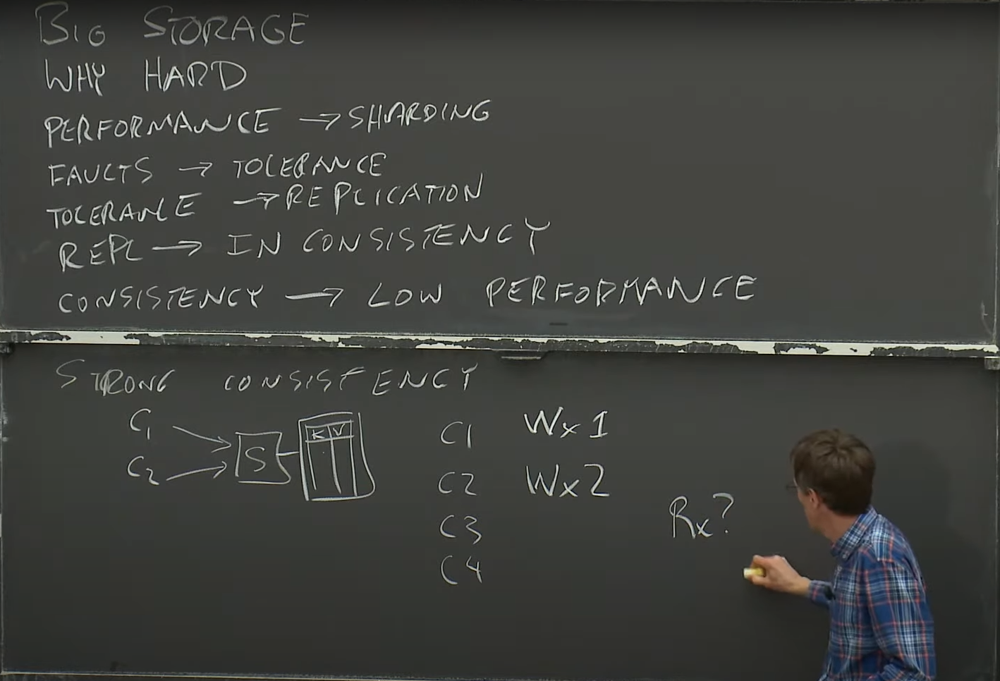

# MIT 6.824 Distributed System

> This is a note for the MIT 6.824 Distributed System course in 2020 - Spring, a free course on YouTube.

- [MIT 6.824 Distributed System](#mit-6824-distributed-system)
  - [Lecture 1: Introduction](#lecture-1-introduction)
    - [What is a Distributed System?](#what-is-a-distributed-system)
    - [Case study: MapReduce (MR)](#case-study-mapreduce-mr)

## Lecture 1: Introduction

- Link: [Lecture 1: Introduction](https://youtu.be/cQP8WApzIQQ?si=p-Zn1kFrTYjteVz7)

### What is a Distributed System?
- **Distributed System:** A group of computers cooperating to provide a service.
- It's **not easy to build distributed systems**:
  - Concurrency
  - Complex Infras
  - How to get high Perf?
  - Parital failure.
- Main topics in this course:
  - `Storage`
  - `Communication`
  - `Computation`
- Distributed features:
  - `Fault Tolerance`: What if something broken?
    - *Availability*
    - *Replication*
    - *Recoverability*
  - `Consistency`: Genral purpose infrastructure needs to be well-defined behavior, something like: read(x) value from the most recent write(x) on replica...
  - `Performace`: 2x Resource will bring to 2x Perf or 2x throughput?
  - `Trade-off`: Fault tolerance, consistency and performance ara enemies.
    - Fault tolerance and consistency require communication but communication is often slow!
  - `Implementation`: RPC, Thread, Concurency...

### Case study: MapReduce (MR)

> **MapReduce** is a programming model and an associated implementation for processing and generating large data sets. Users specify a map function that processes a key/value pair to generate a set of intermediate key/value pairs, and a reduce function that merges all intermediate values associated with the same intermediate key.

- **Useful link**
  - [MapReduce: Simplified Data Processing on Large Clusters](https://pdos.csail.mit.edu/6.824/papers/mapreduce.pdf)
  - [Note](https://pdos.csail.mit.edu/6.824/notes/l01.txt)

- MR scales well because:
  - `Nx <worker>` computer might get `Nx <throughput>`. Map() can run in parallel, same for Reduce().
  - More workers, more throughput.
- MR rules:
  - **Map()** and **Reduce()** functions are pure functions.
  - **Map()** and **Reduce()** functions are stateless and not interact with other workers.
- In 2004, Google published the paper about MR, and it's the first paper that introduces the concept of distributed systems. The bottleneck of MR is network speed.
- How MR minimize network traffic:
  - Coordinater tries to run each Map task on GFS (Google File System) node that contains the input data. This makes the data local to the computation.
  - Map Workers write intermediate data to local disk.
  - Reduce Workers read intermediate data from map workers over the network.
- Suppose MR runs a Map task twice, one Reduce sees first run's output and the other sees the second run's output. This is a consistency problem. The two Map executions had better produce identical intermediate output! **They are only allowed to look at their arguments/input, no state, no file I/O, no interaction, no external communication, no random numbers.**
- Current status of MR: `Spark`, `Flink`, `Hadoop`, etc. No longer in use at Google. Google uses a system called `FlumeJava` and GFS is replaced by `Colossus`.

##  Lecture 3: GFS

- Link: [Lecture 3: GFS](https://www.youtube.com/watch?v=EpIgvowZr00&list=PLrw6a1wE39_tb2fErI4-WkMbsvGQk9_UB&index=3)

### Large-scale storage system

- Learn to how to design good interface of big storage system.
- Why is it hard?
  - Engineers aim to build systems with high `performance`, often achieved by distributing workloads across thousands of servers (`sharding`).
  - `Sharding` introduces the need to manage failures, as any single server could fail (`fault tolerance`).
  - `Fault tolerance` requires `replication`, ensuring that copies of data are available so the system can remain functional even if some servers go down.
  - `Replication` brings challenges in maintaining `consistency`, as data across multiple copies must remain synchronized accurately.
  - Maintaining `consistency` often impacts `performance`, as servers need to communicate ("chitchat") and perform checks with each other.
- This cycle appears repeatedly in many systems we analyze.
- If you prioritize strong consistency, you'll likely pay the price in performance. Conversely, optimizing for performance may lead to occasional anomalous behavior due to weaker consistency guarantees.

> "The consistency behavior of applications or clients looks just like a single server, even though the data is distributed across many servers."

### Bad Replication Design (This is *not* what GFS does)

-  Client sends update to each replica chunkserver.
-  Each chunkserver applies the update to its copy.

### GFS Design

- Context: Many Google services needed a big fast unified storage system: Mapreduce, crawler, indexer, log storage/analysis... This Storage will share data across many services with huge capacity and high throughput (performance), and it should be fault-tolerant.
- How it works:
  - **Master** (two main tables):
    - Mapping filename to an array of chunk IDs, chunk handles.
    - Mapping each chunk ID (or handle) to a list of chunkserver, current version, which chunl server is primary, lease expiration time.
    - Another table is log and checkpoint.
- Read action:
  - Input: name and offset to the Master.
  - Master returns the chunk handle and the list of chunkserver (also cache the result).
  - Client talks to one of the chunkserver to read the data.
  - Clients only ask Master where to find a file's chunks, clients cache name -> chunkhandle info, Master does not handle data, so (hopefully) not heavily loaded.
- Write action:
  - No primary case:
    - Master must find out the most up-to-date copy of the chunk.
    - Master picks a primary (and the lease expiration of this primary) then increments the version number of the chunk(?).
    - Primary picks offset of all the replicas and sends the data to them, told them to write the data to offset.
    - If all replicas sayin' "I'm done", the primary tells client "I'm done".
    - Else, the primary it will tell client "I'm not done". In this case, client will retry whole process.
- What is a lease?
  - Permission to act as primary for a given time (60 seconds). Primary promises to stop acting as primary before lease expires. Master promises not to change primaries until after expiration. Separate lease per actively written chunk.
- What if the Master designates a new primary while old one is active?
    - Two active primaries! C1 writes to P1, C2 reads from P2, doesn't seen C1's write! called "split brain" -- a disaster.
    - Leases help prevent split brain: Master won't designate new primary until the current one is guaranteed to have stopped acting as primary.
