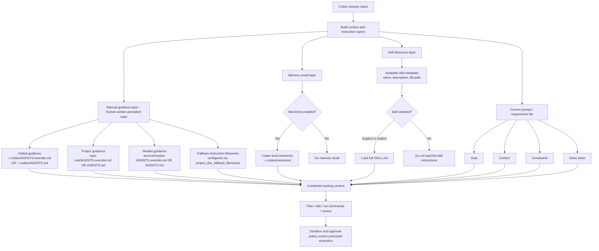

# Codex Persistent Context and Workflow Notes

## Table of Contents

- [Context layers overview](#context-layers-overview)
- [Codex Memories](#codex-memories)
- [Manual Guidance: AGENTS.md](#manual-guidance-agentsmd)
- [Plugins](#plugins)
- [MCP](#mcp)
- [Skills and SKILL.md](#skills-and-skillmd)
- [Writing requirements for Codex](#writing-requirements-for-codex)

## Context layers overview



## Codex Memories

**Reference**: [Codex Memories](https://developers.openai.com/codex/memories)

Codex Memories let Codex carry useful context from earlier threads into future work. After memories are enabled, Codex can remember stable preferences, recurring workflows, tech stacks, project conventions, and known pitfalls, so the same context does not need to be repeated in every thread.

Important behavior:
* Memories are off by default. Enable them in Codex settings or set:
  ```toml
  [features]
  memories = true
  ```

* Memories are a helpful local recall layer, not the source of truth for mandatory team rules.
* Required team/project guidance should live in `AGENTS.md` or checked-in documentation.
* Codex can turn useful context from eligible previous threads into local memory files.
* Codex skips active or short-lived sessions.
* Memory updates happen in the background, not necessarily immediately when a thread ends.
* Codex waits until a thread has been idle long enough before summarizing it.
* Memory generation can be skipped when remaining Codex rate limit is below the configured threshold.
* Memory files live under the Codex home directory. By default, this is:

  ```text
  ~/.codex/memories/
  ```

The memory directory can include summaries, durable entries, recent inputs, and supporting evidence from prior threads.
Operational note: **treat files under `~/.codex/memories/` as generated state.** They can be inspected for troubleshooting, but they should not be the primary manual control surface.

## Manual Guidance: AGENTS.md

```text
root@vienct3 ~/ws/src-code/cpe-emqx-status (main)$ tree -C
.
├── AGENTS.md
├── app
│   ├── application
│   ├── business
│   │   ├── model
│   │   │   ├── AGENTS.md
│   │   └── services
│   │       ├── AGENTS.md
│   ├── controller
│   │   ├── http_controller
│   │   │   ├── AGENTS.md
│   │   └── kafka_controller
│   │       ├── AGENTS.md
│   ├── infras
│   │   ├── AGENTS.md
│   ├── main.go
│   └── Makefile
├── code_review.md
├── Dockerfile
├── docs
│   └── requirements
│       ├── 01.emqx-connection-state.md
│       └── 02.remove-retry.md
└── README.md
```

**Reference**: [Custom instructions with AGENTS.md](https://developers.openai.com/codex/guides/agents-md)

`AGENTS.md` is the best place to encode human-written instructions for how Codex should work in a repository. It is closer to “manual guidance” than “memory”.
Use `AGENTS.md` for:
* Repo layout and important directories.
* Build, test, lint, and run commands.
* Engineering conventions.
* PR expectations.
* Security constraints.
* “Do not” rules.
* Definition of done.
* How to verify work before finishing.

Discovery order:
* **Global scope:**
	* Codex checks the Codex home directory, default `~/.codex`.
	* It reads `AGENTS.override.md` if present.
	* Otherwise it reads `AGENTS.md`.
	* Codex uses only the first non-empty file at this level.
* **Project scope:**
	* Codex starts at the project root, usually the Git root.
	* It walks down to the current working directory.
	* In each directory, it checks:
		* `AGENTS.override.md`
		* `AGENTS.md`
		* fallback names from `project_doc_fallback_filenames` 
	* Codex includes at most one instruction file per directory.
* **Merge order:**
	* Codex concatenates files from root to current directory.
	* Files closer to the current working directory appear later in the combined prompt.
	* Later guidance can override earlier guidance.

Important config:

```toml
project_doc_fallback_filenames = ["TEAM_GUIDE.md", ".agents.md"]
project_doc_max_bytes = 65536
```

By default, Codex stops adding instruction files once the combined size reaches `project_doc_max_bytes`, which is 32 KiB by default.
Practical rule: keep `AGENTS.md` short and operational. A target like “under ~150 lines” is a team heuristic, not an official Codex limit. The official limit is byte-based, not line-based.

## Plugins

**Reference**: [Codex Plugins](https://developers.openai.com/codex/plugins)

**Plugins are installable bundles for reusable Codex workflows.** A plugin can include:

* **Skills**: reusable instructions for specific kinds of work.
* **Apps**: connections to services such as GitHub, Slack, Google Drive, or Gmail.
* **MCP servers**: external tools or shared information sources.
* **Hooks**: lifecycle automation.
* Assets and install-surface metadata.

Some useful third-party examples to evaluate:

* **Ponytail**: a Codex-compatible plugin/skill collection focused on conservative coding-agent behavior.
* **Context7**: provides up-to-date, version-specific library documentation to AI coding agents.
* **CodeGraph**: a local-first code knowledge graph / MCP tool for repository intelligence.

Security note: third-party plugins and MCP servers should be reviewed before use. They can alter agent behavior, expose tools, or add lifecycle hooks.

## MCP

Reference: [Model Context Protocol](https://modelcontextprotocol.io/docs/getting-started/intro)
MCP, or Model Context Protocol, is an open standard for connecting AI applications to external systems.
Use MCP when Codex needs access to:
* External documentation.
* Local or remote databases.
* Browser or design tools.
* Code intelligence tools.
* Internal developer platforms.
* Search, calculators, or other callable tools.

MCP is not memory. It is a protocol for giving the model access to tools and external context.
Examples:
* **Context7 MCP:** useful when the model may rely on outdated library docs.
* **CodeGraph MCP**: useful for large repositories where repeated `grep` and file reads waste tokens and miss structural relationships.

## Skills and SKILL.md

Reference: [Agent Skills](https://developers.openai.com/codex/skills)

Skills extend Codex with task-specific capabilities. A skill is a directory with a required `SKILL.md` file and optional scripts, references, assets, and metadata.

Typical structure:

```text
my-skill/
  SKILL.md
  scripts/
  references/
  assets/
  agents/
    openai.yaml
```

`SKILL.md` must include `name` and `description`.
Skills use progressive disclosure:
* Codex initially sees only skill metadata: name, description, and file path.
* Codex loads the full `SKILL.md` only when it decides to use the skill.
* This keeps the normal context lighter than putting every workflow into `AGENTS.md`.
Codex can activate skills in two ways:
1. Explicit invocation:
   * Mention the skill directly in the prompt.
   * In CLI/IDE, use `/skills` or type `$` to mention a skill.
2. Implicit invocation:
   * Codex chooses a skill when the task matches the skill description.
**Important distinction:**
* `AGENTS.md` is for always-on guidance.
* `SKILL.md` is for task-specific workflows that should only load when relevant.

Use `AGENTS.md` for rules that should always apply. Use Skills for heavier workflows such as:
* Security review.
* Release checklist.
* Database migration workflow.
* Architecture documentation generation.

## Writing requirements for Codex

Reference: [Codex Best Practices](https://developers.openai.com/codex/learn/best-practices)
For small tasks, a direct prompt is enough. For complex tasks, write the requirement into a file and make Codex treat it as the root of trust for the task. This reduces drift, hidden assumptions, and context loss. A good Codex requirement should contain:

### Goal

What should be changed or built? Example:
```text
Update MQTT connection state from EMQX events.
```

### Context

Which files, folders, docs, examples, logs, or errors matter? Example:
```text
Read:
- docs/emqx-events.md
- internal/connection_state/*
- migrations/*
- existing Kafka consumer implementation
```

### Constraints

What standards, architecture rules, or safety requirements must Codex follow? Example:
```text
- Do not break existing register worker behavior.
- Do not mark device offline if the disconnect event belongs to an older connection session.
- Keep database writes idempotent.
- Add tests for out-of-order events.
```

### Done when

What proves the task is complete? Example:
```text
Done when:
- Unit tests cover connected, disconnected, reconnect, and stale disconnect events.
- Migration runs successfully.
- Consumer handles malformed events without crashing.
- Existing tests pass.
- README documents event ordering assumptions.
```

## Recommended additions

* Sandbox and approvals: Codex command execution is controlled by sandbox and approval policy.
* Rules: Use rules for command-level policy. Example:  Forbid destructive commands like `rm -rf /`, production deploys, or secret-printing commands.
* Config baseline: Document your default `~/.codex/config.toml` choices:
```toml
model = "gpt-5.5"
model_reasoning_effort = "high"
approval_policy = "on-request"
sandbox_mode = "workspace-write"
web_search = "cached"

[features]
memories = true
hooks = true
```

---
# Requirement: EMQX Connection State

## Goal

* Update the MQTT connection state ...

## Context

### Desired Behavior
* Consume EMQX MQTT connection events from Kafka topic `public.emqx.prod.events.v1`.
* Event types:
  * `client.connected`
  * `client.disconnected`
* Event format:
```json
{
}
```

* When receiving `client.connected`, mark the CPE as MQTT online.
* When receiving `client.disconnected`, mark the CPE as MQTT offline only if the disconnect event belongs to the latest known connection session.
* Store/update relevant connection metadata in PSQL, table name: `cpe_mqtt_connection_states`:

```sql
CREATE TABLE scp.cpe_mqtt_connection_states (
    mqtt_connected     boolean NOT NULL DEFAULT false,
    last_event         varchar(32) NOT NULL, -- client.connected / client.disconnected
    created_at         timestamptz NOT NULL DEFAULT now(),
    updated_at         timestamptz NOT NULL DEFAULT now()
);
```

* Store/Update in case `client.conntected` and Delete cache in case `client.disconnected` in Redis:
  * Key: MAC Address without semicolons, lowercase, e.g. `aa11bb22cc33`
  * Value: Just a string: peername with port.
* Avoid overwriting a newer connected state with a delayed/stale disconnected event.
### Scope

* Add or update Kafka consumer logic for EMQX connection events.

### Entry Points

* Kafka topic: `xxx`
* DB table: `xxx`
  
## Constraints

* Follow Clean Architecture.
* Minimal change.
* Do not introduce a new dependency unless required.
* Do not change public API contracts, if changes are required, check and warn about backward compatibility.

## Done When

* Tests added/updated.
* Existing tests pass.
* Event handling covers:...