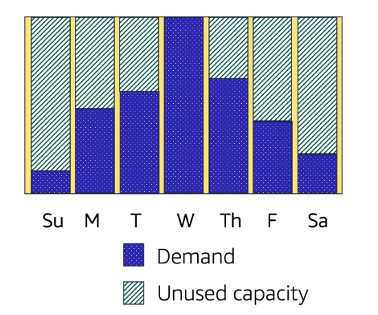
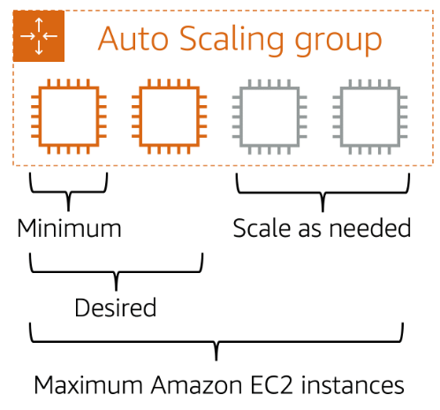
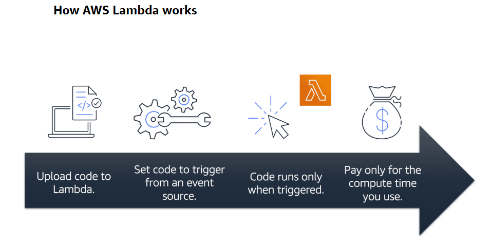
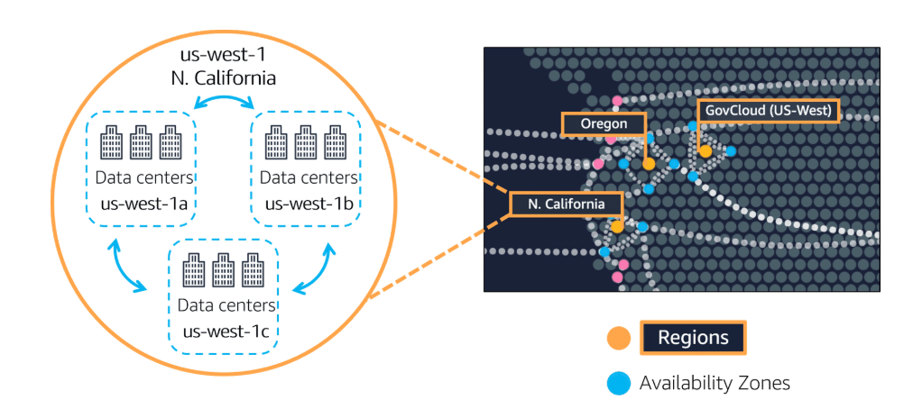
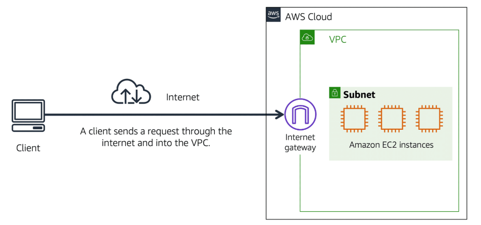
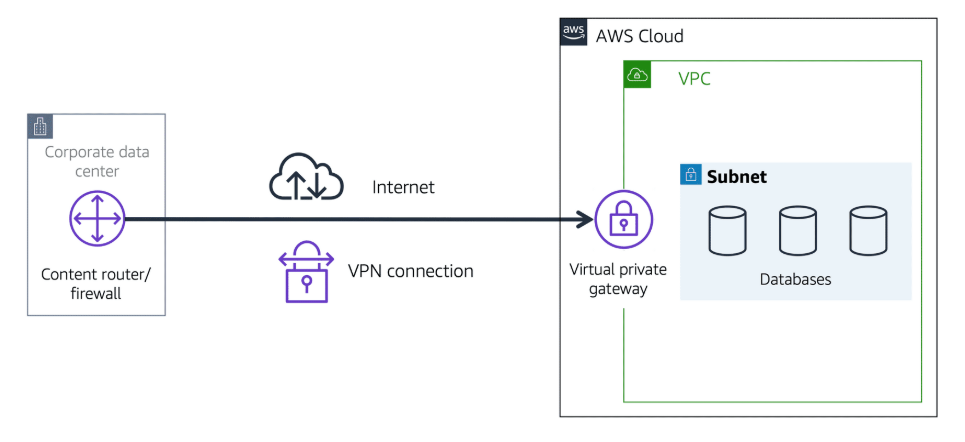
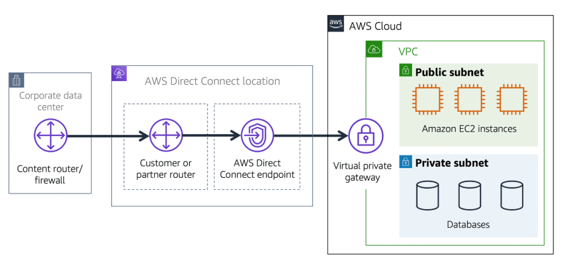
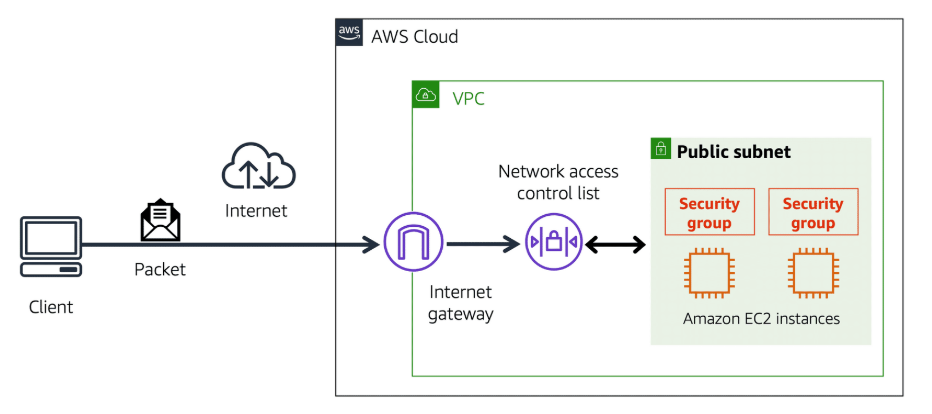
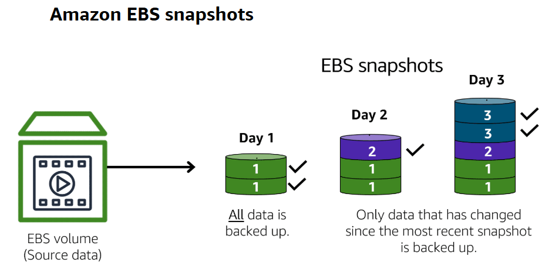

# AWS 101

> This repository contains notes about AWS - from zero.

## Resources

- [AWS Skill Builder](https://explore.skillbuilder.aws/)

## Table of Contents

- [Compute in the Cloud](#compute-in-the-cloud)
    - [EC2 - Elastic Compute Cloud](#ec2---elastic-compute-cloud)
    - [EC2 Auto Scaling](#ec2-auto-scaling)
    - [Elastic Load Balancing (ELB)](#elastic-load-balancing-elb)
    - [Amazon Simple Notification Service (SNS) & Amazon Simple Queue Service (SQS)](#amazon-simple-notification-service-sns--amazon-simple-queue-service-sqs)
    - [AWS Lambda](#aws-lambda)
    - [Amazon Elastic Container Service (ECS) & Amazon Elastic Kubernetes Service (EKS)](#amazon-elastic-container-service-ecs--amazon-elastic-kubernetes-service-eks)
    - [AWS Fargate](#aws-fargate)
    - [Sumary](#sumary)
- [Global Infrastructure & Reliablity](#global-infrastructure--reliablity)
    - [Regions](#regions)
    - [Availability Zones](#availability-zones)
    - [Edge Locations](#edge-locations)
    - [Provision AWS Resources](#provision-aws-resources)
        - [AWS Elastic Beanstalk](#aws-elastic-beanstalk)
        - [AWS CloudFormation](#aws-cloudformation)
- [Networking](#networking)
    - [Amazon Virtual Private Cloud (VPC)](#amazon-virtual-private-cloud-vpc)
        - [Internet Gateway](#internet-gateway)
        - [Virtual Private Gateway](#virtual-private-gateway)
        - [AWS Direct Connect](#aws-direct-connect)
    - [Subnets and Network Access Control Lists (NACLs)](#subnets-and-network-access-control-lists-nacls)
        - [Subnets](#subnets)
        - [Network Access Control Lists (NACLs)](#network-access-control-lists-nacls)
        - [Security Groups](#security-groups)
    - [Global Networking](#global-networking)
        - [DNS](#dns)
        - [Amazon Route 53](#amazon-route-53)
- [Storage and Database](#storage-and-database)
    - [Instance Stores and Amazon Elastic Block Store (EBS)](#instance-stores-and-amazon-elastic-block-store-ebs)
        - [Instance Stores](#instance-stores)
        - [Amazon Elastic Block Store (EBS)](#amazon-elastic-block-store-ebs)
    - [Amazon S3](#amazon-s3)
        - [Object Storage](#object-storage)
        - [Amazon S3 Storage Classes](#amazon-s3-storage-classes)
    - [Amazon Elastic File System (EFS)](#amazon-elastic-file-system-efs)
    - [Amazon RDS](#amazon-rds)
    - [Other Storage services](#other-storage-services)

## "Compute in the Cloud"

### EC2 - Elastic Compute Cloud

- **Amazon EC2**: A service providing virtual servers to power your business applications.
- EC2 Instance Types:
    - `General purpose instances`: Balance of compute, memory, and networking resources.
        - Usecases: Web services, code repositories, development environments.
    - `Compute optimized instances`: Ideal for compute-bound applications that benefit from high-performance processors.
        - Usecases: High-performance web servers, scientific modeling, dedicated gaming servers.
    - `Memory optimized instances`: Designed to deliver fast performance for workloads that process large data sets in memory.
        - Usecases: Databases, real-time big data analytics, in-memory caching.
    - `Accelerated computing instances`: Use hardware accelerators, or co-processors, to perform functions such as floating-point number calculations, graphics processing, or data pattern matching more efficiently than software running on a general-purpose CPU.
        - Usecases: Graphics processing, floating-point calculations, data pattern matching.
    - `Storage optimized instances`: Designed for workloads that require high, sequential read and write access to very large data sets on local storage. They are optimized to deliver tens of thousands of low-latency, random I/O operations per second (IOPS) to applications.
        - Usecases: Data warehousing applications, distributed file systems, network file systems, log or data processing applications.

- [EC2 Naming Conventions](https://docs.aws.amazon.com/ec2/latest/instancetypes/instance-type-names.html): Instance types are named based on their instance family and instance size. Example: `t2.micro`.
    - `t2.micro`: `t` stands for `instance type`, `2` stands for `generation`, `micro` stands for `size`.

- EC2 Pricing:
    - **On-Demand Instances**: Pay per hour or per second depending on which instances you run and OS. No long-term commitments or upfront payments.
        - Ideal for short-term, irregular workloads that cannot be interrupted. No upfront costs or minimum contracts apply.
    - **Savings Plans**: Commit to a consistent usage (USD/hour) for 1 or 3 years. Save up to 72% on EC2, Fargate, and Lambda.
        - Ideal for workloads with *steady state usage*, predictable usage, long-term savings.
    - **Reserved Instances**: Suited for steady-state or predictable workloads. Up to 75% discount compared to On-Demand pricing. Commit to a 1 or 3-year term. Can be: All Upfront, Partial Upfront, No Upfront.
        - Ideal for *steady workloads* with upfront or partial payment options.
    - **Spot Instances**: Request unused EC2 instances at steep discounts. Can be terminated by AWS with 2 minutes warning. Up to 90% discount compared to On-Demand pricing.
        - Ideal for workloads that can tolerate interruptions (e.g., batch processing). Workloads should be fault-tolerant and flexible. Should has some gracefull shutdown mechanism.
    - **Dedicated Hosts**: Most expensive! Physical EC2 server dedicated for your use. Meet compliance requirements by ensuring no shared tenancy.
        - Ideal for Compliance-driven, fully isolated resources.

### EC2 Auto Scaling

- **Amazon EC2 Auto Scaling** enables you to automatically add or remove Amazon EC2 instances in response to changing application demand. There are two approaches to scaling:
    - **Manual Scaling**: responds to changing demand. 
    - **Predictive  Scaling**: automatically schedules the right number of Amazon EC2 instances based on predicted demand.
- There 03 configured parameters for Auto Scaling:
    - **Minimum Capacity**: The minimum number of instances that Auto Scaling maintains.
    - **Desired Capacity**: The number of instances that Auto Scaling tries to maintain.
    - **Maximum Capacity**: The maximum number of instances that Auto Scaling maintains.

- Like the image above:
    - Minimum Capacity: Ensures at least 1 instance is always running, providing continuous availability.
    - Desired Capacity: Allows the system to scale up to 2 instances during normal operations for optimal performance.
    - Maximum Capacity: Ensures that the system can scale up to 4 instances during peak demand to maintain

### Elastic Load Balancing (ELB)

- **Elastic Load Balancing** is the AWS service that automatically distributes incoming application traffic across multiple resources, such as Amazon EC2 instances.
    - AWS101 Question: What if the ELB is down? How to handle this situation? Answer: [StackOverflow](https://stackoverflow.com/questions/46698011/are-amazon-elastic-load-balancer-elb-failure-proof)
- How ELB works (with EC2 Auto Scaling):
    - Auto-scaling services notify ELB when new instances are ready.
    - ELB directs traffic to new instances as they come online.
    - During scale-down, ELB waits for requests to complete before terminating instances.

### Amazon Simple Notification Service (SNS) & Amazon Simple Queue Service (SQS)

- **Amazon Simple Notification Service (Amazon SNS)** is a publish/subscribe service. Using Amazon SNS topics, a publisher publishes messages to subscribers. 
- **Amazon Simple Queue Service (Amazon SQS)** is a message queuing service. It allows you to decouple and scale microservices, distributed systems, and serverless applications.

### AWS Lambda

- **AWS Lambda** is a serverless compute service that lets you run code without provisioning or managing servers. Lambda runs your code only when needed and scales automatically, from a few requests per day to thousands per second.
- Lambda supports multiple languages: Node.js, Python, Ruby, Java, Go, .NET Core, and custom runtime.
- There are 03 main components in Lambda:
    - **Function**: A piece of code that performs a specific task.
    - **Event Source**: A Lambda trigger. It can be an S3 bucket, an SNS topic, an SQS queue, or an API Gateway.
    - **Resource**: The AWS service that triggers the Lambda function.

### Amazon Elastic Container Service (ECS) & Amazon Elastic Kubernetes Service (EKS)

- **Amazon Elastic Container Service (ECS)** is a fully managed container orchestration service. ECS supports Docker containers and allows you to easily run and scale containerized applications on AWS.
- **Amazon Elastic Kubernetes Service (EKS)** is a fully managed Kubernetes service. EKS makes it easy to deploy, manage, and scale containerized applications using Kubernetes on AWS.

### AWS Fargate

- **AWS Fargate** is a serverless compute engine for containers. It works with both `Amazon ECS` and `Amazon EKS`. Fargate removes the need to provision and manage servers, allowing you to focus on building your applications.

### Sumary

- **EC2**: Virtual servers to power your business applications. For full access to the operating system and traditional applications.
- **AWS Lambda**: Run code without provisioning or managing servers. For event-driven or short-running applications (no infrastructure management).
- **Amazon ECS & Amazon EKS**: Fully managed container orchestration services.
- **Fargate**: For serverless container hosting (no EC2 management required).

## Global Infrastructure & Reliablity

### Regions

- AWS oprates in different areas globally. Each area is called a `Region`.
- Each region is a separate geographic area. Each region has multiple, isolated locations known as `Availability Zones`.
- When determining the right Region for your services:
    - **Compliance with data governance** and legal requirements. For example, if your company requires all of its data to reside within the boundaries of the UK, you would choose the London Region.
    - **Proximity to customers**. For example, if your customers are located in Europe, you would choose a Region in Europe.
    - **Services available in a Region**. Not all services are available in all Regions. For example, Amazon S3 is available in all Regions, but Amazon RDS is not.
    - **Pricing**. Prices can vary between Regions. For example, the price of an Amazon EC2 instance in the US East (N. Virginia) Region might be different from the price of an Amazon EC2 instance in the Asia Pacific (Tokyo) Region.

### Availability Zones

- **An Availability Zone** is a single data center or a group of data centers within a Region. Availability Zones are located tens of miles apart from each other. This is close enough to have low latency between Availability Zones, but far enough apart to reduce the risk of a single event affecting all Availability Zones.

### Edge Locations

- **An edge location** is a site that Amazon CloudFront uses to *store cached copies of your content* closer to your customers for faster delivery.
- AWS uses Amazon CloudFront as its CDNs(Content Delivery Network) service. CloudFront uses a global network of edge locations to cache and deliver content to users with low latency.
- Edge locations also run Amazon Route 53 - a DNS Servicer that helps direct customers to correct web locations with low latency.

### Provision AWS Resources

There are 03 ways to provision AWS resources:
- **AWS Management Console**: A web-based interface that you can use to manage your AWS resources.
- **AWS Command Line Interface (CLI)**: A command-line tool that allows you to interact with AWS services using commands in your command shell.
- **AWS Software Development Kits (SDKs)**: SDKs are available in multiple programming languages. You can use the SDKs to interact with AWS services using your preferred programming language.

#### AWS Elastic Beanstalk

- With **AWS Elastic Beanstalk**, you provide code and configuration settings, and Elastic Beanstalk deploys the resources necessary to perform the following tasks:
    - Adjust capacity according to incoming traffic.
    - Load balance traffic.
    - Auto-scaling.
    - Monitoring application health.
- Elastic Beanstalk is known as a `Platform as a Service (PaaS)`.

#### AWS CloudFormation

- With AWS CloudFormation, you can treat your infrastructure as code. This means that you can build an environment by writing lines of code instead of using the AWS Management Console to individually provision resources.

## Networking

### Amazon Virtual Private Cloud (VPC)

- A networking service that you can use to establish boundaries around your AWS resources is **Amazon Virtual Private Cloud (Amazon VPC)**
- Amazon VPC enables you to provision an isolated section of the AWS Cloud.

#### Internet Gateway

- To allow public traffic from the internet to access your VPC, you need to attach an **Internet Gateway** to your VPC.

#### Virtual Private Gateway

- A virtual private gateway enables you to establish a virtual private network (VPN) connection between your VPC and a private network, such as an on-premises data center or internal corporate network.

#### AWS Direct Connect

- **AWS Direct Connect** is a service that enables you to establish a dedicated network connection between your network and one of the AWS Direct Connect locations.
- Suppose that there is an apartment building with a hallway directly linking the building to the coffee shop. Only the residents of the apartment building can travel through this hallway. 

### Subnets and Network Access Control Lists (NACLs)

#### Subnets

- A subnet is a section of a VPC in which you can group resources based on securiy or operational needs. Subnets can be public or private.
- **Public Subnet**: A subnet contains resources that can be accessed from the internet.
- **Private Subnet**: A subnet contains resources that cannot be accessed from the internet. Such as databases.
- Before *packet*  can enter into a subnet or exit from a subnet, it must pass through a `Network Access Control List (NACL)`.

#### Network Access Control Lists (NACLs)

- A NACL is a virtual firewall that controls inbound and outbound traffic at the subnet level.
- By default, a NACL allows all inbound and outbound traffic. You can create custom NACLs to control traffic.
- For custom NACLs, you can create rules that allow or deny traffic based on IP addresses, protocols, and ports. All inbound and outbound traffic is denied by default until you add rules.
- **NACLs perform stateless filtering**. They remember nothing and check packets that cross the subnet boundary each way: in and out.
- After a packet crosses the subnet boundary, it is checked by the `Security Group` associated with the resource.

#### Security Groups

- A security group acts as a virtual firewall for your instance to control inbound and outbound traffic.
- You can add custom rules to configure which traffic should be allowed; any other traffic would then be denied.
- **Security Groups are stateful**. They remember previous decisions made for incoming packets.

### Global Networking

#### DNS

- Nothing to talk about DNS. Just the "phone book" of the internet.

#### Amazon Route 53

- **Amazon Route 53** is a DNS web service. It gives developers and businesses a reliable way to route end users to internet applications hosted in AWS.
- Amazon Route 53 connects user requests to infrastructure running in AWS (such as Amazon EC2 instances and load balancers). It can route users to infrastructure outside of AWS.
- Another feature of Amazon Route 53 is the ability to register domain names. You can also transfer DNS records for existing domain names to Amazon Route 53.

## Storage and Database

### Instance Stores and Amazon Elastic Block Store (EBS)

#### Instance Stores

- **Instance Store** is a temporary block-level storage that is physically attached to the host computer for an EC2 instance. It behaves like a physical hard drive.
- An instance store is disk storage that is physically attached to the host computer for an EC2 instance, and therefore has the same lifespan as the instance.

#### Amazon Elastic Block Store (EBS)

- **Amazon Elastic Block Store (Amazon EBS)** provides block-level storage volumes for use with Amazon EC2 instances.
- Backup and restore: You can create snapshots of EBS.

### Amazon S3

#### Object Storage

- In object storage, each object consists of data, metadata and key.
- Data may be in any format, such as text, image, video, or audio.
- **Amazon S3** is a service that provides object-level storage. Amazon S3 stores data as objects in buckets.
- Maximum object size: 5TB.
- In S3, you pay only for what you use.
- Consider two factors:
    - How often you plan to retrieve data.
    - How available you need the data to be.

#### Amazon S3 Storage Classes

- **Amazon S3 Standard**: 
    - For frequently accessed data.
    - Stores data in a **minimum of three Availability Zones**.
    - Amazon S3 Standard has a higher cost than other storage classes intended for infrequently accessed data and archival storage.
- **Amazon S3 Standard-Infrequent Access (S3 Standard-IA)**:
    - Ideal for infrequently accessed data.
    - Similar to Amazon S3 Standard, but with lower storage costs and higher retrieval costs. 
- **Amazon S3 One Zone-Infrequent Access (S3 One Zone-IA)**:
    - Ideal for infrequently accessed data that does not require the same level of availability and durability as Amazon S3 Standard or S3 Standard-IA.
    - Stores data in a single Availability Zone.
    - Has a lower storage price than Amazon S3 Standard-IA.
- **Amazon S3 Intelligent-Tiering**:
    - Automatically moves objects between two access tiers based on changing access patterns.
    - Designed for customers who want to optimize storage costs automatically when data access patterns change.
    - Requires a small monthly monitoring and automation fee per object
- **Amazon S3 Glacier Instant Retrieval**:
    - Works well for archived data that requires immediate access, Can retrieve objects within a few milliseconds.
    - Data is stored in a durable, secure, and low-cost storage class.
- **Amazon S3 Glacier Flexible Retrieval**:
    - Ideal for archived data that requires access within minutes to hours.
    - Low-cost storage designed for data archiving
- **Amazon S3 Glacier Deep Archive**:
    - Lowest-cost object storage class ideal for archiving
    - Able to retrieve objects within 12 hours
- **Amazon S3 Outposts**:
    - Ideal for workloads that require low-latency access to data on-premises.
    - Provides object storage on premises.

### Amazon Elastic File System (EFS)

- Amazon EFS is a regional service. It stores data in and across multiple Availability Zones.
- Compared to block storage and object storage, file storage is ideal for use cases in which a large number of services and resources need to access the same data at the same time.
- The duplicate storage enables you to access data concurrently from all the Availability Zones in the Region where a file system is located.

### Amazon RDS

- **Amazon Relational Database Service (Amazon RDS)** is a managed service that makes it easy to set up, operate, and scale a relational database in the cloud.
- Amazon RDS is a managed service that automates tasks such as hardware provisioning, database setup, patching, and backups.
- Available engines: Amazon Aurora, PostgreSQL, MySQL, MariaDB, Oracle, and Microsoft SQL Server.
- `Amazon Aurora(opens in a new tab)` is an enterprise-class relational database. It is compatible with MySQL and PostgreSQL relational databases.

### Other Storage services

- Amazon DynamoDB: A key-value database service.
- Amazon Redshift: A data warehousing service.
- Amazon Database Migration Service: A service that helps you migrate databases to AWS quickly and securely.
- Amazon DocumentDB: A document database service that is compatible with MongoDB.
- Amazon Neptune: A graph database service.
- Amazon ElastiCache: A web service that makes it easy to deploy, operate, and scale an in-memory cache in the cloud.