# AWS 101

> This repository contains notes about AWS - from zero.

## Resources

- [AWS Skill Builder](https://explore.skillbuilder.aws/)
- [Ultimate AWS Certified Cloud Practitioner CLF-C02 2025](https://www.udemy.com/course/aws-certified-cloud-practitioner-new/)

## Table of Contents

- [AWS 101](#aws-101)
  - [Resources](#resources)
  - [Table of Contents](#table-of-contents)
  - ["Compute in the Cloud"](#compute-in-the-cloud)
    - [On-Premises vs. IaaS vs. PaaS vs. SaaS](#on-premises-vs-iaas-vs-paas-vs-saas)
    - [EC2 - Elastic Compute Cloud](#ec2---elastic-compute-cloud)
    - [EC2 Auto Scaling](#ec2-auto-scaling)
    - [Elastic Load Balancing (ELB)](#elastic-load-balancing-elb)
    - [Amazon Simple Notification Service (SNS) \& Amazon Simple Queue Service (SQS)](#amazon-simple-notification-service-sns--amazon-simple-queue-service-sqs)
    - [AWS Lambda](#aws-lambda)
    - [Amazon Elastic Container Service (ECS) \& Amazon Elastic Kubernetes Service (EKS)](#amazon-elastic-container-service-ecs--amazon-elastic-kubernetes-service-eks)
    - [AWS Fargate](#aws-fargate)
    - [Sumary](#sumary)
  - [Global Infrastructure \& Reliablity](#global-infrastructure--reliablity)
    - [Regions](#regions)
    - [Availability Zones](#availability-zones)
    - [Edge Locations](#edge-locations)
    - [Provision AWS Resources](#provision-aws-resources)
      - [AWS Elastic Beanstalk](#aws-elastic-beanstalk)
      - [AWS CloudFormation](#aws-cloudformation)
  - [Networking](#networking)
    - [Amazon Virtual Private Cloud (VPC)](#amazon-virtual-private-cloud-vpc)
      - [Internet Gateway](#internet-gateway)
      - [Virtual Private Gateway](#virtual-private-gateway)
      - [AWS Direct Connect](#aws-direct-connect)
    - [Subnets and Network Access Control Lists (NACLs)](#subnets-and-network-access-control-lists-nacls)
      - [Subnets](#subnets)
      - [Network Access Control Lists (NACLs)](#network-access-control-lists-nacls)
      - [Security Groups](#security-groups)
    - [Global Networking](#global-networking)
      - [DNS](#dns)
      - [Amazon Route 53](#amazon-route-53)
  - [Storage and Database](#storage-and-database)
    - [Instance Stores and Amazon Elastic Block Store (EBS)](#instance-stores-and-amazon-elastic-block-store-ebs)
      - [Instance Stores](#instance-stores)
      - [Amazon Elastic Block Store (EBS)](#amazon-elastic-block-store-ebs)
    - [Amazon S3](#amazon-s3)
      - [Object Storage](#object-storage)
      - [Amazon S3 Storage Classes](#amazon-s3-storage-classes)
    - [Amazon Elastic File System (EFS)](#amazon-elastic-file-system-efs)
    - [Amazon RDS](#amazon-rds)
    - [Other Storage services](#other-storage-services)
  - [Security](#security)
    - [AWS Shared Responsibility Model](#aws-shared-responsibility-model)
    - [AWS Identity and Access Management (IAM)](#aws-identity-and-access-management-iam)
      - [IAM Users](#iam-users)
      - [IAM Policies](#iam-policies)
      - [IAM groups](#iam-groups)
      - [IAM Roles](#iam-roles)
      - [IAM Security Tools](#iam-security-tools)
    - [Denial of Service (DoS) and Distributed Denial of Service (DDoS) Attacks](#denial-of-service-dos-and-distributed-denial-of-service-ddos-attacks)
      - [AWS Shield](#aws-shield)
    - [Additinal Security Services](#additinal-security-services)
  - [Monitoring and Analytics](#monitoring-and-analytics)
    - [Amazon CloudWatch](#amazon-cloudwatch)
    - [Amazon CloudTrail](#amazon-cloudtrail)
    - [AWS Trusted Advisor](#aws-trusted-advisor)
  - [Pricing and Support](#pricing-and-support)
    - [AWS Free Tier](#aws-free-tier)
    - [Pricing Concepts](#pricing-concepts)
      - [Pricing Examples](#pricing-examples)
    - [Billing Dashboard](#billing-dashboard)
      - [Consolidated Billing](#consolidated-billing)
    - [AWS Budgets](#aws-budgets)
    - [AWS Cost Explorer](#aws-cost-explorer)
    - [AWS Support Plans](#aws-support-plans)
      - [Basic Support](#basic-support)
      - [TAM (Technical Account Manager)](#tam-technical-account-manager)
  - [Migration \& Innovation](#migration--innovation)
    - [AWS Cloud Adoption Framework (AWS CAF)](#aws-cloud-adoption-framework-aws-caf)
    - [Migration Strategies](#migration-strategies)
    - [AWS Snow Family](#aws-snow-family)
  - [AWS Well-Architected Framework](#aws-well-architected-framework)
    - [Benefits of the AWS Well-Architected Framework](#benefits-of-the-aws-well-architected-framework)
    


## "Compute in the Cloud"

### On-Premises vs. IaaS vs. PaaS vs. SaaS

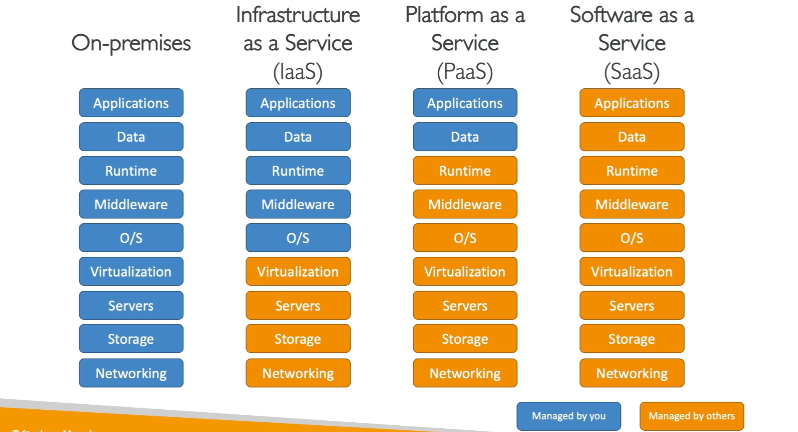

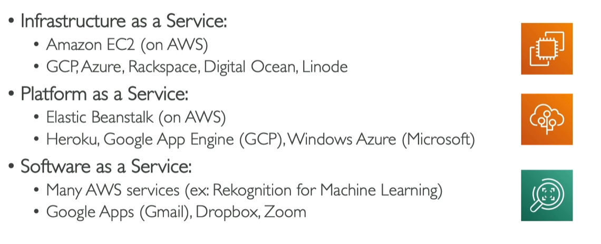

### EC2 - Elastic Compute Cloud

- **Amazon EC2**: A service providing virtual servers to power your business applications.
- EC2 Instance Types:
    - `General purpose instances`: Balance of compute, memory, and networking resources.
        - Usecases: Web services, code repositories, development environments.
    - `Compute optimized instances`: Ideal for compute-bound applications that benefit from high-performance processors.
        - Usecases: High-performance web servers, scientific modeling, dedicated gaming servers.
    - `Memory optimized instances`: Designed to deliver fast performance for workloads that process large data sets in memory.
        - Usecases: Databases, real-time big data analytics, in-memory caching.
    - `Accelerated computing instances`: Use hardware accelerators, or co-processors, to perform functions such as floating-point number calculations, graphics processing, or data pattern matching more efficiently than software running on a general-purpose CPU.
        - Usecases: Graphics processing, floating-point calculations, data pattern matching.
    - `Storage optimized instances`: Designed for workloads that require high, sequential read and write access to very large data sets on local storage. They are optimized to deliver tens of thousands of low-latency, random I/O operations per second (IOPS) to applications.
        - Usecases: Data warehousing applications, distributed file systems, network file systems, log or data processing applications.

- [EC2 Naming Conventions](https://docs.aws.amazon.com/ec2/latest/instancetypes/instance-type-names.html): Instance types are named based on their instance family and instance size. Example: `t2.micro`.
    - `t2.micro`: `t` stands for `instance type`, `2` stands for `generation`, `micro` stands for `size`.


- EC2 Pricing:
    - **On-Demand Instances**: Pay per hour or per second depending on which instances you run and OS. No long-term commitments or upfront payments.
        - Ideal for short-term, irregular workloads that cannot be interrupted. No upfront costs or minimum contracts apply.
    - **Savings Plans**: Commit to a consistent usage (USD/hour) for 1 or 3 years. Save up to 72% on EC2, Fargate, and Lambda.
        - Ideal for workloads with *steady state usage*, predictable usage, long-term savings.
    - **Reserved Instances**: Suited for steady-state or predictable workloads. Up to 75% discount compared to On-Demand pricing. Commit to a 1 or 3-year term. Can be: All Upfront, Partial Upfront, No Upfront.
        - Ideal for *steady workloads* with upfront or partial payment options.
    - **Spot Instances**: Request unused EC2 instances at steep discounts. Can be terminated by AWS with 2 minutes warning. Up to 90% discount compared to On-Demand pricing.
        - Ideal for workloads that can tolerate interruptions (e.g., batch processing). Workloads should be fault-tolerant and flexible. Should has some gracefull shutdown mechanism.
    - **Dedicated Hosts**: Most expensive! Physical EC2 server dedicated for your use. Meet compliance requirements by ensuring no shared tenancy.
        - Ideal for Compliance-driven, fully isolated resources.

### EC2 Auto Scaling


- **Amazon EC2 Auto Scaling** enables you to automatically add or remove Amazon EC2 instances in response to changing application demand. There are two approaches to scaling:
    - **Manual Scaling**: responds to changing demand. 
    - **Predictive  Scaling**: automatically schedules the right number of Amazon EC2 instances based on predicted demand.
- There 03 configured parameters for Auto Scaling:
    - **Minimum Capacity**: The minimum number of instances that Auto Scaling maintains.
    - **Desired Capacity**: The number of instances that Auto Scaling tries to maintain.
    - **Maximum Capacity**: The maximum number of instances that Auto Scaling maintains.


- Like the image above:
    - Minimum Capacity: Ensures at least 1 instance is always running, providing continuous availability.
    - Desired Capacity: Allows the system to scale up to 2 instances during normal operations for optimal performance.
    - Maximum Capacity: Ensures that the system can scale up to 4 instances during peak demand to maintain

### Elastic Load Balancing (ELB)

- **Elastic Load Balancing** is the AWS service that automatically distributes incoming application traffic across multiple resources, such as Amazon EC2 instances.
    - AWS101 Question: What if the ELB is down? How to handle this situation? Answer: [StackOverflow](https://stackoverflow.com/questions/46698011/are-amazon-elastic-load-balancer-elb-failure-proof)
- How ELB works (with EC2 Auto Scaling):
    - Auto-scaling services notify ELB when new instances are ready.
    - ELB directs traffic to new instances as they come online.
    - During scale-down, ELB waits for requests to complete before terminating instances.

### Amazon Simple Notification Service (SNS) & Amazon Simple Queue Service (SQS)

- **Amazon Simple Notification Service (Amazon SNS)** is a publish/subscribe service. Using Amazon SNS topics, a publisher publishes messages to subscribers. 
- **Amazon Simple Queue Service (Amazon SQS)** is a message queuing service. It allows you to decouple and scale microservices, distributed systems, and serverless applications.

### AWS Lambda

- **AWS Lambda** is a serverless compute service that lets you run code without provisioning or managing servers. Lambda runs your code only when needed and scales automatically, from a few requests per day to thousands per second.
- Lambda supports multiple languages: Node.js, Python, Ruby, Java, Go, .NET Core, and custom runtime.
- There are 03 main components in Lambda:
    - **Function**: A piece of code that performs a specific task.
    - **Event Source**: A Lambda trigger. It can be an S3 bucket, an SNS topic, an SQS queue, or an API Gateway.
    - **Resource**: The AWS service that triggers the Lambda function.


### Amazon Elastic Container Service (ECS) & Amazon Elastic Kubernetes Service (EKS)

- **Amazon Elastic Container Service (ECS)** is a fully managed container orchestration service. ECS supports Docker containers and allows you to easily run and scale containerized applications on AWS.
- **Amazon Elastic Kubernetes Service (EKS)** is a fully managed Kubernetes service. EKS makes it easy to deploy, manage, and scale containerized applications using Kubernetes on AWS.

### AWS Fargate

- **AWS Fargate** is a serverless compute engine for containers. It works with both `Amazon ECS` and `Amazon EKS`. Fargate removes the need to provision and manage servers, allowing you to focus on building your applications.

### Sumary

- **EC2**: Virtual servers to power your business applications. For full access to the operating system and traditional applications.
- **AWS Lambda**: Run code without provisioning or managing servers. For event-driven or short-running applications (no infrastructure management).
- **Amazon ECS & Amazon EKS**: Fully managed container orchestration services.
- **Fargate**: For serverless container hosting (no EC2 management required).

## Global Infrastructure & Reliablity

### Regions

- AWS oprates in different areas globally. Each area is called a `Region`.
- Each region is a separate geographic area. Each region has multiple, isolated locations known as `Availability Zones`.
- When determining the right Region for your services:
    - **Compliance with data governance** and legal requirements. For example, if your company requires all of its data to reside within the boundaries of the UK, you would choose the London Region.
    - **Proximity to customers**. For example, if your customers are located in Europe, you would choose a Region in Europe.
    - **Services available in a Region**. Not all services are available in all Regions. For example, Amazon S3 is available in all Regions, but Amazon RDS is not.
    - **Pricing**. Prices can vary between Regions. For example, the price of an Amazon EC2 instance in the US East (N. Virginia) Region might be different from the price of an Amazon EC2 instance in the Asia Pacific (Tokyo) Region.

### Availability Zones


- **An Availability Zone** is a single data center or a group of data centers within a Region. Availability Zones are located tens of miles apart from each other. This is close enough to have low latency between Availability Zones, but far enough apart to reduce the risk of a single event affecting all Availability Zones.

### Edge Locations

- **An edge location** is a site that Amazon CloudFront uses to *store cached copies of your content* closer to your customers for faster delivery.
- AWS uses Amazon CloudFront as its CDNs(Content Delivery Network) service. CloudFront uses a global network of edge locations to cache and deliver content to users with low latency.
- Edge locations also run Amazon Route 53 - a DNS Servicer that helps direct customers to correct web locations with low latency.

### Provision AWS Resources

There are 03 ways to provision AWS resources:
- **AWS Management Console** - Using password and MFA: A web-based interface that you can use to manage your AWS resources.
- **AWS Command Line Interface (CLI)** - Using Access Key: A command-line tool that allows you to interact with AWS services using commands in your command shell.
- **AWS Software Development Kits (SDKs)** - Using Access Key: SDKs are available in multiple programming languages. You can use the SDKs to interact with AWS services using your preferred programming language.

#### AWS Elastic Beanstalk

- With **AWS Elastic Beanstalk**, you provide code and configuration settings, and Elastic Beanstalk deploys the resources necessary to perform the following tasks:
    - Adjust capacity according to incoming traffic.
    - Load balance traffic.
    - Auto-scaling.
    - Monitoring application health.
- Elastic Beanstalk is known as a `Platform as a Service (PaaS)`.

#### AWS CloudFormation

- With AWS CloudFormation, you can treat your infrastructure as code. This means that you can build an environment by writing lines of code instead of using the AWS Management Console to individually provision resources.

## Networking

### Amazon Virtual Private Cloud (VPC)

- A networking service that you can use to establish boundaries around your AWS resources is **Amazon Virtual Private Cloud (Amazon VPC)**
- Amazon VPC enables you to provision an isolated section of the AWS Cloud.
- In this isolated section, you can launch resources in Virtual Networks that you define. Your VPC is completely contained in a single Region and span multiple Availability Zones.

> What the heck is Zonal Service?
> The term Zonal service refers to AWS services with resources that are assigned on an AZ level.
> Using resources in multiple AZs increases the relability, performance, and fault tolerance of your applications.


#### Internet Gateway

- To allow public traffic from the internet to access your VPC, you need to attach an **Internet Gateway** to your VPC.


#### Virtual Private Gateway

- A virtual private gateway enables you to establish a virtual private network (VPN) connection between your VPC and a private network, such as an on-premises data center or internal corporate network.


#### AWS Direct Connect

- **AWS Direct Connect** is a service that enables you to establish a dedicated network connection between your network and one of the AWS Direct Connect locations.
- Suppose that there is an apartment building with a hallway directly linking the building to the coffee shop. Only the residents of the apartment building can travel through this hallway. 


### Subnets and Network Access Control Lists (NACLs)

#### Subnets

- A subnet is a section of a VPC in which you can group resources based on securiy or operational needs. Subnets can be public or private.
- **Public Subnet**: A subnet contains resources that can be accessed from the internet.
- **Private Subnet**: A subnet contains resources that cannot be accessed from the internet. Such as databases.
- Before *packet*  can enter into a subnet or exit from a subnet, it must pass through a `Network Access Control List (NACL)`.

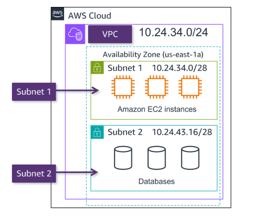

#### Network Access Control Lists (NACLs)

- A NACL is a virtual firewall that controls **inbound and outbound traffic at the subnet level**.
- By default, a NACL allows all inbound and outbound traffic. You can create custom NACLs to control traffic.
- For custom NACLs, you can create rules that allow or deny traffic based on IP addresses, protocols, and ports. All inbound and outbound traffic is denied by default until you add rules.
- **NACLs perform stateless filtering**. They remember nothing and check packets that cross the subnet boundary each way: in and out.
- After a packet crosses the subnet boundary, it is checked by the `Security Group` associated with the resource.

#### Security Groups

- A security group acts as a **virtual firewall for your instance** to control inbound and outbound traffic.
- You can add custom rules to configure which traffic should be allowed; any other traffic would then be denied.
- Security Group only contain **allow** rules.
- **Security Groups are stateful**. They remember previous decisions made for incoming packets.
- Can be attached to multiple instances.
- Security group is locked down to a region/VPC combinations.
- If application is not accessible, check the security group first.
- If application gives a connection refused, then it's an application error or it's not launched.
- All **inbound traffic is blocked by default**.
- All **outbound traffic is authorized by default**.

> It's good to maintain one seperate security group for SSH Access.


### Global Networking

#### DNS

- Nothing to talk about DNS. Just the "phone book" of the internet.

#### Amazon Route 53

- **Amazon Route 53** is a DNS web service. It gives developers and businesses a reliable way to route end users to internet applications hosted in AWS.
- Amazon Route 53 connects user requests to infrastructure running in AWS (such as Amazon EC2 instances and load balancers). It can route users to infrastructure outside of AWS.
- Another feature of Amazon Route 53 is the ability to register domain names. You can also transfer DNS records for existing domain names to Amazon Route 53.

## Storage and Database

### Instance Stores and Amazon Elastic Block Store (EBS)

#### Instance Stores

- **Instance Store** is a temporary block-level storage that is physically attached to the host computer for an EC2 instance. It behaves like a physical hard drive.
- An instance store is disk storage that is physically attached to the host computer for an EC2 instance, and therefore has the same lifespan as the instance.

#### Amazon Elastic Block Store (EBS)

- **Amazon Elastic Block Store (Amazon EBS)** provides block-level storage volumes for use with Amazon EC2 instances.
- Backup and restore: You can create snapshots of EBS.


### Amazon S3

#### Object Storage

- In object storage, each object consists of data, metadata and key.
- Data may be in any format, such as text, image, video, or audio.
- **Amazon S3** is a service that provides object-level storage. Amazon S3 stores data as objects in buckets.
- Maximum object size: 5TB.
- In S3, you pay only for what you use.
- Consider two factors:
    - How often you plan to retrieve data.
    - How available you need the data to be.

#### Amazon S3 Storage Classes

- **Amazon S3 Standard**: 
    - For frequently accessed data.
    - Stores data in a **minimum of three Availability Zones**.
    - Amazon S3 Standard has a higher cost than other storage classes intended for infrequently accessed data and archival storage.
- **Amazon S3 Standard-Infrequent Access (S3 Standard-IA)**:
    - Ideal for infrequently accessed data.
    - Similar to Amazon S3 Standard, but with lower storage costs and higher retrieval costs. 
- **Amazon S3 One Zone-Infrequent Access (S3 One Zone-IA)**:
    - Ideal for infrequently accessed data that does not require the same level of availability and durability as Amazon S3 Standard or S3 Standard-IA.
    - Stores data in a single Availability Zone.
    - Has a lower storage price than Amazon S3 Standard-IA.
- **Amazon S3 Intelligent-Tiering**:
    - Automatically moves objects between two access tiers based on changing access patterns.
    - Designed for customers who want to optimize storage costs automatically when data access patterns change.
    - Requires a small monthly monitoring and automation fee per object
- **Amazon S3 Glacier Instant Retrieval**:
    - Works well for archived data that requires immediate access, Can retrieve objects within a few milliseconds.
    - Data is stored in a durable, secure, and low-cost storage class.
- **Amazon S3 Glacier Flexible Retrieval**:
    - Ideal for archived data that requires access within minutes to hours.
    - Low-cost storage designed for data archiving
- **Amazon S3 Glacier Deep Archive**:
    - Lowest-cost object storage class ideal for archiving
    - Able to retrieve objects within `12 hours`
- **Amazon S3 Outposts**:
    - Ideal for workloads that require low-latency access to data on-premises.
    - Provides object storage on premises.

### Amazon Elastic File System (EFS)

- Amazon EFS is a regional service. It stores data in and across multiple Availability Zones.
- Compared to block storage and object storage, file storage is ideal for use cases in which a large number of services and resources need to access the same data at the same time.
- The duplicate storage enables you to access data concurrently from all the Availability Zones in the Region where a file system is located.

### Amazon RDS

- **Amazon Relational Database Service (Amazon RDS)** is a managed service that makes it easy to set up, operate, and scale a relational database in the cloud.
- Amazon RDS is a managed service that automates tasks such as hardware provisioning, database setup, patching, and backups.
- Available engines: Amazon Aurora, PostgreSQL, MySQL, MariaDB, Oracle, and Microsoft SQL Server.
- `Amazon Aurora` is an enterprise-class relational database. It is compatible with MySQL and PostgreSQL relational databases.

### Other Storage services

- Amazon DynamoDB: A key-value database service.
- Amazon Redshift: A data warehousing service.
- Amazon Database Migration Service: A service that helps you migrate databases to AWS quickly and securely.
- Amazon DocumentDB: A document database service that is compatible with MongoDB.
- Amazon Neptune: A graph database service.
- Amazon ElastiCache: A web service that makes it easy to deploy, operate, and scale an in-memory cache in the cloud.

## Security

### AWS Shared Responsibility Model

- The shared responsibility model divides into customer responsibilities (commonly referred to as **"security in the cloud"**) and AWS responsibilities (commonly referred to as **"security of the cloud"**).

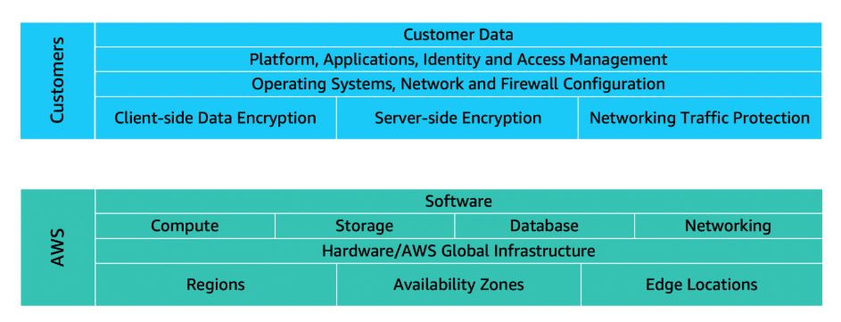

### AWS Identity and Access Management (IAM)

- **AWS Identity and Access Management (IAM)** enables you to manage access to AWS services and resources securely.
- When you first create an AWS account, you begin with an identity known as the **root user**. Root user has complete access to all AWS services and resources in the account.
- Root account created by default, shouldn't bbe used or shared.
- Users are people within your organization and they can be grouped into IAM groups.
- Group only contains users, not other groups.
- Users don't have to belong to any group, and user can belong to multiple groups.

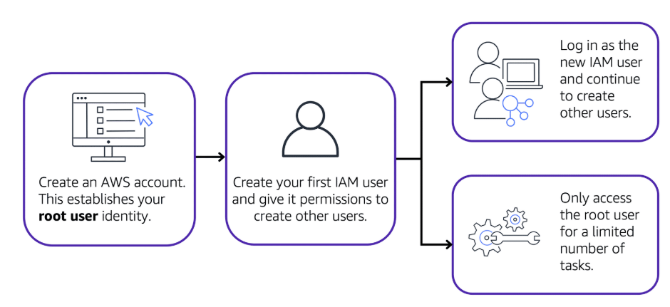

> Best practice: Do not use the root user for everyday tasks. Instead, use the root user to create your first IAM user and assign it permission to create other users. Then, countinue to create other IAM users.

#### IAM Users

- An IAM User is an identity that you create ion AWS. It **represents a person or service** that interacts with AWS services and resources.
- By default, when you create a new IAM user in AWS, it has no permissions associated with it. To allow the IAM user to perform specific actions in AWS, you mus grant the IAM user the necessary permissions.

> Best practice: AWS recommend that you create individual IAM users for each person who needs to access AWS.  

#### IAM Policies

- An IAM policy is a document that allows or denies permissions to AWS services and resources.
- IAM policies enable you to customize users levels of access to resources. For example, you can allow users to access all of the Amazon S3 buckets within your AWS account, or only a specific bucket.
- Example IAM policy:

```json
{
    "Version": "2012-10-17",
    "Statement": [
        {
            "Effect": "Allow",
            "Action": "s3:ListObject",
            "Resource": "arn:aws:s3:::my_bucket/*"
        }
    ]
}
```

> Best practice: Follow the security principle of least privilege. This means that you should grant only the permissions that are required to perform a task.

#### IAM groups

- An IAM group is a collection of IAM users. You can use groups to specify permissions for multiple users, which can make it easier to manage permissions for those users.

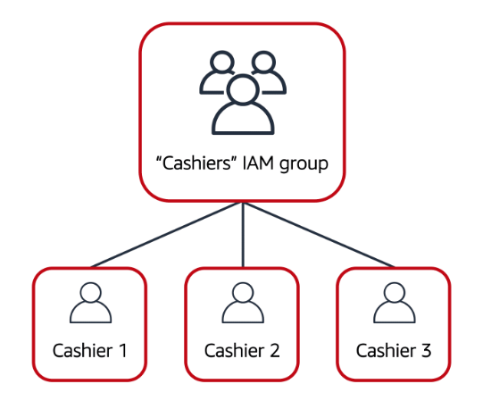

#### IAM Roles

- **An IAM role** is an identity that you can assume to gain temporary access to permissions.
-  When someone assumes an IAM role, they abandon all previous permissions that they had under a previous role and assume the permissions of the new role. 
- IAM roles just like IAM users, buit they are intended to be used not by physical people, they are used by services.

> Best practice: IAM roles are ideal for situations in which access to services or resources needs to be granted temporarily, instead of long-term.

#### IAM Security Tools

- **IAM Credentials Report (Account Level)**: A report that lists all of the IAM users in your account and the status of their various credentials.
- **IAM Access Advisor (User Level)**: A tool that shows the service permissions granted to a user and when those services were last accessed.

> Best practice: Use Access Keys for programmatic access (CLI/SDK) and use IAM roles for applications.

### Denial of Service (DoS) and Distributed Denial of Service (DDoS) Attacks

- A denial-of-service (DoS) attack is a deliberate attempt to make a website or application unavailable to users.
- For example, an attacker might flood a website or application with excessive network traffic until the targeted website or application becomes overloaded and is no longer able to respond.

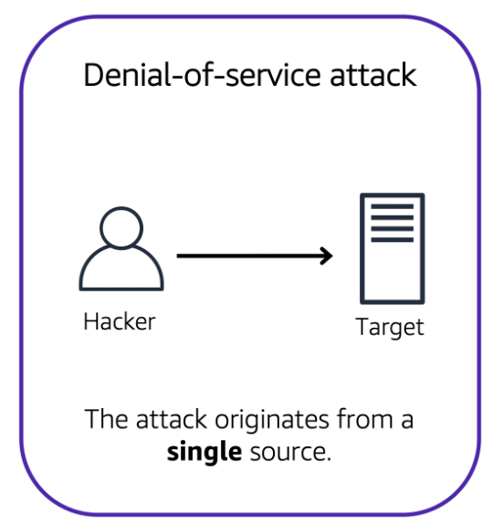

- A distributed denial-of-service (DDoS) attack is a type of DoS attack in which multiple compromised systems are used to target a single system.

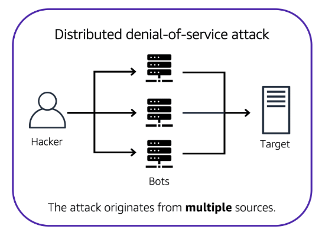

#### AWS Shield

- **AWS Shield** is a service that protects applications against DDoS attacks. AWS Shield provides two levels of protection: `Standard` and `Advanced`.
    - **AWS Shield Standard** is automatically included at no extra cost with AWS services.
    - **AWS Shield Advanced** provides additional protection against more sophisticated DDoS attacks, it is a paid service.

### Additinal Security Services

- **AWS Key Management Service (KMS)**: A managed service that makes it easy for you to create and control the encryption keys used to encrypt your data.
- **AWS WAF**: A web application firewall that helps protect your web applications from common web exploits.
- **Amazon Inspector**: An automated security assessment service that helps improve the security and compliance of applications deployed on AWS.
- **Amazon GuardDuty**: A threat detection service that continuously monitors for malicious activity and unauthorized behavior to protect your AWS accounts and workloads.

## Monitoring and Analytics

### Amazon CloudWatch

- **Amazon CloudWatch** is a web service that enables you to monitor and mange various metrics, as well as configure alarm actions based on data from those metrics.
- CloudWatch uses metrics to represent the data points for your resources. AWS services send metrics to CloudWatch.

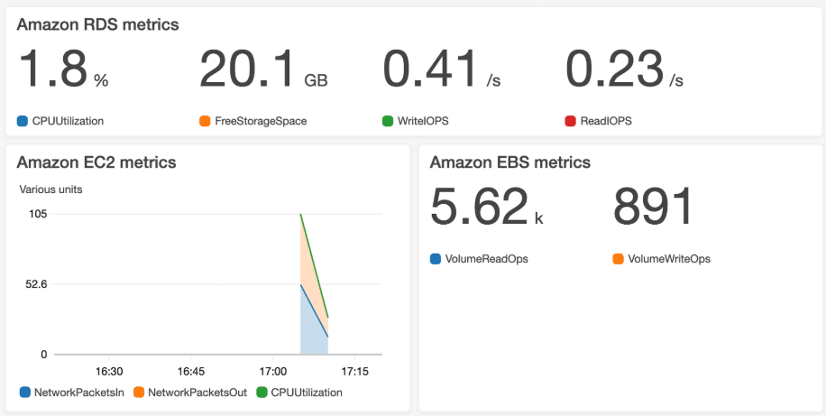

### Amazon CloudTrail

- **AWS CloudTrail** records API calls for your account. The recorded information includes the identity of the API caller, the time of the API call, the source IP address of the API caller, and more.
- Within CloudTrail, you can also enable `CloudTrail Insights`. This optional feature allows CloudTrail to automatically detect unusual API activities in your AWS account. 

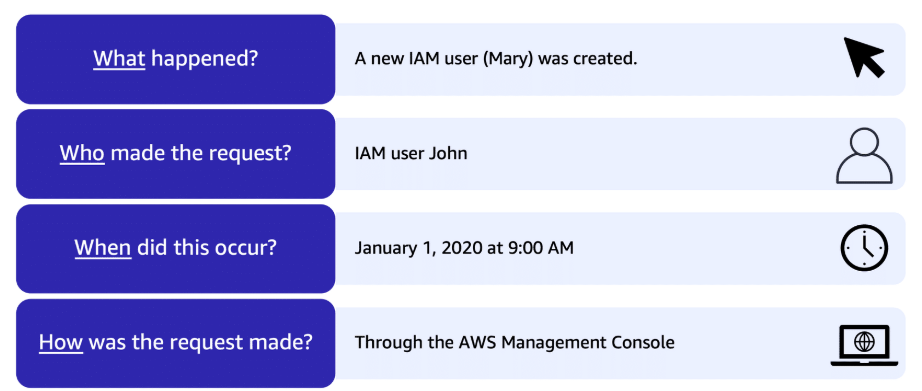

### AWS Trusted Advisor

- **AWS Trusted Advisor** is a web service that inspects your AWS environment and provides real-time recommendations in accordance with AWS best practices.
- Trusted Advisor compares its findings to AWS best practices in five categories:
    - Cost Optimization
    - Performance
    - Security
    - Fault Tolerance
    - Service Limits

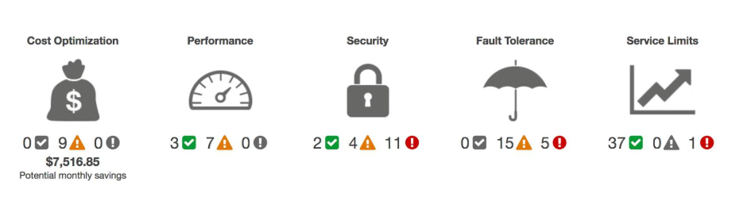

- In Trusted Advisor console: 
    - **The green check** indicates the number of items for which it detected no problems.
    - **The orange triangle** represents the number of recommended investigations.
    - **The red flag** represents the number of recommended actions.

## Pricing and Support

### AWS Free Tier

- [The AWS Free Tier](https://aws.amazon.com/free/) enables you to begin using certain services without having to worry about incurring costs for the specified period.
    - Always free: These offers do not expire and are available to all AWS customers. Example:
        - 25GB of Amazon DynamoDB storage.
        - AWS Lambda allows 1 million free requests and up to 3.2 million seconds of compute time per month.
    - 12 months free: These offers are available to new AWS customers and are available for 12 months following your AWS sign-up date. Example:
        - 750 hours of Amazon EC2 Linux t2.micro instance usage.
        - 5GB of Amazon S3 storage.
    - Trials: Shor-term free trials that start from the date you activate a service.

### Pricing Concepts

- **Pay for what you use**: You pay only for the services you use, pay for the resources you consume without any upfront or long-term commitments.
- **Pay less when you reserve**: Some services offer reservation options that provide a significant discount compared to On-Demand Instance pricing.
- **Pay less with volume**: The more you use, the less you pay per unit. Some services offer tiered pricing, so the per-unit cost is incrementally lower with increased usage.

#### Pricing Examples

- **AWS Lambda**: For AWS Lambda, you are charged based on the **number of requests for your functions** and **the time that it takes for them to run**. You can save on AWS Lambda costs by signing up for a Compute Savings Plan (offers lower compute costs in exchange for committing to a consistent amount of usage over a 1-year or 3-year term)

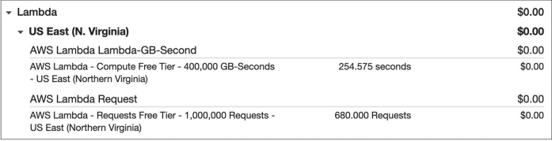

- **Amazon EC2**: For Amazon EC2, you pay for only the **compute time that you use** while your instances are running.

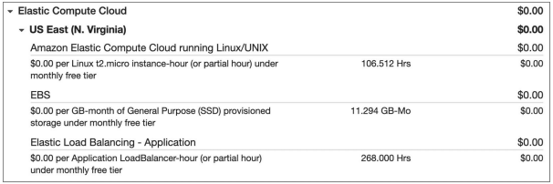

- **Amazon S3**: For Amazon S3, you pay for the **storage** that you use, the **number of requests made to your data**, the amount of **data transferred** out of Amazon S3 and **management, replication**.

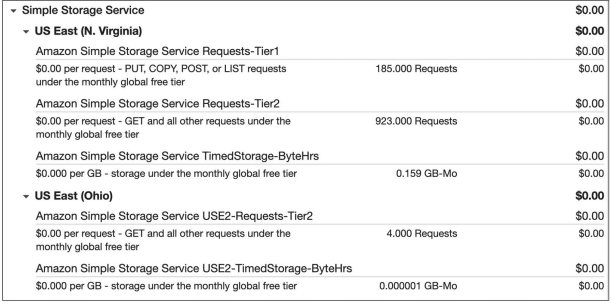

### Billing Dashboard

- Use the **AWS Billing & Cost Management dashboard** to pay your AWS bill, monitor your usage, and analyze and control your costs.

#### Consolidated Billing

- **The consolidated billing** feature of AWS Organizations enables you to receive a single bill for all AWS accounts in your organization.

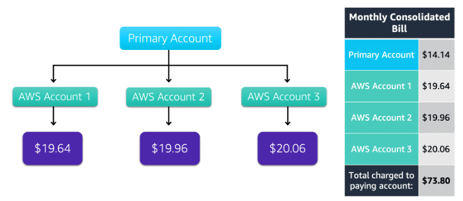

### AWS Budgets

- In **AWS Budgets**, you can create budgets to plan your service usage, service costs, and instance reservations. 
- The information in AWS Budgets updates three times a day. This helps you to accurately determine how close your usage is to your budgeted amounts or to the AWS Free Tier limits.

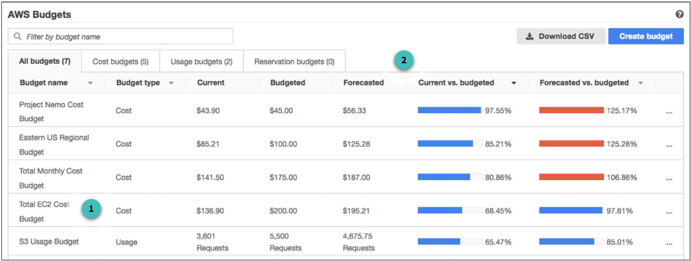

### AWS Cost Explorer

- **AWS Cost Explorer** is a tool that enables you to visualize, understand, and manage your AWS costs and usage over time.
- Include a default report of the costs and usage for your top five cost-accruing services.

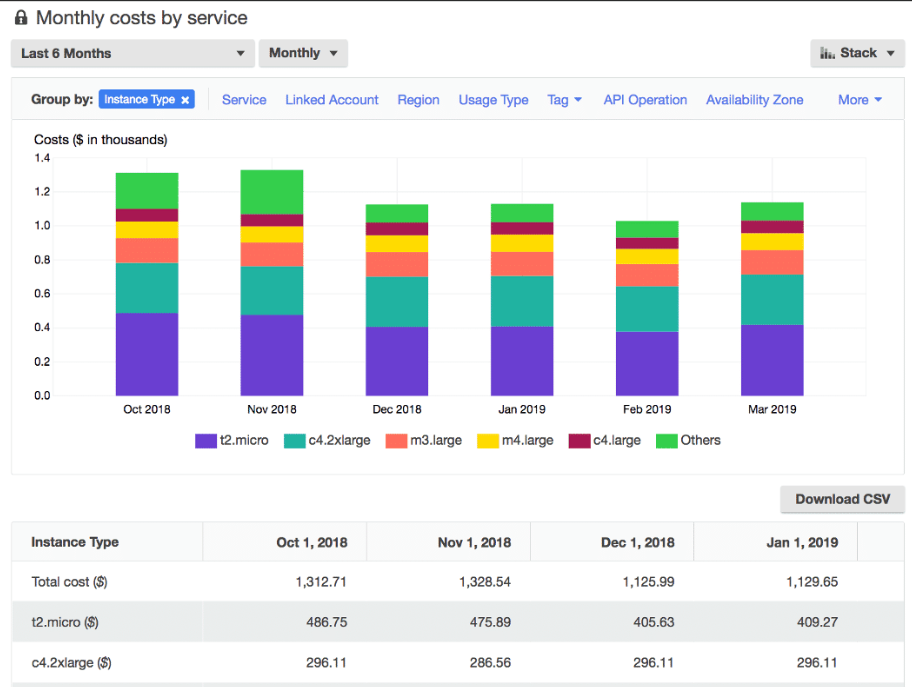

### AWS Support Plans

#### Basic Support

- **Basic Support** is free for all AWS customers. It includes access to whitepapers, documentation, and support communities.
- With Basic Support, you have access to a limited selection of **AWS Trusted Advisor** checks. Additionally, you can use the **AWS Personal Health Dashboard**, a tool that provides alerts and remediation guidance when AWS is experiencing events that may affect you.

#### TAM (Technical Account Manager)

- **The Enterprise On-Ramp** and **Enterprise Support** plans include access to a Technical Account Manager (TAM).
- **TAMs provide expert engineering guidance**, help you design solutions that efficiently integrate AWS services, assist with cost-effective and resilient architectures, and provide direct access to AWS programs and a broad community of experts.

| `Feature`                        | `Developer`                          | `Business`                                 | `Enterprise On-Ramp`                          | `Enterprise`                                                   |
|--------------------------------|------------------------------------|------------------------------------------|---------------------------------------------|-------------------------------------------------------------|
| **Case Severity/ Response Times** | General guidance: < `24 hours`<br>System impaired: < `12 hours` | General guidance: < `24 hours`<br>System impaired: < `12 hours`<br>Production system impaired: < `4 hours`<br>Production system down: < `1 hour` | General guidance: < `24 hours`<br>System impaired: < `12 hours`<br>Production system impaired: < `4 hours`<br>Production system down: < `1 hour`<br>Business-critical system down: < `30 minutes` | General guidance: < `24 hours`<br>System impaired: < `12 hours`<br>Production system impaired: < `4 hours`<br>Production system down: < `1 hour`<br>Business/Mission-critical system down: < `15 minutes` |
| **Architectural Guidance**      | General                           | Contextual to your use-cases             | Annual consultative review and guidance based on your applications | Consultative reviews and guidance based on your applications |
| **Technical Account Management** | `N/A`                              | `N/A`                                      | A pool of Technical Account Managers to provide proactive guidance | Designated Technical Account Manager (TAM) to provide consultative architectural and operational guidance delivered in the context of your applications and use-cases |
| **AWS Trusted Advisor**         | Service Quota and basic Security checks | Full set of checks                       | Full set of checks                            | Full set of checks and prioritized recommendations curated by AWS account team with AWS Trusted Advisor |


## Migration & Innovation

### AWS Cloud Adoption Framework (AWS CAF)

- At the highest level, thje AWS Cloud Adoption Framework organizes guidance into six areas of focus, called **perspectives**.
    - **Business Capabiblities**:
        - Business Perspective: Ensures that IT aligns with business needs and that IT investments link to key business results.
        - People Perspective: Supports development of an organization-wide change management strategy for cloud adoption.
        - Governance Perspective: focuses on the skills and processes to align IT strategy with business strategy. This ensures that you maximize the business value and minimize risks.
    - **Technology Capabilities**:
        - Platform Perspective: includes principles and patterns for implementing new solutions on the cloud, and migrating on-premises workloads to the cloud.
        - Security Perspective: ensures that the organization meets security objectives for visibility, auditability, control, and agility. 
        - Operations Perspective: helps you to enable, run, use, operate, and recover IT workloads to the level agreed upon with your business stakeholders.\

### Migration Strategies

- **Rehosting**: Also known as "lift and shift". This strategy involves moving your existing applications to the cloud with minimal changes.
- **Replatforming**: also known as "lift, tinker, and shift",Involves making a few cloud optimizations to your applications to take advantage of some cloud capabilities.
- **Refactoring**: Also known as "re-architecting". This strategy involves making significant changes to your applications to take full advantage of cloud-native features.
- **Repurchasing**: involves moving from a traditional license to a software-as-a-service model. 
- **Retiring**: Involves decommissioning an application or service that is no longer needed.
- **Retaining**: Involves keeping an application on-premises or in its current state.

### AWS Snow Family

- **AWS Snow Family** is a collection of physical devices that help you transfer large amounts of data into and out of AWS.
- **AWS Snowcone**: A small, rugged, and secure edge computing and data transfer device.
- **AWS Snowball**: A petabyte-scale data transport solution that uses secure appliances to transfer large amounts of data into and out of AWS.
    - **Snowball Edge Storage Optimized**: 
        - Storage: 80 TB of hard disk drive (HDD) capacity for block volumes and Amazon S3 compatible object storage, and 1 TB of SATA solid state drive (SSD) for block volumes. 
        - Compute: 40 vCPUs, and 80 GiB of memory to support Amazon EC2 sbe1 instances (equivalent to C5).
    - **Snowball Edge Compute Optimized**:
        - Storage: 80-TB usable HDD capacity for Amazon S3 compatible object storage or Amazon EBS compatible block volumes and 28 TB of usable NVMe SSD capacity for Amazon EBS compatible block volumes. 
        - Compute: 104 vCPUs, 416 GiB of memory, and an optional NVIDIA Tesla V100 GPU. Devices run Amazon EC2 sbe-c and sbe-g instances, which are equivalent to C5, M5a, G3, and P3 instances.
- **AWS Snowmobile**: AWS Snowmobile is a service that is used for transferring up to 100 PB of data to AWS.

## AWS Well-Architected Framework

- The **AWS Well-Architected Framework**  helps you understand how to design and operate `reliable`, `secure`, `efficient`, and `cost-effective` systems in the AWS Cloud.
- There are six pillars:
    - **Operational Excellence**: is the ability to run and monitor systems to deliver business value and to continually improve supporting processes and procedures.
      - AWS CloudFormation.
      - AWS Config.
      - AWS CloudTrail.
      - AWS CloudWatch.
      - AWS X-Ray.
      - AWS CodeBuild, AWS CodeDeploy, AWS CodePipeline, AWS CodeCommit.
    - **Security**: is the ability to protect information, systems, and assets while delivering business value through risk assessments and mitigation strategies. 
    - **Reliability**: is the ability of a system to do the following:
        - Recover from failures and continue to function.
        - Dynamically acquire computing resources to meet demand.
        - Mitigate disruptions such as misconfigurations or transient network issues.
    - **Performance Efficiency**: is the ability to use computing resources efficiently to meet system requirements and to maintain that efficiency as demand changes and technologies evolve. 
    - **Cost Optimization**: is the ability to run systems to deliver business value at the lowest price point. 
    - **Sustainability**: is the ability to continually improve sustainability impacts by reducing energy consumption and increasing efficiency across all components of a workload by maximizing the benefits from the provisioned resources and minimizing the total resources required.

### Benefits of the AWS Well-Architected Framework

- Trade upfront expense for variable expense.
- Benefit from massive economies of scale.
- Stop guessing capacity.
- Increase speed and agility.
- Stop spending money running and maintaining data centers.
- Go global in minutes.