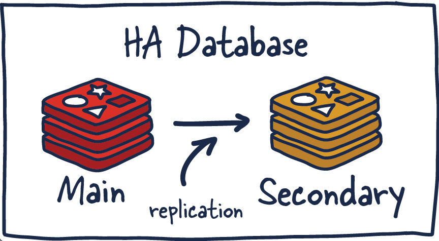
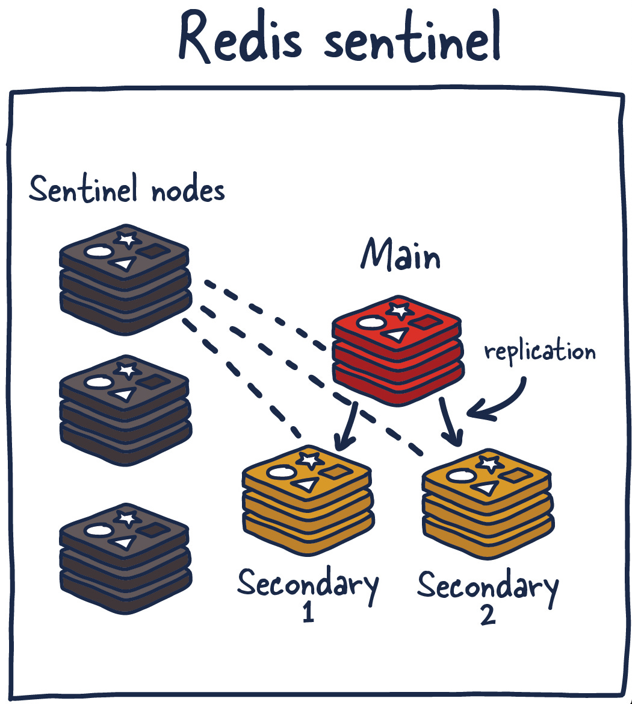

# 02. Caching Design

## 1. Introduction

- A Cache is a hardware or software component that stores data so that future requests for that data can be served faster.
- The data in cache:
    - **A copy of frequently accessed data** from a slower storage layer (like a database).
    - **Computed results of expensive operations.**
- Caching is used to improve performance, reduce latency, and decrease the load on backend systems.
- Trade-off:
    - Performance vs. consistency (Synchronize between cache and database).
    - Performance vs. cost (Space).
- Cache is **not a replacement** for a database.
- The cache `hit rate` is a key metric to measure the effectiveness of caching.
- Follow `80/20 rule`: 20% of objects are used 80% of the time.

## 2. Caching Strategies

### 2.1. Read

#### 2.1.1. Read-Aside cache

The cache is checked first, and if the data is not found, it is fetched from the database and stored in the cache. In cache-aside, the application is responsible for fetching data from the database and populating the cache.

- Cache hit:
```bash
┌─────────────┐    ┌─────────────┐    ┌─────────────┐
│   Client    │    │    Cache    │    │  Database   │
└──────┬──────┘    └──────┬──────┘    └──────┬──────┘
       │                  │                  │
       │ 1. GET user/123  │                  │
       ├─────────────────►│                  │
       │                  │                  │
       │                  │ 2. Key exists    │
       │                  │    ✓ HIT         │
       │                  │                  │
       │ 3. Return data   │                  │
       │◄─────────────────┤                  │
       │                  │                  │
       │                  │                  │
```

- Cache miss:
```bash
┌─────────────┐    ┌─────────────┐    ┌─────────────┐
│   Client    │    │    Cache    │    │  Database   │
└──────┬──────┘    └──────┬──────┘    └──────┬──────┘
       │                  │                  │
       │ 1. GET user/456  │                  │
       ├─────────────────►│                  │
       │                  │                  │
       │ 2. Key not found │                  │
       │    ✗ MISS        │                  │
       │◄─────────────────┤                  │
       │                  │ 3. Query DB      │
       │────────────────────────────────────►│
       │                  │                  │
       │                  │ 4. Return data   │
       │◄────────────────────────────────────┤
       │                  │                  │
       │ 5. Store in cache│                  │
       │─────────────────►│                  │
       │                  │                  │
       │                  │                  │
       │                  │                  │
```

- Advantages:
    - Tolerate cache failures (cache is decoupled from database).
    - Flexible for data models.
- Disadvantages:
    - Increased complexity.
    - Data inconsistency risk.

#### 2.1.2. Read-Through cache

The cache sits between the client and the database. When a cache miss occurs, the cache automatically loads data from the database. In read-through, this logic is usually supported by the library or stand-alone cache provider. Unlike cache-aside, the data model in read-through cache cannot be different than that of the database.

- Cache hit:
```bash
┌─────────────┐    ┌─────────────┐    ┌─────────────┐
│   Client    │    │    Cache    │    │  Database   │
└──────┬──────┘    └──────┬──────┘    └──────┬──────┘
       │                  │                  │
       │ 1. GET user/123  │                  │
       ├─────────────────►│                  │
       │                  │                  │
       │                  │ 2. Key exists    │
       │                  │    ✓ HIT         │
       │                  │                  │
       │ 3. Return data   │                  │
       │◄─────────────────┤                  │
       │                  │                  │
```

- Cache miss:
```bash
┌─────────────┐    ┌─────────────┐    ┌─────────────┐
│   Client    │    │    Cache    │    │  Database   │
└──────┬──────┘    └──────┬──────┘    └──────┬──────┘
       │                  │                  │
       │ 1. GET user/456  │                  │
       ├─────────────────►│                  │
       │                  │                  │
       │                  │ 2. Key not found │
       │                  │    ✗ MISS        │
       │                  │                  │
       │                  │ 3. Auto-load     │
       │                  ├─────────────────►│
       │                  │                  │
       │                  │ 4. Return data   │
       │                  │◄─────────────────┤
       │                  │                  │
       │                  │ 5. Store & return│
       │ 6. Return data   │                  │
       │◄─────────────────┤                  │
       │                  │                  │
```

- Advantages:
    - Simplified application logic (cache handles DB loading).
    - Consistent interface for applications.
    - Reduces duplicate code across services.
- Disadvantages:
    - Cache becomes a single point of failure.
    - Limited flexibility in loading logic.

### 2.2. Write

#### 2.2.1. Write-Through cache

Data is written to both cache and database simultaneously. The write operation is only considered successful when both operations complete.

```bash
┌─────────────┐    ┌─────────────┐    ┌─────────────┐
│   Client    │    │    Cache    │    │  Database   │
└──────┬──────┘    └──────┬──────┘    └──────┬──────┘
       │                  │                  │
       │ 1. POST user/123 │                  │
       ├─────────────────►│                  │
       │                  │                  │
       │                  │ 2. Write to DB   │
       │                  ├─────────────────►│
       │                  │                  │
       │                  │ 3. Success       │
       │                  │◄─────────────────┤
       │                  │                  │
       │                  │ 4. Update cache  │
       │                  │                  │
       │ 5. Success       │                  │
       │◄─────────────────┤                  │
```

- Advantages:
    - Data consistency between cache and database.
    - Fast subsequent reads.
- Disadvantages:
    - Slower write operations.
    - Cache may store infrequently accessed data.
    - Write latency increases.

#### 2.2.2. Write-Around cache (Usually used)

Data is written directly to the database, bypassing the cache. Cache is only populated on read misses. We may invalidate the cache entry after a write operation, but it is not mandatory.

```bash
┌─────────────┐         ┌─────────────┐    ┌─────────────┐
│   Client    │         │    Cache    │    │  Database   │
└──────┬──────┘         └──────┬──────┘    └──────┬──────┘
       │                       │                  │
       │ 1. POST user/123      │                  │
       ├─────────────────────────────────────────►│
       │                       │                  │
       │                       │ 2. Write data    │
       │                       │                  │
       │ 3. Success            │                  │
       │◄─────────────────────────────────────────┤
       │ 4. Invalidate cache   │                  │
       │──────────────────────►│                  │
       │                       │                  │
```

- Advantages:
    - Fast write operations.
    - No cache invalidation complexity.
    - Good for write-heavy workloads.
    - Prevents cache pollution with infrequently accessed data.
- Disadvantages:
    - Recent writes not available in cache.
    - Higher read latency for new data.
    - Cache miss penalty for newly written data.

#### 2.2.3. Write-Behind cache (Write-Back)

Data is written to cache immediately and asynchronously written to database later.

```bash
┌─────────────┐    ┌─────────────┐    ┌─────────────┐
│   Client    │    │    Cache    │    │  Database   │
└──────┬──────┘    └──────┬──────┘    └──────┬──────┘
       │                  │                  │
       │ 1. POST user/123 │                  │
       ├─────────────────►│                  │
       │                  │                  │
       │                  │ 2. Write to cache│
       │                  │                  │
       │ 3. Success       │                  │
       │◄─────────────────┤                  │
       │                  │                  │
       │                  │ 4. Async write   │
       │                  ├─────────────────►│
       │                  │    (batched)     │
```

- Advantages:
    - Fastest write performance.
    - Good for write-heavy applications.
    - Reduces database load through batching.
    - Better throughput.
- Disadvantages:
    - Risk of data loss if cache fails.
    - Complex implementation.
    - Eventual consistency issues.
    - Requires robust error handling.

### 2.3. Data Inconsistency

- **Cache Invalidation**:
    - **Time-based**: Set a TTL (Time To Live) for cache entries.
    - **Command-based**: Application logic to invalidate cache entries when data changes.
    - **Event-based**: Use events to trigger cache invalidation (e.g., message queues).
    - **Group-based**: Invalidate all entries related to a specific key or pattern.

- Why Cache Invalidation is Hard:
    - **Timing**: How long enough for TTL?
    - **Concurrency**: Race condition.
    - **Data Relationships**: Complex relationships can lead to cascading invalidations.
    - **Unlike Database, Cache can be everywhere and anywhere**: Hard to finding root causes.

- Consider Solution: 
  - `Read-Aside` + `Write-Around` with invalidation: `DELETE cache`. (`RA-DWA`).
  - It may remain data inconsistency for a short time, but it is acceptable in most cases. We can use `TTL` to reduce the inconsistency time.
  - Update DB first, delete cache later.

## 3. Challenges

### 3.1. Reliability Challenges

#### 3.1.1. Problem 01: No Atomicity

- **Context**:
  - Customer updates their profile: Age from 33 to 34.
  - But customer X complains that it needs some time to take effect.
  - Currently system is using `Read-Aside` + `Write-Through` cache.
  - The profile of customer X in cache is not updated yet.
- **Cause**:
    - `Cache` and `Database` are different systems.
    - Database may write successfully, but cache may fail to update.
    - Cache may return stale data.

```bash
┌─────────────┐    ┌─────────────┐    ┌─────────────┐
│   Client    │    │    Cache    │    │  Database   │
└──────┬──────┘    └──────┬──────┘    └──────┬──────┘
       │                  │                  │
       │ 1. UPDATE        │                  │
       │    age: 33→34    │                  │
       ├────────────────────────────────────►│
       │                  │ 2. Success ✓     │
       │◄────────────────────────────────────┤
       │                  │                  │
       │ 3. Update cache  │                  │
       │     ✗ FAILS      │                  │
       │─────────────────►│                  │
       │                  │                  │
       │ 4. GET user      │                  │
       ├─────────────────►│                  │
       │                  │                  │
       │ 5. Return        │                  │
       │    age: 33       │                  │
       │    (STALE!)      │                  │
       │◄─────────────────┤                  │
       │                  │                  │
```

- **Solution**:
    - Retry logic for cache update (Easy).
    - Use a message queue to ensure cache updates are processed (Hard).

### 3.1.2. Problem 02: Cache Avalanche

- **Context**:
  - Cache is down or cache entries or a "hot key" data are expired at the same time, 
  - All requests hit the database, causing a surge in load, leading to potential downtime.
- **Solution**:
    - **Cache Clustering**: Use multiple cache nodes to distribute load.
    - **Rate Limiting**: Limit the number of requests hitting the database during cache downtime.
    - **Circuit Breaker Pattern**: Temporarily stop requests to the database when it is overloaded.
    - **Even distribution** for TTL: Use a random TTL for cache entries to avoid simultaneous expiration.
    - With hot keys, we can do background preloading of cache entries before they expire or update cache periodically.

### 3.1.3. Problem 03: Cache Penetration

- **Context**:
  - A request for a non-existent key (e.g., user ID that does not exist) bypasses the cache and hits the database (It's also not in the database).
  - This can lead to excessive load on the database with many requests for non-existent data.
- **Solution**:
    - **Cache Empty Responses**: Store a special marker in the cache for non-existent keys to prevent repeated database hits.
    - **Bloom Filters**: Use a probabilistic data structure to quickly check if a key might exist before querying the cache or database.
    - **Strong Validation**: Validate requests before hitting the cache or database to ensure they are for valid keys.

## 3.2. High Traffic Challenges

### 3.2.1. Problem 04: Cache Hot Keys

- **Context**:
  - A small number of keys receive a disproportionately high number of requests (e.g., popular product ID). But these key only in Node A in a distributed cache.
- **Solution**:
    - **Cache Warming** or **Copy hot key into multiple nodes**: Preload frequently accessed data into the cache before it is requested.
    - **Local Caching**: Use local caches in each node to reduce the load on the central cache.

### 3.2.2. Problem 05: Large Cache Size

- **Context**:
  - Cache size is too large, leading to high memory usage and potential performance degradation, may increase latency.
- **Solution**:
    - **Data Compression**: Compress data before storing it in the cache to reduce memory usage.

## 3.3. What if the Cache DB is running out of memory?

- Least Recently Used (LRU) eviction policy: Remove the least recently used items from the cache when it reaches its memory limit.
- Least Frequently Used (LFU) eviction policy: Remove the least frequently accessed items from the cache.

## 4. Redis

### 4.1. Introduction

- Redis is an open-source, **in-memory database**.
- Various data structures: `strings`, `hashes`, `lists`, `sets`, `sorted sets`, ...
- Supports caching, pub/sub messaging, multiple clustering modes, and persistence...
- **Usecases**: Caching, key-value store, message queue, ...

### 4.2. Architecture

### 4.2.1. Master-Slave Replication

- `Replication`: Data is written to the master node and then replicated to one or more slave nodes asynchronously. Data can be read from both master and slave nodes.



- **Advantages**:
    - Improved read scalability (read from slaves).
- **Disadvantages**:
    - Data inconsistency risk (slaves may lag behind).
    - Failover issues (if master fails, a slave must be promoted).

### 4.2.2. Sentinel

- `Sentinel`: Provides high availability and monitoring for Redis. It can automatically promote a slave to master if the master fails.
- When Master fails, Sentinel will select a new master from the slaves and update other slaves to replicate from the new master.



- **Advantages**:
    - Automatic failover and monitoring.
- **Disadvantages**:
    - Data inconsistency.
    - Operational overhead.
    - All writes go to the master, which can become a bottleneck.

### 4.2.3. Cluster

- `Cluster`: Distributes data across multiple Redis nodes in different servers.


- **Advantages**:
    - Sovlves failover issues.
    - Reduce the system's dependency on a single master.
    - Scalable read and write operations.
- **Disadvantages**:
    - Increased complexity.
    - Operational overhead.