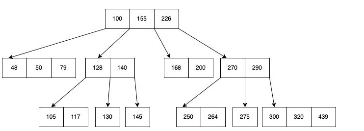
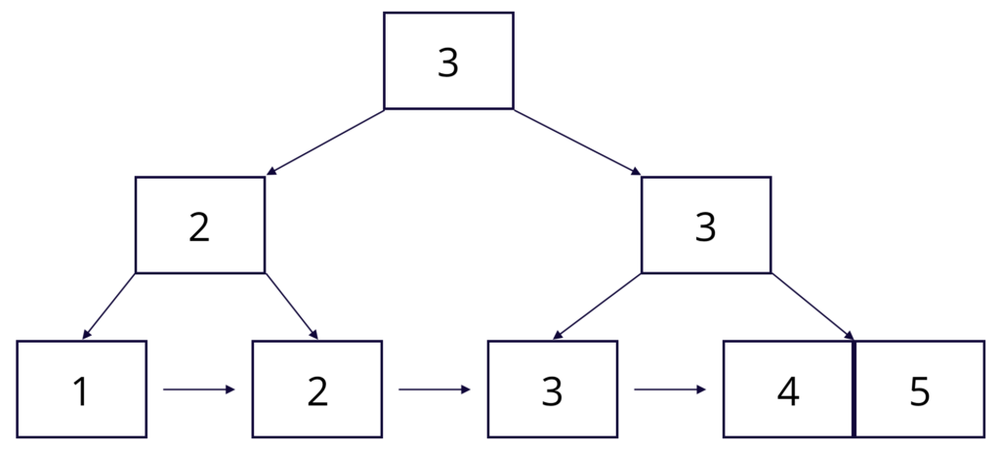
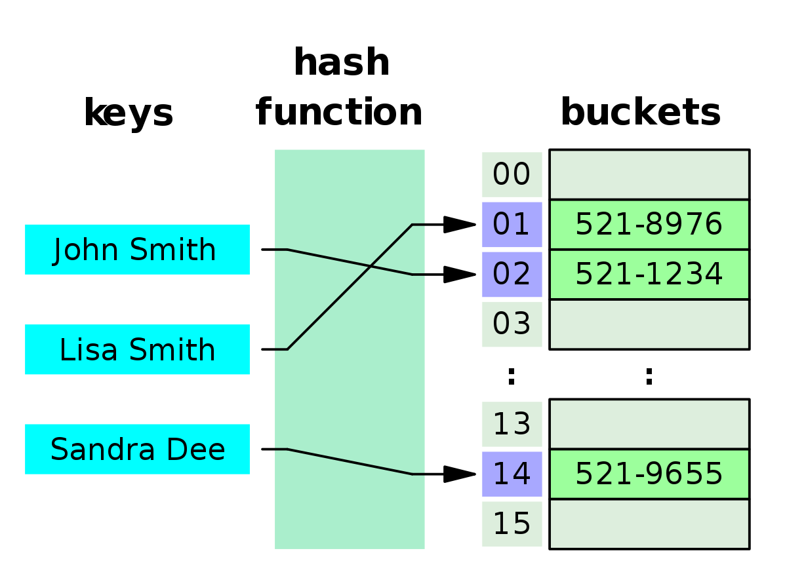
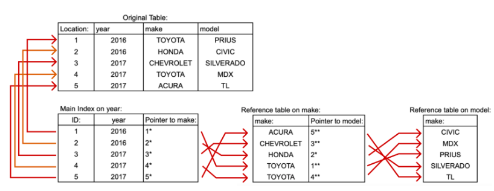

# 03. Index

> An index is a data structure that improves the speed of data retrieval operations on a database table at the cost of additional space and slower writes.
> [Wikipedia](https://en.wikipedia.org/wiki/Index_(database))

## Table of Contents

- [03. Index](#03-index)
  - [Table of Contents](#table-of-contents)
  - [1. Introduction](#1-introduction)
  - [2. Classification](#2-classification)
    - [2.1. Data Structures](#21-data-structures)
      - [2.1.1. B-Tree (Balanced Tree)](#211-b-tree-balanced-tree)
      - [2.1.2. B+ Tree](#212-b-tree)
      - [2.1.3. Hash Index](#213-hash-index)
    - [2.2. Physical Storage](#22-physical-storage)
      - [2.2.1. Clustered Index](#221-clustered-index)
      - [2.2.2. Non-Clustered Index](#222-non-clustered-index)
    - [2.3. Characteristics](#23-characteristics)
      - [2.3.1. Primary Index](#231-primary-index)
      - [2.3.2. Unique Index](#232-unique-index)
    - [2.4. Columns](#24-columns)
      - [2.4.1. Single-Column Index](#241-single-column-index)
      - [2.4.2. Multi-Column Index](#242-multi-column-index)
    - [2.4.3. Covering Index](#243-covering-index)
  - [3. Best Practices](#3-best-practices)
    - [3.1. When?](#31-when)
    - [3.2. Failures index](#32-failures-index)
      - [3.2.1. Case 1: Index with `LIKE`](#321-case-1-index-with-like)
      - [3.2.2. Case 2: Index with `OR`](#322-case-2-index-with-or)
      - [3.2.3. Case 3: Type Conversion](#323-case-3-type-conversion)
      - [3.2.5. Case 4: Index with calculated columns](#325-case-4-index-with-calculated-columns)
  - [4. Query Optimization (PostgreSQL)](#4-query-optimization-postgresql)
    - [4.1. Direct Query Optimization](#41-direct-query-optimization)
      - [4.1.1. Execute plan](#411-execute-plan)
      - [4.1.2. Types of Scanning](#412-types-of-scanning)
      - [4.1.3. Reading Execution Plan](#413-reading-execution-plan)
  - [5. Some self notes](#5-some-self-notes)
    - [5.1. Multicolumn Indexes](#51-multicolumn-indexes)
    - [5.2. Syntax](#52-syntax)
    - [5.3. What the heck is a multicolumn index?](#53-what-the-heck-is-a-multicolumn-index)
    - [5.4 Example](#54-example)
    - [5.5 Performance](#55-performance)

## 1. Introduction

- Indexes are used to speed up data retrieval operations in databases.
- Indexes are **typically stored on disk**.

## 2. Classification

- **By data structure**: B+tree, hash, bitmap, etc.
- **By Physical storage**: clustered, non-clustered, etc.
- **By number of columns**: single-column, multi-column, etc.
- **By characteristics**: Primary, unique, prefix, full-text, etc.

### 2.1. Data Structures

> What factors should be considered when mentioning data structures and algorithms?

- Usecase.
- Time complexity.
- Space complexity.
- Complexity of implementation.

#### 2.1.1. B-Tree (Balanced Tree)



- All leaves are at the same level.
- Each node contains a sorted list of keys and pointers to child nodes.
- Insertion, deletion, and search operations can be performed in O(log n) time.

#### 2.1.2. B+ Tree



- A variation of B-Tree.
- The pointers to the actual records are stored only in the leaf nodes.
- The internal nodes only contain keys and pointers to other nodes. Many keys can be stored in internal nodes.
- All leaf nodes are linked together, allowing for efficient range queries.

#### 2.1.3. Hash Index

> A "Good" hash function is one that minimizes collisions, evenly distributes keys, and is fast to compute.



- Uses a hash function to compute the address of the data.
- Fast for equality searches.
- Limitations:
    - Not suitable for range queries.
    - Requires a good hash function to minimize collisions.

### 2.2. Physical Storage

#### 2.2.1. Clustered Index


- Clustered index is a type of index that determines the physical order of data in a table.
- A table can **have only one** clustered index.
- The leaf nodes of a clustered index contain the actual data rows.
- By default, primary keys are clustered indexes. But we can choose different columns as clustered indexes, separate from the primary key.
- In `InnoDB`, cluster index use `B+Tree` structure (can't use hash index).

#### 2.2.2. Non-Clustered Index


- Indexes are not clustered index, then non-clustered index.
- The value (the leaf node of B+Tree) of secondary index is **the primary key value**.
- A table can have multiple secondary indexes.
- Accessing data using a secondary index involves two steps:
    1. Use the secondary index to find the primary key.
    2. Use the primary key to find the actual data row.

> What is the disadvantage of indexes?

- Slow down write operations.
- Occupy additional disk space.
- Take time to create and maintain indexes.

### 2.3. Characteristics

> What is the difference between key and index?

- **Key**: a constraint defined the behavior of data in a database table, such as primary key, foreign key, etc. It ensures data integrity and uniqueness.
- **Index**: An index is a data structure that improves the speed of data retrieval operations on a database table. It is used to quickly locate and access the data without scanning the entire table.

#### 2.3.1. Primary Index

- Primary index is a specific type of index that serves as a unique identifier for each record in a table.

#### 2.3.2. Unique Index

- Unique index ensures that the values in a column or a combination of columns are unique across the table (but can be null).

### 2.4. Columns

#### 2.4.1. Single-Column Index

- An index created on a single column of a table.

#### 2.4.2. Multi-Column Index

Example: Multi-Column Index (`country`, `province`, `name`).

> Which of the following queries can use this index?

- `SELECT * FROM users WHERE  province = 'California' AND country = 'USA';`
- `SELECT * FROM users WHERE province = 'California';`
- `SELECT * FROM users WHERE name = 'JANE' AND province = 'Texas';`
- `SELECT * FROM users WHERE country = 'USA'`

**Answer**: The first and the fourth queries can use the multi-column index.

- **The order of columns in a multi-column index matters**. The index is most effective when the **leading column** are used in the query's WHERE clause.

> Is this multi-column index useful for the above queries?

**Answer**: The leading index column in multi-column index should have high cardinality (**the higher the number of unique values, the better**).

### 2.4.3. Covering Index

- A covering index is an index that contains all the columns needed to satisfy a query, allowing the database to retrieve the data without accessing the actual table.
- Answering the query by using only the index without accessing the table is called **index-only scan**.
- Recommended for <= 5 columns.

## 3. Best Practices

### 3.1. When?

> When to use indexes?

- Read-heavy workloads: `WHERE`, `JOIN`, `ORDER BY`, `GROUP BY`, etc.
- Fields that are frequently used in search conditions or unique constraints.
- Find small datasets in large tables.

> When not to use indexes?

- Very low cardinality columns (e.g., boolean fields, gender fields).
- Write-heavy workloads.

- **Best practice**:
  - Limit the number of indexes on a table to avoid performance degradation.
  - The primary key index is preferably self-incrementing (e.g., `AUTO_INCREMENT` in MySQL).
  - The index is best set to `NOT NULL`, because `NULL` is complicated to handle in indexes and can lead to performance issues.
  - `Covering indexes` are recommended for queries that require multiple columns (reduce a lot of I/O operations).
  - Regularly monitor and analyze query performance to identify potential indexing needs: B+Tree might become unbalanced over time, leading to performance degradation -> rebuild the index periodically.

### 3.2. Failures index

#### 3.2.1. Case 1: Index with `LIKE`

> Index on `name` column

- `SELECT * FROM users WHERE name LIKE '%JANE';` (❌)
- `SELECT * FROM users WHERE name LIKE '%JANE%';` (❌)
- `SELECT * FROM users WHERE name LIKE 'JANE%';` (✅)

#### 3.2.2. Case 2: Index with `OR`

> Index on `id` column

- `SELECT * FROM users WHERE id = 1 OR age = 18;` (❌ - `INDEX` OR `NOT INDEX` -> Still scan the whole table).

#### 3.2.3. Case 3: Type Conversion

> Index on `age` column

- if `age` is varchar: `SELECT * FROM users WHERE age = 18;` (❌ - `age` is converted to string, so it will scan the whole table).
- if `age` is int: `SELECT * FROM users WHERE age = '18';` (✅ - `age` is converted to int, so it can use the index).

**Because automatically convert the string to int, so it can use the index.**

#### 3.2.5. Case 4: Index with calculated columns

> Index on `age` column

- `SELECT * FROM users WHERE age + 1 = 18;` (❌ - `age + 1` is a calculated column, so it will scan the whole table).
- `SELECT * FROM users WHERE age = 17;` (✅ - `age` is a column, so it can use the index).

**Because the index saves the original value of the column, not the value calculated by expression.**

## 4. Query Optimization (PostgreSQL)

### 4.1. Direct Query Optimization

#### 4.1.1. Execute plan

- An **execution plan** is a detailed, step-by-step description of how a database engine will execute a query.
- Syntax:
  - `EXPLAIN`: get basic information about the execution plan.
  - `ANALYZE`: get more concrete information about the execution plan, including actual execution time and row counts.
  - `BUFFER`: get information about cache hit/miss statistics.
  - `FORMAT`: specify the output format (e.g., `JSON`, `TEXT`, etc.).
  - Example: `EXPLAIN (ANALYZE, BUFFERS, FORMAT JSON) SELECT * FROM users WHERE age = 18;`

```SQL
EXPLAIN ANALYZE
SELECT
    *
FROM
    "MacAddresses" ma
WHERE
    mac_address = '30600ada759f';                                               
```

#### 4.1.2. Types of Scanning

- Sequential Scan: Scans the entire table row by row without using an index.
  - Parallel Sequential Scan: Uses multiple threads to scan the table in parallel.
- Index Scan: Uses an index to quickly locate rows.
- Index only Scan: Uses a covering index to retrieve all required columns without accessing the table.
- Bitmap Index Scan + Bitmap Heap Scan: Combines multiple index scans into a bitmap, then retrieves rows from the table.

#### 4.1.3. Reading Execution Plan

- Estimated Values:
  - `Startup Cost`: The estimated cost of the initial setup before the first row is returned.
  - `Total Cost`: The estimated cost of executing the entire query.
  - `Plan Rows`: The estimated number of rows that will be returned by the query.
  - `Plan Width`: The estimated average width (in bytes) of each row returned by the query.
- Actual Values:
  - `Actual Startup Time`: The actual time taken to start returning the first row.
  - `Actual Total Time`: The actual time taken to execute the entire query.
  - `Actual Rows`: The actual number of rows returned by the query.
  - `Actual Loops`: The number of times the operation was executed (useful for nested loops).

## 5. Some self notes


### 5.1. Multicolumn Indexes

> Multicolumn indexes (also known as composite indexes) are similar to standard indexes. They both store a sorted "table" of pointers to the main table. Multicolumn indexes however can store additional sorted pointers to other columns.

**References**: [Multicolumn Indexes](https://www.atlassian.com/data/sql/multicolumn-indexes)

### 5.2. Syntax

```sql
CREATE INDEX [index name]
ON [Table name]([column1, column2, column3,...]);
```

### 5.3. What the heck is a multicolumn index?

- Multicolumn indexes are indexes that store data on up to 32 columns.
- When creating a multicolumn index, **the column order is very important.**
- Multicolumn indexes are structured to have `a hierarchical structure`.

### 5.4 Example


Multi-column index will look like this if we create index on (`year`, `make`, `model`):



- In a three column index we can see that the main index `year` stores pointers to both the original table and the reference table on `make`, which in turn has pointers to the reference table on `model`.
- Query step:
    - The query will first look at the `year` index to find the correct `year`.
    - The main index also has a pointer to the secondary index where the related `make` is stored.
    - The secondary index in term has a pointer to the tertiary index.
- Because of this pointer ordering, in order to access the secondary index, it has to be **done through the main index**. 
- This means that this multicolumn index can be used for queries that filter by just `year`, `year and make`, or `year, make, and model`.
- The multicolumn index **cannot be used for queries just on the `make` or `model` of the car because the pointers are inaccessible.**

### 5.5 Performance

- A `normal index` versus a `multicolumn index`: There is little to no difference when sorting by just the first column `year`.


- However, when sorting by the multiple column `year, make, and model`, the multicolumn index is much faster.


