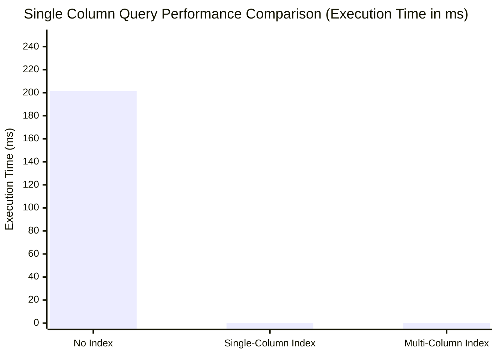
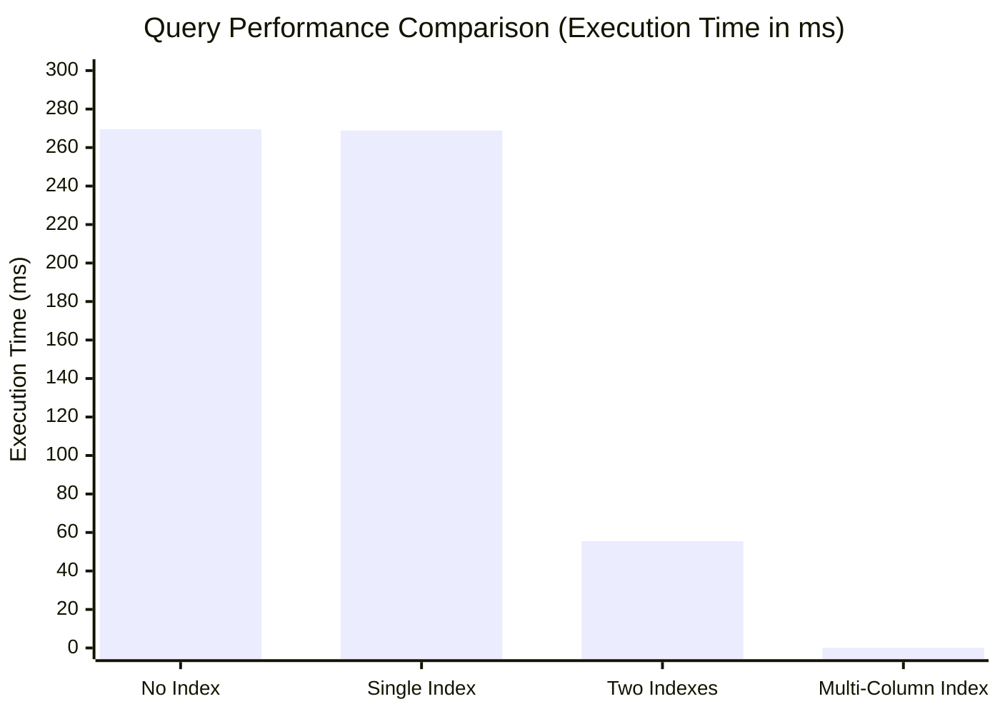

# 03. Index

> An index is a data structure that improves the speed of data retrieval operations on a database table at the cost of additional space and slower writes.
> [Wikipedia](https://en.wikipedia.org/wiki/Index_(database))

## Table of Contents

- [03. Index](#03-index)
  - [Table of Contents](#table-of-contents)
  - [1. Introduction](#1-introduction)
  - [2. Classification](#2-classification)
    - [2.1. Data Structures](#21-data-structures)
      - [2.1.1. B-Tree (Balanced Tree)](#211-b-tree-balanced-tree)
      - [2.1.2. B+ Tree](#212-b-tree)
      - [2.1.3. Hash Index](#213-hash-index)
    - [2.2. Physical Storage](#22-physical-storage)
      - [2.2.1. Clustered Index](#221-clustered-index)
      - [2.2.2. Non-Clustered Index](#222-non-clustered-index)
    - [2.3. Characteristics](#23-characteristics)
      - [2.3.1. Primary Index](#231-primary-index)
      - [2.3.2. Unique Index](#232-unique-index)
    - [2.4. Columns](#24-columns)
      - [2.4.1. Single-Column Index](#241-single-column-index)
      - [2.4.2. Multi-Column Index](#242-multi-column-index)
    - [2.4.3. Covering Index](#243-covering-index)
  - [3. Best Practices](#3-best-practices)
    - [3.1. When?](#31-when)
    - [3.2. Failures index](#32-failures-index)
      - [3.2.1. Case 1: Index with `LIKE`](#321-case-1-index-with-like)
      - [3.2.2. Case 2: Index with `OR`](#322-case-2-index-with-or)
      - [3.2.3. Case 3: Type Conversion](#323-case-3-type-conversion)
      - [3.2.5. Case 4: Index with calculated columns](#325-case-4-index-with-calculated-columns)
  - [4. Query Optimization (PostgreSQL)](#4-query-optimization-postgresql)
    - [4.1. Direct Query Optimization](#41-direct-query-optimization)
      - [4.1.1. Execute plan](#411-execute-plan)
      - [4.1.2. Types of Scanning](#412-types-of-scanning)
      - [4.1.3. Reading Execution Plan](#413-reading-execution-plan)
  - [5. Some self notes](#5-some-self-notes)
    - [5.1. Multicolumn Indexes](#51-multicolumn-indexes)
    - [5.2. Syntax](#52-syntax)
    - [5.3. What the heck is a multicolumn index?](#53-what-the-heck-is-a-multicolumn-index)
    - [5.4 Example](#54-example)
    - [5.5 Performance](#55-performance)
  - [6. Practical Example](#6-practical-example)
    - [6.1. Schema](#61-schema)
    - [6.2. Reading Execution Plan](#62-reading-execution-plan)
      - [6.2.1. Single column condition](#621-single-column-condition)
        - [6.2.1.1. Simple select:](#6211-simple-select)
        - [6.2.1.2. With Single-Column Index](#6212-with-single-column-index)
        - [6.2.1.3. With Multi-Column Index](#6213-with-multi-column-index)
      - [6.2.2. Multi-column condition](#622-multi-column-condition)
        - [6.2.2.1. Simple select:](#6221-simple-select)
        - [6.2.2.2. With Single-Column Index](#6222-with-single-column-index)
        - [6.2.2.3. With Multi-Column Index](#6223-with-multi-column-index)
    - [6.3. Questions](#63-questions)
      - [6.3.1. What if I select 1st column of multi-column index and use `WHERE` clause on remain column?](#631-what-if-i-select-1st-column-of-multi-column-index-and-use-where-clause-on-remain-column)
  

## 1. Introduction

- Indexes are used to speed up data retrieval operations in databases.
- Indexes are **typically stored on disk**.

## 2. Classification

- **By data structure**: B+tree, hash, bitmap, etc.
- **By Physical storage**: clustered, non-clustered, etc.
- **By number of columns**: single-column, multi-column, etc.
- **By characteristics**: Primary, unique, prefix, full-text, etc.

### 2.1. Data Structures

> What factors should be considered when mentioning data structures and algorithms?

- Usecase.
- Time complexity.
- Space complexity.
- Complexity of implementation.

#### 2.1.1. B-Tree (Balanced Tree)


- All leaves are at the same level.
- Each node contains a sorted list of keys and pointers to child nodes.
- Insertion, deletion, and search operations can be performed in O(log n) time.

#### 2.1.2. B+ Tree


- A variation of B-Tree.
- The pointers to the actual records are stored only in the leaf nodes.
- The internal nodes only contain keys and pointers to other nodes. Many keys can be stored in internal nodes.
- All leaf nodes are linked together, allowing for efficient range queries.

#### 2.1.3. Hash Index

> A "Good" hash function is one that minimizes collisions, evenly distributes keys, and is fast to compute.


- Uses a hash function to compute the address of the data.
- Fast for equality searches.
- Limitations:
    - Not suitable for range queries.
    - Requires a good hash function to minimize collisions.

### 2.2. Physical Storage

#### 2.2.1. Clustered Index


- Clustered index is a type of index that determines the physical order of data in a table.
- A table can **have only one** clustered index.
- The leaf nodes of a clustered index contain the actual data rows.
- By default, primary keys are clustered indexes. But we can choose different columns as clustered indexes, separate from the primary key.
- In `InnoDB`, cluster index use `B+Tree` structure (can't use hash index).

#### 2.2.2. Non-Clustered Index


- Indexes are not clustered index, then non-clustered index.
- The value (the leaf node of B+Tree) of secondary index is **the primary key value**.
- A table can have multiple secondary indexes.
- Accessing data using a secondary index involves two steps:
    1. Use the secondary index to find the primary key.
    2. Use the primary key to find the actual data row.

> What is the disadvantage of indexes?

- Slow down write operations.
- Occupy additional disk space.
- Take time to create and maintain indexes.

### 2.3. Characteristics

> What is the difference between key and index?

- **Key**: a constraint defined the behavior of data in a database table, such as primary key, foreign key, etc. It ensures data integrity and uniqueness.
- **Index**: An index is a data structure that improves the speed of data retrieval operations on a database table. It is used to quickly locate and access the data without scanning the entire table.

#### 2.3.1. Primary Index

- Primary index is a specific type of index that serves as a unique identifier for each record in a table.

#### 2.3.2. Unique Index

- Unique index ensures that the values in a column or a combination of columns are unique across the table (but can be null).

### 2.4. Columns

#### 2.4.1. Single-Column Index

- An index created on a single column of a table.

#### 2.4.2. Multi-Column Index

Example: Multi-Column Index (`country`, `province`, `name`).

> Which of the following queries can use this index?

- `SELECT * FROM users WHERE  province = 'California' AND country = 'USA';`
- `SELECT * FROM users WHERE province = 'California';`
- `SELECT * FROM users WHERE name = 'JANE' AND province = 'Texas';`
- `SELECT * FROM users WHERE country = 'USA'`

**Answer**: The first and the fourth queries can use the multi-column index.

- **The order of columns in a multi-column index matters**. The index is most effective when the **leading column** are used in the query's WHERE clause.

> Is this multi-column index useful for the above queries?

**Answer**: The leading index column in multi-column index should have high cardinality (**the higher the number of unique values, the better**).

### 2.4.3. Covering Index

- A covering index is an index that contains all the columns needed to satisfy a query, allowing the database to retrieve the data without accessing the actual table.
- Answering the query by using only the index without accessing the table is called **index-only scan**.
- Recommended for <= 5 columns.

## 3. Best Practices

### 3.1. When?

> When to use indexes?

- Read-heavy workloads: `WHERE`, `JOIN`, `ORDER BY`, `GROUP BY`, etc.
- Fields that are frequently used in search conditions or unique constraints.
- Find small datasets in large tables.

> When not to use indexes?

- Very low cardinality columns (e.g., boolean fields, gender fields).
- Write-heavy workloads.

- **Best practice**:
  - Limit the number of indexes on a table to avoid performance degradation.
  - The primary key index is preferably self-incrementing (e.g., `AUTO_INCREMENT` in MySQL).
  - The index is best set to `NOT NULL`, because `NULL` is complicated to handle in indexes and can lead to performance issues.
  - `Covering indexes` are recommended for queries that require multiple columns (reduce a lot of I/O operations).
  - Regularly monitor and analyze query performance to identify potential indexing needs: B+Tree might become unbalanced over time, leading to performance degradation -> rebuild the index periodically.

### 3.2. Failures index

#### 3.2.1. Case 1: Index with `LIKE`

> Index on `name` column

- `SELECT * FROM users WHERE name LIKE '%JANE';` (❌)
- `SELECT * FROM users WHERE name LIKE '%JANE%';` (❌)
- `SELECT * FROM users WHERE name LIKE 'JANE%';` (✅)

#### 3.2.2. Case 2: Index with `OR`

> Index on `id` column

- `SELECT * FROM users WHERE id = 1 OR age = 18;` (❌ - `INDEX` OR `NOT INDEX` -> Still scan the whole table).

#### 3.2.3. Case 3: Type Conversion

> Index on `age` column

- if `age` is varchar: `SELECT * FROM users WHERE age = 18;` (❌ - `age` is converted to string, so it will scan the whole table).
- if `age` is int: `SELECT * FROM users WHERE age = '18';` (✅ - `age` is converted to int, so it can use the index).

**Because automatically convert the string to int, so it can use the index.**

#### 3.2.5. Case 4: Index with calculated columns

> Index on `age` column

- `SELECT * FROM users WHERE age + 1 = 18;` (❌ - `age + 1` is a calculated column, so it will scan the whole table).
- `SELECT * FROM users WHERE age = 17;` (✅ - `age` is a column, so it can use the index).

**Because the index saves the original value of the column, not the value calculated by expression.**

## 4. Query Optimization (PostgreSQL)

### 4.1. Direct Query Optimization

#### 4.1.1. Execute plan

- An **execution plan** is a detailed, step-by-step description of how a database engine will execute a query.
- Syntax:
  - `EXPLAIN`: get basic information about the execution plan.
  - `ANALYZE`: get more concrete information about the execution plan, including actual execution time and row counts.
  - `BUFFER`: get information about cache hit/miss statistics.
  - `FORMAT`: specify the output format (e.g., `JSON`, `TEXT`, etc.).
  - Example: `EXPLAIN (ANALYZE, BUFFERS, FORMAT JSON) SELECT * FROM users WHERE age = 18;`

```SQL
EXPLAIN ANALYZE
SELECT
    *
FROM
    "MacAddresses" ma
WHERE
    mac_address = '30600ada759f';                                               
```

#### 4.1.2. Types of Scanning

- Sequential Scan: Scans the entire table row by row without using an index.
  - Parallel Sequential Scan: Uses multiple threads to scan the table in parallel.
- Index Scan: Uses an index to quickly locate rows.
- Index only Scan: Uses a covering index to retrieve all required columns without accessing the table.
- Bitmap Index Scan + Bitmap Heap Scan: Combines multiple index scans into a bitmap, then retrieves rows from the table.

#### 4.1.3. Reading Execution Plan

- Estimated Values:
  - `Startup Cost`: The estimated cost of the initial setup before the first row is returned.
  - `Total Cost`: The estimated cost of executing the entire query.
  - `Plan Rows`: The estimated number of rows that will be returned by the query.
  - `Plan Width`: The estimated average width (in bytes) of each row returned by the query.
- Actual Values:
  - `Actual Startup Time`: The actual time taken to start returning the first row.
  - `Actual Total Time`: The actual time taken to execute the entire query.
  - `Actual Rows`: The actual number of rows returned by the query.
  - `Actual Loops`: The number of times the operation was executed (useful for nested loops).

## 5. Some self notes


### 5.1. Multicolumn Indexes

> Multicolumn indexes (also known as composite indexes) are similar to standard indexes. They both store a sorted "table" of pointers to the main table. Multicolumn indexes however can store additional sorted pointers to other columns.

**References**: [Multicolumn Indexes](https://www.atlassian.com/data/sql/multicolumn-indexes)

### 5.2. Syntax

```sql
CREATE INDEX [index name]
ON [Table name]([column1, column2, column3,...]);
```

### 5.3. What the heck is a multicolumn index?

- Multicolumn indexes are indexes that store data on up to 32 columns.
- When creating a multicolumn index, **the column order is very important.**
- Multicolumn indexes are structured to have `a hierarchical structure`.

### 5.4 Example


Multi-column index will look like this if we create index on (`year`, `make`, `model`):


- In a three column index we can see that the main index `year` stores pointers to both the original table and the reference table on `make`, which in turn has pointers to the reference table on `model`.
- Query step:
    - The query will first look at the `year` index to find the correct `year`.
    - The main index also has a pointer to the secondary index where the related `make` is stored.
    - The secondary index in term has a pointer to the tertiary index.
- Because of this pointer ordering, in order to access the secondary index, it has to be **done through the main index**. 
- This means that this multicolumn index can be used for queries that filter by just `year`, `year and make`, or `year, make, and model`.
- The multicolumn index **cannot be used for queries just on the `make` or `model` of the car because the pointers are inaccessible.**

### 5.5 Performance

- A `normal index` versus a `multicolumn index`: There is little to no difference when sorting by just the first column `year`.


- However, when sorting by the multiple column `year, make, and model`, the multicolumn index is much faster.


## 6. Practical Example

### 6.1. Schema

- Schema: [`tickets`](infras/posgresql/dummy-data-generator/tickets.sql)
- Dummy data generator: [`dummy-data-generator`](infras/posgresql/dummy-data-generator/README.md)

```sql
CREATE TABLE tickets (
    id BIGSERIAL PRIMARY KEY,
    ticket_number VARCHAR(20) UNIQUE NOT NULL,
    title VARCHAR(255) NOT NULL,
    description TEXT,
    status VARCHAR(20) NOT NULL DEFAULT 'open',
    priority VARCHAR(10) NOT NULL DEFAULT 'medium',
    category VARCHAR(50) NOT NULL,
    user_id BIGINT NOT NULL,
    assigned_to BIGINT,
    created_at TIMESTAMP NOT NULL DEFAULT CURRENT_TIMESTAMP,
    updated_at TIMESTAMP NOT NULL DEFAULT CURRENT_TIMESTAMP,
    resolved_at TIMESTAMP,
    due_date TIMESTAMP,
    tags TEXT[],
    metadata JSONB,
    is_escalated BOOLEAN DEFAULT FALSE,
    customer_satisfaction_score INTEGER CHECK (customer_satisfaction_score >= 1 AND customer_satisfaction_score <= 5),
    response_time_hours INTEGER,
    resolution_time_hours INTEGER
);
```

### 6.2. Reading Execution Plan

#### 6.2.1. Single column condition

##### 6.2.1.1. Simple select:

```sql 
EXPLAIN ANALYSE SELECT
	*
FROM
	tickets
WHERE ticket_number = 'TK-011273';

-----------------------------------
-- Output:
-- ----------------------------------------------------------------------------------------------------------------------------+
-- Gather  (cost=1000.00..236015.13 rows=1 width=397) (actual time=3.423..201.286 rows=1 loops=1)                              |
--   Workers Planned: 2                                                                                                        |
--   Workers Launched: 2                                                                                                       |
--   ->  Parallel Seq Scan on tickets  (cost=0.00..235015.03 rows=1 width=397) (actual time=120.643..185.034 rows=0 loops=3)   |
--         Filter: ((ticket_number)::text = 'TK-011273'::text)                                                                 |
--         Rows Removed by Filter: 1333333                                                                                     |
-- Planning Time: 0.047 ms                                                                                                     |
-- JIT:                                                                                                                        |
--   Functions: 6                                                                                                              |
--   Options: Inlining false, Optimization false, Expressions true, Deforming true                                             |
--   Timing: Generation 0.418 ms (Deform 0.127 ms), Inlining 0.000 ms, Optimization 0.290 ms, Emission 5.121 ms, Total 5.829 ms|
-- Execution Time: 201.446 ms                                                                                                  |
```

- Scan type: `Parallel Seq Scan` (sequential scan).
- Execution time: `201.446 ms`.
- Plan worker: `Workers Planned: 2`, `Workers Launched: 2` -> total of `3` workers (1 main + 2 parallel workers).
- Each worker processed **1,333,333 rows** and removed them by filter (i.e., they did not match `ticket_number = 'TK-011273'`) -> total of `4,000,000` rows in the table.(true, count(*) return `4000000` rows).
- Filter: `((ticket_number)::text = 'TK-011273'::text)` -> the filter is applied on the `ticket_number` column.
- Started: `3.423 ms`, finished: `201.286 ms`.
- Startup cost: `1000.00`, total cost: `236015.13`.
- JIT (Just-In-Time compilation) is enabled, which can improve performance for complex queries by compiling parts of the query at runtime. Overhead: `5.829 ms`.

##### 6.2.1.2. With Single-Column Index

```sql
CREATE INDEX idx_ticket_number ON tickets(ticket_number);
```

```sql
EXPLAIN ANALYSE SELECT
	*
FROM
	tickets
WHERE ticket_number = 'TK-111273';
-----------------------------------
-- Output:
-- ----------------------------------------------------------------------------------------------------------------------------+
-- Index Scan using idx_ticket_number on tickets  (cost=0.43..8.45 rows=1 width=397) (actual time=0.025..0.025 rows=1 loops=1)|
--   Index Cond: ((ticket_number)::text = 'TK-111273'::text)                                                                  |
-- Planning Time: 0.096 ms                                                                                                    |
-- Execution Time: 0.036 ms                                                                                                   |
```

- Scan type: `Index Scan using idx_ticket_number`.
- Execution time: `0.036 ms`.
- Index condition: `((ticket_number)::text = 'TK-111273'::text)`.
- Started: `0.025 ms`, finished: `0.025 ms`.
- Startup cost: `0.43`, total cost: `8.45`.
- Execution time is significantly reduced to `0.036 ms` due to the index.

##### 6.2.1.3. With Multi-Column Index

```sql
CREATE INDEX idx_ticket_number_status ON tickets(ticket_number, status, priority);
```

```sql
EXPLAIN ANALYSE SELECT
  *
FROM
  tickets
WHERE ticket_number = 'TK-111273';

-----------------------------------
-- Output:
-- ----------------------------------------------------------------------------------------------------------------------------+
-- QUERY PLAN                                                                                                                        |
----------------------------------------------------------------------------------------------------------------------------------+
-- Index Scan using idx_ticket_number_status on tickets  (cost=0.43..8.45 rows=1 width=397) (actual time=0.019..0.020 rows=1 loops=1)|
--   Index Cond: ((ticket_number)::text = 'TK-111273'::text)                                                                         |
-- Planning Time: 0.056 ms                                                                                                           |
-- Execution Time: 0.031 ms                                                                                                          |
```

** Summary: **
| Scenario | Scan Type | Execution Time | Startup Cost | Total Cost | Rows Scanned | Performance Notes |
|----------|-----------|----------------|--------------|------------|--------------|------------------|
| **No Index** | Parallel Seq Scan | 201.446 ms | 1000.00 | 236015.13 | 4,000,000 | 3 workers, scanned entire table |
| **Single-Column Index** | Index Scan | 0.036 ms | 0.43 | 8.45 | 1 | Direct index lookup |
| **Multi-Column Index** | Index Scan | 0.031 ms | 0.43 | 8.45 | 1 | Uses first column of composite index |



#### 6.2.2. Multi-column condition

##### 6.2.2.1. Simple select:

```sql
EXPLAIN ANALYSE SELECT
  *
  FROM
  tickets
WHERE status = 'open' AND priority = 'medium' and category = 'bug' and assigned_to = 396;

-----------------------------------
-- Output:
-- ----------------------------------------------------------------------------------------------------------------------------+
-- Gather  (cost=1000.00..248522.83 rows=35 width=397) (actual time=11.578..269.236 rows=40 loops=1)                                                     |
--   Workers Planned: 2                                                                                                                                  |
--   Workers Launched: 2                                                                                                                                 |
--   ->  Parallel Seq Scan on tickets  (cost=0.00..247519.33 rows=15 width=397) (actual time=39.934..252.894 rows=13 loops=3)                            |
--         Filter: (((status)::text = 'open'::text) AND ((priority)::text = 'medium'::text) AND ((category)::text = 'bug'::text) AND (assigned_to = 396))|
--         Rows Removed by Filter: 1333320                                                                                                               |
-- Planning Time: 0.060 ms                                                                                                                               |
-- JIT:                                                                                                                                                  |
--   Functions: 6                                                                                                                                        |
--   Options: Inlining false, Optimization false, Expressions true, Deforming true                                                                       |
--   Timing: Generation 0.745 ms (Deform 0.277 ms), Inlining 0.000 ms, Optimization 0.462 ms, Emission 8.186 ms, Total 9.393 ms                          |
-- Execution Time: 269.486 ms                                                                                                                            |
```

- Scan type: `Parallel Seq Scan` (sequential scan).
- Execution time: `269.486 ms`.
- Plan worker: `Workers Planned: 2`, `Workers Launched: 2` -> total of `3` workers (1 main + 2 parallel workers).
- Each worker processed **1,333,320 rows** and removed them by filter (i.e., they did not match `status = 'open' AND priority = 'medium' AND category = 'bug' AND assigned_to = 396`) -> total of `4,000,000` rows in the table (true, count(*) return `4000000` rows).
- Filter: `(((status)::text = 'open'::text) AND ((priority)::text = 'medium'::text) AND ((category)::text = 'bug'::text) AND (assigned_to = 396))`.
- Rows removed by filter: `1,333,320` (the rows did not match the condition).
- Started: `11.578 ms`, finished: `269.236 ms`.
- Startup cost: `1000.00`, total cost: `248522.83`.
- JIT (Just-In-Time compilation) is enabled, which can improve performance for complex queries by compiling parts of the query at runtime. Overhead: `9.393 ms`.

##### 6.2.2.2. With Single-Column Index

```sql
CREATE INDEX idx_status ON tickets(status);
```

```sql
EXPLAIN ANALYSE SELECT
  *
  FROM
  tickets
WHERE status = 'open' AND priority = 'medium' and category = 'bug' and assigned_to = 396;

-----------------------------------
-- Output:
-- ----------------------------------------------------------------------------------------------------------------------------+
-- QUERY PLAN                                                                                                                 |
---------------------------------------------------------------------------------------------------------------------------+
-- Gather  (cost=1000.00..248522.83 rows=35 width=397) (actual time=11.521..268.596 rows=40 loops=1)                                                     |
--   Workers Planned: 2                                                                                                                                  |
--   Workers Launched: 2                                                                                                                                 |
--   ->  Parallel Seq Scan on tickets  (cost=0.00..247519.33 rows=15 width=397) (actual time=23.569..252.211 rows=13 loops=3)                            |
--         Filter: (((status)::text = 'open'::text) AND ((priority)::text = 'medium'::text) AND ((category)::text = 'bug'::text) AND (assigned_to = 396))|
--         Rows Removed by Filter: 1333320                                                                                                               |
-- Planning Time: 0.067 ms                                                                                                                               |
-- JIT:                                                                                                                                                  |
--   Functions: 6                                                                                                                                        |
--   Options: Inlining false, Optimization false, Expressions true, Deforming true                                                                       |
--   Timing: Generation 0.742 ms (Deform 0.276 ms), Inlining 0.000 ms, Optimization 0.471 ms, Emission 8.193 ms, Total 9.407 ms                          |
-- Execution Time: 268.840 ms                                                                                                                            |
```

- Scan type: `Parallel Seq Scan` (sequential scan).
- Execution time: `268.840 ms`.
- Plan worker: `Workers Planned: 2`, `Workers Launched: 2` -> total of `3` workers (1 main + 2 parallel workers).
- Each worker processed **1,333,320 rows** and removed them by filter (i.e., they did not match `status = 'open' AND priority = 'medium' AND category = 'bug' AND assigned_to = 396`) -> total of `4,000,000` rows in the table (true, count(*) return `4000000` rows).
- Filter: `(((status)::text = 'open'::text) AND ((priority)::text = 'medium'::text) AND ((category)::text = 'bug'::text) AND (assigned_to = 396))`.
- Rows removed by filter: `1,333,320` (the rows did not match the condition).
- Started: `11.521 ms`, finished: `268.596 ms`.
- Startup cost: `1000.00`, total cost: `248522.83`.
- JIT (Just-In-Time compilation) is enabled, which can improve performance for complex queries by compiling parts of the query at runtime. Overhead: `9.407 ms`.

**Notes**:  single-column index on status is not being used due to: PostgreSQL's query optimizer making a cost-based decision: 
- Low Selectivity of `status` Column.
- Cost-Based Optimization.
- Multiple Filter Conditions.

- More test: We will create one more sigle-column index on `assigned_to` column.

```sql
CREATE INDEX idx_assigned_to ON tickets(assigned_to);
```

PostgreSQL now has **two indexes** available:
- `idx_status` (on `status` column)
- `idx_assigned_to` (on `assigned_to` column)


```sql
EXPLAIN ANALYSE SELECT
  *
  FROM
  tickets
WHERE status = 'open' AND priority = 'medium' and category = 'bug' and assigned_to = 396;
-----------------------------------
-- Output:
-- ----------------------------------------------------------------------------------------------------------------------------+
-- Bitmap Heap Scan on tickets  (cost=8789.02..13030.02 rows=35 width=397) (actual time=43.620..55.454 rows=40 loops=1)                  |
--   Recheck Cond: ((assigned_to = 396) AND ((status)::text = 'open'::text))                                                             |
--   Rows Removed by Index Recheck: 3377                                                                                                 |
--   Filter: (((priority)::text = 'medium'::text) AND ((category)::text = 'bug'::text))                                                  |
--   Rows Removed by Filter: 1095                                                                                                        |
--   Heap Blocks: exact=4458                                                                                                             |
--   ->  BitmapAnd  (cost=8789.02..8789.02 rows=1117 width=0) (actual time=42.761..42.762 rows=0 loops=1)                                |
--         ->  Bitmap Index Scan on idx_assigned_to  (cost=0.00..62.32 rows=5586 width=0) (actual time=0.537..0.538 rows=5568 loops=1)   |
--               Index Cond: (assigned_to = 396)                                                                                         |
--         ->  Bitmap Index Scan on idx_status  (cost=0.00..8726.43 rows=799733 width=0) (actual time=42.025..42.025 rows=800202 loops=1)|
--               Index Cond: ((status)::text = 'open'::text)                                                                             |
-- Planning Time: 0.131 ms                                                                                                               |
-- Execution Time: 55.474 ms                                                                                                             |
```

- **Notes**:
  - **Bitmap Index Scan**: this is the primary index scan, that creates a bitmap array. This operation does not get the actual row values, but creates a bitmap array with the **heap-page locations of the rows**. There can be multiple such operations.
  - **Bitmap Heap Scan**: this is the final operation in the plan tree, that uses the previously created bitmap arrays from the earlier stage to **fetch the actual row values**.
  - When several "Bitmap Index Scan" are applied, `BitmapAnd` or `BitmapOr` logical operations are also used against the created bitmap arrays. **Their purpose is to help creating the final bitmap array (result array)**, which is then passed to the "Bitmap Heap Scan" node.
  - Bitmap scanning can be considered as a **"middle ground"** between the sequential scan and index scan methods

- Scan type: `Bitmap Heap Scan`.
- Execution time: `55.474 ms`.
- Started: `43.620 ms`, finished: `55.454 ms`.
- Startup cost: `8789.02`, total cost: `13030.02`.

````mermaid
graph TD
    A[Query: WHERE status='open' AND priority='medium' AND category='bug' AND assigned_to=396] --> B[PostgreSQL Optimizer Decision]
    
    B --> C[Use Both Indexes with BitmapAnd]
    
    C --> D[Bitmap Index Scan on idx_assigned_to]
    C --> E[Bitmap Index Scan on idx_status]
    
    D --> F[Creates Bitmap A: 5,568 rows where assigned_to=396]
    E --> G[Creates Bitmap B: 800,202 rows where status='open']
    
    F --> H[BitmapAnd Operation]
    G --> H
    
    H --> I[Combined Bitmap: ~4,500 rows matching BOTH conditions]
    
    I --> J[Bitmap Heap Scan]
    J --> K[Read actual table rows from combined bitmap]
    
    K --> L[Apply remaining filters: priority='medium' AND category='bug']
    L --> M[Final Result: 40 rows]
    
    style D fill:#e1f5fe
    style E fill:#e1f5fe
    style H fill:#fff3e0
    style J fill:#f3e5f5
    style M fill:#e8f5e8
````

##### 6.2.2.3. With Multi-Column Index

```sql
CREATE INDEX idx_assigned_to_status_priority_category ON tickets(assigned_to, status, priority,category);
```

```sql
EXPLAIN ANALYSE SELECT
  *
  FROM
  tickets
where  assigned_to = 396 and status = 'open' AND priority = 'medium' and category = 'bug';
-----------------------------------
-- Output:
-- ----------------------------------------------------------------------------------------------------------------------------+
Index Scan using idx_assigned_to_status_priority_category on tickets  (cost=0.43..145.30 rows=35 width=397) (actual time=0.019..0.049 rows=40 loops=1)|
  Index Cond: ((assigned_to = 396) AND ((status)::text = 'open'::text) AND ((priority)::text = 'medium'::text) AND ((category)::text = 'bug'::text))  |
Planning Time: 0.141 ms                                                                                                                               |
Execution Time: 0.062 ms                                                                                                                              |
```
- Scan type: `Index Scan using idx_assigned_to_status_priority_category`.
- Execution time: `0.062 ms`.
- Index condition: `((assigned_to = 396) AND ((status)::text = 'open'::text) AND ((priority)::text = 'medium'::text) AND ((category)::text = 'bug'::text))`.
- Started: `0.019 ms`, finished: `0.049 ms`.
- Startup cost: `0.43`, total cost: `145.30`.

**Summary:**
| Scenario | Scan Type | Execution Time | Startup Cost | Total Cost | Rows Scanned | Index Strategy | Performance Notes |
|----------|-----------|----------------|--------------|------------|--------------|----------------|------------------|
| **No Index** | Parallel Seq Scan | 269.486 ms | 1000.00 | 248522.83 | 4,000,000 | None | Full table scan with 3 workers |
| **Single Index (status)** | Parallel Seq Scan | 268.840 ms | 1000.00 | 248522.83 | 4,000,000 | Index ignored | Low selectivity, optimizer chose seq scan |
| **Two Indexes (status + assigned_to)** | Bitmap Heap Scan | 55.474 ms | 8789.02 | 13030.02 | ~4,500 | Bitmap AND | Combined both indexes with bitmap operation |
| **Multi-Column Index** | Index Scan | 0.062 ms | 0.43 | 145.30 | 40 | Direct index lookup | Perfect match for all 4 conditions |




### 6.3. Questions

#### 6.3.1. What if I select 1st column of multi-column index and use `WHERE` clause on remain column?

```sql
CREATE INDEX idx_assigned_to_status_priority_category ON tickets(assigned_to, status, priority,category);
```

```sql
EXPLAIN ANALYSE SELECT
  assigned_to
  FROM
  tickets
where  status = 'open' AND priority = 'medium' and category = 'bug';
-----------------------------------
-- Output:
-- ----------------------------------------------------------------------------------------------------------------------------+
-- QUERY PLAN                                                                                                                                                        |
------------------------------------------------------------------------------------------------------------------------------------------------------------------+
-- Index Only Scan using idx_assigned_to_status_priority_category on tickets  (cost=0.43..79189.37 rows=24938 width=8) (actual time=0.024..15.277 rows=25178 loops=1)|
--   Index Cond: ((status = 'open'::text) AND (priority = 'medium'::text) AND (category = 'bug'::text))                                                              |
--   Heap Fetches: 3586                                                                                                                                              |
-- Planning Time: 0.056 ms                                                                                                                                           |
-- Execution Time: 15.865 ms                                                                                                                                         |
```

> PostgreSQL can use a multi-column index even if you skip the left-most column in the WHERE clause, but it has to scan the index for all values of the omitted column(s), so it’s less efficient than if you included them. If all columns referenced are in the index, you get an Index Only Scan.

```sql
EXPLAIN ANALYSE SELECT
  assigned_to, user_id
  FROM
  tickets
where  status = 'open' AND priority = 'medium' and category = 'bug';
-----------------------------------
-- Output:
-- ----------------------------------------------------------------------------------------------------------------------------+
-- QUERY PLAN                                                                                                                                                        |
------------------------------------------------------------------------------------------------------------------------------------------------------------------+
-- Bitmap Heap Scan on tickets  (cost=65574.66..136826.96 rows=24938 width=16) (actual time=18.419..81.124 rows=25178 loops=1)                                  |
--   Recheck Cond: (((status)::text = 'open'::text) AND ((priority)::text = 'medium'::text) AND ((category)::text = 'bug'::text))                               |
--   Heap Blocks: exact=23810                                                                                                                                   |
--   ->  Bitmap Index Scan on idx_assigned_to_status_priority_category  (cost=0.00..65568.43 rows=24938 width=0) (actual time=11.992..11.992 rows=25178 loops=1)|
--         Index Cond: (((status)::text = 'open'::text) AND ((priority)::text = 'medium'::text) AND ((category)::text = 'bug'::text))                           |
-- Planning Time: 0.056 ms                                                                                                                                      |
-- JIT:                                                                                                                                                         |
--   Functions: 4                                                                                                                                               |
--   Options: Inlining false, Optimization false, Expressions true, Deforming true                                                                              |
--   Timing: Generation 0.277 ms (Deform 0.161 ms), Inlining 0.000 ms, Optimization 0.212 ms, Emission 3.169 ms, Total 3.657 ms                                 |
-- Execution Time: 82.664 ms                                                                                                                                    |
```

- Key change from your previous query: You are now selecting `user_id`, which is not part of the index.
- Bitmap Index Scan: Scans the index for all rows where status, priority, and category match.
- Bitmap Heap Scan:
  - Uses the bitmap to fetch the actual rows from the table ("heap").
  - Recheck and Fetches `user_id` from the table (because `user_id` is not in the index).
- **Why Not Index Only Scan?** Index Only Scan is only possible if all columns needed (in SELECT and WHERE) are present in the index.

> `The second case` = `the first case` + `fetch actual row (to get user_id).`