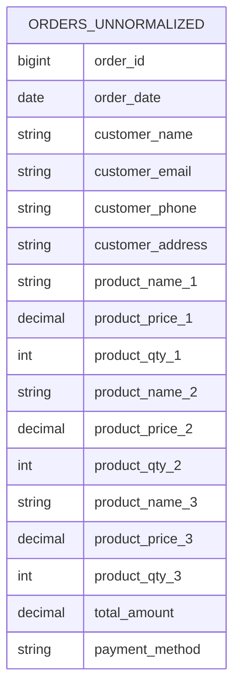
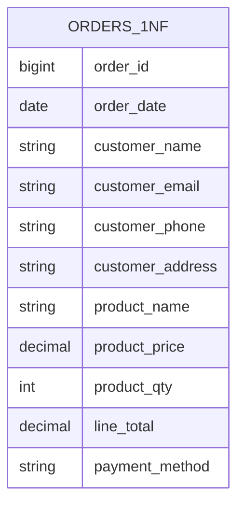
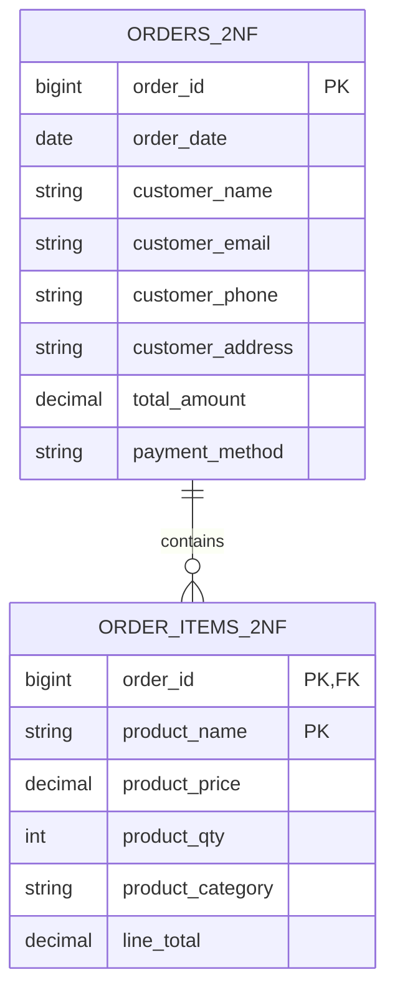
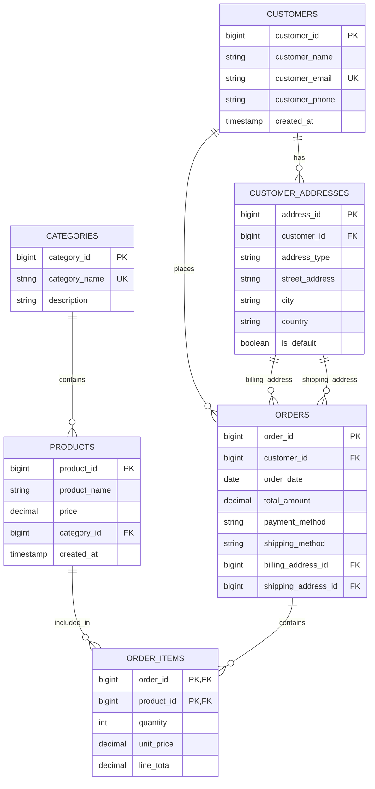
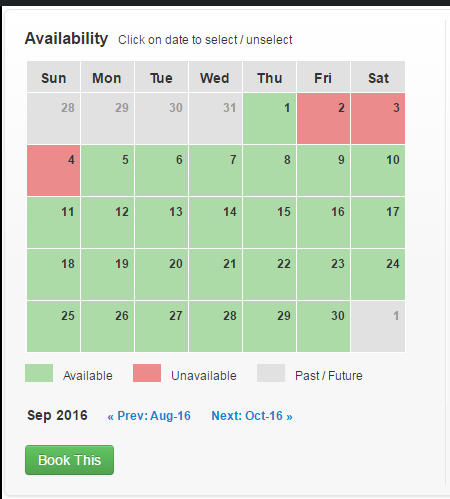

# Data Modeling

> Build the thing right and build the right thing.

## The process

- Analyze the requirements
    - Clear requirements are crucial for effective data modeling.
    - Check the current DB and current System.
- Data modeling
    - Define entities, attributes, and relationships.
- Data integrity
    - Review
    - Normalization/Denormalization

## Schema

### Entity Relationship Diagram (ERD)

- Entity: object has identity and life cycle.
- Entity Relationship Diagram (ERD): visual representation of entities and their relationships.

### Types of tables

- **Entity Table**: Represents a single entity with its attributes.
- **Relationship Table**: Represents a many-to-many relationship between entities.
- **Support Table**: Contains additional information or metadata about entities.
- **Configuration Table**: Stores configuration settings for the application, countries, provinces, etc.

### Normalization

- **Normalization**: Process of organizing data to reduce redundancy and improve data integrity.
- Normalization breaks down tables into smaller, related tables.
- **Pros**:
    - Reduces data redundancy.
    - Improves data integrity.
- **Cons**:
    - Can lead to complex queries.
    - May impact performance due to multiple joins.


#### Example: E-commerce Order System

##### **BEFORE Normalization (0NF - Unnormalized)**

```sql
-- Single table with all order information (lots of redundancy)
CREATE TABLE orders_unnormalized (
    order_id BIGINT,
    order_date DATE,
    customer_name VARCHAR(100),
    customer_email VARCHAR(100),
    customer_phone VARCHAR(20),
    customer_address TEXT,
    customer_city VARCHAR(50),
    customer_country VARCHAR(50),
    product_name_1 VARCHAR(100),
    product_price_1 DECIMAL(10,2),
    product_qty_1 INTEGER,
    product_category_1 VARCHAR(50),
    product_name_2 VARCHAR(100),
    product_price_2 DECIMAL(10,2),
    product_qty_2 INTEGER,
    product_category_2 VARCHAR(50),
    product_name_3 VARCHAR(100),
    product_price_3 DECIMAL(10,2),
    product_qty_3 INTEGER,
    product_category_3 VARCHAR(50),
    total_amount DECIMAL(10,2),
    payment_method VARCHAR(50),
    shipping_method VARCHAR(50)
);
```

**Sample Data:**
| order_id | customer_name | customer_email | product_name_1 | product_price_1 | product_name_2 | product_price_2 | total_amount |
|----------|---------------|----------------|----------------|-----------------|----------------|-----------------|--------------|
| 1001 | John Doe | john@email.com | iPhone 14 | 999.00 | AirPods | 199.00 | 1198.00 |
| 1002 | John Doe | john@email.com | MacBook Pro | 2499.00 | NULL | NULL | 2499.00 |
| 1003 | Jane Smith | jane@email.com | iPhone 14 | 999.00 | iPad | 799.00 | 1798.00 |



**❌ Problems with Unnormalized Data:**
- **Data Redundancy**: Customer info repeated in every order
- **Update Anomalies**: Changing customer email requires updating multiple rows
- **Insert Anomalies**: Can't add a customer without an order
- **Delete Anomalies**: Deleting an order loses customer information
- **Storage Waste**: Fixed columns for products (what if order has 10 items?)
- **Data Inconsistency**: Same customer might have different addresses in different orders

---

##### **AFTER Normalization**

**1NF (First Normal Form) - Eliminate Repeating Groups**

```sql
-- Remove repeating columns, create separate rows for each product
CREATE TABLE orders_1nf (
    order_id BIGINT,
    order_date DATE,
    customer_name VARCHAR(100),
    customer_email VARCHAR(100),
    customer_phone VARCHAR(20),
    customer_address TEXT,
    customer_city VARCHAR(50),
    customer_country VARCHAR(50),
    product_name VARCHAR(100),
    product_price DECIMAL(10,2),
    product_qty INTEGER,
    product_category VARCHAR(50),
    line_total DECIMAL(10,2),
    payment_method VARCHAR(50),
    shipping_method VARCHAR(50)
);
```



**2NF (Second Normal Form) - Eliminate Partial Dependencies**

```sql
-- Separate orders and order items
CREATE TABLE orders_2nf (
    order_id BIGINT PRIMARY KEY,
    order_date DATE,
    customer_name VARCHAR(100),
    customer_email VARCHAR(100),
    customer_phone VARCHAR(20),
    customer_address TEXT,
    customer_city VARCHAR(50),
    customer_country VARCHAR(50),
    total_amount DECIMAL(10,2),
    payment_method VARCHAR(50),
    shipping_method VARCHAR(50)
);

CREATE TABLE order_items_2nf (
    order_id BIGINT,
    product_name VARCHAR(100),
    product_price DECIMAL(10,2),
    product_qty INTEGER,
    product_category VARCHAR(50),
    line_total DECIMAL(10,2),
    PRIMARY KEY (order_id, product_name),
    FOREIGN KEY (order_id) REFERENCES orders_2nf(order_id)
);
```



**3NF (Third Normal Form) - Eliminate Transitive Dependencies**

```sql
-- Separate customers and products
CREATE TABLE customers (
    customer_id BIGINT PRIMARY KEY,
    customer_name VARCHAR(100),
    customer_email VARCHAR(100) UNIQUE,
    customer_phone VARCHAR(20),
    created_at TIMESTAMP DEFAULT CURRENT_TIMESTAMP
);

CREATE TABLE customer_addresses (
    address_id BIGINT PRIMARY KEY,
    customer_id BIGINT,
    address_type ENUM('billing', 'shipping'),
    street_address TEXT,
    city VARCHAR(50),
    country VARCHAR(50),
    is_default BOOLEAN DEFAULT FALSE,
    FOREIGN KEY (customer_id) REFERENCES customers(customer_id)
);

CREATE TABLE categories (
    category_id BIGINT PRIMARY KEY,
    category_name VARCHAR(50) UNIQUE,
    description TEXT
);

CREATE TABLE products (
    product_id BIGINT PRIMARY KEY,
    product_name VARCHAR(100),
    price DECIMAL(10,2),
    category_id BIGINT,
    created_at TIMESTAMP DEFAULT CURRENT_TIMESTAMP,
    FOREIGN KEY (category_id) REFERENCES categories(category_id)
);

CREATE TABLE orders (
    order_id BIGINT PRIMARY KEY,
    customer_id BIGINT,
    order_date DATE,
    total_amount DECIMAL(10,2),
    payment_method VARCHAR(50),
    shipping_method VARCHAR(50),
    billing_address_id BIGINT,
    shipping_address_id BIGINT,
    FOREIGN KEY (customer_id) REFERENCES customers(customer_id),
    FOREIGN KEY (billing_address_id) REFERENCES customer_addresses(address_id),
    FOREIGN KEY (shipping_address_id) REFERENCES customer_addresses(address_id)
);

CREATE TABLE order_items (
    order_id BIGINT,
    product_id BIGINT,
    quantity INTEGER,
    unit_price DECIMAL(10,2),
    line_total DECIMAL(10,2),
    PRIMARY KEY (order_id, product_id),
    FOREIGN KEY (order_id) REFERENCES orders(order_id),
    FOREIGN KEY (product_id) REFERENCES products(product_id)
);
```



### Denormalization

- **Denormalization**: Process of combining tables to improve read performance.
- Denormalization is often used in data warehousing or when read performance is critical.
- **Pros**:
    - Improves read performance by reducing joins.
    - Simplifies queries.
    - May leverage indexes more effectively.
- **Cons**:
    - Increases data redundancy.
    - Data Consistency issues can arise.

### Foreign Keys

- **Foreign Key**: A foreign key is a column or columns in a database that (e.g. `table_1.column_a`) that are linked to a column in a different table (`table_2.column_b`).
- Note: Foreign key !=  Reference column. Foreign key is a constraint that enforces referential integrity between two tables, while a reference column is simply a column that points to another table. Reference columns can exist without foreign key constraints, but foreign keys always reference another table.
- **Problem**:
    - During insert, update, or delete operations, the database must ensure that the foreign key constraint is not violated.
    - Complexity of schema increases with more foreign keys.
    - Application must catch the errors and handle them appropriately.
    - Backup and restore operations can be more complex due to foreign key relationships.

> So, do we need foreign keys? Or we will implement them in the application layer?

- **Small business applications:** Foreign keys are often used to enforce data integrity. We may not have enough resources to implement complex application logic.
- **Large scale applications:** Foreign keys may be avoided to improve performance and flexibility. Application logic is used to enforce data integrity. This approach may require more development effort and testing.

### Where is reference column placed?

- **Context**: Order system will have 2 tables: `orders` and `transactions`.
- **Option 1**: Place reference column in `orders` table: `orders.transaction_id`
- **Option 2**: Place reference column in `transactions` table: `transactions.order_id`
- Answer:
    - If the `transactions` table is a child of the `orders` table, then the reference column should be placed in the `transactions` table. This is because each transaction is associated with a specific order, and it makes sense to link the transaction back to its parent order.
    - In the future, if we need to create new table `shipments` that is also a child of `orders`, we can add a reference column `shipments.order_id` in the `shipments` table. This way, we can maintain a consistent relationship between the `orders`, `transactions`, and `shipments` tables. In the opposite case, if we place the reference column in the `orders` table, it would not be possible to link multiple child tables to the same parent table without creating additional complexity.

> Put reference column in the child table.

### Template

- Bussiness data: Data that is used to run the business, such as customer information, orders, transactions, etc.
- Techinical data: Data that is used to run the system: version, create_at, updated_at, etc.
- Template:

```sql
CREATE TABLE user (
    -- Business data
    id BIGSERIAL PRIMARY KEY,
    name VARCHAR(100) NOT NULL,
    email VARCHAR(100) UNIQUE NOT NULL,
    status VARCHAR(20) NOT NULL, -- status is very important for business logic, because what we do is manage the "entity" lifecycle.

    -- Helper data
    metadata JSONB, -- Store additional information about the user in a flexible format

    -- Technical data
    version INTEGER DEFAULT 1, -- Versioning for optimistic locking
    created_at TIMESTAMP DEFAULT CURRENT_TIMESTAMP,
    updated_at TIMESTAMP DEFAULT CURRENT_TIMESTAMP ON UPDATE CURRENT_TIMESTAMP,
    created_by BIGINT, -- User who created the record
    updated_by BIGINT -- User who last updated the record
    -- Add more fields as needed
);
```

## Case Studies

### Multiple Languages

- *Context*: View a post in multiple languages.
- *Requirements*:
    - Simple schema.
    - Easy to add new languages.
    - Easy to query posts in a specific language.

- *Solution*:

```sql
CREATE TABLE posts (
    id BIGSERIAL PRIMARY KEY,
    title VARCHAR(255) NOT NULL,
    title_translations JSONB, -- Store translations in a JSONB column
    content TEXT NOT NULL,
    content_translations JSONB, -- Store translations in a JSONB column
    created_at TIMESTAMP DEFAULT CURRENT_TIMESTAMP,
    updated_at TIMESTAMP DEFAULT CURRENT_TIMESTAMP ON UPDATE CURRENT_TIMESTAMP
);
```

- Sample data:

| id | title | title_translations | content | content_translations | created_at | updated_at |
|----|-------|---------------------|---------|----------------------|------------|-------------|
| 1  | Hello | {"en": "Hello", "fr": "Bonjour"} | Welcome to our site! | {"en": "Welcome to our site!", "fr": "Bienvenue sur notre site!"} | 2023-10-01 12:00:00 | 2023-10-01 12:00:00 |
| 2  | Goodbye | {"en": "Goodbye", "fr": "Au revoir"} | Thank you for visiting! | {"en": "Thank you for visiting!", "fr": "Merci de votre visite!"} | 2023-10-02 12:00:00 | 2023-10-02 12:00:00 |

### Homestay booking

- Requirements:
    - Check status of homestay by date.
    - Able to change price by date.



- Solution:

```sql
CREATE TABLE homestays (
    id BIGSERIAL PRIMARY KEY,
    name VARCHAR(255) NOT NULL,
    description TEXT,
    created_at TIMESTAMP DEFAULT CURRENT_TIMESTAMP,
    updated_at TIMESTAMP DEFAULT CURRENT_TIMESTAMP ON UPDATE CURRENT_TIMESTAMP
);

CREATE TABLE homestay_prices (
    id BIGSERIAL PRIMARY KEY,
    homestay_id BIGINT NOT NULL,
    price DECIMAL(10, 2) NOT NULL,
    date DATE NOT NULL,
    FOREIGN KEY (homestay_id) REFERENCES homestays(id),
    UNIQUE (homestay_id, date) -- Ensure one price per homestay per date
);
```

- After creating one new homestay, generate prices for the next 30 days or 365 days.

### Calendar

- Requirements:
    - Create time based events.
        - Start time and end time.
        - Repeating events.
    - Query events by date or specific time range: week, month, year.
- Solution:
    - Create two tables: `events` and `event_time_slots`.
    - `events` table stores the event details, and `event_time_slots` table stores the time slots for each event.
    - Max repeating interval is 1 year.

```sql
CREATE TABLE events (
    id BIGSERIAL PRIMARY KEY,
    title VARCHAR(255) NOT NULL,
    description TEXT,
    start_time TIMESTAMP NOT NULL,
    end_time TIMESTAMP NOT NULL,
    is_repeating BOOLEAN DEFAULT FALSE,
    repeat_interval VARCHAR(50), -- e.g., 'daily', 'weekly', 'monthly', 'yearly'
    created_at TIMESTAMP DEFAULT CURRENT_TIMESTAMP,
    updated_at TIMESTAMP DEFAULT CURRENT_TIMESTAMP ON UPDATE CURRENT_TIMESTAMP
);

CREATE TABLE event_time_slots (
    id BIGSERIAL PRIMARY KEY,
    event_id BIGINT NOT NULL,
    time_slot_start_local_time TIMESTAMP NOT NULL,
    time_slot_end_local_time TIMESTAMP NOT NULL,
    timezone VARCHAR(50) NOT NULL, -- e.g., 'UTC', 'America/New_York'
    FOREIGN KEY (event_id) REFERENCES events(id),
    UNIQUE (event_id, time_slot_start_local_time, time_slot_end_local_time) -- Ensure unique time slots for each event 
);
```

### Tagging System

- Requirements:
    - A post can have multiple tags.
    - Get all posts with a specific tag.
    - Get all tags for a specific post.

- 2 solutions:

```sql
-- Solution 1: Using a many-to-many relationship
CREATE TABLE posts (
    id BIGSERIAL PRIMARY KEY,
    title VARCHAR(255) NOT NULL,
    content TEXT NOT NULL,
    created_at TIMESTAMP DEFAULT CURRENT_TIMESTAMP,
    updated_at TIMESTAMP DEFAULT CURRENT_TIMESTAMP ON UPDATE CURRENT_TIMESTAMP
);

CREATE TABLE tags (
    id BIGSERIAL PRIMARY KEY,
    name VARCHAR(100) NOT NULL UNIQUE,
    created_at TIMESTAMP DEFAULT CURRENT_TIMESTAMP,
    updated_at TIMESTAMP DEFAULT CURRENT_TIMESTAMP ON UPDATE CURRENT_TIMESTAMP
);

CREATE TABLE post_tags (
    post_id BIGINT NOT NULL,
    tag_id BIGINT NOT NULL,
    PRIMARY KEY (post_id, tag_id),
    FOREIGN KEY (post_id) REFERENCES posts(id),
    FOREIGN KEY (tag_id) REFERENCES tags(id)
);

-- Solution 2: Column tags: array of tags then create inverted index
CREATE TABLE posts_with_tags (
    id BIGSERIAL PRIMARY KEY,
    title VARCHAR(255) NOT NULL,
    content TEXT NOT NULL,
    tags TEXT[] NOT NULL, -- Array of tags
    created_at TIMESTAMP DEFAULT CURRENT_TIMESTAMP,
    updated_at TIMESTAMP DEFAULT CURRENT_TIMESTAMP ON UPDATE CURRENT_TIMESTAMP
);

-- Create an inverted index on the tags array
CREATE INDEX idx_posts_tags ON posts_with_tags USING GIN (tags);
```

- Some references:
    - [Generalized Inverted Indexes](https://www.cockroachlabs.com/docs/stable/inverted-indexes)