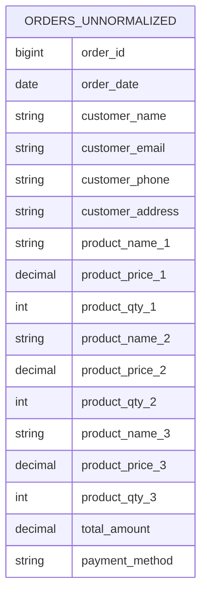
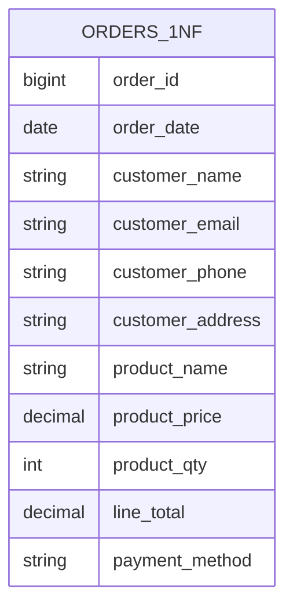
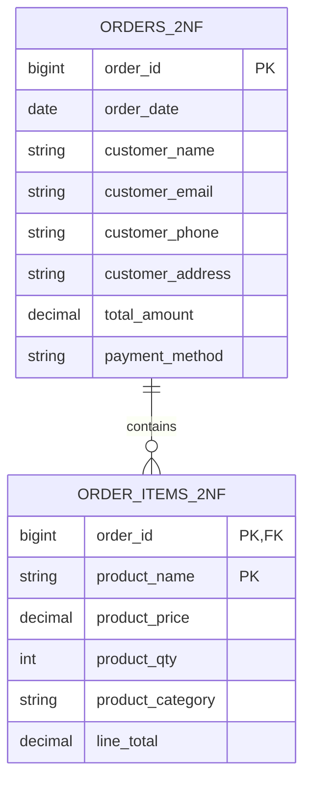
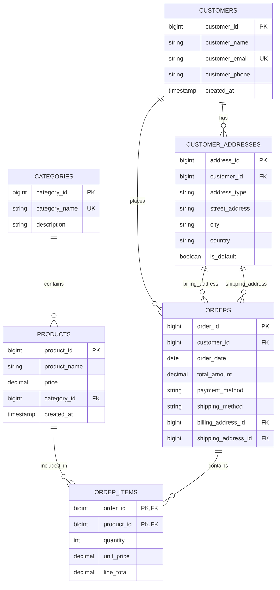

# Data Modeling

> Build the thing right and build the right thing.

## The process

- Analyze the requirements
    - Clear requirements are crucial for effective data modeling.
    - Check the current DB and current System.
- Data modeling
    - Define entities, attributes, and relationships.
- Data integrity
    - Review
    - Normalization/Denormalization

## Schema

### Entity Relationship Diagram (ERD)

- Entity: object has identity and life cycle.
- Entity Relationship Diagram (ERD): visual representation of entities and their relationships.

### Types of tables

- **Entity Table**: Represents a single entity with its attributes.
- **Relationship Table**: Represents a many-to-many relationship between entities.
- **Support Table**: Contains additional information or metadata about entities.
- **Configuration Table**: Stores configuration settings for the application, countries, provinces, etc.

### Normalization

- **Normalization**: Process of organizing data to reduce redundancy and improve data integrity.
- Normalization breaks down tables into smaller, related tables.
- **Pros**:
    - Reduces data redundancy.
    - Improves data integrity.
- **Cons**:
    - Can lead to complex queries.
    - May impact performance due to multiple joins.


#### Example: E-commerce Order System

##### **BEFORE Normalization (0NF - Unnormalized)**

```sql
-- Single table with all order information (lots of redundancy)
CREATE TABLE orders_unnormalized (
    order_id BIGINT,
    order_date DATE,
    customer_name VARCHAR(100),
    customer_email VARCHAR(100),
    customer_phone VARCHAR(20),
    customer_address TEXT,
    customer_city VARCHAR(50),
    customer_country VARCHAR(50),
    product_name_1 VARCHAR(100),
    product_price_1 DECIMAL(10,2),
    product_qty_1 INTEGER,
    product_category_1 VARCHAR(50),
    product_name_2 VARCHAR(100),
    product_price_2 DECIMAL(10,2),
    product_qty_2 INTEGER,
    product_category_2 VARCHAR(50),
    product_name_3 VARCHAR(100),
    product_price_3 DECIMAL(10,2),
    product_qty_3 INTEGER,
    product_category_3 VARCHAR(50),
    total_amount DECIMAL(10,2),
    payment_method VARCHAR(50),
    shipping_method VARCHAR(50)
);
```

**Sample Data:**
| order_id | customer_name | customer_email | product_name_1 | product_price_1 | product_name_2 | product_price_2 | total_amount |
|----------|---------------|----------------|----------------|-----------------|----------------|-----------------|--------------|
| 1001 | John Doe | john@email.com | iPhone 14 | 999.00 | AirPods | 199.00 | 1198.00 |
| 1002 | John Doe | john@email.com | MacBook Pro | 2499.00 | NULL | NULL | 2499.00 |
| 1003 | Jane Smith | jane@email.com | iPhone 14 | 999.00 | iPad | 799.00 | 1798.00 |



**❌ Problems with Unnormalized Data:**
- **Data Redundancy**: Customer info repeated in every order
- **Update Anomalies**: Changing customer email requires updating multiple rows
- **Insert Anomalies**: Can't add a customer without an order
- **Delete Anomalies**: Deleting an order loses customer information
- **Storage Waste**: Fixed columns for products (what if order has 10 items?)
- **Data Inconsistency**: Same customer might have different addresses in different orders

---

##### **AFTER Normalization**

**1NF (First Normal Form) - Eliminate Repeating Groups**

```sql
-- Remove repeating columns, create separate rows for each product
CREATE TABLE orders_1nf (
    order_id BIGINT,
    order_date DATE,
    customer_name VARCHAR(100),
    customer_email VARCHAR(100),
    customer_phone VARCHAR(20),
    customer_address TEXT,
    customer_city VARCHAR(50),
    customer_country VARCHAR(50),
    product_name VARCHAR(100),
    product_price DECIMAL(10,2),
    product_qty INTEGER,
    product_category VARCHAR(50),
    line_total DECIMAL(10,2),
    payment_method VARCHAR(50),
    shipping_method VARCHAR(50)
);
```



**2NF (Second Normal Form) - Eliminate Partial Dependencies**

```sql
-- Separate orders and order items
CREATE TABLE orders_2nf (
    order_id BIGINT PRIMARY KEY,
    order_date DATE,
    customer_name VARCHAR(100),
    customer_email VARCHAR(100),
    customer_phone VARCHAR(20),
    customer_address TEXT,
    customer_city VARCHAR(50),
    customer_country VARCHAR(50),
    total_amount DECIMAL(10,2),
    payment_method VARCHAR(50),
    shipping_method VARCHAR(50)
);

CREATE TABLE order_items_2nf (
    order_id BIGINT,
    product_name VARCHAR(100),
    product_price DECIMAL(10,2),
    product_qty INTEGER,
    product_category VARCHAR(50),
    line_total DECIMAL(10,2),
    PRIMARY KEY (order_id, product_name),
    FOREIGN KEY (order_id) REFERENCES orders_2nf(order_id)
);
```



**3NF (Third Normal Form) - Eliminate Transitive Dependencies**

```sql
-- Separate customers and products
CREATE TABLE customers (
    customer_id BIGINT PRIMARY KEY,
    customer_name VARCHAR(100),
    customer_email VARCHAR(100) UNIQUE,
    customer_phone VARCHAR(20),
    created_at TIMESTAMP DEFAULT CURRENT_TIMESTAMP
);

CREATE TABLE customer_addresses (
    address_id BIGINT PRIMARY KEY,
    customer_id BIGINT,
    address_type ENUM('billing', 'shipping'),
    street_address TEXT,
    city VARCHAR(50),
    country VARCHAR(50),
    is_default BOOLEAN DEFAULT FALSE,
    FOREIGN KEY (customer_id) REFERENCES customers(customer_id)
);

CREATE TABLE categories (
    category_id BIGINT PRIMARY KEY,
    category_name VARCHAR(50) UNIQUE,
    description TEXT
);

CREATE TABLE products (
    product_id BIGINT PRIMARY KEY,
    product_name VARCHAR(100),
    price DECIMAL(10,2),
    category_id BIGINT,
    created_at TIMESTAMP DEFAULT CURRENT_TIMESTAMP,
    FOREIGN KEY (category_id) REFERENCES categories(category_id)
);

CREATE TABLE orders (
    order_id BIGINT PRIMARY KEY,
    customer_id BIGINT,
    order_date DATE,
    total_amount DECIMAL(10,2),
    payment_method VARCHAR(50),
    shipping_method VARCHAR(50),
    billing_address_id BIGINT,
    shipping_address_id BIGINT,
    FOREIGN KEY (customer_id) REFERENCES customers(customer_id),
    FOREIGN KEY (billing_address_id) REFERENCES customer_addresses(address_id),
    FOREIGN KEY (shipping_address_id) REFERENCES customer_addresses(address_id)
);

CREATE TABLE order_items (
    order_id BIGINT,
    product_id BIGINT,
    quantity INTEGER,
    unit_price DECIMAL(10,2),
    line_total DECIMAL(10,2),
    PRIMARY KEY (order_id, product_id),
    FOREIGN KEY (order_id) REFERENCES orders(order_id),
    FOREIGN KEY (product_id) REFERENCES products(product_id)
);
```

