# Kafka

> Kafka is a distributed event streamin platform. Kafka was originally developed by LinkedIn and later open-sourced in 2011. It is now part of the Apache Software Foundation.

## Introduction


- Distributed streaming platform. high throughput with long-term retention.
- Pub/sub pattern, fan-out mechanism.
- Used for building real-time data pipelines and streaming applications.
- Asynchronous communication between services (different from synchronous HTTP requests, where client waits for a response).
- Kafka can be used to decouple services, allowing them to operate independently. This lead to better `scalability` and `fault tolerance` (if one service fails, others can continue to operate).
- **Pros**:
  - High throughput.
  - Asynchronous processing.
  - Decoupled architecture.
  - Scalable and fault-tolerant.
- **Cons**:
  - Complexity in setup and management.
  - Operational overhead.
  - Cost.

### Why Kafka?

- We choosing Message broker based on these criteria:
  - Delivery guarantee
  - Functionality
  - Performance
  - Scalability
  - Ecosystem

#### Database-backed queues

> Some references: 
> [Message Queue Using MySQL](https://www.pirobits.com/post/message-queue-using-mysql-select-for-update)

- **Pros**:
  - Delivery guarantee: we may achieve At-least-once delivery guarantee.
  - Leverage existing database infrastructure.

- **Cons**:
  - Performance: Not designed for high throughput. Database locks can lead to contention and slow performance.
  - Scalability: Limited by database capacity. Scaling requires sharding or partitioning.
  - Complexity: Managing message states (e.g., processing, failed) can be complex.
  - Functionality: Limited features compared to dedicated message brokers (e.g., no built-in support for pub/sub, fan-out, etc.).

#### Redis

- Redis can work as message brokers with 3 features:
  - **Pub/Sub**: Publish/subscribe messaging pattern. (at-most-once delivery).
  - **Lists**: Using lists as queues with `LPUSH` and `RPOP` (at-most-once delivery).
  - **Streams**: A more advanced feature for handling streams of data with built-in support for consumer groups and message offsets. (at-least-once delivery).

- **Pros**:
  - Leveraging existing Redis infrastructure.
  - High performance and low latency.
  - Simple to set up and use.
- **Cons**:
  - Durability: Data is stored in memory, so it may be lost on restart or failure.
  - Resource limitations: Memory-based storage can lead to scalability issues.
  - Poor features for a message broker.

#### RabbitMQ

> Some references: [RabbitMQ vs. Kafka](https://blog.bytebytego.com/i/136167161/rabbitmq-vs-kafka)

- **Pros**:
  - Flexible routing and message patterns.
  - Support at-least-once delivery guarantee.
  - Delay, Priority, RPC, etc.
  - Low latency.
  - Wide language support.
- **Cons**:
  - Deleting messages on acknowledgment can lead to message loss if not handled properly. You need to set automatic acknowledgment or manual acknowledgment to ensure messages are not lost.
  - Medium throughput compared to Kafka.
  - Ecosystem is not as rich as Kafka.

#### NATS

> Some references: [Compare NATS](https://docs.nats.io/nats-concepts/overview/compare-nats)

- NATs has the concept "[Queue Groups](https://docs.nats.io/nats-concepts/core-nats/queue)" alternative to consumer groups in Kafka. But in Kafka, there are three methods of load balacing (hash, round-robin, and sticky partitioner), while NATS only supports round-robin.

- **Pros**:
  - High performance than Kafka.
  - Flexible Routing.
  - Less operational overhead.
- **Cons**:
  - Ordering: NATS does not guarantee message ordering across multiple subscribers.

#### Kafka

> Some references: [Why is Kafka fast?](https://blog.bytebytego.com/p/why-is-kafka-fast)

- **Actually Kafka is not so fast**. It's optimized for high throughput and long-term retention at expense of latency, while preserving message order, durability, and scalability.
- Kafka performance is based on a lot of design decisions:
  - **Broker side**:
    - Kafka utilizes a segmented, append-only log structure for storing messages, which allows for efficient disk I/O and high throughput. **Kafka uses sequential for both reading and writing messages**, which is much faster than random access.
    - **Zero-copy technology**: Kafka uses a zero-copy mechanism to transfer data from disk to network, which reduces CPU usage and improves throughput.Zero-copy is disabled if we configure compression and SSL.
    - **Unflushed Buffered Writes**: Kafka does not flush data to disk immediately after writing. Instead, it buffers writes in memory and flushes them periodically. This reduces the number of disk I/O operations and improves throughput. Kafka just write to buffer and return ACK to producer, then flush to disk later. Is this may lead to data loss? Using in-sync replicas (ISRs) and replication factor, Kafka ensures that data is not lost even if the leader broker fails before flushing to disk.
  - **Client side**
    - Kafka bottleneck is usually the network, not the disk. Kafka producer uses batching to send multiple messages in a single request, which improves throughput by reducing the number of requests sent over the network.
  - Streaming Parallelism:
    - Partitioning allows Kafka to scale horizontally by distributing data across multiple brokers and partitions. Each partition can be processed independently, allowing for parallel processing of messages.


### The difference between `Event` vs `Request/Response`

- **Event**: Just a thing that happened. It may a bussiness fact that value to more than one service. Event does not require a response.
- **Request/Response**: A request is made to a service, and a response is expected. It is a synchronous communication pattern.

### Event Streaming

- **Streaming**: Continuous flow of data (or events) that can be processed in real-time.
- **Event streaming** includes: How to get events in/out, how to store events, how to order them, etc.

> If Event streaming is good, why not use it everywhere?

- Event streaming is not always the best solution for every use case. **It always has its own trade-offs**:
  - Cost and complexity.
  - Error handling and debugging can be more complex.
  - Operational overhead.
  - Learning curve for developers.
  - Some usecase expect a response, which is not suitable for event streaming!

## Core Concepts

- **Broker**: A Kafka server that stores and serves messages. One cluster can have multiple brokers.
- **Zookeeper**: Mangages broker and mananges the overall cluster state. It is used for leader election, configuration management, and coordination.
- **Kafka Raft (KRaft)**: An alternative to Zookeeper for managing Kafka clusters. It is a newer approach that simplifies the architecture by removing the dependency on Zookeeper.

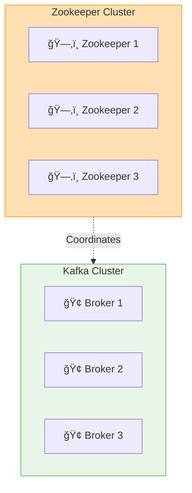

- **Topic**: A category or feed name to which messages are published. Topics are partitioned for scalability.
- **Partition**: A topic can be divided into multiple partitions, which allows for parallel processing and scalability. Each partition is an ordered, immutable sequence of messages. kafka uses partition to scale horizontally. Partitions act as a queue, where messages are stored in the order they are received.

```mermaid
graph TD
    subgraph T1[" Topic: user-events "]
        P1[📂 Partition 0<br/>Msg1 → Msg2 → Msg3]
        P2[📂 Partition 1<br/>Msg4 → Msg5 → Msg6]
        P3[📂 Partition 2<br/>Msg7 → Msg8 → Msg9]
    end
    
    %% Producers write to partitions
    PROD[📤 Producer] -->|Hash Key| P1
    PROD -->|Hash Key| P2
    PROD -->|Hash Key| P3
    
    %% Consumers read from partitions
    P1 --> CONS1[📥 Consumer 1]
    P2 --> CONS2[📥 Consumer 2]
    P3 --> CONS3[📥 Consumer 3]
    
    style T1 fill:#E8F5E8,stroke:#4CAF50,color:#000000
    style PROD fill:#1976D2,stroke:#BBDEFB,color:#FFFFFF
    style CONS1 fill:#388E3C,stroke:#A5D6A7,color:#FFFFFF
    style CONS2 fill:#F57C00,stroke:#FFD54F,color:#FFFFFF
    style CONS3 fill:#7B1FA2,stroke:#E1BEE7,color:#FFFFFF
```

- **Offset** is a unique identifier for each message within a partition. It is an integer that represents the position of the message in the partition. Offsets are used to track which messages have been consumed by a consumer.
- **Record**: A message in Kafka is called a record. Record has 6 attributes:
  - `Key`: Optional identifier for the record, used for partitioning or grouping related records.
  - `Value`: The actual data of the record. Nullable.
  - `Headers`: Optional metadata associated with the record.
  - `Partition`: The partition to which the record belongs.
  - `Offset`: The unique identifier for the record within the partition.
  - `Timestamp`: The time when the record was produced. In milliseconds since epoch.
- **Producer**: An application that publishes messages to Kafka topics. Producers can send messages to specific partitions based on the key or round-robin distribution.
- **Consumer**: An application that subscribes to Kafka topics and processes messages. Consumers can read messages from one or more partitions.


- **Consumer Group**: A group of consumers that work together to consume messages from a topic. Each consumer in the group reads from a different partition, allowing for parallel processing. Each message is consumed by only one consumer in the group.
  - The first consumer in a group will read all partitions.
  - When the second consumer joins the group, **a rebalance is triggered**, and partitions are reassigned to consumers in the group. This action is automatic and transparent to the application.
  - A partition is assigned to only one consumer in a group at a time. There may be more consumers than partitions, in which case some consumers will not receive any messages. The redundant consumers will be idle and can be used for failover.
  - Different consumer groups do not interfere with each other. Each group can consume the same messages independently.

### Consumer Groups

```mermaid
graph TD
    subgraph T[" Topic: order-events "]
        P0[📂 Partition 0<br/>Order1 → Order2 → Order3]
        P1[📂 Partition 1<br/>Order4 → Order5 → Order6]
        P2[📂 Partition 2<br/>Order7 → Order8 → Order9]
    end
    
    subgraph CG1[" Consumer Group: processing-service "]
        C1[📥 Consumer 1]
        C2[📥 Consumer 2]
        C3[📥 Consumer 3]
    end
    
    subgraph CG2[" Consumer Group: analytics-service "]
        C4[📥 Consumer A]
        C5[📥 Consumer B]
    end
    
    %% Consumer Group 1 - Each consumer gets one partition
    P0 --> C1
    P1 --> C2
    P2 --> C3
    
    %% Consumer Group 2 - Fewer consumers than partitions
    P0 --> C4
    P1 --> C4
    P2 --> C5
    
    style T fill:#E8F5E8,stroke:#4CAF50,color:#000000
    style CG1 fill:#E3F2FD,stroke:#2196F3,color:#000000
    style CG2 fill:#FFF3E0,stroke:#FF9800,color:#000000
    style C1 fill:#1976D2,stroke:#BBDEFB,color:#FFFFFF
    style C2 fill:#1976D2,stroke:#BBDEFB,color:#FFFFFF
    style C3 fill:#1976D2,stroke:#BBDEFB,color:#FFFFFF
    style C4 fill:#F57C00,stroke:#FFD54F,color:#FFFFFF
    style C5 fill:#F57C00,stroke:#FFD54F,color:#FFFFFF
```

- **Partitioner**: A component that determines which partition a message should be sent:
  - If partition is specified, the message is sent to that partition.
  - If no partition is specified, the partitioner uses the key to determine the partition:
    - **If key is provided**, it hashes the key to determine the partition: `partion` = `murmur2(key)` % `(number_of_partitions - 1)`. Same key will always go to the same partition.
    - **If no key is provided**:
      - In kafka 2.4.0 earlier, it uses round-robin to distribute messages across partitions.
      - In kafka 2.4.0 and later, `Sticky Partitioner` is used. `Sticky Partitioner` improves the performance of the producer especially with high throughput. The producer sticky partitioner will:
        - Send messages to the same partition until the batch is full or the linger time is reached.
        - After that, it will switch to another partition.
        - This approach reduces the number of requests and improves throughput.
- **Replication**: A replica is a copy of a partition stored on another broker. Replication provides fault tolerance and high availability. Replicas are distributed across brokers to ensure that if one broker fails, the data is still available on other brokers.
  - The number of replicas is defined by the `replication factor` of the topic.
  - The default replication factor is 1, which means no replication. Replicattion factor should be greater than 1 and less than the size of the cluster.
- **Leader and Follower**:
  - Each partition has one leader and zero or more followers.
  - Producer only sends messages to the leader.
  - Consumers read from the leader replica by default.

## Producer

### ACK

- ACK is a signal sent from receiver indicating tht a mesasge has been received.
- ACKS is the number of acknowledgments the producer requires the leader to receive before considering a request complete.

### ACKS = 0

- The producer does not wait for any acknowledgment from the broker.
- Just fire and forget.
- **Pros**:
  - Fastest option, no waiting for acknowledgment.
- **Cons**:
  - Durability: weakest.
  - Message may be lost if the broker fails before it is written to disk.
  - No offset is not returned, so the producer cannot track the message.
- Use case: when you don't care about message durability and just want to send messages as fast as possible. Some metrics from IoT devices, Non-essential logs, etc.
- Records will still be replicated asynchronously.


### ACKS = 1

- The producer waits for the leader to acknowledge the message.
- **Pros**:
  - Faster than ACKS = all.
  - Offset is returned, so the producer can track the message.
- **Cons**:
  - Durability: moderate.
  - If the leader fails after acknowledging the message but before it is replicated to followers, the message may be lost.
- **Use cases**: User activity logs, non-critical data that can be lost without significant impact.

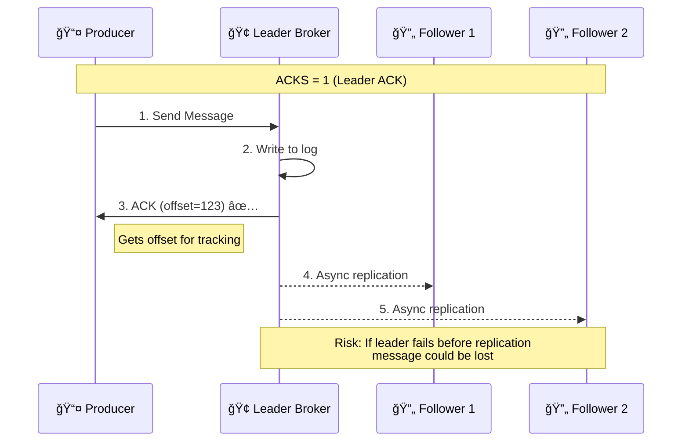


### ACKS = all (or -1)

- The producer waits for all in-sync replicas (ISRs) to acknowledge the message.
- Replication is synchronous.
- **Pros**:
  - Highest durability.
  - Guarantees that the message is written to all replicas before considering the request complete.
- **Cons**:
  - Slowest option, as it waits for all replicas to acknowledge.
  - Higher latency due to waiting for multiple acknowledgments.
- **Use cases**: Critical data that must be durable and available, such as financial transactions, order processing, etc.

```mermaid
sequenceDiagram
    participant P as 📤 Producer
    participant L as 🢠Leader Broker
    participant F1 as 🔄 Follower 1
    participant F2 as 🔄 Follower 2
    
    Note over P,F2: ACKS = all (Maximum Durability)
    
    P->>L: 1. Send Message
    L->>L: 2. Write to log
    
    par Sync Replication
        L->>F1: 3. Replicate message
        F1->>L: 4. ACK from F1 ✅
    and
        L->>F2: 5. Replicate message
        F2->>L: 6. ACK from F2 ✅
    end
    
    L->>P: 7. Final ACK (offset=123) ✅
    Note right of P: All ISRs confirmed<br/>Highest durability
    
    Note over L,F2: All replicas have the message<br/>Safe even if leader fails
```

### Retries

- Types of errors that producer can encounter:
  - **Transient errors**: Temporary issues that can be retried, such as network failures, broker unavailability, etc.
    - LEADER_NOT_AVAILABLE
    - network errors
  - **Non-transient errors**: Permanent issues that cannot be retried, such as invalid messages, schema validation errors, etc.
    - INVALID_MESSAGE
    - IVALID_CONFIG
    - Too large message
- 2 types of retries:
  - **Automatic retries**: retry N times then give up.
  - **Manual retries**.
- Some metric can be used when retrying:
  - `retries`: Number of retries.
  - `retry.backoff.ms`: Time to wait before retrying.
  - `delivery.timeout.ms`: Maximum time to wait for a message to be delivered.
- **Issues**:
  - Duplicate messages: If a message is retried, it may be sent multiple times. This can lead to duplicate processing in the consumer.
  - Out of order messages: If a message is retried, it may be sent after a later message, leading to out-of-order processing in the consumer.

### Batching

> Kafka performance bottleneck is usually the network, not the disk. Batching is a way to improve throughput by sending multiple messages in a single request.

- Batching is the process of grouping multiple messages together and sending them in a single request. This method improves throughput by reducing the number of requests sent over the network.
- Batching is implemented in the producer.
- Control by 2 parameters:
  - `batch.size`: Maximum size of a batch in bytes. Default is 16KB.
  - `linger.ms`: Maximum time to wait before sending a batch. Default is 0 (send immediately).

#### `linger.ms`

- Producer will wait for up to the specified time before sending a batch.
- This add more latency, but allows more messages to be sent in a single request.
- The default value is 0, which means the producer will send messages immediately without waiting.
- If `linger.ms` = 0, batching still happens, but it is based on `batch.size` only. It may happen when the producer wait for the ACK from the broker.
- if `linger.ms` is set to a positive value, the producer will wait for that amount of time before sending a batch, even if the batch size is not reached.

> The more `linger.ms` is set, the more messages will be batched together, which leads to better throughput but higher latency.

#### `batch.size`

- Maximum size of a batch in bytes.
- Default is 16KB.
- If the batch size is reached, the producer will send the batch immediately, regardless of the `linger.ms` setting.
- A very large batch size can lead to increased memory usage and latency, as the producer will wait for more messages to fill the batch before sending.
- If a message is larger than the batch size, the the message won't be batched and will be sent immediately.

> The more `batch.size` is set, the more messages will be batched together, which leads to better throughput but higher latency.

#### Trade-offs

- Batching **improves throughput** by reducing the number of requests sent over the network but **adds latency.**
- May improve i/o performance by reducing the number of disk writes.
- Larger batch size can lead to increased memory usage and latency.

### Compression

- Compression is the process of reducing the size of messages before sending them over the network.
- Compression has a positive impact on performance:
  - Improve network throughput by reducing the amount of data sent over the network.
  - Save storage space on the broker.
  - Better latency due to reduced network traffic.
- Cons: CPU overhead for compressing and decompressing messages.
- Compression != Encryption. Compression is not a security feature, it is just a way to reduce the size of messages.
- **Types**: `none`, `gzip`, `snappy`, `lz4`, `zstd`.
- **Recommended**: `lz4` (normal case), `zstd` (high compression ratio).

| Compression Type | Compression Ratio | CPU Overhead | Compression Speed | Network bandwidth |
|------------------|-------------------|--------------|-------------------|-------------------|
| `gzip`             | Highest               | Highest          | Slowest            | Slowest            |
| `snappy`           | Medium                  | Medium              | Medium               | Medium               |
| `lz4`              | Slowest               | Slowest           | Fastest             | Highest             |
| `zstd`             | Medium                  | Medium              | Medium               | Medium               |

- **Compression is configured in the producer** and **decompressing is done in the consumer**.
- By default, brokers do not interfere with the batch when storing the batch.
- The compression format on the producer side must match the decompression format on the consumer side.

### Max In Flight Requests

- `max.in.flight.requests.per.connection`: Maximum number of unacknowledged requests the producer can send to a broker before blocking.
- Default is 5.
- Purpose: improve throughput by allowing multiple requests in producer (not improving throughput in the broker).

### Sticky Partitioner

> Awesome reference: [Kafka producer đã không còn Round Robin Partition với key null](https://thanhlv.com/blog/2024-08-07-Kafka-producer-da-khong-con-Round-Robin-Partition-voi-key-null.html)

- `Sticky Partitioner` is the logic of the producer that determines which partition a message should be sent to.
- Older versions of Kafka used round-robin partitioning, which mean producers don't immediately send messages but placing the partition-specific batches to sent later.
- In case the parameter `linger.ms` is set to a positive value, the producer will wait for that amount of time before sending a batch. In the enviroment with low throughput, this can lead to a situation where the producer is waiting for messages to fill the batches of each partition.

```mermaid
sequenceDiagram
    participant P as 📤 Producer
    participant P0 as 📂 Partition 0
    participant P1 as 📂 Partition 1
    participant P2 as 📂 Partition 2
    
    Note over P,P2: Round-Robin (Old Behavior)
    
    P->>P0: Msg1 → Batch 0 (1/16KB)
    P->>P1: Msg2 → Batch 1 (1/16KB)
    P->>P2: Msg3 → Batch 2 (1/16KB)
    P->>P0: Msg4 → Batch 0 (2/16KB)
    
    Note over P,P2: With linger.ms=10ms, producer waits<br/>for each partition batch to fill up
    
    P-->>P0: ⰠWait 10ms → Send partial batch
    P-->>P1: ⰠWait 10ms → Send partial batch  
    P-->>P2: ⰠWait 10ms → Send partial batch
    
    Note over P,P2: Result: 3 network requests<br/>with small, inefficient batches
```

- `Sticky Partitioner` improves the performance of the producer especially with high throughput. The producer sticky partitioner will:
  - Send messages to the same partition until the batch is full or the linger time is reached.
  - After that, it will switch to another partition.
  - This approach reduces the number of requests and improves throughput.
  - Sticky partitioner increases the rate of "filling" the batch, which leads to increase hit `batch.size` instead of `linger.ms`.
- We can say this is "Per Batch" Round-Robin, where the producer sends messages to the same partition until the batch is full, then switches to the next partition.

```mermaid
sequenceDiagram
    participant P as 📤 Producer
    participant P0 as 📂 Partition 0
    participant P1 as 📂 Partition 1
    participant P2 as 📂 Partition 2
    
    Note over P,P2: Sticky Partitioner (New Behavior)
    
    P->>P0: Msg1 → Batch 0 (1/16KB)
    P->>P0: Msg2 → Batch 0 (2/16KB)
    P->>P0: Msg3 → Batch 0 (3/16KB)
    P->>P0: Msg4 → Batch 0 (16KB - FULL!)
    
    P-->>P0: ✅ Send full batch immediately
    
    Note over P,P2: Switch to next partition
    
    P->>P1: Msg5 → Batch 1 (1/16KB)
    P->>P1: Msg6 → Batch 1 (2/16KB)
    
    Note over P,P2: Result: Fewer, larger batches<br/>Better network utilization
```

### Idempotence

> What if the producer sends the same message multiple times?

- `Idempotence`: the operation can be applied multiple times without changing the result beyond the initial application.
- How it works:
  - A Unique producer ID (PID) is assigned to each producer.
  - Each message sent by the producer includes a sequence number.
  - The broker checks the sequence number and PID to determine if the message is sent before.
- Configure:
  - `enable.idempotence=true`.
  - `acks=all`.
  - `retries=INT_MAX` (or a large number).
  - `max.in.flight.requests=5`
- Note: Idempotent producers only resolve ordering issues on producer side.

```mermaid
sequenceDiagram
    participant P as 📤 Producer (PID: 12345)
    participant B as 🢠Broker
    participant L as 📠Message Log
    
    Note over P,L: Idempotent Producer Flow
    
    %% First message attempt
    P->>B: 1. Send Message A (PID: 12345, Seq: 0)
    B->>B: 2. Check: PID 12345, Seq 0 - NEW
    B->>L: 3. Store Message A (PID: 12345, Seq: 0)
    B->>P: 4. ACK (offset: 100) ✅
    
    %% Second message
    P->>B: 5. Send Message B (PID: 12345, Seq: 1)
    B->>B: 6. Check: PID 12345, Seq 1 - NEW
    B->>L: 7. Store Message B (PID: 12345, Seq: 1)
    B->>P: 8. ACK (offset: 101) ✅
    
    %% Network failure scenario - retry
    Note over P,B: Network timeout, producer retries Message B
    
    P->>B: 9. Retry Message B (PID: 12345, Seq: 1)
    B->>B: 10. Check: PID 12345, Seq 1 - DUPLICATE!
    Note right of B: Already processed this sequence
    B->>P: 11. ACK (offset: 101) ✅
    Note right of B: Returns same offset,<br/>no duplicate in log
    
    %% Next message continues normally
    P->>B: 12. Send Message C (PID: 12345, Seq: 2)
    B->>B: 13. Check: PID 12345, Seq 2 - NEW
    B->>L: 14. Store Message C (PID: 12345, Seq: 2)
    B->>P: 15. ACK (offset: 102) ✅
```

### Serialization

> Serialization is the process of converting objects or data structures into bytes for transmission or storage.

#### Formats

- Text-based formats:
  - `JSON`.
  - `XML`.
  - `String`.
- Binary-based formats:
  - `Avro`.
  - `Protobuf`.
  - `Thrift`.
  
#### Format Selection

- **Complexity**: The difficulty of parsing and generating the format.
  - Text-based formats are easier to read and debug.
  - Binary formats are more efficient in terms of size and speed.
  - Binary formats are more suitable for high-performance applications.
- **Compatibility**: Is the format compatible with other components in the system?
  - Text-based formats are more flexible and easier to evolve.
  - Binary formats require careful schema management.
- **Size**: The size of the serialized data.
  - Binary formats are usually smaller than text-based formats.
  - Smaller size leads to better network throughput and storage efficiency.

## Consumer

- A consumer is an application that subscribes to Kafka topics and processes messages.
- Consumer can read from:
  - The beginning of the topic.
  - The specified offset or timestamp using `seek()`.
  - The current position: a consumer goes down then restart or a new consumer joins the group and need to know the latest position.

### Offset commit

- Consumers need to keep track of the offsets of the messages they have processed.
- Offset commit is the process of saving the current position of the consumer in a partition of the topic.
- Where to store commits?
  - Offsets are stored in a special topic called `__consumer_offsets`. This is the default and recommended way.
  - Current offset = committed offset + 1.

### Delivery Guarantees

- Dekivery Guarantee: The assurance provided by the system about message delivery reliability and consistency.
- 3 types of delivery guarantees:
  - **At-Most-Once**: A message us processed at most once but it may be error.
    - If a message is lost, it will not be retried.
    - ***Usecase***: Logging, metrics, event IoT, etc.
  - **At-Least-Once**: A message is processed at least once, but it may be duplicated.
    - If a message is lost, it will be retried.
    - ***Usecase***: Email, SMS, Data replication, etc.
  - **Exactly-Once**: A message is processed exactly once, without duplicates or loss.
    - This is the most complex and expensive guarantee to achieve.
    - ***Usecase***: Financial transactions, where duplicates or loss are not acceptable.
    - **Note**: A messaging platform cannot offer exactly-once delivery guarantee by itself. It requires the application to be designed to handle idempotent operations and deduplication logic.

> **Awesome reference**: [You Cannot Have Exactly-Once Delivery](https://bravenewgeek.com/you-cannot-have-exactly-once-delivery/)
> In the letter I mail you, I ask you to call me once you receive it. You never do. Either you really didn’t care for my letter or it got lost in the mail. That’s the cost of doing business. I can send the one letter and hope you get it, or I can send 10 letters and assume you’ll get at least one of them. The trade-off here is quite clear (postage is expensive!), but sending 10 letters doesn’t really provide any additional guarantees. In a distributed system, we try to guarantee the delivery of a message by waiting for an acknowledgement that it was received, but all sorts of things can go wrong. Did the message get dropped? Did the ack get dropped? Did the receiver crash? Are they just slow? Is the network slow? Am I slow? FLP and the Two Generals Problem are not design complexities, they are impossibility results.
> To reiterate, there is no such thing as exactly-once delivery. We must choose between the lesser of two evils, which is at-least-once delivery in most cases. This can be used to simulate exactly-once semantics by ensuring idempotency or otherwise eliminating side effects from operations. Once again, it’s important to understand the trade-offs involved when designing distributed systems. There is asynchrony abound, which means you cannot expect synchronous, guaranteed behavior. Design for failure and resiliency against this asynchronous nature.

### Type of Commit

#### Synchronous

- **Pros**:
  - Ordering: Messages are processed in the order they are received.
  - Reduce the number of duplicate messages.
- **Cons**:
  - Manual offset management: The consumer must manually commit the offsets after processing the messages.
  - May lead to low throughput if the processing is slow.
  - Risk of sending heartbeat messages to the broker.

#### Asynchronous

- **Pros**:
  - Higher throughput: Messages can be processed in parallel, leading to better performance.
- **Cons**:
  - Manual offset management.
  - Error handling: If a message fails to process, it may be retried or skipped, leading to potential data loss or duplication.

#### Automatic

- **By default, consumers use automatic offset management** (every 5 seconds - ``auto.commit.interval.ms`).
- Automatic commit is asynchronous, meaning the consumer does not wait for the broker to acknowledge the offset commit.
- After processing a batch, consumers might process the next one without committing the offset of the previous batch.
- **Pros**:
  - Simplifies consumer logic.
  - Higher throughput.
- **Cons**:
  - Risk of duplicated messages (more than sync and async case).

#### Auto Offset Reset

- Offset usually is stored in the `__consumer_offsets` topic.
- **What if the current offset does not exist in the topic?** (Starting a new consumer group or the current offset is deleted).
  - `auto.offset.reset` is the configuration that determines what to do in this case.
  - `earliest`: Start consuming from the beginning of the topic.
  - `latest`: Start consuming from the end of the topic (default).
  - `none`: Throw an error if the offset does not exist.

## Error Handling

- We can split Error into 2 types:
  - **Retriable  errors**: Errors that can be retried, such as network errors, broker unavailability, etc.
  - **Non-retriable  errors**: Errors that cannot be retried, such as invalid messages, schema validation errors, error relate to the business logic, etc.
- Simple retry may lead to some issues:
  - **Consumer blocking**: Simple retry may block the consumer and lead to a backlog of messages.
  - **Observability**: Simple retry may make it difficult to track the progress of the consumer and identify issues.
- Retry non-blocking: Where does we store the error event?
  - **On memory**: Not recommended, as it may lead to data loss if the consumer crashes.
  - **Database**: Store the error event in a database, such as MySQL, PostgreSQL, etc. This allows for better observability and tracking of errors but we need to handle the database logic and handle archiving the error events.
  - **Store in another topic**: Store the error event in a separate topic, such as `error-events`. This allows for better observability and tracking of errors, and we can use a separate consumer to process the error events. This is the recommended way to handle errors in Kafka. But we will another problem: What if the error event fail again?
    - **Multi-level retry**: We can use a multi-level retry mechanism to handle errors in Kafka. The idea is to have multiple topics for different levels of retries, such as `error-events`, `error-events-retry-1`, `error-events-retry-2`, etc. Each topic will have its own consumer that will process the error events and retry them. The final topic that we can't retry will be `Dead Letter Queue (DLQ)`, where we store the error events that cannot be retried anymore.
    - **Cons**: 
      - Complexity: Multi-level retry adds complexity to the system, as we need to manage multiple topics and consumers.
      - Monitoring: We need to monitor the error events and retry them manually if needed.
      - Backpressure: If the error events are not processed quickly, it may lead to backpressure on the system.
- Retry logic must be backoff to avoid overwhelming the system with retries. We can use exponential backoff or a fixed delay between retries.

> "No mechanism brought more distributed systems down than retry logic."

## Group membership and Partition Assignment

### Group membership

**Consumer Group Coordinator** (Broker-side):
- **Location**: Runs on a Kafka broker
- **Selection**: Determined by hashing the group ID
- **Responsibilities**:
  - Manages group membership (joins/leaves)
  - Detects consumer failures via heartbeats
  - Triggers rebalance when membership changes
  - Assigns one consumer as the group leader
  - Distributes the final partition assignment to all consumers
  - Persists group metadata and committed offsets

**Group Leader** (Client-side):

- **Location**: One of the consumer instances in the group
- **Selection**: Usually the first consumer to join the group
- **Responsibilities**:
  - Collects subscription information from all group members
  - Runs the partition assignment algorithm (Range, RoundRobin, Sticky, etc.)
  - Calculates which consumer gets which partitions
  - Sends the assignment proposal back to the coordinator

```mermaid
sequenceDiagram
    participant C1 as 📥 Consumer 1<br/>(Group Leader)
    participant C2 as 📥 Consumer 2
    participant GC as 🏢 Group Coordinator<br/>(Broker)
    participant T as 📋 Topic Partitions
    
    Note over C1,T: Rebalance Triggered (New Consumer Joins)
    
    GC->>C1: 1. Assign as Group Leader
    GC->>C1: 2. Send group metadata
    GC->>C2: 3. Request subscription info
    
    C2->>GC: 4. Subscription details
    GC->>C1: 5. Forward all subscriptions
    
    C1->>C1: 6. Run assignment algorithm<br/>(Sticky/RoundRobin/Range)
    C1->>GC: 7. Send assignment plan
    
    GC->>C1: 8. Your partitions: [0, 1]
    GC->>C2: 9. Your partitions: [2, 3]
    
    Note over C1,T: Assignment complete,<br/>consumers start processing
```

### Group protocol

- **Membership phrase**:
  - Assume that 3 consumers join the same group simultaneously.
  - The group coordinator will assign one of them as the group leader.
  - The group coordinator responses to the group leader with the group metadata.

```mermaid
sequenceDiagram
    participant C1 as 📥 Consumer 1
    participant C2 as 📥 Consumer 2
    participant C3 as 📥 Consumer 3
    participant GC as 🏢 Group Coordinator<br/>(Broker)
    
    Note over C1,GC: Membership Phase - 3 Consumers Join Simultaneously
    
    par Consumers Join
        C1->>GC: 1a. JoinGroup Request
        Note right of C1: group.id: "payment-service"
    and
        C2->>GC: 1b. JoinGroup Request
        Note right of C2: group.id: "payment-service"
    and
        C3->>GC: 1c. JoinGroup Request
        Note right of C3: group.id: "payment-service"
    end
    
    GC->>GC: 2. Select Group Leader
    Note right of GC: Usually first consumer to join<br/>Consumer 1 becomes leader
    
    GC->>C1: 3. JoinGroup Response (LEADER[C1], MEMBER[C2, C3])
    Note right of GC: Includes all member metadata
    
    GC->>C2: 4. JoinGroup Response (LEADER[C1], MEMBER[])
    Note right of GC: Wait for assignment
    
    GC->>C3: 5. JoinGroup Response (LEADER[C1], MEMBER[])
    Note right of GC: Wait for assignment
    
    Note over C1,GC: Group Leader (C1) has all metadata<br/>Ready for assignment calculation
```

- **Sync phase**:
  - The group leader collects subscription information from all consumers in the group.
  - The group leader is responsible for determining the partition assignment for each consumer in the group.
  - The group leader sends partition assignment to the group coordinator.
  - The group coordinator sends the partition assignment to each consumer in the group.

// ...existing code...
- **Sync phase**:
  - The group leader collects subscription information from all consumers in the group.
  - The group leader is responsible for determining the partition assignment for each consumer in the group.
  - The group leader sends partition assignment to the group coordinator.
  - The group coordinator sends the partition assignment to each consumer in the group.

```mermaid
sequenceDiagram
    participant C1 as 📥 Consumer 1<br/>(Group Leader)
    participant C2 as 📥 Consumer 2
    participant C3 as 📥 Consumer 3
    participant GC as 🏢 Group Coordinator<br/>(Broker)
    participant T as 📋 Topics<br/>(order-events)
    
    Note over C1,T: Sync Phase - Partition Assignment Calculation
    
    %% Leader collects subscription info
    Note over C1,GC: Group Leader has all member metadata from Join phase
    
    C1->>C1: 1. Collect subscriptions from all members
    Note right of C1: Members: [C1, C2, C3]<br/>Subscriptions: ["order-events"]
    
    C1->>C1: 2. Run partition assignment algorithm
    Note right of C1: Algorithm: CooperativeStickyAssignor<br/>Topic: order-events (3 partitions)<br/>Consumers: 3
    
    C1->>C1: 3. Calculate assignment
    Note right of C1: C1 → Partition 0<br/>C2 → Partition 1<br/>C3 → Partition 2
    
    %% Send assignment to coordinator
    C1->>GC: 4. SyncGroup Request (Assignment Plan)
    Note right of C1: Assignment: {<br/>  C1: [order-events-0],<br/>  C2: [order-events-1],<br/>  C3: [order-events-2]<br/>}
    
    %% Other consumers send empty sync requests
    par Other Consumers Wait
        C2->>GC: 5a. SyncGroup Request (Empty)
        Note right of C2: Waiting for assignment
    and
        C3->>GC: 5b. SyncGroup Request (Empty)
        Note right of C3: Waiting for assignment
    end
    
    %% Coordinator distributes assignments
    GC->>C1: 6. SyncGroup Response
    Note right of GC: Your assignment:<br/>[order-events-0]
    
    GC->>C2: 7. SyncGroup Response
    Note right of GC: Your assignment:<br/>[order-events-1]
    
    GC->>C3: 8. SyncGroup Response
    Note right of GC: Your assignment:<br/>[order-events-2]
    
    Note over C1,T: All consumers now know their partitions<br/>Ready to start consuming messages
```

**Why partition assignment is determined by the group leader?**
Flexibility: The group leader can implement custom partition assignment logic based on the application needs.

### Eager Rebalance vs Cooperative Rebalance

> Awesome reference: [The incremental cooperative rebalancing protocol](https://www.confluent.io/blog/cooperative-rebalancing-in-kafka-streams-consumer-ksqldb/#incremental-cooperative-rebalancing-protocol)

- **Eager rebalance is a process where the group leader immediately reassigns partitions to consumers when a new consumer joins or an existing consumer leaves**. This ensures that all consumers have a balanced load and can start consuming messages as soon as possible but may lead to temporary unavailability of some partitions.
- **Cooperative rebalance  has the same process as eager rebalance, but the consumer doesn't immediately stop consume message.  Consumers take the difference with their current assignment, then revoke any partitions that don’t appear in their new assignment**. Likewise, they will add any partitions that appear in their new assignment but not in their current assignment. This allows consumers to continue processing messages while the rebalance is happening,For every partition that appears in both their old and new assignments, they don’t have to do a thing. Very few rebalances require a significant migration of partitions between consumers, so in most cases, there will be little or absolutely nothing to do.

## Liveness

- Kafka satisfies the liveness in 2 ways:
  - **Check availability**:
    - Is it alive still?
    - Requiring consumers to periodically exchange heartbeats with the group coordinator.
    - By default, consumers send a heartbeat every 3 seconds (`heartbeat.interval.ms`).
    - In consumer coordinator, the `session.timeout.ms` is the maximum time a consumer can be inactive before it is considered dead. If a consumer does not send a heartbeat within this time, it will be removed from the group and a rebalance will be triggered.
  - **Check progress**:
    - Is it making progress?
    - Requiring consumers to invoke the `poll()` method periodically.
    - `poll()` method is used to fetch `max.poll.records` messages from the topic and process them. Max time between 2 `poll()` calls is `max.poll.interval.ms`. If the time between 2 `poll()` calls exceeds this value, the consumer will be considered dead and the group coordinator will trigger a rebalance.

## Some problems

### Topic Width

- Kafka only allows increasing the number of partitions in a topic, not decreasing.
- Increasing partitions can lead to one key being distributed across multiple partitions, which can break ordering guarantees.
- **Number of partitions = Expected throughput / Throughput per partition.**
- Write throughput per partition is usually around 10MB/s.
- Read throughput per partition is usually based on the application and the consumer's processing speed.

### Large Messages

- The default maximum message size in Kafka is 1MB (`message.max.bytes`).
- What if we need to send larger messages?
  - Re-configure `message.max.bytes` on the broker: Limitation (max is 10MB), slow down consuming, wasting resources.
  - External storage: Store large messages in an external storage system (e.g., S3, HDFS) and send a reference (URL) in the Kafka message.
    - **Pros**: No size limitation, better performance.
    - **Cons**: Requires additional logic to handle external storage, may lead to data consistency issues if not handled properly.

### Request - Response Pattern

- Problem: Sometimes, the requester also needs to wait for a response from the responder.
- Solution: Use a separate topic for responses. But which request does the response belong to?
  - Use a correlation ID: Include a unique identifier in the request message and the response message. The requester can then match the response to the request based on this ID.
  - Response can store in local cache, database, remote cache for polling, or implement callback mechanism. Each approach has its own trade-offs.

### Dual Write

- Context: When a service needs to write to both Kafka and another data store (e.g., database) or both Kafka and another Kafka topic. Requirements:
  - Consistency: Both writes must succeed or fail together.
  - Atomicity: The writes should be treated as a single unit of work.

#### United Dual-Write

- **United Dual-Write**: 2 writes in two different topics, but they are treated as a single unit of work.
- Solution: Kafka transactions.
  - Kafka transactions allow you to write to multiple topics atomically.
  - Use the `beginTransaction()`, `send()`, and `commitTransaction()` methods in the producer to ensure that both writes are committed together.
  - If any write fails, you can use `abortTransaction()` to roll back both writes.

#### Separate Dual-Write

- **Separate Dual-Write**: 2 writes in database and Kafka, but they are treated as separate units of work.
- Potential solutions:
  - **CDC**: Change Data Capture (CDC) is a technique that captures changes in the database and publishes them to Kafka.
    - Simple
    - Not full control over the data flow.
  - **Saga Pattern**: A distributed transaction pattern that ensures consistency across multiple services.
    - Each service has its own local transaction.
    - If a service fails, it can trigger compensating actions to roll back the changes made by previous services.
    - More complex, but provides better control over the data flow and error handling.
  - **Transactional Outbox Pattern**: A pattern that ensures that messages are sent to Kafka only after the database transaction is committed.
    - The service writes the message to an outbox table in the database as part of the same transaction.
    - A separate process reads from the outbox table and sends messages to Kafka (this may be `Debezium` + `Kafka connect`).
    - Ensures that messages are sent only after the database transaction is committed, providing better consistency.
    - Trades off:
      - Simplicity: Easier to implement than the Saga pattern.
      - Performance: May introduce some latency due to the separate process reading from the outbox table.
      - Complexity: Requires additional logic to handle and maintain the outbox table and the separate process.
      - At least once delivery: The outbox table may contain duplicate messages if the process reading from the outbox table fails and retries.

### Ordering Guarantees

- The importance of ordering guarantees depends on the use case.
  - Gaming: Ordering is crucial, as the game state must be consistent across all players.
  - Order Processing: Ordering is important, as the order of events affects the final state of the order.
- Order by field(s) or compare logic: created_at(timestamp), sequence number, etc.
- Be careful with physical clock to order events, as it may lead to issues with clock skew and time synchronization.
- Kafka provides ordering guarantees within a partition, but not across partitions.
- To ensure end-to-end ordering:
  - `enable.idempotence=true` in the producer.
  - Group related messages by key to ensure they go to the same partition.

## Best Practices

### Topic Naming

> Awesome reference: [Kafka Topic Naming Conventions](https://www.confluent.io/learn/kafka-topic-naming-convention/#readability)

- Using `-` or `.` instead of `_` in topic names to avoid conflict with Kafka's internal topics.
- Convention (Recommended, not enforced):
  - `<tenant_id>-<service_owner>-[private|public]-<topic_name>-<env>`.
  - `<tenant_id>.<service_owner>.[private|public].<topic_name>.<env>`.

### Choosing key

- Why Key is Important?
  - Ordering.
  - Data Distribution.
  - Deduplication.
- Choosing the right key is crucial for ensuring that messages are processed in the correct order and distributed evenly across partitions.
  - If ordering is important, use a key that ensures related messages go to the same partition.
    - Based on business logic, such as user ID, order ID, etc.
    - Make sure that data is distributed evenly across partitions to avoid hot spots.
    - Be careful with compacted topics, as the key is used to determine which messages are retained.
  - If you are not sure, just set key to `null`. Don't use a random key, as it will lead to uneven distribution of messages across partitions, **using `null` to make advantage of the round-robin or sticky partitioner**.

### Message format

- `Metadata`: Include metadata in the message to help with processing and debugging. We may put metadata in the `headers` or as part of the payload.
  - `Timestamp`: When the message was produced.
  - `Message ID`: Unique identifier for the message.
  - `Original Message ID`: If the message is a retry, include the original message ID to help with deduplication or the upper layer/first service.
  - `Service Name` or `Service ID`: The service that produced the message.
- `Message code`: Use a consistent message code to identify the type of message.
- `Payload`: Actual data of the message.

```json
{
  "metadata": {
    "timestamp": "2023-10-01T12:00:00Z",
    "message_id": "random-unique-id-1",
    "original_message_id": "random-unique-id-0",
    "service_name": "order-service"
  },
  "code": "ORDER_CREATED",
  "payload": {
    "order_id": "ORD123456",
    "user_id": "USR987654",
    "items": [
      {
        "item_id": "ITEM123",
        "quantity": 2
      }
    ],
    "total_amount": 100.0
  }
}
```

### Recommended Configurations

- Prioritize the characteristics:
  - Throughput.
  - Latency.
  - Durability.
  - Availability.

**Example**:
  - Financial System:
    - (1) Durability.
    - (2) Availability.
    - (3) Latency.
    - (4) Throughput.
  - Data Ingestion System:
    - (1) Throughput.
    - (2) Availability.
    - (3) Durability.
    - (4) Latency.

- We should check the version of Kafka because different versions have different default configurations.
- Client libraries also affect the performance and behavior of Kafka. Make sure to use the latest version of the client library that is compatible with your Kafka cluster.
- Engineering in real life is about trade-offs. We should choose the right configurations based on the use case and requirements.
- Throughput (may differ by usecase, just for reference):
  - Low: < 10K messages/sec.
  - Moderate: 10K - 100K messages/sec.
  - High: > 100K messages/sec.

#### Producer Configurations

> JUST FOR REFERENCE, ENGINEERING IS ABOUT TRADE-OFFS, CHOOSE THE RIGHT CONFIGURATIONS BASED ON YOUR USE CASE AND REQUIREMENTS.

- Docs: [Kafka producer configuration reference | Confluent Documentation](https://docs.confluent.io/platform/current/installation/configuration/producer-configs.html)
- Version: new (>= 2.8)
- `acks`
    - 1: throughput
    - all: durability
- `retries=30` (durability)
- `enable.idempotence=true` (durability)
- `linger.ms`:
  - 0: low latency, low throughput
  - 8: moderate latency, moderate throughput
  - 20: high latency, high throughput
- `compression.type`
  - `None`: low throughput, low latency
  - `lz4`: moderate throughput, balance between throughput and latency
  - `Zstd`: very high throughput
- `Batch.size`: (bytes)
  - `16384`: moderate throughput
  - `32768`: high throughput
- `Buffer.memory`
- `max.in.flight.requests.per.connection=5`
- `Partitioner`: null (default). Good for throughput, latency, and even distribution.

#### Consumer Configurations

> JUST FOR REFERENCE, ENGINEERING IS ABOUT TRADE-OFFS, CHOOSE THE RIGHT CONFIGURATIONS BASED ON YOUR USE CASE AND REQUIREMENTS.

- Docs: [Kafka Consumer configuration reference | Confluent Documentation](https://docs.confluent.io/platform/current/installation/configuration/consumer-configs.html)
- Version: new (>= 2.8)
- `group.id=` (required for consumer groups)
- `enable.auto.commit=true` (simplicity vs manual control)
- `auto.offset.reset=latest` (start from newest messages)
- `receive.buffer.bytes`:
  - `4MB`: if memory is no problem
  - `1MB`: if memory is scarce
- `partition.assignment.strategy=org.apache.kafka.clients.consumer.CooperativeStickyAssignor` (balanced assignment)
- `fetch.min.bytes`:
  - `1` (default): low latency
  - `50000`: high throughput
- `session.timeout.ms`:
  - `45000`: default
  - Low number: better availability (faster failure detection)

#### Topic Configurations

> JUST FOR REFERENCE, ENGINEERING IS ABOUT TRADE-OFFS, CHOOSE THE RIGHT CONFIGURATIONS BASED ON YOUR USE CASE AND REQUIREMENTS.

- Docs: [Kafka topic configuration reference | Confluent Documentation](https://docs.confluent.io/platform/current/installation/configuration/topic-configs.html)
- `partitions`:
  - `1`: preserving message ordering
  - Higher number of partitions → higher throughput
  - **Tradeoffs**: [How to Choose the Number of Topics/Partitions in a Kafka Cluster?](https://www.confluent.io/blog/how-choose-number-topics-partitions-kafka-cluster/) | Confluent
- `replication.factor=3` (fault tolerance)
- `min.insync.replicas=2` (durability vs availability balance)
- `compression.type=producer` (inherit from producer settings)

#### Additional Resources

- [Kafka in Production](https://github.com/dttung2905/kafka-in-production)
- [Kafka option explorer](https://learn.conduktor.io/kafka/kafka-options-explorer/)