# Kafka

> Kafka is a distributed event streamin platform. Kafka was originally developed by LinkedIn and later open-sourced in 2011. It is now part of the Apache Software Foundation.

## Introduction

- Distributed streaming platform. high throughput with long-term retention.
- Pub/sub pattern, fan-out mechanism.
- Used for building real-time data pipelines and streaming applications.
- Asynchronous communication between services (different from synchronous HTTP requests, where client waits for a response).
- Kafka can be used to decouple services, allowing them to operate independently. This lead to better `scalability` and `fault tolerance` (if one service fails, others can continue to operate).
- **Pros**:
  - High throughput.
  - Asynchronous processing.
  - Decoupled architecture.
  - Scalable and fault-tolerant.
- **Cons**:
  - Complexity in setup and management.
  - Operational overhead.
  - Cost.

### The difference between `Event` vs `Request/Response`

- **Event**: Just a thing that happened. It may a bussiness fact that value to more than one service. Event does not require a response.
- **Request/Response**: A request is made to a service, and a response is expected. It is a synchronous communication pattern.

### Event Streaming

- **Streaming**: Continuous flow of data (or events) that can be processed in real-time.
- **Event streaming** includes: How to get events in/out, how to store events, how to order them, etc.

> If Event streaming is good, why not use it everywhere?

- Event streaming is not always the best solution for every use case. **It always has its own trade-offs**:
  - Cost and complexity.
  - Error handling and debugging can be more complex.
  - Operational overhead.
  - Learning curve for developers.
  - Some usecase expect a response, which is not suitable for event streaming!

## Core Concepts

- **Broker**: A Kafka server that stores and serves messages. One cluster can have multiple brokers.
- **Zookeeper**: Mangages broker and mananges the overall cluster state. It is used for leader election, configuration management, and coordination.
- **Kafka Raft (KRaft)**: An alternative to Zookeeper for managing Kafka clusters. It is a newer approach that simplifies the architecture by removing the dependency on Zookeeper.

- **Topic**: A category or feed name to which messages are published. Topics are partitioned for scalability.
- **Partition**: A topic can be divided into multiple partitions, which allows for parallel processing and scalability. Each partition is an ordered, immutable sequence of messages. kafka uses partition to scale horizontally. Partitions act as a queue, where messages are stored in the order they are received.

- **Offset** is a unique identifier for each message within a partition. It is an integer that represents the position of the message in the partition. Offsets are used to track which messages have been consumed by a consumer.
- **Record**: A message in Kafka is called a record. Record has 6 attributes:
  - `Key`: Optional identifier for the record, used for partitioning or grouping related records.
  - `Value`: The actual data of the record. Nullable.
  - `Headers`: Optional metadata associated with the record.
  - `Partition`: The partition to which the record belongs.
  - `Offset`: The unique identifier for the record within the partition.
  - `Timestamp`: The time when the record was produced. In milliseconds since epoch.
- **Producer**: An application that publishes messages to Kafka topics. Producers can send messages to specific partitions based on the key or round-robin distribution.
- **Consumer**: An application that subscribes to Kafka topics and processes messages. Consumers can read messages from one or more partitions.

```mermaid
graph LR
    P[📤 Producer] -->|Publish| T[📋 Topic A] -->|Consume| C[📥 Consumer]
    
    style P fill:#1976D2,stroke:#BBDEFB,color:#FFFFFF
    style T fill:#4CAF50,stroke:#A5D6A7,color:#FFFFFF
    style C fill:#FF9800,stroke:#FFD54F,color:#FFFFFF
```

- **Consumer Group**: A group of consumers that work together to consume messages from a topic. Each consumer in the group reads from a different partition, allowing for parallel processing. Each message is consumed by only one consumer in the group.
  - The first consumer in a group will read all partitions.
  - When the second consumer joins the group, **a rebalance is triggered**, and partitions are reassigned to consumers in the group. This action is automatic and transparent to the application.
  - A partition is assigned to only one consumer in a group at a time. There may be more consumers than partitions, in which case some consumers will not receive any messages. The redundant consumers will be idle and can be used for failover.
  - Different consumer groups do not interfere with each other. Each group can consume the same messages independently.

### Consumer Groups

- **Partitioner**: A component that determines which partition a message should be sent:
  - If partition is specified, the message is sent to that partition.
  - If no partition is specified, the partitioner uses the key to determine the partition:
    - **If key is provided**, it hashes the key to determine the partition: `partion` = `murmur2(key)` % `(number_of_partitions - 1)`. Same key will always go to the same partition.
    - **If no key is provided**:
      - In kafka 2.4.0 earlier, it uses round-robin to distribute messages across partitions.
      - In kafka 2.4.0 and later, `Sticky Partitioner` is used. `Sticky Partitioner` improves the performance of the producer especially with high throughput. The producer sticky partitioner will:
        - Send messages to the same partition until the batch is full or the linger time is reached.
        - After that, it will switch to another partition.
        - This approach reduces the number of requests and improves throughput.
- **Replication**: A replica is a copy of a partition stored on another broker. Replication provides fault tolerance and high availability. Replicas are distributed across brokers to ensure that if one broker fails, the data is still available on other brokers.
  - The number of replicas is defined by the `replication factor` of the topic.
  - The default replication factor is 1, which means no replication. Replicattion factor should be greater than 1 and less than the size of the cluster.
- **Leader and Follower**:
  - Each partition has one leader and zero or more followers.
  - Producer only sends messages to the leader.
  - Consumers read from the leader replica by default.

## Producer

### ACK

- ACK is a signal sent from receiver indicating tht a mesasge has been received.
- ACKS is the number of acknowledgments the producer requires the leader to receive before considering a request complete.

### ACKS = 0

- The producer does not wait for any acknowledgment from the broker.
- Just fire and forget.
- **Pros**:
  - Fastest option, no waiting for acknowledgment.
- **Cons**:
  - Durability: weakest.
  - Message may be lost if the broker fails before it is written to disk.
  - No offset is not returned, so the producer cannot track the message.
- Use case: when you don't care about message durability and just want to send messages as fast as possible. Some metrics from IoT devices, Non-essential logs, etc.
- Records will still be replicated asynchronously.

### ACKS = 1

- The producer waits for the leader to acknowledge the message.
- **Pros**:
  - Faster than ACKS = all.
  - Offset is returned, so the producer can track the message.
- **Cons**:
  - Durability: moderate.
  - If the leader fails after acknowledging the message but before it is replicated to followers, the message may be lost.
- **Use cases**: User activity logs, non-critical data that can be lost without significant impact.

### ACKS = all (or -1)

- The producer waits for all in-sync replicas (ISRs) to acknowledge the message.
- Replication is synchronous.
- **Pros**:
  - Highest durability.
  - Guarantees that the message is written to all replicas before considering the request complete.
- **Cons**:
  - Slowest option, as it waits for all replicas to acknowledge.
  - Higher latency due to waiting for multiple acknowledgments.
- **Use cases**: Critical data that must be durable and available, such as financial transactions, order processing, etc.

### Retries

- Types of errors that producer can encounter:
  - **Transient errors**: Temporary issues that can be retried, such as network failures, broker unavailability, etc.
    - LEADER_NOT_AVAILABLE
    - network errors
  - **Non-transient errors**: Permanent issues that cannot be retried, such as invalid messages, schema validation errors, etc.
    - INVALID_MESSAGE
    - IVALID_CONFIG
    - Too large message
- 2 types of retries:
  - **Automatic retries**: retry N times then give up.
  - **Manual retries**.
- Some metric can be used when retrying:
  - `retries`: Number of retries.
  - `retry.backoff.ms`: Time to wait before retrying.
  - `delivery.timeout.ms`: Maximum time to wait for a message to be delivered.
- **Issues**:
  - Duplicate messages: If a message is retried, it may be sent multiple times. This can lead to duplicate processing in the consumer.
  - Out of order messages: If a message is retried, it may be sent after a later message, leading to out-of-order processing in the consumer.