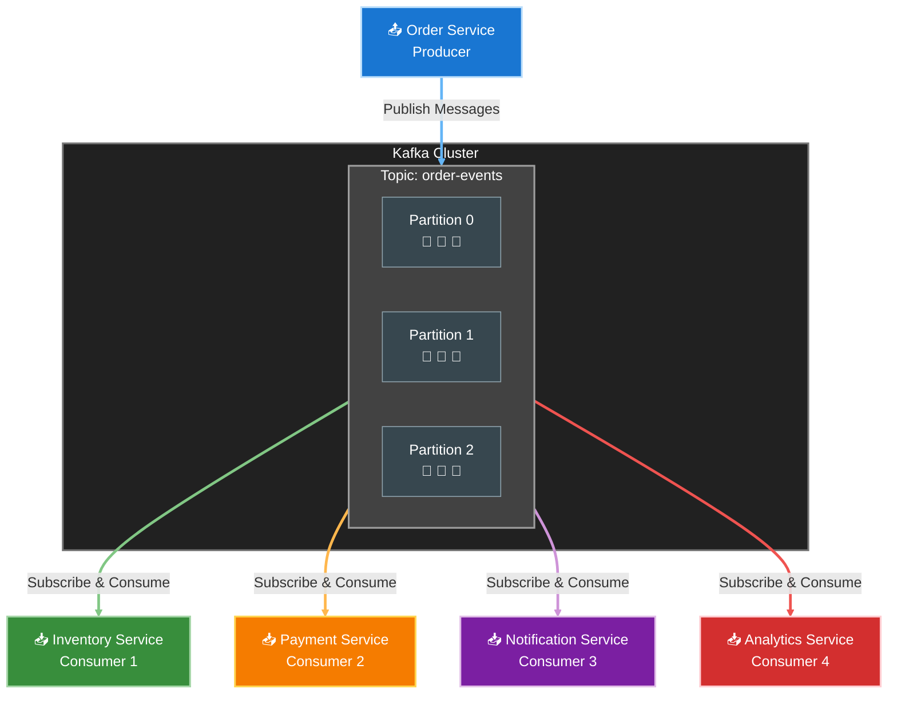

# Kafka

> Kafka is a distributed event streamin platform. Kafka was originally developed by LinkedIn and later open-sourced in 2011. It is now part of the Apache Software Foundation.

## Introduction

- Distributed streaming platform. high throughput with long-term retention.
- Pub/sub pattern, fan-out mechanism.
- Used for building real-time data pipelines and streaming applications.
- Asynchronous communication between services (different from synchronous HTTP requests, where client waits for a response).
- Kafka can be used to decouple services, allowing them to operate independently. This lead to better `scalability` and `fault tolerance` (if one service fails, others can continue to operate).
- **Pros**:
  - High throughput.
  - Asynchronous processing.
  - Decoupled architecture.
  - Scalable and fault-tolerant.
- **Cons**:
  - Complexity in setup and management.
  - Operational overhead.
  - Cost.

### The difference between `Event` vs `Request/Response`

- **Event**: Just a thing that happened. It may a bussiness fact that value to more than one service. Event does not require a response.
- **Request/Response**: A request is made to a service, and a response is expected. It is a synchronous communication pattern.