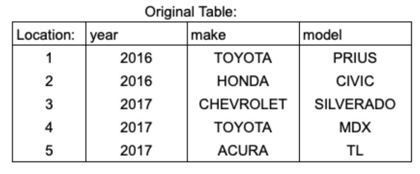
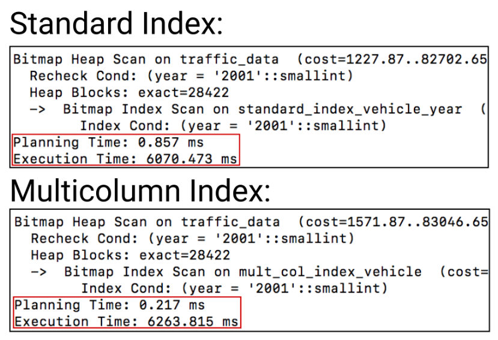
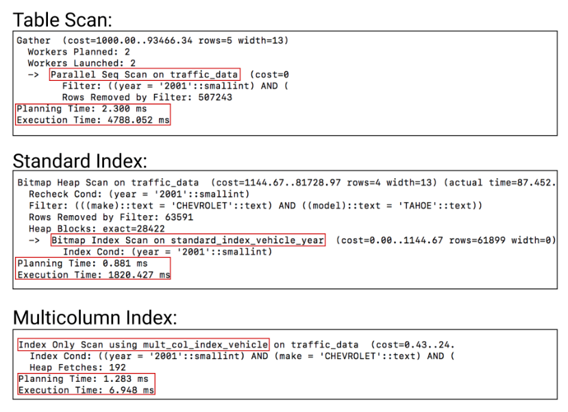

# SQL Self Notes

> This is a collection of notes on SQL. It is a work in progress and will be updated as I learn more about SQL.

**Table of Contents**

## 1. Multicolumn Indexes

> Multicolumn indexes (also known as composite indexes) are similar to standard indexes. They both store a sorted "table" of pointers to the main table. Multicolumn indexes however can store additional sorted pointers to other columns.

**References**: [Multicolumn Indexes](https://www.atlassian.com/data/sql/multicolumn-indexes)

### 1.1. Syntax

```sql
CREATE INDEX [index name]
ON [Table name]([column1, column2, column3,...]);
```

### 1.2. What the heck is a multicolumn index?

- Multicolumn indexes are indexes that store data on up to 32 columns.
- When creating a multicolumn index, **the column order is very important.**
- Multicolumn indexes are structured to have `a hierarchical structure`.

### 1.3. Example



Multi-column index will look like this if we create index on (`year`, `make`, `model`):


- In a three column index we can see that the main index `year` stores pointers to both the original table and the reference table on `make`, which in turn has pointers to the reference table on `model`.
- Query step:
    - The query will first look at the `year` index to find the correct `year`.
    - The main index also has a pointer to the secondary index where the related `make` is stored.
    - The secondary index in term has a pointer to the tertiary index.
- Because of this pointer ordering, in order to access the secondary index, it has to be **done through the main index**. 
- This means that this multicolumn index can be used for queries that filter by just `year`, `year and make`, or `year, make, and model`.
- The multicolumn index **cannot be used for queries just on the `make` or `model` of the car because the pointers are inaccessible.**

### 1.4. Performance

- A `normal index` versus a `multicolumn index`: There is little to no difference when sorting by just the first column `year`.



- However, when sorting by the multiple column `year, make, and model`, the multicolumn index is much faster.


