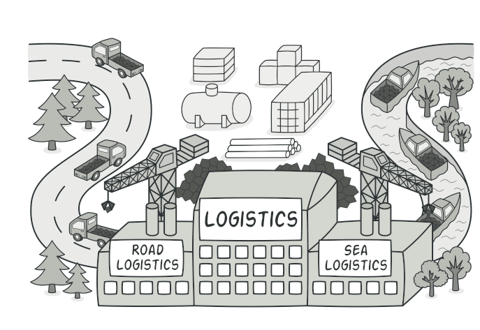
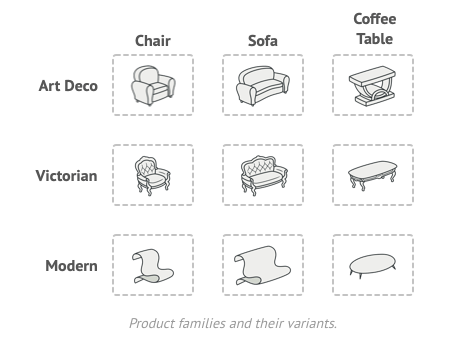
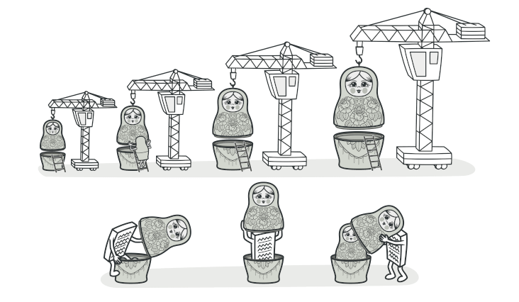
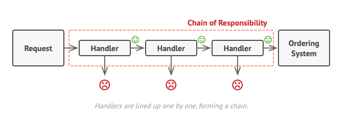

# Go Design Pattern

> This collection is note taking of series [Go Design Pattern](https://www.youtube.com/watch?v=-eHfGiq9plg&list=PLOsM_3jFFQRmNCt68hxCdxi8i_fUx2wTZ)


## Strategy

> Strategy is a `behavioral design pattern` that lets you define a family of algorithms, put each of them into a separate class, and make their objects interchangeable.

``` Go
type Notifier interface {
	Send(message string)
}

type EmailNotifier struct{}

func (e *EmailNotifier) Send(message string) {
	// send email
	fmt.Printf("Sending email: %s (Sender: Email)\n", message)
}

type SMSNotifier struct{}

func (s *SMSNotifier) Send(message string) {
	// send sms
	fmt.Printf("Sending sms: %s (Sender: SMS)\n", message)
}

type PushNotifier struct {
	notifier Notifier
}

func (p *PushNotifier) SendMessage(message string) {
	p.notifier.Send(message)
}

func main() {
	emailNotifier := &EmailNotifier{}
	emailNotification := &PushNotifier{notifier: emailNotifier}
	emailNotification.SendMessage("Hello, welcome to the world of Go!")

	smsNotifier := &SMSNotifier{}
	smsNotification := &PushNotifier{notifier: smsNotifier}
	smsNotification.SendMessage("Hello, welcome to the world of Go!")
}
```

- Use the Strategy when you have a lot of similar classes that only differ in the way they execute some behavior.
- Use the pattern to isolate the business logic of a class from the implementation details of algorithms that may not be as important in the context of that logic.

## Factory Method

> Factory Method is a `creational design pattern` that provides an interface for creating objects in a superclass, but allows subclasses to alter the type of objects that will be created.



``` Go
// notifier/notifier.go
package notifier

type Notifier interface {
	Send(message string)
}

type emailNotifier struct{}

func (e *emailNotifier) Send(message string) {
	// send email
	fmt.Printf("Sending email: %s (Sender: Email)\n", message)
}

type sMSNotifier struct{}

func (s *sMSNotifier) Send(message string) {
	// send sms
	fmt.Printf("Sending sms: %s (Sender: SMS)\n", message)
}

func NewNotifier(notificationType string) Notifier {
	if notificationType == "email" {
		return &emailNotifier{}
	}
	if notificationType == "sms" {
		return &sMSNotifier{}
	}
	return nil
}
```

```Go
package main

import "factory-method/solution/notifier"

func main() {
	emailNoti := notifier.NewNotifier("email")
	emailNoti.Send("Hello, welcome to the world of Go!")
}
```

- Use the Factory Method when you don't know beforehand the exact types and dependencies of the objects your code should work with.
-  Use the Factory Method when you want to provide users of your library or framework with a way to extend its internal components.
- Use the Factory Method when you want to save system resources by reusing existing objects instead of rebuilding them each time.

## Abstract Factory

> Abstract Factory is a `creational design` pattern that lets you **produce families of related objects without specifying their concrete classes**.



- just define the "type" of things you want to sale

```Go
type Drink interface {
	Drink()
}

type Food interface {
	Eat()
}
```

- Then define the various type of each thing, like: drink = coffee or beer, food = sandwich or chips

```Go
type Coffee struct{}

func (c *Coffee) Drink() {
	// drink coffee
	fmt.Println("Drinking Coffee")
}

type Beer struct{}

func (b *Beer) Drink() {
	// drink beer
	fmt.Println("Drinking Beer")
}

type Sandwich struct{}

func (s *Sandwich) Eat() {
	// eat sandwich
	fmt.Println("Eating Sandwich")
}

type Chips struct{}

func (c *Chips) Eat() {
	// eat chips
	fmt.Println("Eating Chips")
}
```

- Then define the factory with collection of food and drink you want to combine...

```Go
type VoucherAbstractFactory interface {
	GetDrink() Drink
	GetFood() Food
}

type CoffeeSandwichFactory struct{}

func (c *CoffeeSandwichFactory) GetDrink() Drink {
	return &Coffee{}
}

func (c *CoffeeSandwichFactory) GetFood() Food {
	return &Sandwich{}
}

type BeerChipsFactory struct{}

func (b *BeerChipsFactory) GetDrink() Drink {
	return &Beer{}
}

func (b *BeerChipsFactory) GetFood() Food {
	return &Chips{}
}

```

- Finally use these shiet:

```Go
func getVoucherFactory(campaignName string) VoucherAbstractFactory {
	if campaignName == "morning" {
		return &CoffeeSandwichFactory{}
	}
	if campaignName == "evening" {
		return &BeerChipsFactory{}
	}
	return nil
}
```

## Decorator

> Decorator is a `structural design pattern` that lets you attach new behaviors to objects by placing these objects inside special wrapper objects that contain the behaviors.



- Implement various of type notification:

```Go

type Notifier interface {
	Send(message string)
}

type EmailNotifier struct{}

func (e *EmailNotifier) Send(message string) {
	// send email
	fmt.Printf("Sending email: %s (Sender: Email)\n", message)
}

type SMSNotifier struct{}

func (s *SMSNotifier) Send(message string) {
	// send sms
	fmt.Printf("Sending sms: %s (Sender: SMS)\n", message)
}

type TelegramNotifier struct{}

func (t *TelegramNotifier) Send(message string) {
	// send sms
	fmt.Printf("Sending telegram: %s (Sender: Telegram)\n", message)
}
```

- Create the decorator type:

```Go
type NotifierDecorator struct {
	notifier Notifier
	core     *NotifierDecorator // point to another decorator
}

func (nd NotifierDecorator) Send(message string) {
	nd.notifier.Send(message)

    // like stack or recursive
	if nd.core != nil {
		nd.core.Send(message)
	}
}

func (nd NotifierDecorator) Decorate(notifier Notifier) NotifierDecorator {
	return NotifierDecorator{
		core:     &nd,
		notifier: notifier,
	}
}

func NewNotifierDecorator(notifier Notifier) NotifierDecorator {
	return NotifierDecorator{
		notifier: notifier,
	}
}
```

- Finally:

```Go
func main() {
	notifier := NewNotifierDecorator(&EmailNotifier{}).
		Decorate(&SMSNotifier{}).
		Decorate(&TelegramNotifier{})

	notifier.Send("Hello, welcome to the world of Go!")
}

/*
Output:
Sending telegram: Hello, welcome to the world of Go! (Sender: Telegram)
Sending sms: Hello, welcome to the world of Go! (Sender: SMS)
Sending email: Hello, welcome to the world of Go! (Sender: Email)
*/
```

- Use the Decorator pattern when you need to be able to assign extra behaviors to objects at runtime without breaking the code that uses these objects.
- Use the pattern when it's awkward or not possible to extend an object's behavior using inheritance.

## Chain of Responsibility

> Chain of Responsibility is a `behavioral design pattern` that lets you pass requests along a chain of handlers. Upon receiving a request, each handler decides either to process the request or to pass it to the next handler in the chain.



- First, define 1 "Context", or an Object that will pass throught all of chains.

```go
type Context struct {
	url     string
	content string
	data    any
}
```

- Define type of function of chain:

```go
type Handler func(*Context) error
```

- Define each chain:

```go
func CheckingUrlHandler(ctx *Context) error {
	fmt.Printf("Checking URL: %s\n", ctx.url)
	return nil
}

func FetchContentHandler(c *Context) error {
	fmt.Printf("Fetching content from url: %s\n", c.url)
	c.content = "Hello, World!"
	return nil
}

func ExtractDataHandler(c *Context) error {
	fmt.Printf("Extracting data from content: %s\n", c.content)
	c.data = "Hello, World!"
	return nil
}
```

- Define chain node, chain node will contain 2 things: current node (handler) and next node (pointer to another handler). It will be built like `link list`.

```go
type HandlerNode struct {
	handler Handler
	next    *HandlerNode
}
```

- Define `execute` function:


```go
func (node *HandlerNode) Execute(url string) error {
	ctx := Context{
		url: url,
	}

	if node == nil || node.handler == nil {
		return nil
	}

	if err := node.handler(&ctx); err != nil {
		return err
	}

	return node.next.Execute(url)
}

// or like this:
func (node *HandlerNode) Execute(url string) error {
	ctx := Context{
		url: url,
	}

	nextNode := node.next
	for nextNode != nil {
		if err := nextNode.handler(&ctx); err != nil {
			return err
		}

		nextNode = nextNode.next
	}

	return nil
}
```

- Define construct function:

```go
func NewCrawler(handler ...Handler) HandlerNode {
	node := HandlerNode{}

	if len(handler) > 0 {
		node.handler = handler[0]
	}

	currentNode := &node

	for i := 1; i < len(handler); i++ {
		currentNode.next = &HandlerNode{handler: handler[i]}
		currentNode = currentNode.next
	}

	return node
}
```

- Define struct that contains that link list and execute function:

```go
type WebCrawler struct {
	handler HandlerNode
}

func (wc WebCrawler) Crawl(url string) {
	if err := wc.handler.Execute(url); err != nil {
		log.Println(err)
	}
}


func main() {
	WebCrawler{
		handler: NewCrawler(
			CheckingUrlHandler,
			FetchContentHandler,
			ExtractDataHandler,
			SaveDataHandler,
		),
	}.Crawl("https://www.google.com")
}
```
