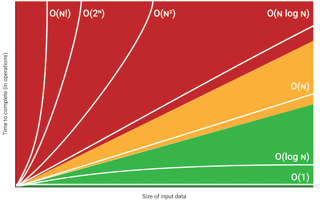
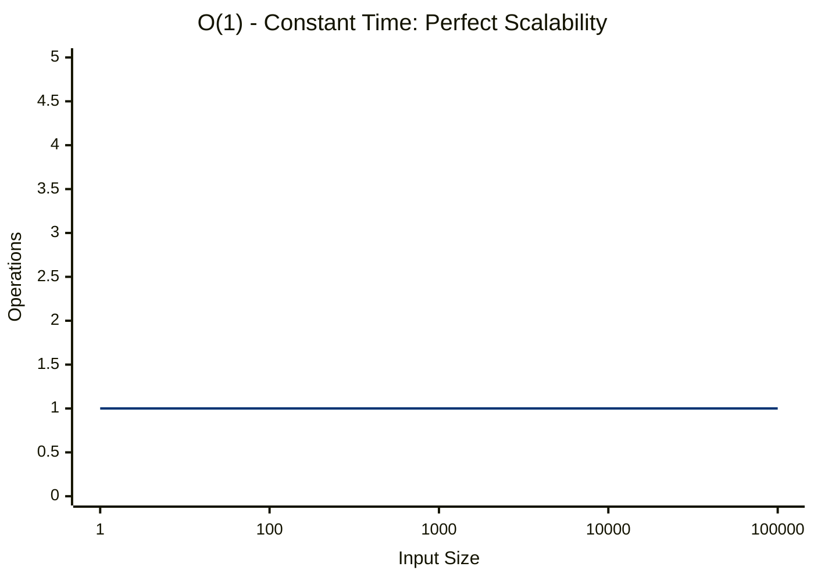
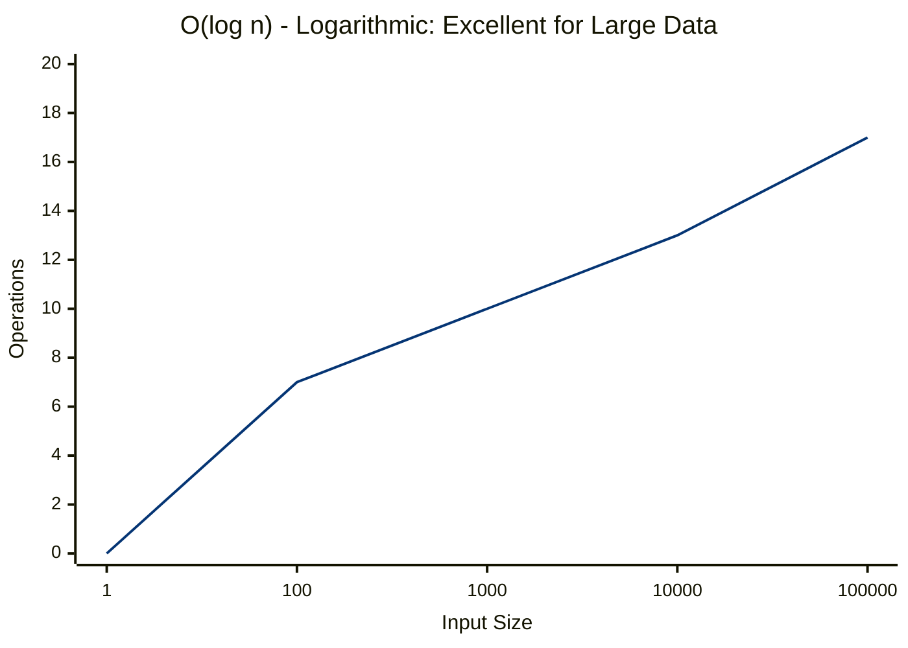
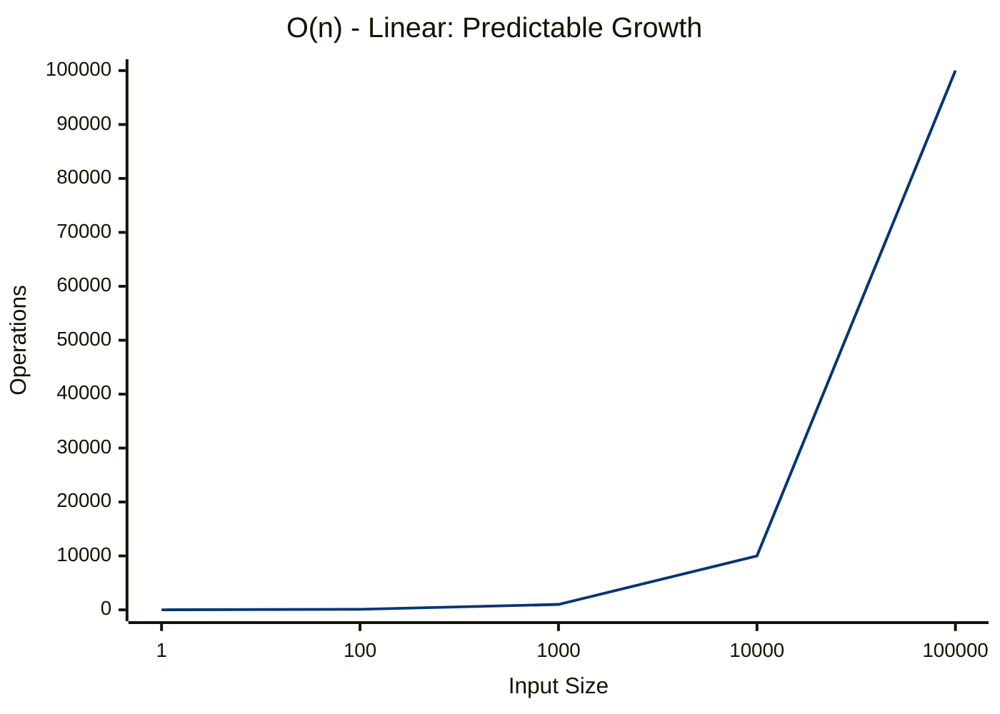
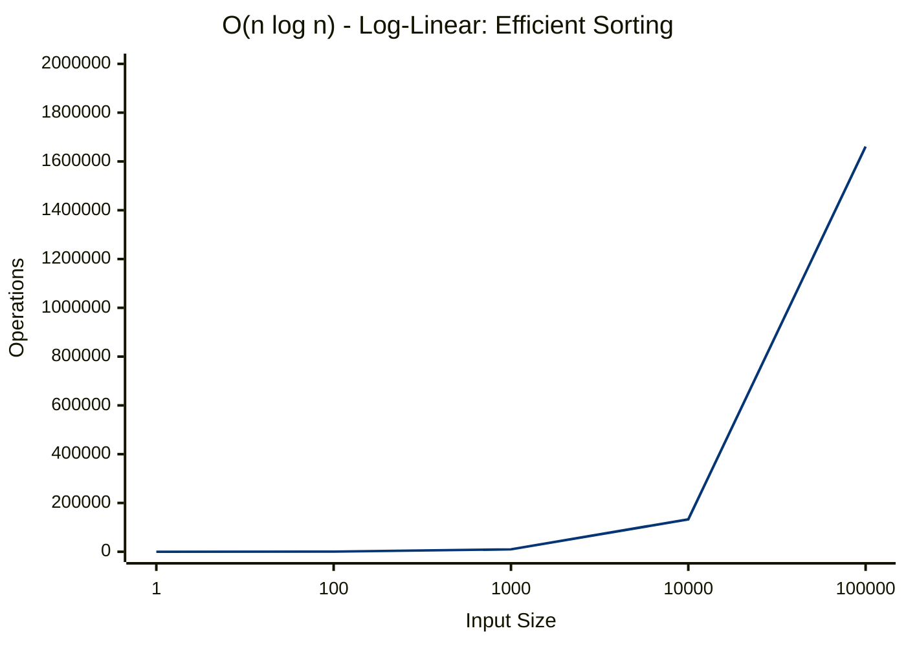
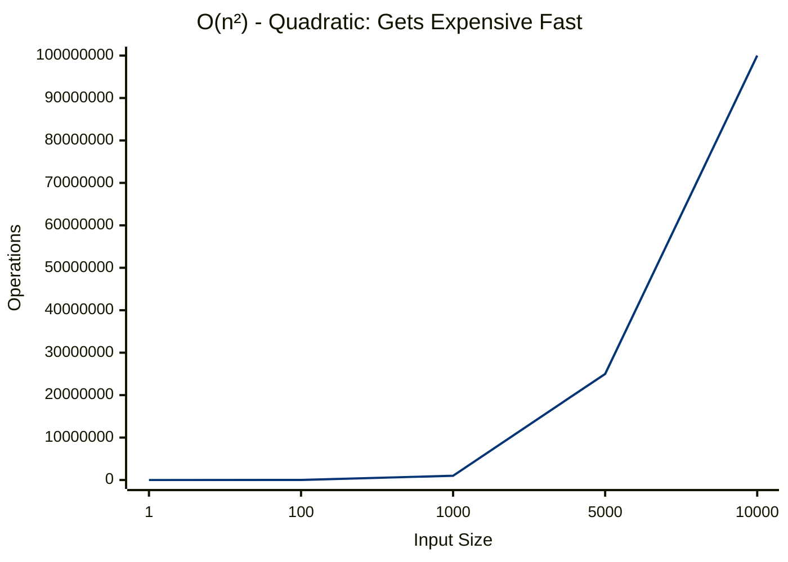
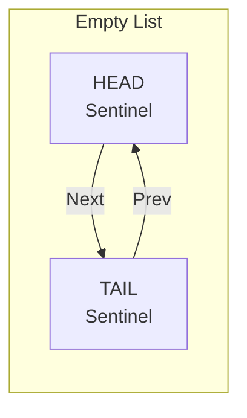
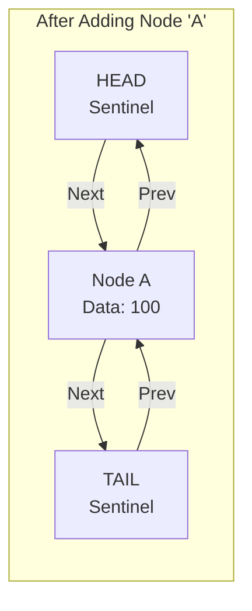

# DSA (With Go)

> With my current fucking job, I work as a "one-man army" in Backend development, and I have to do everything from scratch. So I decided to learn Data Structures and Algorithms in Go. Start from zero.
> My only reference roadmap: [Roadmap](https://neetcode.io/roadmap). Thanks to my friend @HiepThanh0510 for the recommendation.

# Some basics

## What the heck is complexity?

> Sometime I hear people say "O(n) time complexity" or "O(1) space complexity". What the heck is that?

- Big O Notation is a mathematical way to describe how an algorithm's performance scales as the input size grows. Think of it as predicting how your system will behave under load.
- When talking about complexity, we usually refer to two main aspects:
  - **Space Complexity**: How much memory does it use? Measured in terms of the amount of memory it needs relative to the input size.
  - **Time Complexity**: How fast does it run? Measured in terms of the number of operations it performs relative to the input size.
- Something important to note:
  - Input >= 0;
  - Function do more work for more input;
  - Drop constants and lower order terms;
    - e.g., O(2n) -> O(n), O(n + log n) -> O(n);
    - n^3 + n^2 + n + 1 -> O(n^3);



- `O(1)` - Constant Time: The algorithm takes the same amount of time regardless of input size. Example: Accessing an element in an array by index.

```go
// Array access - always takes same time regardless of array size
func getFirstElement(arr []int) int {
    if len(arr) == 0 {
        return -1
    }
    return arr[0]  // Always 1 operation
}
```



- `O(log n)` - Logarithmic Time: The algorithm reduces the problem size by half each time. Example: Binary search in a sorted array.

```go
func binarySearch(sortedArr []int, target int) int {
    left, right := 0, len(sortedArr)-1
    
    for left <= right {
        mid := left + (right-left)/2
        
        if sortedArr[mid] == target {
            return mid
        } else if sortedArr[mid] < target {
            left = mid + 1    // Eliminate left half
        } else {
            right = mid - 1   // Eliminate right half
        }
    }
    
    return -1
}
```



- `O(n)` - Linear Time: The algorithm processes each element once. Example: Finding the maximum element in an array.

```go
func linearSearch(arr []int, target int) int {
    for i, value := range arr {    // Loop through ALL elements
        if value == target {
            return i
        }
    }
    return -1
}
```




- `O(n log n)` - Log-Linear Time: Common in efficient sorting algorithms like mergesort or heapsort. Example: Mergesort.

```go
func efficientSort(arr []int) []int {
    sort.Ints(arr)  // Go's built-in sort is O(n log n)
    return arr
}
```



- `O(n²)` - Quadratic Time: The algorithm has nested loops, processing each element for every other element. Example: Bubble sort.

```go
// Bubble sort - avoid in production!
func bubbleSort(arr []int) {
    n := len(arr)
    for i := 0; i < n; i++ {
        for j := 0; j < n-i-1; j++ {    // Double nested loops
            if arr[j] > arr[j+1] {
                arr[j], arr[j+1] = arr[j+1], arr[j]
            }
        }
    }
}
```



## Some common patterns

### Sentinel Pattern

- `Wiki`:
    - **Sentinel value**: In computer programming, a sentinel value (also referred to as **a flag value**, **trip value**, or **dummy data**) is a special value in the context of an algorithm which uses its presence as a condition of termination, typically in a loop or recursive algorithm.
    - **Sentinel node**: In computer programming, a sentinel node is a specifically designated node used with linked lists and trees as a traversal path terminator. This type of node does not hold or reference any data managed by the data structure.
- In this notes, i used this pattern in [doubly linked list](./linked-list/doubly-ll/main.go)





- **Benefits**:
    - Simplifies code by eliminating edge cases (e.g., inserting into an empty list).
    - Ensures that there are always nodes to reference, making operations like insertion and deletion more straightforward.