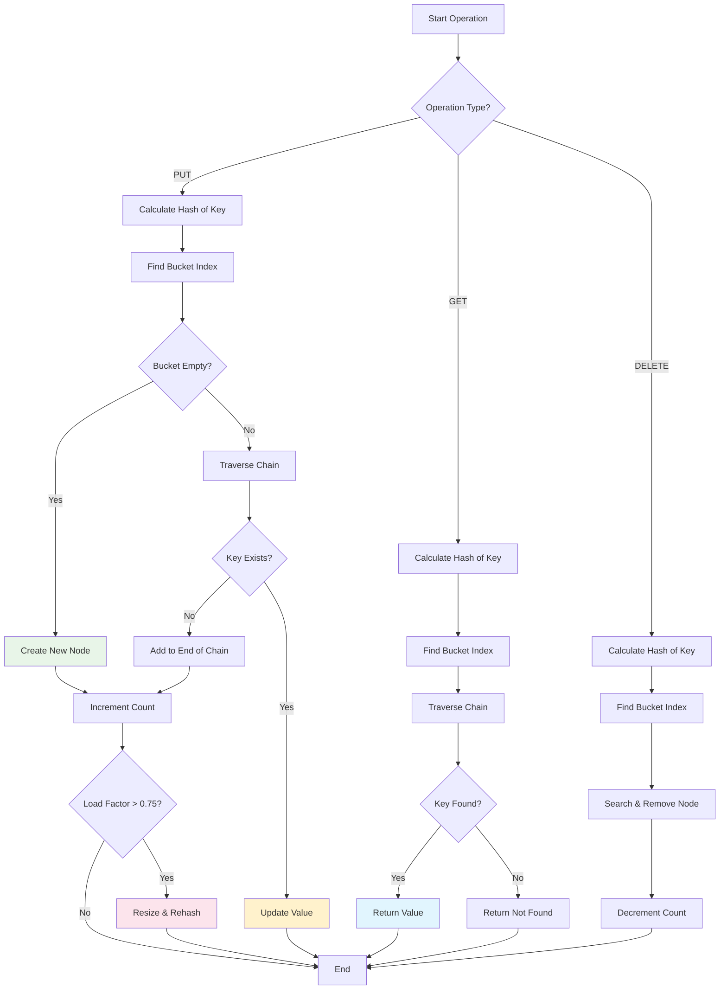
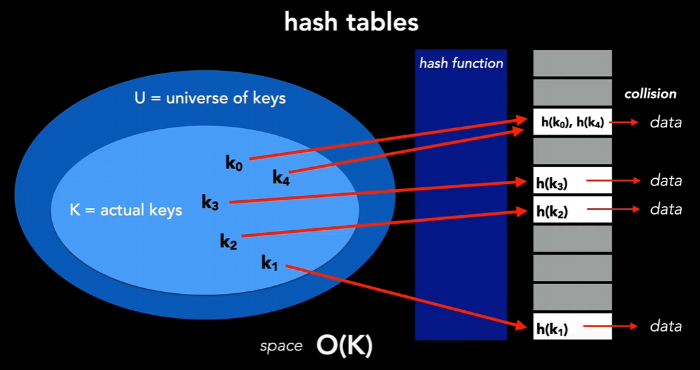
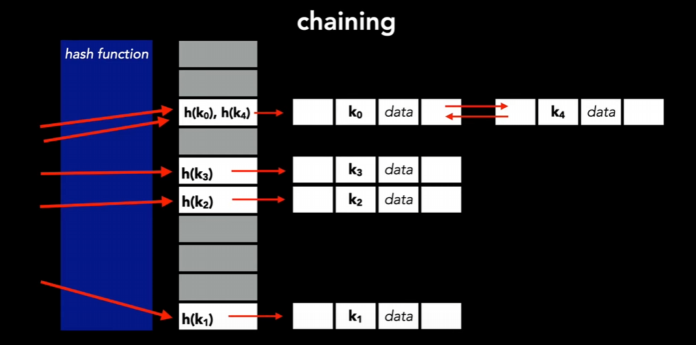

# HASH


## Definition

- **A Hash Table** (also called Hash Map) is a data structure that implements an associative array abstract data type, a structure that can map keys to values. It uses a hash function to compute an index into an array of buckets or slots, from which the desired value can be found. The main goal is to achieve O(1) average time complexity for search, insertion, and deletion operations.

## Characteristics

- **Key-Value Pair**: Hash tables store data in key-value pairs, allowing for efficient retrieval based on the key.
- **Hash Function**: A hash function is used to compute an index from the key, which determines where the value is stored in the array.
- **Collision Handling**: When two keys hash to the same index, a collision occurs. Common strategies for handling collisions include chaining (using linked lists) and open addressing (finding another open slot).
- **Dynamic Resizing**: Many hash table implementations resize the underlying array when the load factor (number of elements / array size) exceeds a certain threshold, maintaining efficient performance.

## Core concepts



- **Hash function**: a function that takes a key (input) and returns an index in the hash table array.



- **Collision**: When two different keys produce the same hash value.
- **Chaining**: A collision resolution technique where each bucket in the hash table contains a linked list of all entries that hash to the same index.



- **Load factor**: The load factor is basically how much data we have in our table. This load factor is called `lambda`. This factor is going to vary depending on how our data structure resolves collisions. We need to resize table when `lambda` exceeds a certain threshold to maintain efficient performance.

```sh
lambda = number of entries / size of the hash table
```