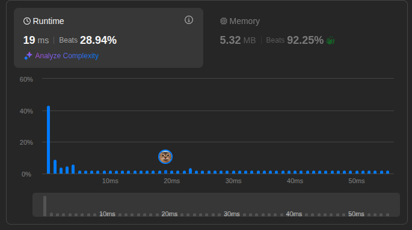
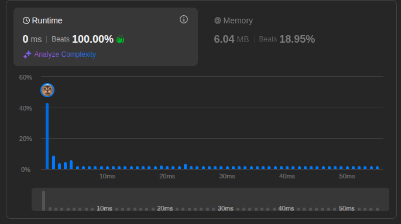

# Two Sum

## Problem Statement

- Given an array of integers `nums` and an integer `target`, return indices of the two numbers such that they add up to `target`.

## Submits

### First Attempt

- Ok we don't know anything about hash, so let's try brute force.
- This is `O(n^2)` time complexity: two nested loops.

```go
func twoSum(nums []int, target int) []int {
    for i := 0; i < len(nums); i++ {
        for j := i + 1; j < len(nums); j++ {
            if nums[i]+nums[j] == target {
                return []int{i, j}
            }
        }
    }
    return nil
}
```



### Second Attempt

- Brute force is too slow, let's try to use a hash map to store the numbers we have seen so far.
- This is `O(n)` time complexity.
- In Go, simply use `map` to implement a hash map. Just remember to check if the key exists or not.
- **Key point**: everything about fast lookup is to use hash map.

```go
func twoSum(nums []int, target int) []int {
	ret := make(map[int]int)
	for i, v := range nums {
		expectedVal := target - v
		if iLookup, found := ret[expectedVal]; found {
			return []int{i, iLookup}
		}
		ret[v] = i
	}
	return nil
}
```

