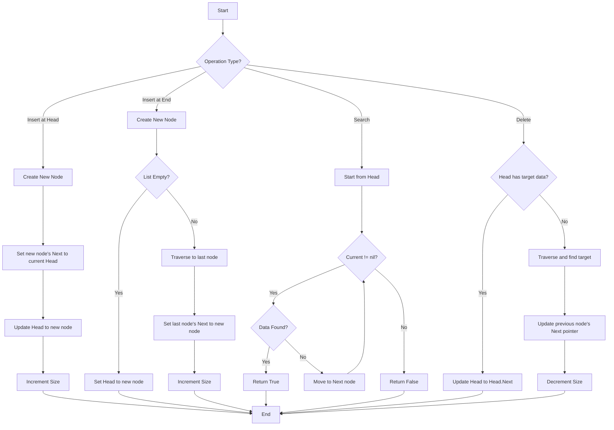

# LINKED LIST


- We have seen arrays, which store elements in contiguous memory locations. The problem with arrays is that they're never have the "right" size, they are either too big or too small. So we need a data structure that can grow and shrink dynamically as needed.

## Definition

```bash

Head                                                          NULL
 |                                                             ^
 v                                                             |
┌─────┬─────┐    ┌─────┬─────┐    ┌─────┬─────┐    ┌─────┬─────┐
│ 10  │  ●──┼───>│ 20  │  ●──┼───>│ 30  │  ●──┼───>│ 40  │  ●──┼
└─────┴─────┘    └─────┴─────┘    └─────┴─────┘    └─────┴─────┘
```

- A **Linked List** is a linear data structure where elements, called nodes, are stored in non-contiguous memory locations. Each node contains data and a reference (or pointer) to the next node in the sequence. Linked lists are dynamic in size, allowing for efficient insertions and deletions.
- Unlike arrays, linked lists don't have a fixed size and allow efficient insertion and deletion anywhere in the sequence.
- **Nodes**: Each element in a linked list is called a node. Node contains two parts:
    - **Data**: The actual value or information stored in the node.
    - **Next pointer**: A reference to the next node in the list (and optionally to the previous node in doubly linked lists).
- **The only thing we know to access a linked list is the head pointer**, which points to the first node in the list. The last node points to NULL, indicating the end of the list.
- **Types of Linked Lists**:
    - **Singly Linked List**: Each node points to the next node
    - **Doubly Linked List**: Each node has pointers to both next and previous nodes
    - **Circular Linked List**: Last node points back to the first node



## Characteristics

- **Dynamic Size**: Can grow or shrink during runtime
- **Sequential Access**: Must traverse from head to reach any element
- **Memory Efficiency**: Allocates memory as needed