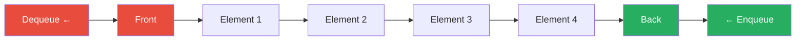
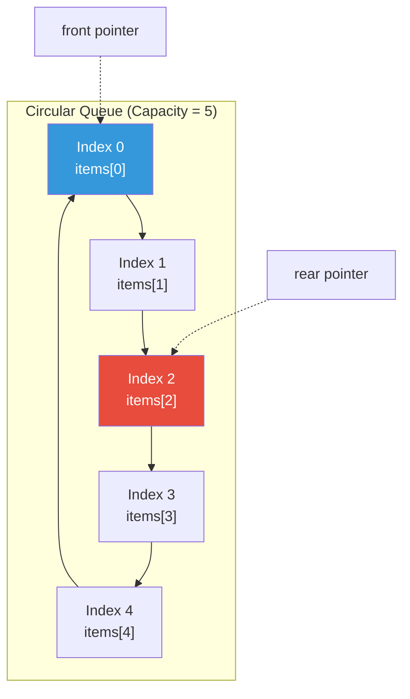
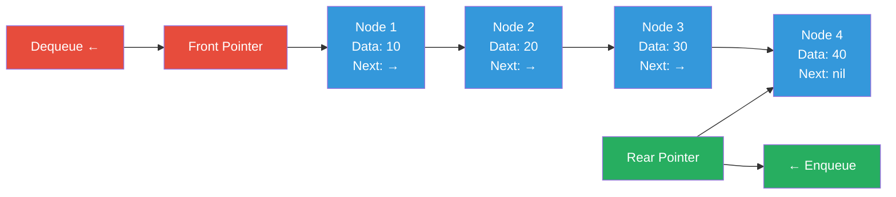

## QUEUE


## Definition

- A Queue is a data structure that follows the **First In, First Out (FIFO)** principle, meaning the first element added to the queue will be the first one to be removed. It is similar to a real-life queue, like a line of people waiting for a service.

## Characteristics

- **FIFO (First In, First Out)**: The first element added is the first one to be removed.
- **Enqueue Operation**: Adding an element to the back of the queue.
- **Dequeue Operation**: Removing an element from the front of the queue.
- **Linear Structure**: Elements are arranged in a sequential manner.
- **Restricted Access**: Elements can only be added from the ends of the queue and removed from the front.



## Core operations

- **Enqueue**: Adds an element to the back of the queue.
- **Dequeue**: Removes an element from the front of the queue.
- **Front/Peek**: Returns the front element without removing it.
- **Size**: Returns the number of elements in the queue.
- **IsEmpty**: Checks if the queue is empty.

## Example

- **Simple Queue**: Just act as a regular queue.

```go
type Queue struct {
	Items []int
}

func NewQueue() *Queue {
	return &Queue{
		Items: []int{},
	}
}

func (q *Queue) IsEmpty() bool {
	return len(q.Items) == 0
}

func (q *Queue) Size() int {
	return len(q.Items)
}

func (q *Queue) Display() {
	fmt.Printf("Queue: %v (front -> rear)\n", q.Items)
}

func (q *Queue) Enqueue(item int) {
	q.Items = append(q.Items, item)
}

func (q *Queue) Dequeue() (int, bool) {
	if q.IsEmpty() {
		return 0, false
	}

	item := q.Items[0]
	q.Items = q.Items[1:]
	return item, true
}

func (q *Queue) Front() (int, bool) {
	if q.IsEmpty() {
		return 0, false
	}
	return q.Items[0], true
}
```

- **Circular Queue**: A circular queue is a more efficient implementation of a queue that uses a fixed-size array in a circular manner. When the end of the array is reached, it wraps around to the beginning, allowing for better space utilization. This is particularly useful in scenarios where the queue is frequently filled and emptied. The circular queue maintains two pointers (front and rear) to track the positions of the first and last elements, respectively.



```go
var (
	ErrQueueFull       = errors.New("queue is full")
	ErrQueueEmpty      = errors.New("queue is empty")
	ErrInvalidCapacity = errors.New("capacity must be positive")
)


// CircularQueue represents a circular queue data structure
type CircularQueue struct {
	items    []int
	front    int
	rear     int
	size     int
	capacity int
}

// NewCircularQueue creates a new CircularQueue with the given capacity
func NewCircularQueue(capacity int) (*CircularQueue, error) {
	if capacity <= 0 {
		return nil, ErrInvalidCapacity
	}

	return &CircularQueue{
		items:    make([]int, capacity),
		front:    0,
		rear:     -1, // Start at -1 so first enqueue sets rear to 0
		size:     0,
		capacity: capacity,
	}, nil
}

// Size returns the current number of elements in the queue
func (q *CircularQueue) Size() int {
	return q.size
}

// Capacity returns the maximum capacity of the queue
func (q *CircularQueue) Capacity() int {
	return q.capacity
}

// IsEmpty checks if the queue is empty
func (q *CircularQueue) IsEmpty() bool {
	return q.size == 0
}

// IsFull checks if the queue is full
func (q *CircularQueue) IsFull() bool {
	return q.size == q.capacity
}

// Front returns the front element without removing it (peek operation)
func (q *CircularQueue) Front() (int, error) {
	if q.IsEmpty() {
		return 0, ErrQueueEmpty
	}
	return q.items[q.front], nil
}

// Rear returns the rear element without removing it
func (q *CircularQueue) Rear() (int, error) {
	if q.IsEmpty() {
		return 0, ErrQueueEmpty
	}
	return q.items[q.rear], nil
}

// Enqueue adds an item to the rear of the queue
func (q *CircularQueue) Enqueue(item int) error {
	if q.IsFull() {
		return ErrQueueFull
	}

	q.rear = (q.rear + 1) % q.capacity
	q.items[q.rear] = item
	q.size++
	return nil
}

// Dequeue removes and returns the front element of the queue
func (q *CircularQueue) Dequeue() (int, error) {
	if q.IsEmpty() {
		return 0, ErrQueueEmpty
	}

	item := q.items[q.front]

	// update front pointer and size
	q.front = (q.front + 1) % q.capacity
	q.size--

	return item, nil
}
```

- **Linked-list Queue**: is the queue that implemented using linked-list. It uses nodes to store data and pointers to link them together. The queue maintains two pointers: one for the front (head) and one for the rear (tail) of the queue. Linked-list queue is perfect for: Variable-size queues, frequent enqueue/dequeue operations, and memory efficiency.



```go

type Node struct {
	data int
	next *Node
}

type LinkedQueue struct {
	front *Node
	rear  *Node
	size  int
}

func NewLinkedQueue() *LinkedQueue {
	return &LinkedQueue{
		front: nil,
		rear:  nil,
		size:  0,
	}
}

func (q *LinkedQueue) Display() {
	current := q.front
	for current != nil {
		fmt.Print(current.data, " ")
		current = current.next
	}
	fmt.Println()
}

func (q *LinkedQueue) IsEmpty() bool {
	return q.size == 0
}

func (q *LinkedQueue) Size() int {
	return q.size
}

func (q *LinkedQueue) Enqueue(item int) {
	newNode := &Node{data: item, next: nil}

	// empty queue
	if q.IsEmpty() {
		// front → [1] ← rear
		// 		    ↑
		//      Same node!
		q.front = newNode
		q.rear = newNode
	} else {
		// assign the "next" pointer of the current rear to the new node
		// 	front → [1] → [2]
		//     ↑     ↑
		//   rear  newNode
		q.rear.next = newNode

		// update the rear pointer to the new node
		// front → [1] → [2] ← rear
		q.rear = newNode
	}
	q.size++
}

func (q *LinkedQueue) Dequeue() (int, bool) {
	if q.IsEmpty() {
		return 0, false
	}

	it := q.front.data
	q.front = q.front.next
	q.size--

	if q.IsEmpty() {
		// NOW the queue is empty, but rear still points to the old node!
		// rear → [Node{data:10, next:nil}] (garbage/dangling pointer)
		// front → nil
		q.rear = nil
	}

	return it, true
}
```