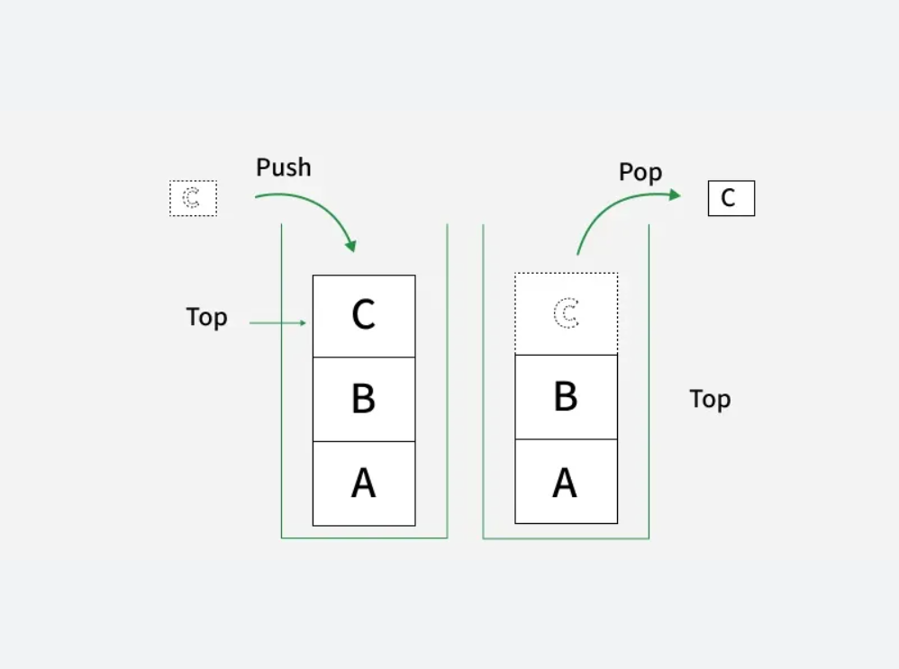
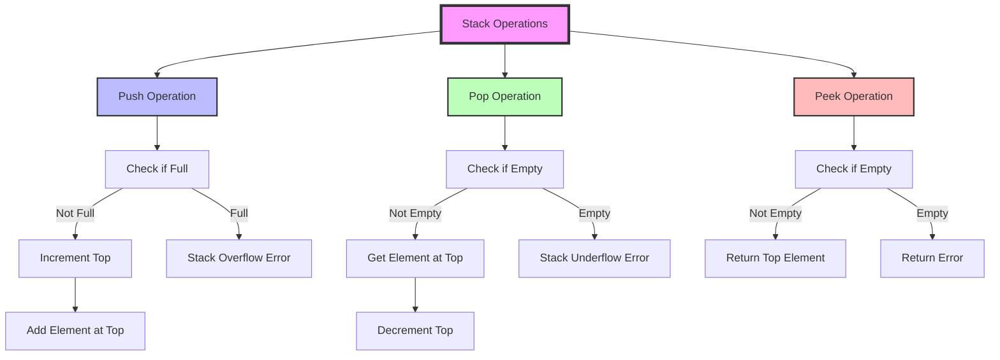

# STACK

## Definition

- **A Stack is a linear data structure that follows the LIFO (Last In, First Out) principle**. Think of it like a stack of plates - you can only add or remove plates from the top. The last element added to the stack will be the first one to be removed.

## Characteristics

- **LIFO Principle**: Last In, First Out
- **Top Pointer**: Tracks the top element
- **Two Primary Operations**: `Push` (add) and `Pop` (remove)
- **Time Complexity**: O(1) for push, pop, and peek operations

## Real-world Applications

- Browser History Management
- Undo/Redo Functionality in Text Editors