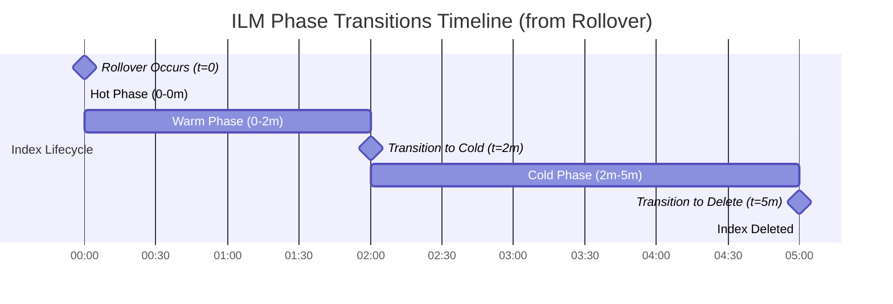

# ELastic Search

> Everything i know about Elasticsearch.

## What the heck is Elasticsearch?

* Elasticsearch is an open-source and distributed search and analytics engine built based on the Apache Lucene library.
* Elasticsearch is designed to handle large volumes of data and provide near real-time search across various types of data, including structured, unstructured, and time-series data.
* Some keys:
    * **Distributed & Scalable**: Data is distributed across multiple nodes, allowing for horizontal scaling and high availability. It's defined by "sharding" and "replication".
    * **Near Real-Time Search**: Data is indexed and made searchable within second.
    * **RESTful API**: Provides a RESTful API for interacting with the cluster.
* ELK stands for: `Elasticsearch`, `Logstash`, and `Kibana`. These three components work together to provide a powerful and flexible platform for collecting, processing, and visualizing data. This document just focuses on Elasticsearch, the core component of the ELK Stack, the other two components will be covered in the future.

## Index

> Elasticsearch uses a structure called an `Index` to store related data together, making it fast and efficient to find what you need.

* All data is stored as **JSON documents**.
* An `index` is a collection of related documents, it's like a database's table but more flexible.
* Indices starting with `.` are reserved for internal use by Elasticsearch.
* To manage indices, there are 02 ways:
    * `Dev Tools`: Direct API calls, more powerful and flexible for complex operations. If the call is successful, it will return a JSON response with details about the operation including `"acknowledged": true`.
    * `Index Management`: A user-friendly interface for common tasks like creating, deleting, and managing indices, suitable for users who prefer a graphical interface.
* Naming convention:
    * Use lowercase letters, numbers, and hyphens (`-`) or underscores (`_`).
    * Avoid spaces and special characters.
    * Avoid starting with a dot (`.`) or an underscore (`_`) as these are reserved for internal use.
* Create an index:

```bash
PUT /my-index

# Add a document to my-index
POST /my-index/_doc
{
    "id": "park_rocky-mountain",
    "title": "Rocky Mountain",
    "description": "Bisected north to south by the Continental Divide, this portion of the Rockies has ecosystems varying from over 150 riparian lakes to montane and subalpine forests to treeless alpine tundra."
}
```

* List all indices:

```bash
GET /_cat/indices?v&h=health,status,index,docs.count,store.size

# Or just get the index with the name "my-index"
GET /_cat/indices/my_books?v&h=health,status,index,docs.count,store.size
```

* Add documents to an index:

```bash
PUT /my_books/_doc/1
{
  "title": "The Great Gatsby",
  "author": "F. Scott Fitzgerald",
  "price": 12.99,
  "genre": "Fiction"
}

# Get mapping and settings of an index
GET /my_books/

# Search
GET /my_books/_doc/1

# List documents in an index
GET /my_books/_search
```

* Delete an index:

```bash
DELETE /my_books
```

## Index Lifecycle Management (ILM)

### Definition

* Index Lifecycle Management (ILM) is a feature in Elasticsearch that automatically manages indices through defined phases based on age or size criteria.
* Phases include:
    * **Hot**: The initial phase where indices receive active writes and require fast query performance.
    * **Warm**: A read-only phase for data that's queried less frequently, typically on slower storage.
    * **Cold**: A phase for rarely accessed data, often with reduced replicas to minimize storage costs.
    * **Rollover**: The action that creates a new index when the current one meets specified size or age thresholds.
* `min_age`: The minimum time an index must wait after rollover before transitioning to the next phase. The `min_age` for each phase is calculated from the rollover time, not from when the index entered the previous phase. So if warm `min_age` is 0 and cold `min_age` is 2 minutes, and delete `min_age` is 5 minutes, the index moves to cold 2 minutes after rollover—not 2 minutes after entering warm. The timeline looks like this:
    * Rollover at 0 minutes → Index enters hot phase.
    * After 0 minutes (immediately) → Index transitions to warm phase.
    * After 2 minutes from rollover → Index transitions to cold phase.
    * After 5 minutes from rollover → Index is deleted.



### ILM with Data Streams

#### Key Terms

| Term |	Definition|
|------|-----------|
| **Data stream** | An abstraction over multiple backing indices that simplifies time-series data management |
| **Backing index** | The actual index that stores data for a data stream, named with a timestamp and sequence number |
| **Index template** | A configuration that automatically applies settings, mappings, and ILM policies to matching indices |
| **Poll interval** | How frequently Elasticsearch checks whether indices are ready to transition to the next lifecycle phase |
| **Priority** | A numeric value that determines which index template takes precedence when multiple templates match |

#### Applying ILM to Data Streams

* Index templates are the bridge between ILM policies and data streams. When a data stream creates a new backing index (either initially or after rollover), it inherits settings from the matching template—including the ILM policy. The priority of 500 ensures this template takes precedence over lower-priority defaults.
* If multiple templates match the same index pattern, only the highest-priority template applies. Built-in templates for Elastic integrations typically use priorities between 100-200.
* Create template with ILM policy:

```bash
PUT _index_template/memory-ds-template
{
  "priority": 500,
  "template": {
    "settings": {
      "number_of_replicas": 0,
      "index.lifecycle.name": "metrics-custom-policy"
    }
  },
  "data_stream": {},
  "index_patterns": [
    "metrics-system.memory-labenv"
  ]
}
```

* Explain the ILM status of an index:

```bash
GET metrics-system.memory-labenv/_ilm/explain

# Output:
{
  "indices": {
    ".ds-metrics-system.memory-labenv-2026.03.29-000001": {
      "index": ".ds-metrics-system.memory-labenv-2026.03.29-000001",
      "managed": true,
      "policy": "metrics-custom-policy",
      "index_creation_date_millis": 1774791726896,
      "time_since_index_creation": "38.15s",
      "lifecycle_date_millis": 1774791726896,
      "age": "38.15s",
      "phase": "hot",
      "phase_time_millis": 1774791727046,
      "action": "rollover",
      "action_time_millis": 1774791727046,
      "step": "check-rollover-ready",
      "step_time_millis": 1774791727046,
      "phase_execution": {
        "policy": "metrics-custom-policy",
        "phase_definition": {
          "min_age": "0ms",
          "actions": {
            "set_priority": {
              "priority": 400
            },
            "rollover": {
              "max_age": "2m",
              "max_primary_shard_docs": 200000000,
              "min_docs": 1,
              "max_primary_shard_size": "50gb"
            }
          }
        },
        "version": 2,
        "modified_date_in_millis": 1774791627108
      },
      "skip": false
    }
  }
}
```

* `phase`: The current lifecycle phase of the index (hot, warm, cold, delete).
* `age`: The time since rollover.
* `action`: current action being evaluated (e.g., rollover).
* `step_info`: details about the current step (e.g., check-rollover-ready).

* Configure poll interval for labs (may be not necessary in production):

```bash
PUT _cluster/settings
{
  "persistent": {
    "indices.lifecycle.poll_interval": "30s"
  }
}
```