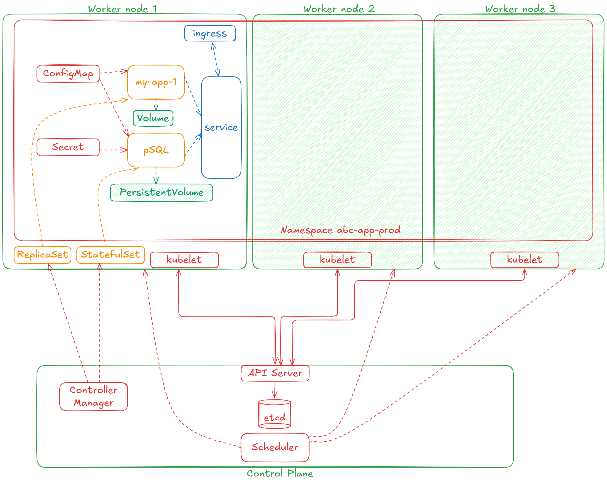
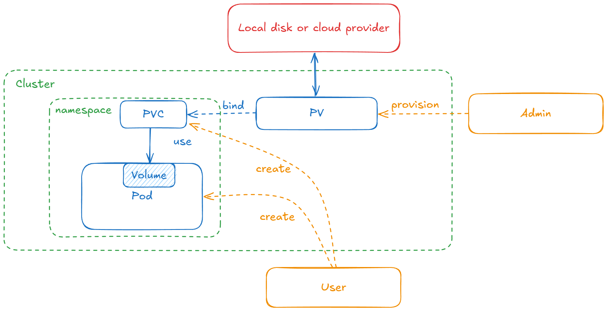
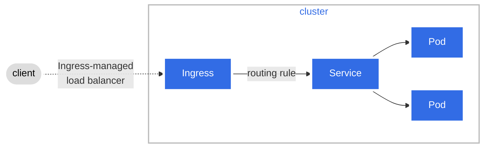
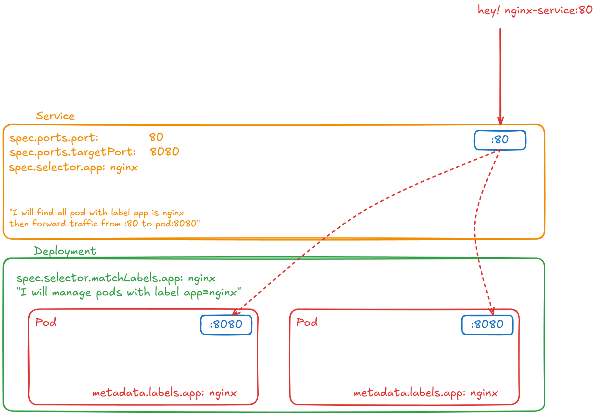
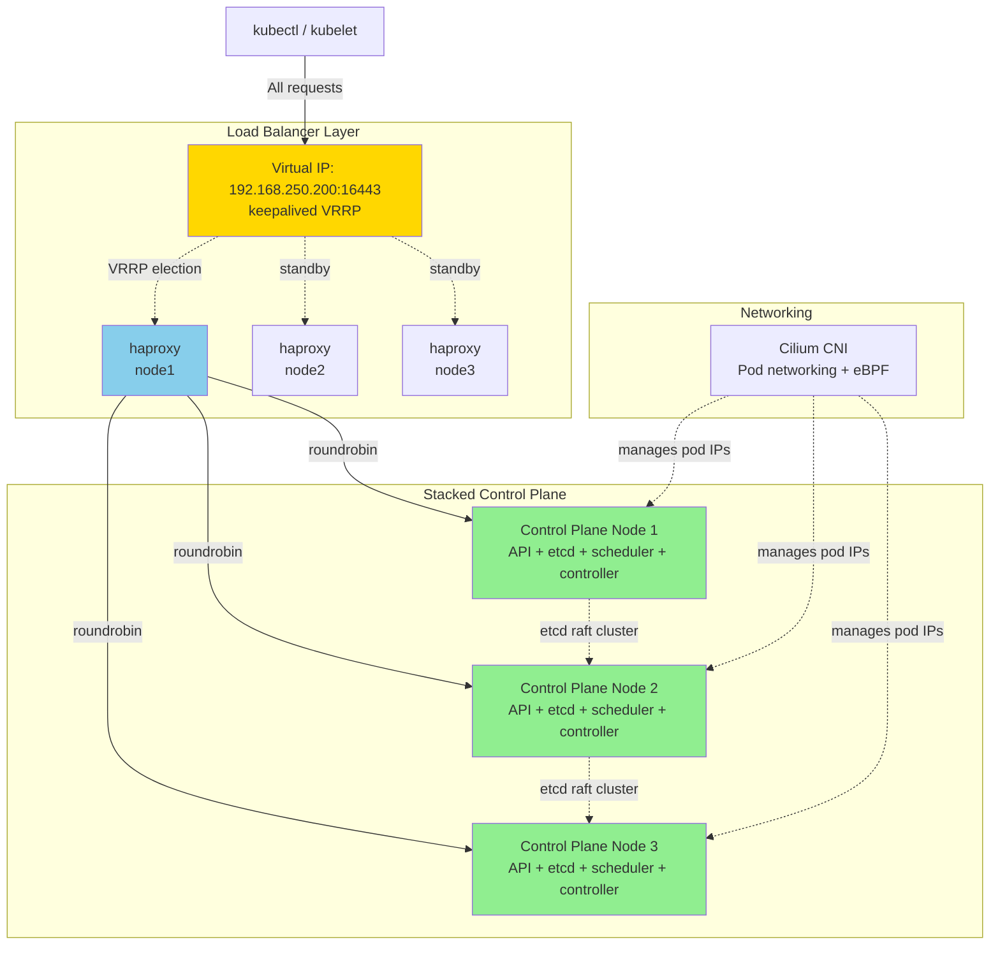

# Kubernetes

## Overview

- Kubernetes is a platform to orchestrate the deployment, scaling, and management of container-based applications.

### Cluster Architecture


#### Cluster

| A cluster is a collection of hosts (nodes) that run containerized applications.

**Node**: A node is a single host in the cluster, which can be a physical or virtual machine. Its job is to run pods. Each node contains the services necessary to run pods and is managed by the master components.
- `kubelet`: An agent that runs on each node in the cluster. It ensures that containers are running in a pod. The kubelet takes a set of PodSpecs that are provided through various mechanisms and ensures that the containers described in those PodSpecs are running and healthy.
- `kube-proxy` (optional): A network proxy that runs on each node in the cluster. It maintains network rules on nodes, allowing network communication to your pods from network sessions inside or outside of your cluster. We can also use other networking solutions instead of kube-proxy, such as Cilium or Calico.
- `Container Runtime`: The container runtime is the software that is responsible for running containers. Kubernetes supports several container runtimes, including Docker, containerd, and CRI-O.

**Pod**: Smallest deployable unit—one or more containers sharing network and storage. Each pod contains one or more containers that share the same network namespace and storage.

#### Control Plane

| The brain of the cluster that makes scheduling decisions and maintains desired state. 

The control plane is responsible for **managing the state of the cluster**, including scheduling, scaling, and updating applications. It consists of several components, including the API server, scheduler, controller manager, and `etcd` (a key-value store for cluster data).
- `kube-apiserver`: The API server is a component of the kubernetes control plane that exposes the Kubernetes API. It is the front-end for the Kubernetes control plane. Node components communicate with the API server to manage the state of the cluster.
- `etcd`: Consistent and highly-available key value store used as Kubernetes' backing store for all cluster data.
- `kube-scheduler`: The scheduler is a component of the Kubernetes control plane that is responsible for scheduling pods onto nodes. It watches for newly created pods that have no node assigned, and selects a node for them to run on. Scheduler just decides on which Node new Pod should be scheduled.
`kube-controller-manager`: The controller manager is a component of the Kubernetes control plane that runs controller processes. Each controller is a separate process, but to reduce complexity, they are all compiled into a single binary and run in a single process.

### Some definitions



#### Service

| Stable network endpoint to access a set of pods.

Services are used to expose some functionality to users or other services. You can have services that provide access to external resources, or pods you control directly at the virtual IP level. Native Kubernetes services are exposed through convenient endpoints. Note that services operate at layer 3 (TCP/UDP).
There are different types of services:
- `ClusterIP` (default): Internal clients send requests to a stable internal IP address.
- `NodePort`: Clients send requests to the IP address of a node on one or more nodePort values that are specified by the Service.
- `LoadBalancer`: Clients send requests to the IP address of a network load balancer.
- `ExternalName`: Internal clients use the DNS name of a Service as an alias for an external DNS name.
- `Headless`: You can use a headless service when you want a Pod grouping, but don't need a stable IP address.

#### Volume

| Storage that persists beyond pod lifetime and can be shared by containers.

Local storage used by the pod is ephemeral and goes away with the pod in most cases. Sometimes that's all you need, if the goal is just to exchange data between containers of the node, but sometimes it's important for the data to outlive the pod, or it's necessary to share data between pods. The volume concept supports that need.

Originally, Kubernetes directly supported many volume types, but the modern approach for extending Kubernetes with volume types is through the Container Storage Interface (CSI).

K8s doesn't manage data persistence.

#### PersistentVolume (PV) & PersistentVolumeClaim (PVC)

| PV: Cluster storage resource; PVC: Request for storage by a user.



The `PersistentVolume` subsystem provides an API for users and administrators that abstracts details of how storage is provided from how it is consumed. To do this, we introduce two new API resources: `PersistentVolume` and `PersistentVolumeClaim`.
**A PersistentVolume (PV) is a piece of storage in the cluster that has been provisioned by an administrator or dynamically provisioned using Storage Classes.** It is a resource in the cluster just like a node is a cluster resource. PVs are volume plugins like Volumes, but have **a lifecycle independent of any individual Pod** that uses the PV.
**A PersistentVolumeClaim (PVC) is a request for storage by a user.** It is similar to a Pod. Pods consume node resources and PVCs consume PV resources.

#### ReplicaSet

| Ensures a specified number of identical pod replicas are running.

A ReplicaSet's purpose is to maintain a stable set of replica Pods running at any given time. Usually, you define a Deployment and let that Deployment manage ReplicaSets automatically.

#### StatefulSet

| Like ReplicaSet but for stateful apps needing stable identity and persistent storage.

A StatefulSet runs a group of Pods, and maintains a sticky identity for each of those Pods. This is useful for managing applications that need persistent storage or a stable, unique network identity. **Each pod gets a predictable name (pod-0, pod-1) and its own PVC. Used for databases, message queues—anything requiring stable identity.**

StatefulSet is the workload API object used to manage stateful applications.

#### Secret

| Stores sensitive data (passwords, tokens, keys) in base64 encoding.

Secrets are small objects that contain sensitive info such as credentials and tokens. They are stored by default as plaintext in etcd, accessible by the Kubernetes API server, and can be mounted as files into pods (using dedicated secret volumes that piggyback on regular data volumes) that need access to them. The same secret can be mounted into multiple pods.

#### ConfigMap

| Stores non-sensitive configuration data as key-value pairs.

Separates config from container images. Mount as files or inject as env vars. Changes don't auto-reload in running pods. **Do not put credentials in ConfigMap**.

#### Namespace

| Virtual cluster for resource isolation and multi-tenancy.

In Kubernetes, namespaces provide a mechanism for isolating groups of resources within a single cluster. Names of resources need to be unique within a namespace, but not across namespaces. Namespace-based scoping is applicable only for namespaced objects (e.g. Deployments, Services, etc.) and not for cluster-wide objects (e.g. StorageClass, Nodes, PersistentVolumes, etc.).
By default, a Kubernetes cluster has three initial namespaces:
- `default`: The default namespace for objects with no other namespace.
- `kube-system`: The namespace for objects created by the Kubernetes system.
- `kube-public`: This namespace is created automatically and is readable by all users (including those not authenticated). It is mostly reserved for cluster usage, in case that some resources should be visible and readable publicly throughout the cluster.
If you don't specify a namespace, objects are created in the `default` namespace.

#### Ingress

| Manages external access (HTTP/HTTPS) to services in a cluster, typically via load balancer.



Make your HTTP (or HTTPS) network service available using a protocol-aware configuration mechanism, that understands web concepts like URIs, hostnames, paths, and more. The Ingress concept lets you map traffic to different backends based on rules you define via the Kubernetes API.

#### Helm

| Package manager for Kubernetes, simplifying app deployment and management.

Helm uses a packaging format called charts. A chart is a collection of files that describe a related set of Kubernetes resources. Helm charts help you define, install, and upgrade even the most complex Kubernetes applications. Examples: You can define a set of yaml files that describe the way to deploy an Elasticsearch stack, but with Helm, you can package those files into a chart and share it with others or pull charts created by the community.
Example charts repository: [Artifact Hub](https://artifacthub.io/), we use Helm to install applications like Prometheus, Grafana, Nginx Ingress Controller:

```bash
# add prometheus community repo and install prometheus
helm repo add prometheus-community https://prometheus-community.github.io/helm-charts
# update repo to get latest charts
helm repo update
# install prometheus
helm install prometheus prometheus-community/prometheus
```

### Configuration File



First line is **apiVersion**, we can use `kubectl api-resources` to find the correct version for any resource.

| apiVersion | Resource Type |
|------------|----------------|
| v1         | Pod, Service, ConfigMap, Secret, Namespace, PersistentVolume, PersistentVolumeClaim |
| apps/v1    | Deployment, StatefulSet, DaemonSet, ReplicaSet |
| batch/v1   | Job, CronJob |
| networking.k8s.io/v1 | Ingress, NetworkPolicy |
| rbac.authorization.k8s.io/v1 | Role, ClusterRole, RoleBinding, ClusterRoleBinding |
| autoscaling/v1 | HorizontalPodAutoscaler |
| storage.k8s.io/v1 | StorageClass, VolumeAttachment |
| policy/v1 | PodDisruptionBudget |

Second line usually is what we want to create; Example: `kind: Deployment`
The remain parts is include 03 parts:
- Metadata
- Specification
    - `template`: template also has it's own metadata and spec section because this template configuration will apply to pod; so pod should have it's own metadata and spec. **This will be the "blueprint" for a pod.**
    - `selector`: Selectors use `labels` to connect Services to Pods dynamically. See: [Labels and Selectors](https://kubernetes.io/docs/concepts/overview/working-with-objects/labels/)
- Status (usually omitted in manifest files, auto generated by kubernetes)

```yaml
apiVersion: apps/v1
kind: Deployment
# Metadata for the Deployment
metadata:
  name: nginx-deployment
  labels:
    app: nginx # ← [1] Label for the DEPLOYMENT object itself
# Specification of the Deployment    
spec:
  replicas: 2
  selector:
    matchLabels:
      app: nginx # ← [2] Deployment manages pods with THIS label
  template:
    metadata:
      labels:
        app: nginx # ← [3] Stamps this label on every pod it creates
    spec:
      containers:
      - name: nginx
        image: nginx:1.16
        ports:
        - containerPort: 8080
# Can be status section, but usually omitted in manifest files

apiVersion: v1
kind: Service
# Metadata for the Service
metadata:
  name: nginx-service
# Specification of the Service
spec:
  selector:
    app: nginx # ← Service finds ALL pods with this label
  ports:
    - protocol: TCP
      port: 80 # ← Service listens on port 80
      targetPort: 8080 # ← Forwards to pod's port 8080
# Status section, usually omitted in manifest files

```

## Playground

### Before we start

```
> nano /etc/network/interfaces
# ------------------------
# This file describes the network interfaces available on your system
# and how to activate them. For more information, see interfaces(5).

source /etc/network/interfaces.d/*

# The loopback network interface
auto lo
iface lo inet loopback

# The primary network interface
auto enp1s0
iface enp1s0 inet static
    address 192.168. 250.190
    netmask 255.255.255.0
    gateway 192.168.250.1
    dns-nameservers 8.8.8.8 8.8.4.4
# ------------------------
    
> systemctl restart networking
```

### **1\. Architecture**

Useful links: [Guide](https://seifrajhi.github.io/blog/kubernetes-containerd-cilium-setup/); [Cilium](https://docs.cilium.io/en/stable/gettingstarted/k8s-install-default/#k8s-install-quick); [kubeadm](https://kubernetes.io/docs/setup/production-environment/tools/kubeadm/install-kubeadm/)

**Pattern:** Stacked etcd HA Control Plane with External Load Balancer



|     |     |     |
| --- | --- | --- |
| **Layer** | **Technology** | **Purpose** |
| **VIP Failover** | keepalived (VRRP) | Provides floating IP that moves between nodes |
| **Load Balancer** | haproxy | Distributes API requests across control planes |
| **Control Plane** | kubeadm (stacked etcd) | API server, scheduler, controller-manager, etcd |
| **CNI** | Cilium | Pod networking with eBPF |
| **Consensus** | etcd (raft) | Distributed key-value store for cluster state |

> `keepalived` VIP failover is network-layer only — add `vrrp_script` health checks to monitor application services (haproxy, API server, etc.), otherwise the VIP remains on a node even when services crash.
> 
> Beside HAProxy + keepalived, we can use other way like `kube-vip` or cloud load balancer.

### **2\. Update & Upgrade**

Update & upgrade

```sh
# simple update & upgrade
sudo apt update -y && sudo apt upgrade -y
```

### **3\. Add New User for Operations**

Add new users for operation task.

```sh
# add new user
adduser devops
usermod -aG sudo devops
su devops && cd
```

### **4\. Turn Off Swap**

Turn of swap: [**Why disable swap on kubernetes?**](https://serverfault.com/questions/881517/why-disable-swap-on-kubernetes); **Kubernetes requires swap to be disabled**. kubelet refuses to start if swap is enabled because it interferes with pod memory limits and scheduling decisions.

```sh
# disables swap immediately.
sudo swapoff -a
# sed commands comment out swap entries in /etc/fstab to persist across reboots.
sudo sed -i '/swap.img/s/^/#/' /etc/fstab
sudo sed -i '/ swap / s/^\(.*\)$/#\1/g' /etc/fstab
```

### **5\. Install Container Runtime (containerd)**

*   Load kernel modules
    *   `**overlay**`: Required for containerd's OverlayFS storage driver (efficient layered filesystems for containers).
    *   `**br_netfilter**`: Enables iptables to see bridged network traffic (required for Kubernetes networking).\\

```sh
cat <<EOF | sudo tee /etc/modules-load.d/k8s.conf
overlay
br_netfilter
EOF

sudo modprobe overlay
sudo modprobe br_netfilter
```

*   Configure sysctl parameters
    *   `**bridge-nf-call-iptables/ip6tables**`: Ensures bridge traffic is processed by iptables (needed for pod networking).
    *   `**ip_forward**`: Enables packet forwarding between network interfaces (required for routing pod traffic).
    *   Persists across reboots via `**/etc/sysctl.d/**`.

```sh
# Configure required sysctl to persist across system reboots
cat <<EOF | sudo tee /etc/sysctl.d/kubernetes.conf
net.bridge.bridge-nf-call-iptables  = 1
net.bridge.bridge-nf-call-ip6tables = 1
net.ipv4.ip_forward                 = 1
EOF
sudo sysctl --system
```

*   Install `**containerd**` binary:  Installs containerd (the container runtime). Kubernetes uses containerd via CRI (Container Runtime Interface) to manage containers.

```sh
# Some neccessary tools
sudo apt install -y curl gnupg2 software-properties-common apt-transport-https ca-certificates
# Install binary
wget https://github.com/containerd/containerd/releases/download/v2.0.0/containerd-2.0.0-linux-amd64.tar.gz
tar -C /usr/local -xzvf containerd-2.0.0-linux-amd64.tar.gz
```

*   Configure `**SystemdCgroup**`: **SystemdCgroup** is a configuration option that tells **containerd** (or other container runtimes) to use systemd as the cgroup driver instead of the default `**cgroupfs**`. **cgroups (control groups) are a Linux kernel feature for limiting and isolating resource usage** (CPU, memory, I/O) for processes. **kubelet** and **containerd** must use the **same cgroup driver.** There are **two cgroup drivers**:
    *   **cgroupfs** — direct cgroup manipulation (default in many runtimes)
    *   **systemd** — uses systemd to manage cgroups (recommended for Kubernetes)

```sh
sudo mkdir -p /etc/containerd
sudo containerd config default | sudo tee /etc/containerd/config.toml
sudo sed -i 's/            SystemdCgroup = false/            SystemdCgroup = true/' /etc/containerd/config.toml
```

*   Create systemd service for containerd: Registers containerd as a systemd service so it starts on boot and can be managed with `**systemctl**`.

```sh
mkdir -p /usr/local/lib/systemd/system/
cat <<EOF > /usr/local/lib/systemd/system/containerd.service
[Unit]
Description=containerd container runtime
Documentation=https://containerd.io
After=network.target local-fs.target dbus.service

[Service]
ExecStartPre=-/sbin/modprobe overlay
ExecStart=/usr/local/bin/containerd

Type=notify
Delegate=yes
KillMode=process
Restart=always
RestartSec=5

LimitNPROC=infinity
LimitCORE=infinity
TasksMax=infinity
OOMScoreAdjust=-999

[Install]
WantedBy=multi-user.target
EOF
systemctl daemon-reload
systemctl enable --now containerd
```

### **6\. Install Kubernetes**

*   **Add Kubernetes APT repository:**

```sh
sudo mkdir -p -m 755 /etc/apt/keyrings
curl -fsSL https://pkgs.k8s.io/core:/stable:/v1.34/deb/Release.key | sudo gpg --dearmor -o /etc/apt/keyrings/kubernetes-apt-keyring.gpg
echo 'deb [signed-by=/etc/apt/keyrings/kubernetes-apt-keyring.gpg] https://pkgs.k8s.io/core:/stable:/v1.34/deb/ /' | sudo tee /etc/apt/sources.list.d/kubernetes.list
sudo apt-get update
```

*   **Install**:
    *   `**kubelet**`: Node agent that runs pods.
    *   `**kubeadm**`: Tool to bootstrap the cluster.
    *   `**kubectl**`: CLI to interact with Kubernetes API.

```sh
sudo apt-get install -y kubelet kubeadm kubectl
# hold version, prevents accidental upgrades (cluster version must be upgraded carefully).
sudo apt-mark hold kubelet kubeadm kubectl
```

*   **Install CNI Plugins:** CNI (Container Network Interface) plugins enable pod networking (e.g., IP assignment, routing). Required by Kubernetes networking solutions like Cilium.

```sh
wget https://github.com/containernetworking/plugins/releases/download/v1.6.0/cni-plugins-linux-amd64-v1.6.0.tgz
mkdir -p /opt/cni/bin
tar -C /opt/cni/bin -xzvf cni-plugins-linux-amd64-v1.6.0.tgz
systemctl restart containerd
```

### **7\. Install keepalived & HAProxy**

Install from apt:

```sh
sudo apt install -y keepalived haproxy
```

Configure `keepalived`: We will setup keepalived with VRRP to provide a floating VIP (Virtual IP Address) for high availability. Note that we add a `vrrp_script` to monitor the health of haproxy service. If haproxy fails, keepalived will lower the priority of the node, causing a failover of the VIP to another healthy node.

*   **For cluster/master 1:**

```sh
sudo tee /etc/keepalived/keepalived.conf > /dev/null <<EOF
vrrp_script check_haproxy {
    script "killall -0 haproxy"
    interval 3
    weight -51
    fall 10
    rise 2
}

vrrp_instance VI_1 {
    state MASTER
    interface enp1s0
    virtual_router_id 51
    priority 250
    advert_int 1
    authentication {
        auth_type PASS
        auth_pass 1234
    }
    virtual_ipaddress {
        192.168.250.200
    }
    track_script {
        check_haproxy
    }
}
EOF

sudo systemctl restart keepalived
sudo systemctl enable keepalived
sudo systemctl status keepalived

# root@vienct3-master-01:~# sudo journalctl -u keepalived.service -f
# -- Journal begins at Wed 2025-11-26 08:51:12 PST. --
# Nov 30 07:30:30 vienct3-master-01 Keepalived_vrrp[6146]: (VI_1) received lower priority (200) advert from 192.168.250.191 - discarding
# Nov 30 07:30:31 vienct3-master-01 Keepalived_vrrp[6146]: (VI_1) received lower priority (200) advert from 192.168.250.191 - discarding
# Nov 30 07:30:32 vienct3-master-01 Keepalived_vrrp[6146]: (VI_1) received lower priority (200) advert from 192.168.250.191 - discarding
# Nov 30 07:30:32 vienct3-master-01 Keepalived_vrrp[6146]: (VI_1) Entering MASTER STATE
# Nov 30 07:31:09 vienct3-master-01 Keepalived_vrrp[6146]: Script `check_haproxy` now returning 1
# Nov 30 07:31:36 vienct3-master-01 Keepalived_vrrp[6146]: VRRP_Script(check_haproxy) failed (exited with status 1)
# Nov 30 07:31:36 vienct3-master-01 Keepalived_vrrp[6146]: (VI_1) Changing effective priority from 250 to 199
# Nov 30 07:31:39 vienct3-master-01 Keepalived_vrrp[6146]: (VI_1) Master received advert from 192.168.250.191 with higher priority 200, ours 199
# Nov 30 07:31:39 vienct3-master-01 Keepalived_vrrp[6146]: (VI_1) Entering BACKUP STATE
# Nov 30 07:34:15 vienct3-master-01 Keepalived_vrrp[6146]: Script `check_haproxy` now returning 0
# Nov 30 07:34:18 vienct3-master-01 Keepalived_vrrp[6146]: VRRP_Script(check_haproxy) succeeded
# Nov 30 07:34:18 vienct3-master-01 Keepalived_vrrp[6146]: (VI_1) Changing effective priority from 199 to 250
# Nov 30 07:34:19 vienct3-master-01 Keepalived_vrrp[6146]: (VI_1) received lower priority (200) advert from 192.168.250.191 - discarding
# Nov 30 07:34:20 vienct3-master-01 Keepalived_vrrp[6146]: (VI_1) received lower priority (200) advert from 192.168.250.191 - discarding
# Nov 30 07:34:21 vienct3-master-01 Keepalived_vrrp[6146]: (VI_1) received lower priority (200) advert from 192.168.250.191 - discarding
# Nov 30 07:34:21 vienct3-master-01 Keepalived_vrrp[6146]: (VI_1) Entering MASTER STATE
```


*   **For cluster/master 2-3:** Priority is lower than master 1, should match the `vrrp_script` configuration above to failover if haproxy fails.

```sh
# master 2
sudo tee /etc/keepalived/keepalived.conf > /dev/null <<EOF
vrrp_script check_haproxy {
    script "killall -0 haproxy"
    interval 3
    weight -51
    fall 10
    rise 2
}


vrrp_instance VI_1 {
    state BACKUP
    interface enp1s0
    virtual_router_id 51
    priority 200
    advert_int 1
    authentication {
        auth_type PASS
        auth_pass 1234
    }
    virtual_ipaddress {
        192.168.250.200
    }
    track_script {
        check_haproxy
    }
}
EOF

# master 3
sudo tee /etc/keepalived/keepalived.conf > /dev/null <<EOF
vrrp_script check_haproxy {
    script "killall -0 haproxy"
    interval 3
    weight -51
    fall 10
    rise 2
}

vrrp_instance VI_1 {
    state BACKUP
    interface enp1s0
    virtual_router_id 51
    priority 150
    advert_int 1
    authentication {
        auth_type PASS
        auth_pass 1234
    }
    virtual_ipaddress {
        192.168.250.200
    }
    track_script {
        check_haproxy
    }
}
EOF

sudo systemctl restart keepalived
sudo systemctl enable keepalived
sudo systemctl status keepalived
```

Configure `haproxy`:

```sh
sudo tee /etc/haproxy/haproxy.cfg > /dev/null <<EOF
global
    log /dev/log local0
    log /dev/log local1 notice
    chroot /var/lib/haproxy
    stats socket /run/haproxy/admin.sock mode 660 level admin
    stats timeout 30s
    user haproxy
    group haproxy
    daemon
    maxconn 4096

defaults
    log     global
    mode    tcp
    option  tcplog
    option  dontlognull
    timeout connect 5s
    timeout client  50s
    timeout server  50s
    retries 3

frontend kubernetes-api-server
    bind *:16443
    mode tcp
    option tcplog
    default_backend kubernetes-api-server

backend kubernetes-api-server
    mode tcp
    balance roundrobin

    server vienct3-master-01 192.168.250.190:6443 check
    server vienct3-master-02 192.168.250.191:6443 check
    server vienct3-master-03 192.168.250.193:6443 check 
EOF
sudo systemctl restart haproxy.service
sudo systemctl enable haproxy.service
sudo systemctl status haproxy.service
```

### **8\. Init Control Plane**

*   Initialize the Control Plane:
    *   `**--control-plane-endpoint**`: Sets a stable endpoint for HA setups (allows multiple control planes behind a load balancer).
    *   `**--upload-certs:**` Uploads control plane certs to Kubernetes Secrets for joining additional control plane nodes.

```sh
sudo kubeadm init \
  --control-plane-endpoint "192.168.250.200:6443" \
  --upload-certs
```

*   Copy kubectl configure file:  Copies the admin kubeconfig to your user directory so kubectl can authenticate to the API server.

```sh
# cp kubectl
mkdir -p $HOME/.kube
sudo cp -i /etc/kubernetes/admin.conf $HOME/.kube/config
sudo chown $(id -u):$(id -g) $HOME/.kube/config
```

*   Reset cluster if something error:

```
sudo kubeadm reset -f
sudo rm -rf /etc/kubernetes /var/lib/etcd /var/lib/kubelet /etc/cni/net.d
sudo systemctl restart containerd
```

### **9\. Install Cilium CNI**

```sh
# Cilium install
CILIUM_CLI_VERSION=$(curl -s https://raw.githubusercontent.com/cilium/cilium-cli/main/stable.txt)
CLI_ARCH=amd64
if [ "$(uname -m)" = "aarch64" ]; then CLI_ARCH=arm64; fi
curl -L --fail --remote-name-all https://github.com/cilium/cilium-cli/releases/download/${CILIUM_CLI_VERSION}/cilium-linux-${CLI_ARCH}.tar.gz{,.sha256sum}
sha256sum --check cilium-linux-${CLI_ARCH}.tar.gz.sha256sum
sudo tar xzvfC cilium-linux-${CLI_ARCH}.tar.gz /usr/local/bin
rm cilium-linux-${CLI_ARCH}.tar.gz{,.sha256sum}
cilium install --version 1.18.4
cilium status --wait
```