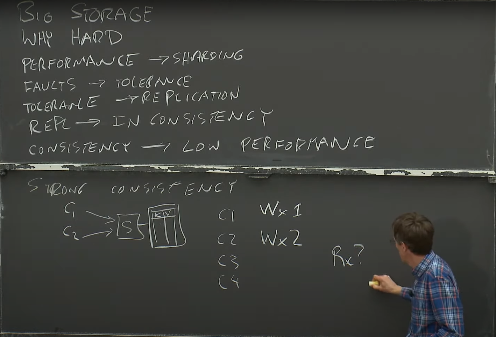
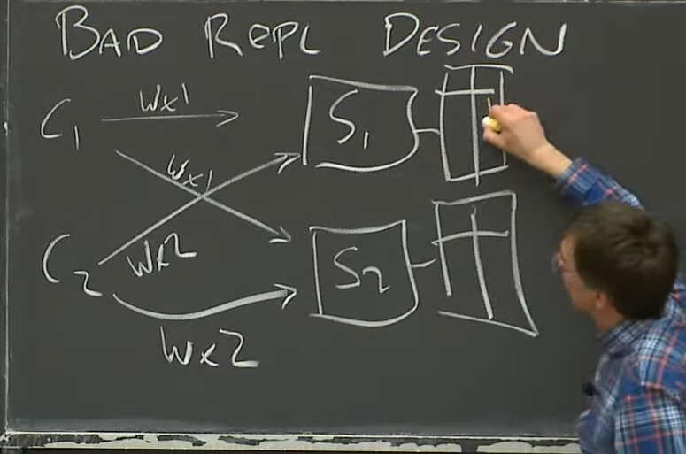

#  Lecture 3: GFS

- [Lecture 3: GFS](https://www.youtube.com/watch?v=EpIgvowZr00&list=PLrw6a1wE39_tb2fErI4-WkMbsvGQk9_UB&index=3)

## Table of Contents

- [Large-scale storage system](#large-scale-storage-system)
- [Bad Replication Design (This is *not* what GFS does)](#bad-replication-design-this-is-not-what-gfs-does)
- [GFS Design](#gfs-design)

## Large-scale storage system

- Learn to how to design good interface of big storage system.
- Why is it hard?
  - Engineers aim to build systems with high `performance`, often achieved by distributing workloads across thousands of servers (`sharding`).
  - `Sharding` introduces the need to manage failures, as any single server could fail (`fault tolerance`).
  - `Fault tolerance` requires `replication`, ensuring that copies of data are available so the system can remain functional even if some servers go down.
  - `Replication` brings challenges in maintaining `consistency`, as data across multiple copies must remain synchronized accurately.
  - Maintaining `consistency` often impacts `performance`, as servers need to communicate ("chitchat") and perform checks with each other.
- This cycle appears repeatedly in many systems we analyze.
- If you prioritize strong consistency, you'll likely pay the price in performance. Conversely, optimizing for performance may lead to occasional anomalous behavior due to weaker consistency guarantees.

> "The consistency behavior of applications or clients looks just like a single server, even though the data is distributed across many servers."

## Bad Replication Design (This is *not* what GFS does)

-  Client sends update to each replica chunk server.
-  Each chunk server applies the update to its copy.

## GFS Design

- Context: Many Google services needed a big fast unified storage system: Mapreduce, crawler, indexer, log storage/analysis... This Storage will share data across many services with huge capacity and high throughput (performance), and it should be fault-tolerant.
- How it works:
  - **Master** (two main tables):
    - Mapping filename to an array of chunk IDs, chunk handles.
    - Mapping each chunk ID (or handle) to a list of chunkserver, current version, which chunl server is primary, lease expiration time.
    - Another table is log and checkpoint.
- Read action:
  - Input: name and offset to the Master.
  - Master returns the chunk handle and the list of chunkserver (also cache the result).
  - Client talks to one of the chunkserver to read the data.
  - Clients only ask Master where to find a file's chunks, clients cache name -> chunkhandle info, Master does not handle data, so (hopefully) not heavily loaded.
- Write action:
  - No primary case:
    - Master must find out the most up-to-date copy of the chunk.
    - Master picks a primary (and the lease expiration of this primary) then increments the version number of the chunk(?).
    - Primary picks offset of all the replicas and sends the data to them, told them to write the data to offset.
    - If all replicas sayin' "I'm done", the primary tells client "I'm done".
    - Else, the primary it will tell client "I'm not done". In this case, client will retry whole process.
- What is a lease?
  - Permission to act as primary for a given time (60 seconds). Primary promises to stop acting as primary before lease expires. Master promises not to change primaries until after expiration. Separate lease per actively written chunk.
- What if the Master designates a new primary while old one is active?
    - Two active primaries! C1 writes to P1, C2 reads from P2, doesn't seen C1's write! called "split brain" -- a disaster.
    - Leases help prevent split brain: Master won't designate new primary until the current one is guaranteed to have stopped acting as primary.
