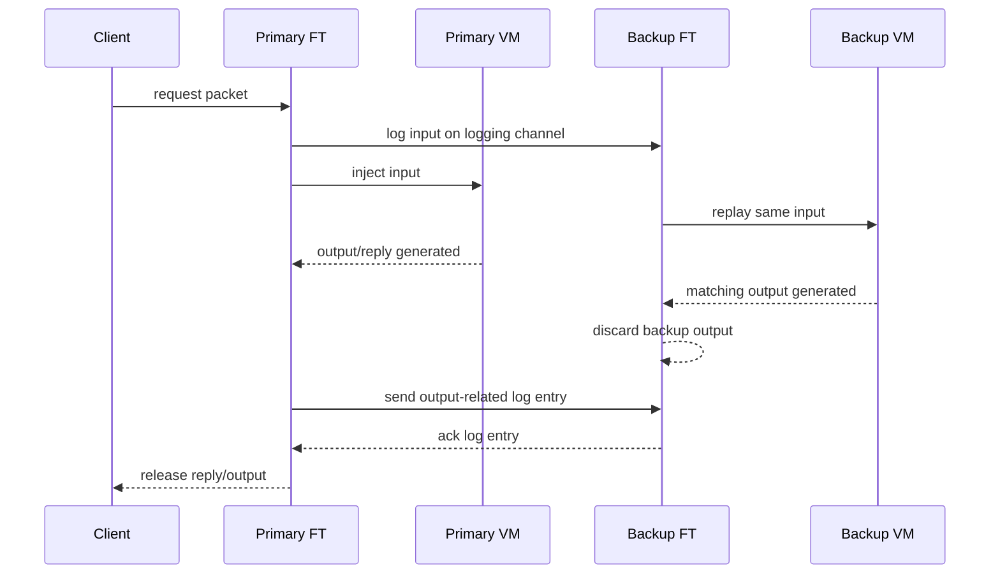
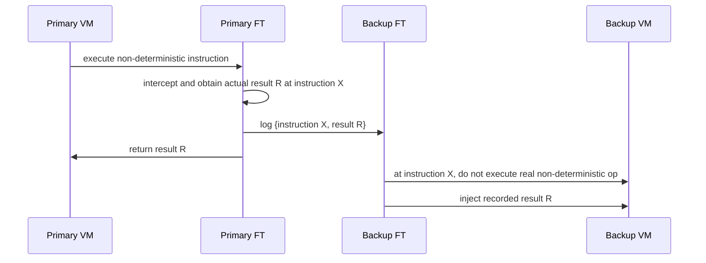
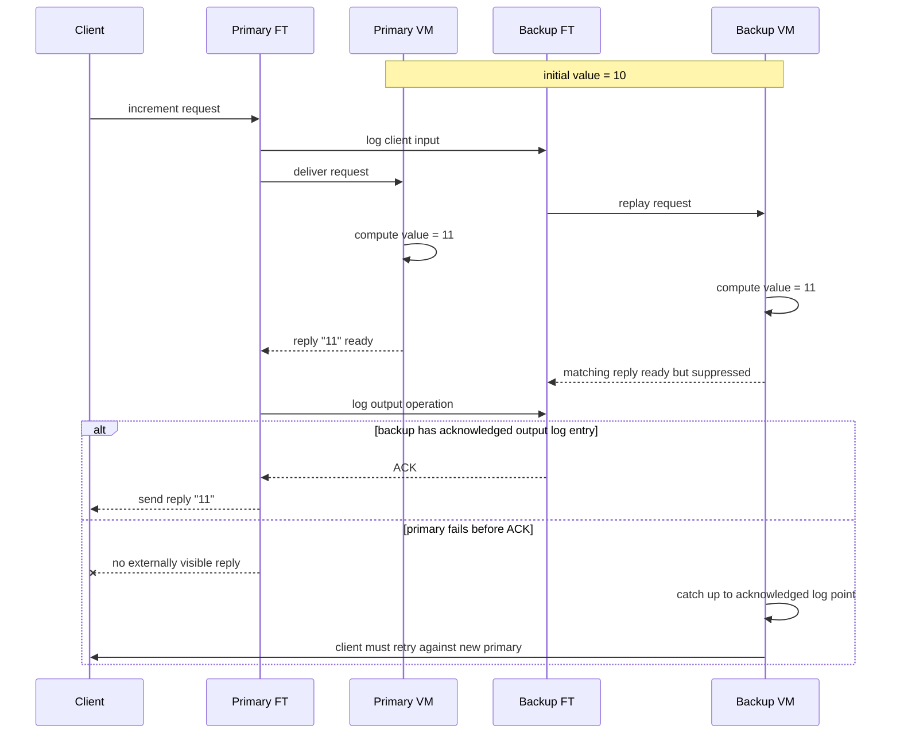
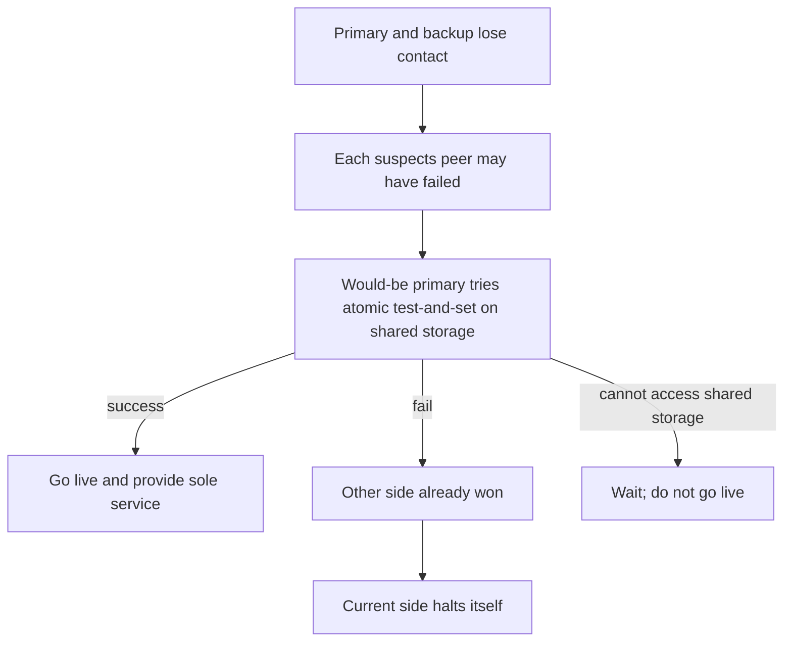

# Lecture 4: Primary-Backup Replication

- [Lecture 4: Primary-Backup Replication](https://youtu.be/M_teob23ZzY?si=rX555iz7XuYAghSy&t=4593)

## Table of Contents

- [Failure model](#failure-model)
- [Two broad replication strategies](#two-broad-replication-strategies)
    - [State Transfer](#state-transfer)
    - [Replicated State Machines](#replicated-state-machines)
        - [VMware FT basic design](#vmware-ft-basic-design)
        - [Handling non-determinism](#handling-non-determinism)
        - [The Output Requirement and the Output Rule](#the-output-requirement-and-the-output-rule)
        - [Network partitions and split brain](#network-partitions-and-split-brain)
        - [Other questions](#other-questions)
- [Main Takeaways](#main-takeaways)

> MIT 6.824 Spring 2020 uses VMware Fault Tolerance as the main case study for understanding primary-backup replication. The lecture is fundamentally about how replication can preserve service despite machine crashes, and why the hard part is not just keeping a backup around, but keeping the backup in a state that is safe to take over at any time. 

## Failure model

The lecture mainly assumes **fail-stop / crash failures**. A machine may stop, but it is not assumed to behave maliciously or arbitrarily. This means replication in this setting is designed to tolerate node crashes, not Byzantine behavior, and not correlated software bugs or operator mistakes in general.

## Two broad replication strategies

### State Transfer

In **state transfer**, the primary executes requests and sends the backup enough state to take over later. Conceptually this may mean shipping a full copy of memory or incremental checkpoints. This approach is simple to explain, but it can be expensive because state is often much larger than the operations that caused it to change.

`Remus` is a classic whole-VM example in this family.

### Replicated State Machines

> If replicas start in the same state, receive the same operations in the same order, and execute deterministically, they reach the same end state.

In a **replicated state machine**, replicas start in the same initial state and process the same inputs in the same order. If execution is deterministic, they end up in the same state and produce the same outputs. Instead of shipping the whole state, the system ships the input stream and enough information to resolve non-determinism.

`VMware FT` follows this approach at the level of virtual machine execution.

#### VMware FT basic design

VMware FT runs a **primary VM** on one host and a **backup VM** on another host. The backup executes the same VM instructions as the primary, with a small lag, using a stream of log entries sent over a **logging channel**. Inputs such as network packets and disk reads, as well as non-deterministic events and instruction results, are captured by the hypervisor on the primary and replayed on the backup. The two VMs therefore remain in virtual lock-step.

The backup is not externally visible. Both VMs may execute code that would generate output, but the backup’s outputs are suppressed by the hypervisor. Only the primary is allowed to produce real external effects.

#### Handling non-determinism

***The central difficulty is that a VM is not naturally deterministic.*** Incoming packets, disk completions, interrupts, and instructions such as reading the processor’s cycle counter can change execution. VMware FT solves this by having the hypervisor capture both the relevant event/result and the point in the instruction stream where it occurred, then replaying it at the same point on the backup.

**The backup does not “guess”; it reuses the primary’s observed non-deterministic outcomes.**

#### The Output Requirement and the Output Rule

The most important safety idea in the lecture is VMware FT’s **Output Requirement**: if the backup ever takes over, it must continue execution in a way that is fully consistent with every output the primary has already sent to the outside world.

That requirement leads to the **Output Rule**:
> The primary VM may not send an output to the external world until the backup VM has received and **acknowledged** the log entry associated with the operation producing that output.

An important nuance is that the Output Rule delays **external visibility**, not necessarily VM execution itself. The VM can often continue running while the output is buffered. Also, exactly-once external effects are not fully guaranteed at the failover boundary; the paper notes that duplicate packets may still arise, and TCP/network/application mechanisms are expected to tolerate lost or duplicate packets.

#### Network partitions and split brain

> **Q: Does FT cope with network partition -- could it suffer from split brain? E.g. if primary and backup both think the other is down. Will they both go live?**
> 
> A: The shared disk server breaks the tie. Disk server supports atomic test-and-set. 
> If primary or backup thinks other is dead, attempts test-and-set.
   If only one is alive, it will win test-and-set and go live.
   If both try, one will lose, and halt.

A timeout alone is not enough to decide which replica should become active. If the primary and backup lose contact because of a network partition, both could incorrectly conclude that the other has failed. VMware FT avoids this split-brain problem by using an atomic test-and-set on shared storage. A VM that wants to go live must first win that atomic operation. If it loses, it halts itself

#### Other questions

> Q: What happens if during the recovery process the backup crashes?

A:  There is no primary and no backup to take over. The system will be down until a new VM has been started by the clustering service.

> When might FT be attractive?

A: Critical but low-intensity services, e.g. name server. Services whose software is not convenient to modify.

> What about replication for high-throughput services?

A: People use application-level replicated state machines for e.g. databases. The state is just the DB, not all of memory+disk. The events are DB commands (put or get), not packets and interrupts.

## Main Takeaways

* **Primary-backup replication is not just “running a backup server.”** The hard parts are:
    * Choosing the right replication boundary.
    * Controlling non-determinism.
    * Ensuring that externally visible outputs are recoverable by the backup.
    * Avoiding split brain during failures or network partitions.
* **The replication design must match the failure model.** Primary-backup replication mainly handles crash/fail-stop failures, not arbitrary bugs, operator mistakes, correlated software bugs, or Byzantine behavior.
* **External output is the real safety boundary.** Once a reply, disk write, or network packet becomes visible to the outside world, the backup must already have enough information to continue a history that is consistent with that output.
* **A timeout only means “suspected failure,” not confirmed death.** Primary-backup replication is only safe under partitions if there is a tie-breaker or authority mechanism, such as shared storage, a view service, quorum, Raft, or Paxos.
* **Fault tolerance is not free.** Stronger replication usually adds latency, coordination cost, logging overhead, failover complexity, and operational burden.