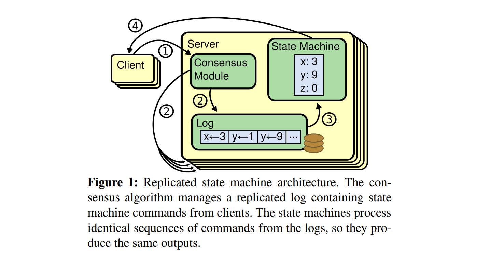
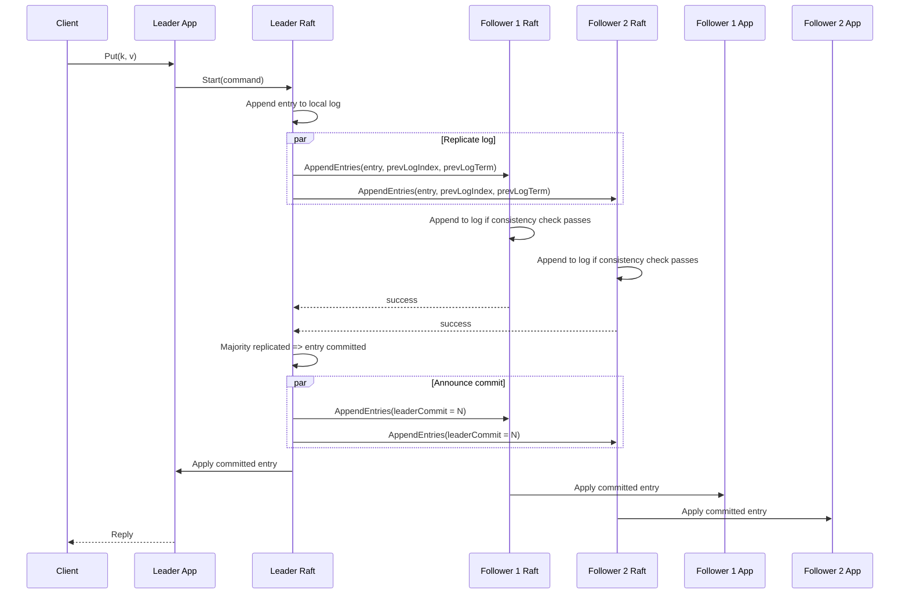
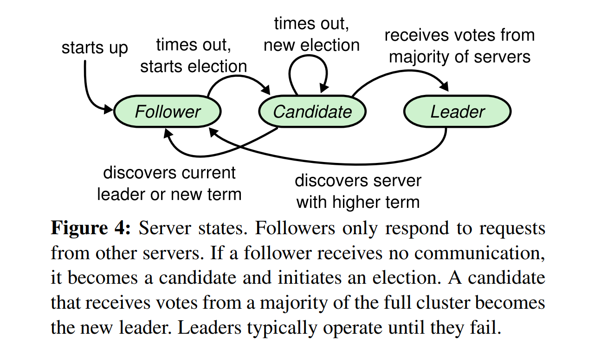
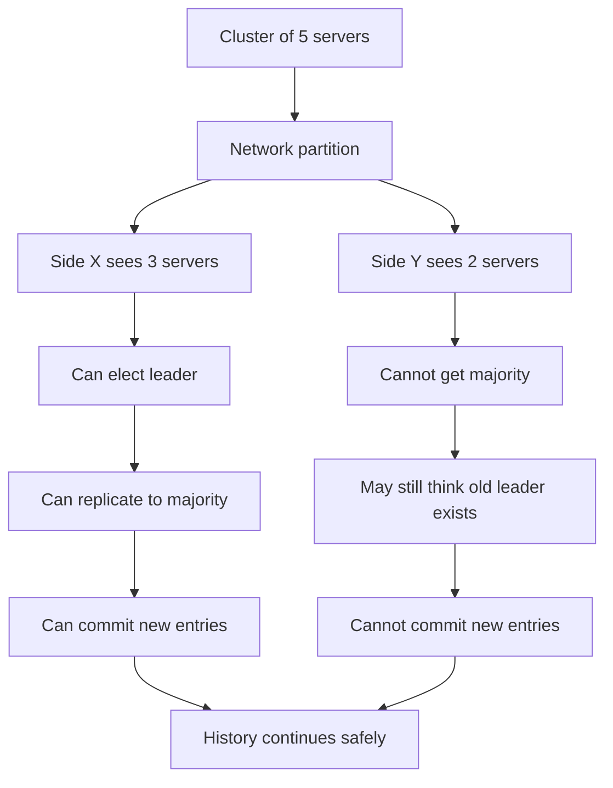

# Lecture 5: Raft

- [Lecture 5: Raft](https://www.youtube.com/watch?v=64Zp3tzNbpE)
- Reference Paper in this lecture: [raft-extened.pdf](papers/raft-extended.pdf)

## What is Raft?

**Raft is a consensus algorithm for managing a replicated log**. It is used to build replicated state machines (see Lecture 4: Primary-Backup Replication): each replica executes the same commands in the same order, so the replicas produce the same state and the same externally visible results. Raft uses a strong leader model: log entries flow from the leader to the followers, which simplifies log management and reasoning about correctness.

## Why split brain is hard

The core difficulty is that a server cannot reliably distinguish "the other server crashed" from "the network is partitioned or delayed".

From one server's point of view, both situations look the same: requests stop getting replies. If replicas are allowed to act independently under this uncertainty, they may both accept writes and create diverging histories, which is split brain. Raft solves this with majorities:

> A leader must win votes from a majority of the **full cluster**, not just from the servers that appear to be alive.

his matters because any two majorities overlap in at least one server. That overlap is what carries committed history forward and prevents two independent leaders from safely committing conflicting histories. To tolerate up to **f** crash failures while still making progress, systems usually use at least **2f + 1 servers**, so that a majority is still available after f failures. 

## Replicated state machine structure

* (1) A client sends a command to the leader's application layer
* (2) The application calls Raft to start agreement on the command
* (3) The leader appends the command to its local log and sends AppendEntries RPCs to followers
* (4) Followers append the entry if the preceding log position matches (prevLogIndex, prevLogTerm)
* (5) Once the leader knows that an entry from its current term is stored on a majority of servers, the entry is committed. The leader then informs followers of the new commit index, and each server applies committed log entries to its state machine in log order.
* (6) Only after the command is committed and applied does the leader reply to the client. 

In the 6.824 model, each replica contains two layers: the application/state machine (for example, a key-value store) and the Raft layer. The application receives client requests and asks Raft to place them into the replicated log. Raft replicates the log entries to other replicas and later tells the application when an entry has been committed and can be applied. This is the basic structure used in the course labs: first implement Raft, then build a key/value service on top of it.

> Why the log matters?

* The log is not just a record of past operations. Its main job is to **define a single execution order for commands**. That order allows all replicas to apply the same commands in the same sequence, which keeps their states identical.
* The log also **stores tentative commands before they are committed**, allows the leader to resend entries to lagging followers, and serves as the durable history used for recovery after crashes.

## Leader election

Raft divides time into `terms`. A term may have at most one leader, though it may temporarily have no leader. Followers wait for heartbeats from the current leader.

If a follower does not receive communication for an election timeout, it becomes a candidate, increments its term, votes for itself, and sends RequestVote RPCs to other servers. If it receives votes from a majority, it becomes the leader and starts sending empty AppendEntries heartbeats to maintain authority. If it sees a higher term or receives valid AppendEntries from another leader, it reverts to follower state.

> What happens if two candidates start an election at the same time? They may split the votes!

Randomized election timeouts are used to reduce split votes. If every server timed out at the same instant, many servers could become candidates together, each voting for itself, and no one would win. Randomization breaks this symmetry. Timeout tuning is a liveness trade-off: **too short causes unnecessary elections; too long causes slow failover**.

### Voting is not just first-come first-served

A server does not simply vote for the first candidate it hears from; It grants its vote only if it has not already voted in that term (or has voted for the same candidate) and the candidate's log is at least as **up-to-date** as its own.

Raft defines "up-to-date" by comparing the last log term first; if those are equal, it compares the last log index. This election restriction is essential for ensuring that a newly elected leader contains all previously committed entries.

### What happens to the old leader

An old leader may still believe it is the leader after a partition or delay. This is safe. If it is in a minority partition, it cannot gather a majority of successful replication responses, so it cannot commit new log entries.

f it can reach a majority, that majority must overlap with the majority that elected any newer leader, and the overlapping servers will reveal the higher term, forcing the old leader to step down. So an outdated leader may temporarily exist, but it cannot safely extend committed history.

## Main takeaways

* The hardest parts are not "sending messages" or "electing someone quickly"; the hard parts are preventing split brain, ensuring that committed history survives leader changes, and making sure that replicas apply only stable log entries.