# mTLS

> How we authenticate and authorize IoT devices connecting to an MQTT broker with over 4M devices, multi-vendor support, and secure communication?

## mTLS Authentication for IoT MQTT System

| Note that this document focuses on the **mTLS authentication** process between an IoT device (MQTT client) and an MQTT broker (server). It does NOT cover general TLS concepts or MQTT protocol details. On production, we may using HSM/TPM for secure key storage, cert revocation (OCSP/CRL), and advanced security measures. This just serves as a practical guide for understanding and implementing mTLS in an IoT context.

* * *

## Table of Contents

1.  [Introduction](#1-introduction)
2.  [Cryptography Fundamentals](#2-cryptography-fundamentals)
3.  [Certificate Signing Request (CSR) Explained](#3-certificate-signing-request-csr-explained)
4.  [mTLS Handshake Flow](#4-mtls-handshake-flow)
5.  [Certificate Verification Deep Dive](#5-certificate-verification-deep-dive)
6.  [Client Configuration](#6-client-configuration)
7.  [Deployment Workflow](#7-deployment-workflow)

* * *

## 1\. Introduction

### What is mTLS?

**Mutual TLS (mTLS)** is a two-way authentication protocol where both parties prove their identity to each other:

*   **Server** proves its identity to the **client** (IoT device)
*   **Client** proves its identity to the **server** (MQTT broker)

Think of it like showing your ID at a secure building **AND** the security guard showing you their badge - both parties verify each other.

### System Overview


**Key Components:**

*   **IoT Device**: Internet of Things device acting as MQTT client
*   **MQTT Broker**: Message broker at `broker.example.com:8883`
*   **Transport**: TLS 1.2/1.3 with client certificate authentication
*   **Protocol**: MQTT over TLS

* * *

## 2\. Cryptography Fundamentals

### 2.1 Public Key Cryptography Basics

```
┌─────────────────────────────────────────────────────────┐
│  Key Pair (Mathematically Linked)                      │
├─────────────────────────────────────────────────────────┤
│  Private Key              Public Key                    │
│  🔐 Secret                📜 Distributed                │
│  Signs/Decrypts           Verifies/Encrypts             │
└─────────────────────────────────────────────────────────┘
```

**Core Properties:**

1.  Data encrypted with **public key** can only be decrypted with **private key**
2.  Data signed with **private key** can only be verified with **public key**
3.  Private key **cannot be derived** from public key (mathematically infeasible)

**Real-World Analogy:**

```
Private Key = Your signature (only you can write it)
Public Key  = Sample of your signature (anyone can compare against it)
Certificate = Official document with your signature sample (notarized)
```

### 2.2 Key Terminology

| Term | Definition | Example in This System |
| --- | --- | --- |
| **Private Key** | Secret key that proves ownership | `client.key` |
| **Public Key** | Shareable key for verification | Embedded inside `client.crt` |
| **Certificate** | Identity document containing public key + metadata | `client.crt` |
| **CSR** | Certificate Signing Request (application for a cert) | `client.csr` |
| **CA** | Certificate Authority (trusted issuer) | Internal CA (`ca.crt`) |
| **Signature** | Encrypted hash proving authenticity | Embedded in certificates |

* * *

## 3\. Certificate Signing Request (CSR) Explained

### 3.1 What is a CSR?

A **CSR** is an **application form** for a certificate. It contains:

*   Your public key
*   Your identity information (Country, Organization, Device MAC, etc.)
*   Your signature (to prove you own the corresponding private key)

**Important:** CSR is NOT the certificate yet - it's the request to get one.

### 3.2 Real-Life Analogy

| Real Life | Digital Certificates |
| --- | --- |
| You fill out application form | Generate CSR |
| Form includes: photo, name, address | CSR includes: public key, MAC address, manufacturer |
| You submit form to DMV | Send CSR to CA |
| DMV verifies and signs it | CA signs CSR → creates certificate |
| You get driver's license | You get `.crt` file |

### 3.3 CSR Contents Example

```
Certificate Request:
    Data:
        Subject: C=US, O=Example-Org, OU=IoT-Device, CN=device-12345678
        Subject Public Key Info:
            Public Key Algorithm: id-ecPublicKey
            Public-Key: (256 bit)
            pub: 04:a1:b2:c3:...
    Signature Algorithm: ecdsa-with-SHA256
```

The CA will review this "application" and if approved, sign it to create the certificate.


* * *

## 4\. mTLS Handshake Flow

### 4.1 High-Level Overview


### 4.2 Detailed Handshake with Verification Steps

```mermaid
sequenceDiagram
    participant IoT as IoT Device
    participant TLS_CLIENT as Client TLS Stack
    participant TLS_SRV as Server TLS Stack
    participant MQTT as MQTT Broker

    Note over IoT: Loaded in memory:<br/>• client.crt + client.key<br/>• ca.crt

    Note over MQTT: Loaded in memory:<br/>• server.crt + server.key<br/>• ca.crt (trusted CA)

    rect rgb(230, 240, 255)
        Note over IoT,MQTT: Phase 1: TLS Handshake Start
        IoT->>TLS_SRV: ClientHello (TLS 1.2/1.3)
        TLS_SRV->>IoT: ServerHello + Certificate(server.crt)
    end

    rect rgb(255, 240, 230)
        Note over IoT,MQTT: Phase 2: CLIENT VERIFIES SERVER
        TLS_CLIENT->>TLS_CLIENT: Step 1: Extract server.crt
        TLS_CLIENT->>TLS_CLIENT: Step 2: Extract Issuer DN from server.crt
        TLS_CLIENT->>TLS_CLIENT: Step 3: Find matching CA (ca.crt)
        TLS_CLIENT->>TLS_CLIENT: Step 4: Extract CA public key
        TLS_CLIENT->>TLS_CLIENT: Step 5: Verify signature on server.crt<br/>using CA public key
        TLS_CLIENT->>TLS_CLIENT: Step 6: Verify CN/SAN = broker.example.com
        TLS_CLIENT->>TLS_CLIENT: Step 7: Check validity dates
        
        alt Server cert invalid
            TLS_CLIENT--xIoT: ❌ Abort: "certificate verify failed"
        else Server cert valid
            Note over TLS_CLIENT: ✅ Server authenticated
        end
    end

    rect rgb(240, 255, 240)
        Note over IoT,MQTT: Phase 3: SERVER REQUESTS CLIENT CERT
        TLS_SRV->>IoT: CertificateRequest (mTLS enabled)
        IoT->>TLS_SRV: Certificate(client.crt)
        IoT->>TLS_SRV: CertificateVerify(signed with client.key)
    end

    rect rgb(255, 255, 230)
        Note over IoT,MQTT: Phase 4: SERVER VERIFIES CLIENT
        TLS_SRV->>TLS_SRV: Step 1: Extract client.crt
        TLS_SRV->>TLS_SRV: Step 2: Extract Issuer DN from client cert
        TLS_SRV->>TLS_SRV: Step 3: Find matching CA (ca.crt)
        TLS_SRV->>TLS_SRV: Step 4: Extract CA public key
        TLS_SRV->>TLS_SRV: Step 5: Verify signature on client.crt<br/>using CA public key
        TLS_SRV->>TLS_SRV: Step 6: Parse Subject:<br/>C=US, O=Example-Org, OU=IoT-Device, CN=device-12345678
        TLS_SRV->>TLS_SRV: Step 7: Check validity dates
        TLS_SRV->>TLS_SRV: Step 8: Verify CertificateVerify signature<br/>using public key from client.crt
        
        alt Client cert invalid OR signature wrong
            TLS_SRV--xMQTT: ❌ Reject connection
        else Client cert valid
            Note over TLS_SRV: ✅ Client authenticated<br/>Identity = device-12345678
        end
    end

    rect rgb(240, 255, 240)
        Note over IoT,MQTT: Phase 5: Session Established
        TLS_SRV->>IoT: Finished (encrypted with session keys)
        IoT->>TLS_SRV: Finished (encrypted)
        
        Note over IoT,MQTT: ✅ mTLS complete<br/>• Server identity verified<br/>• Client identity verified<br/>• Encrypted channel established
    end

    IoT->>MQTT: MQTT CONNECT
    MQTT->>IoT: CONNACK
    IoT->>MQTT: SUBSCRIBE device/commands
    MQTT->>IoT: SUBACK
```



### 4.3 Two-Level Verification

mTLS performs **two levels** of verification:

| Level | What | Verifies | Purpose |
| --- | --- | --- | --- |
| **Level 1** | Certificate signature | CA authenticity | "Is this cert signed by trusted CA?" |
| **Level 2** | Handshake signature | Key ownership | "Does sender own the private key?" |

**Why both levels?**

```
Certificate alone = ID card (can be copied/stolen)
Private key = Your actual signature (proves it's really you)
```

* * *

## 5\. Certificate Verification Deep Dive

### 5.1 Client Side: Verify Server Certificate

When the IoT client receives `server.crt` from the broker:

```sh
# What client does automatically
openssl verify -CAfile /etc/certs/ca.crt server.crt
```

**Verification Steps:**

| Step | Action | Files Used |
| --- | --- | --- |
| 1   | Receive `server.crt` from broker | \-  |
| 2   | Extract Issuer field | `server.crt` |
| 3   | Load trusted CA certificate | `ca.crt` |
| 4   | Extract CA public key | `ca.crt` |
| 5   | **Verify signature** on `server.crt` | CA public key + `server.crt` |
| 6   | Check CN = `broker.example.com` | `server.crt` |
| 7   | Check validity dates (not expired) | `server.crt` |

**Result:** ✅ Server authenticated - connection proceeds

* * *

### 5.2 Broker Side: Verify Client Certificate

When the broker receives `client.crt` from the IoT device:

```sh
# What broker does automatically
openssl verify -CAfile ca.crt client.crt
```

**Verification Steps:**

| Step | Action | Files Used |
| --- | --- | --- |
| 1   | Receive `client.crt` from client | \-  |
| 2   | Extract Issuer field | `client.crt` |
| 3   | Load trusted CA certificate | `ca.crt` |
| 4   | Extract CA public key | `ca.crt` |
| 5   | **Verify signature** on `client.crt` | CA public key + `client.crt` |
| 6   | Extract Subject (device identifier) | `client.crt` |
| 7   | Check validity dates | `client.crt` |
| 8   | Receive CertificateVerify message | Signed with `client.key` |
| 9   | Extract public key from cert | `client.crt` |
| 10  | **Verify CertificateVerify signature** | Client public key + signature |

**Result:** ✅ Client authenticated + owns private key

### 5.3 Key Ownership Proof Sequence

```mermaid
sequenceDiagram
    participant IoT as IoT Device
    participant Broker

    Note over IoT,Broker: Phase 1: Server proves it owns server.key
    
    Broker->>IoT: Here's my server.crt
    Note over Broker: Broker signs handshake data<br/>using server.key
    Broker->>IoT: ServerKeyExchange (signed with server.key)
    
    Note over IoT: Client verifies signature using<br/>public key extracted from server.crt
    
    alt Signature valid
        Note over IoT: ✅ Broker owns server.key
    else Signature invalid
        Note over IoT: ❌ Reject: MITM attack detected
    end

    Note over IoT,Broker: Phase 2: Client proves it owns client.key
    
    IoT->>Broker: Here's my client.crt
    Note over IoT: Client signs handshake transcript<br/>using client.key
    IoT->>Broker: CertificateVerify (signed with client.key)
    
    Note over Broker: Broker verifies signature using<br/>public key from client.crt
    
    alt Signature valid
        Note over Broker: ✅ Client owns client.key
    else Signature invalid
        Note over Broker: ❌ Reject: Stolen cert attack
    end

    Note over IoT,Broker: Phase 3: Key Exchange (ECDHE)
    
    IoT->>IoT: Generate ephemeral key pair
    Broker->>Broker: Generate ephemeral key pair
    
    Note over IoT: Sign ephemeral public key<br/>with client.key
    Note over Broker: Sign ephemeral public key<br/>with server.key
    
    IoT->>Broker: ClientKeyExchange (signed)
    Broker->>IoT: ServerKeyExchange (signed)
    
    Note over IoT,Broker: Both derive same session key<br/>using ECDH math
    
    Note over IoT,Broker: 🔐 All application data encrypted<br/>with session key (AES-GCM)
```



### 5.4 File Roles and Distribution

```mermaid
graph TB
    subgraph "CA Layer (Trust Anchor)"
        CA_KEY[ca.key<br/>🔐 PRIVATE - Signs Certs]
        CA_CERT[ca.crt<br/>📜 PUBLIC - Verify Sigs]
    end

    subgraph "IoT Device (Client)"
        CLIENT_KEY[client.key<br/>🔐 PRIVATE - Proves Identity]
        CLIENT_CERT[client.crt<br/>📜 PUBLIC - Device Identity]
        CA_CERT_CLIENT[ca.crt<br/>📜 Copy - Verify Server]
    end

    subgraph "MQTT Broker (Server)"
        SRV_KEY[server.key<br/>🔐 PRIVATE - Proves Identity]
        SRV_CERT[server.crt<br/>📜 PUBLIC - Server Identity]
        CA_CERT_SRV[ca.crt<br/>📜 Copy - Verify Clients]
    end

    CA_KEY -->|Signs| CLIENT_CERT
    CA_KEY -->|Signs| SRV_CERT
    
    CA_CERT -.->|Copied to| CA_CERT_CLIENT
    CA_CERT -.->|Copied to| CA_CERT_SRV

    CLIENT_CERT -->|Paired with| CLIENT_KEY
    SRV_CERT -->|Paired with| SRV_KEY

    CA_CERT_CLIENT -->|Verifies| SRV_CERT
    CA_CERT_SRV -->|Verifies| CLIENT_CERT

    CLIENT_KEY -->|Signs TLS msgs| CLIENT_CERT
    SRV_KEY -->|Signs TLS msgs| SRV_CERT

    classDef private fill:#f99,stroke:#600,stroke-width:3px
    classDef public fill:#9f9,stroke:#060,stroke-width:2px
    classDef ca fill:#99f,stroke:#006,stroke-width:3px

    class CA_KEY,CLIENT_KEY,SRV_KEY private
    class CA_CERT,CLIENT_CERT,SRV_CERT,CA_CERT_CLIENT,CA_CERT_SRV public
    class CA_KEY,CA_CERT ca
```



* * *

## 6\. Client Configuration

### 6.1 Required Files

MQTT client requires these certificate files at runtime:

```
/etc/certs/client.crt     ← Client certificate
/etc/certs/client.key     ← Client private key
/etc/certs/ca.crt         ← CA certificate (to verify server)
```

**Setting file permissions:**

```sh
chmod 644 /etc/certs/client.crt /etc/certs/ca.crt
chmod 600 /etc/certs/client.key
```

### 6.2 Configuration Parameters

**Example MQTT Client Configuration:**

```
broker_address: broker.example.com
broker_port: 8883
protocol_version: 5.0
transport: TLS
ca_cert: /etc/certs/ca.crt
client_cert: /etc/certs/client.crt
client_key: /etc/certs/client.key
keep_alive: 60
connect_retry_time: 5
connect_retry_max_interval: 60
command_topic: device/commands
response_topic: device/responses
```

### 6.3 Parameter Explanations

| Parameter | Description |
| --- | --- |
| `broker_address` | Hostname of MQTT broker. Don't use IP to avoid CN mismatch. |
| `broker_port` | Port of MQTT broker (`8883` for TLS). |
| `protocol_version` | MQTT protocol version (e.g., `5.0`). |
| `transport` | `TLS` for encrypted connection with mTLS authentication. |
| `ca_cert` | Path to CA certificate for verifying server. |
| `client_cert` | Path to client certificate for authentication. |
| `client_key` | Path to client private key. |
| `keep_alive` | Keep-alive interval in seconds. |
| `command_topic` | MQTT topic where device subscribes for commands. |
| `response_topic` | MQTT topic where device publishes responses. |

* * *

## 7\. Deployment Workflow

### 7.1 Manufacturing Process


### 7.2 Certificate Generation Process

```sh
# Generate device certificates
./generate-certs.sh --device-id <unique-identifier>
```

**Required inputs:**

1.  **Device Identifier**: Unique device ID (e.g., serial number, UUID)
2.  **Organization**: Your organization name
3.  **Device Type**: Type/model of IoT device

**Script output:**

```
output/
├── client.crt        (unique per device)
├── client.key        (unique per device)
├── ca.crt            (same for all devices)
└── server.crt        (for MQTT broker)
```

### 7.3 Certificate Provisioning Flow

```mermaid
sequenceDiagram
    participant CA as CA (Offline)
    participant Broker as MQTT Broker
    participant IoT as IoT Device

    Note over CA: ONE-TIME SETUP (Before deployment)
    
    CA->>CA: Generate server.key (server private key)
    CA->>CA: Generate server CSR (contains server public key)
    CA->>CA: Sign server CSR with ca.key
    CA->>Broker: Deploy server.crt + server.key
    
    CA->>CA: Generate client.key (device private key)
    CA->>CA: Generate client CSR (contains device public key)
    CA->>CA: Sign CSR with ca.key
    CA->>IoT: Provision client.crt + client.key to device

    Note over CA,IoT: Deploy ca.crt to BOTH sides

    rect rgb(255, 240, 230)
        Note over Broker,IoT: RUNTIME: mTLS Handshake
        
        IoT->>Broker: ClientHello
        Broker->>IoT: ServerHello + server.crt
        
        Note over IoT: Extract public key from server.crt
        Broker->>IoT: ServerKeyExchange (signed with server.key)
        Note over IoT: Verify signature with server's public key
        Note over IoT: ✅ Broker owns server.key
        
        IoT->>Broker: Certificate (client.crt)
        IoT->>Broker: CertificateVerify (signed with client.key)
        
        Note over Broker: Extract public key from client.crt
        Note over Broker: Verify CertificateVerify signature
        Note over Broker: ✅ Client owns client.key
    end
    
    Note over Broker,IoT: 🔐 mTLS Established
```



* * *

### 8.1 Verification Checklist

Before deploying, verify:

- [ ] CA certificate present at `/etc/certs/ca.crt`
- [ ] Client cert present at `/etc/certs/client.crt`
- [ ] Client key present at `/etc/certs/client.key`
- [ ] File permissions correct (600 for keys, 644 for certs)
- [ ] Certificate CN matches device identifier
- [ ] Certificate not expired (check `notAfter` date)
- [ ] Server hostname resolves correctly
- [ ] Port 8883 reachable (check firewall rules)
- [ ] MQTT client configuration points to correct files
- [ ] Topics configured correctly
- [ ] System time reasonably correct (for cert validation)

### 8.2 Useful Commands Reference

```sh
# View certificate details
openssl x509 -in cert.crt -noout -text

# Check certificate dates only
openssl x509 -in cert.crt -noout -dates

# Check certificate subject/CN
openssl x509 -in cert.crt -noout -subject

# Verify certificate chain
openssl verify -CAfile ca.crt client.crt

# Test TLS connection
openssl s_client -connect host:8883 -CAfile ca.crt

# Test mTLS connection
openssl s_client -connect host:8883 \
  -cert client.crt -key client.key -CAfile ca.crt

# Check private key
openssl ec -in key.key -check -noout

# Extract public key from certificate
openssl x509 -in cert.crt -noout -pubkey

# Compare certificate and key (should match)
openssl x509 -in cert.crt -noout -modulus | md5sum
openssl ec -in key.key -noout -modulus | md5sum

# View certificate chain
openssl s_client -connect host:8883 -showcerts

# Check cipher suites
openssl s_client -connect host:8883 -cipher 'HIGH:!aNULL:!MD5'
```

* * *

## Appendix A: Quick Reference

### File Locations

| File | Location | Purpose | Unique? |
| --- | --- | --- | --- |
| `ca.crt` | `/etc/certs/` | Verify server cert | No (same for all) |
| `client.crt` | `/etc/certs/` | Client certificate | Yes (per device) |
| `client.key` | `/etc/certs/` | Client private key | Yes (per device) |

### Key Commands

```sh
# Generate certificates
./generate-certs.sh --device-id <identifier>

# Set proper permissions
chmod 600 /etc/certs/client.key
chmod 644 /etc/certs/client.crt /etc/certs/ca.crt

# Test connection
openssl s_client -connect broker.example.com:8883 \
  -cert /etc/certs/client.crt \
  -key /etc/certs/client.key \
  -CAfile /etc/certs/ca.crt
```

### Common Errors

| Error | Likely Cause | Quick Fix |
| --- | --- | --- |
| `certificate verify failed` | Wrong/missing CA cert | Check `/etc/certs/ca.crt` |
| `peer did not return certificate` | Missing client cert/key | Verify files in `/etc/certs/` |
| `certificate signature failure` | Wrong CA used | Re-provision with correct CA |
| `unable to get local issuer` | CA cert not in trust store | Copy CA cert to `/etc/certs/` |

* * *

## Appendix B: Acronyms and Glossary

| Term | Full Name | Description |
| --- | --- | --- |
| **mTLS** | Mutual Transport Layer Security | Two-way authentication using certificates |
| **CA** | Certificate Authority | Trusted entity that issues certificates |
| **CSR** | Certificate Signing Request | Application for a certificate |
| **IoT Device** | Internet of Things Device | Connected device with network capabilities |
| **MQTT** | Message Queuing Telemetry Transport | Lightweight pub/sub messaging protocol |
| **CN** | Common Name | Primary identifier in certificate (MAC address here) |
| **DN** | Distinguished Name | Full subject name in certificate |
| **EC** | Elliptic Curve | Type of public key cryptography |
| **ECDSA** | Elliptic Curve Digital Signature Algorithm | Signing algorithm using EC |
| **RSA** | Rivest-Shamir-Adleman | Alternative public key algorithm |
| **TLS** | Transport Layer Security | Encryption protocol for secure communication |
| **PEM** | Privacy-Enhanced Mail | Text-based certificate/key format |
| **DER** | Distinguished Encoding Rules | Binary certificate format |
| **SAN** | Subject Alternative Name | Additional identifiers in certificate |
| **OCSP** | Online Certificate Status Protocol | Real-time certificate revocation check |
| **CRL** | Certificate Revocation List | List of revoked certificates |
| **HSM** | Hardware Security Module | Secure key storage device |
| **TPM** | Trusted Platform Module | Hardware security chip |
| **ACL** | Access Control List | Permissions list for resources |