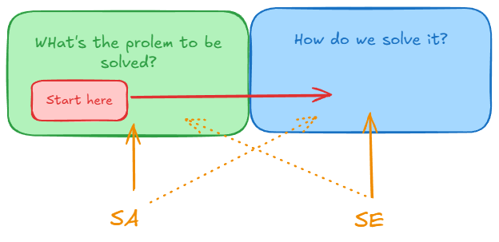

# Some Thoughts

## What is the difference between a Solution Architect (SA) and a Software Engineer (SE)?

**Problem Space vs. Solution Space**

> "Let's build TikTok."

* **Solution Architect (SA): *"What are the requirements?"***

  * The SA works to define **business goals** and determine **how architecture can achieve those goals**.
  * An SA focuses on understanding **features, constraints, and requirements** in order to design an architecture that fits the business objectives.

* **Software Engineer (SE): *"How do we implement video upload?"***

  * The SE focuses on **technical solutions**, **technology selection**, and **implementation details**.
  * Typical concerns include **databases, programming languages, frameworks, and tools**.

---

## Do you need to become an SE before becoming an SA?

* **From SE to SA**

  * Has hands-on engineering experience, can design practical architectures, and understands how systems are implemented.
  * Can support and guide other engineers.
  * However, this path often lacks **soft skills**, such as communication, stakeholder management, and business alignment.

* **From other roles to SA**

  * Strong understanding of **business domains** and the ability to solve problems quickly.
  * However, this path requires gaining substantial **technical depth and hands-on engineering experience**.

---

## Software Architect

### What is Software Architecture?

Software architecture is the **set of structures needed to solve a problem**, and the **relationships between those structures**.
It answers questions such as:

* What components do we use?
* How do they interact with each other?

> **Architecture is design, but not all design is architecture.**

## Awesome Resources

* [Introduction To Microservices - Chris Richardson](https://www.f5.com/company/blog/nginx/introduction-to-microservices)
* [Event sourcing, CQRS, stream processing and Apache Kafka: What's the connection?](https://www.confluent.io/blog/event-sourcing-cqrs-stream-processing-apache-kafka-whats-connection/)