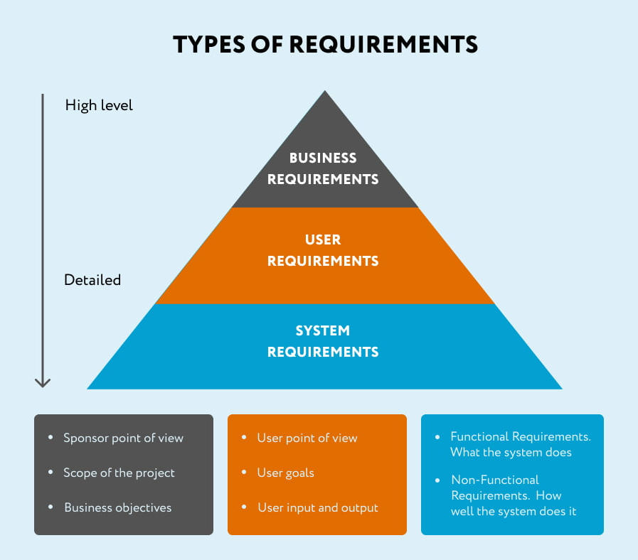

# Type of Requirements

> Without requirements or design, programming is the art of  adding bugs to an empty text file.
> \- Louis Srygley -

## Good vs Bad

### Types

#### VAGUE vs SPECIFIC

*   **Bad Requirement:** "The system should be fast"
*   **Good Requirement:** "The product search API must return results within 200ms for 95% of requests under a load of 10,000 concurrent users"

#### SOLUTION-FOCUSED vs PROBLEM-FOCUSED

*   **Bad Requirement:** "The system must use microservices architecture with Kubernetes"
*   **Good Requirement:** "The system must support independent deployment of the payment module without affecting other features, as we need to update it weekly for compliance changes while the rest of the system updates monthly"

> Describes the actual business need.  
> Explains WHY (compliance, different release cycles).

#### AMBIGUOUS vs MEASURABLE

*   **Bad Requirement:** "The system should be highly available"
*   **Good Requirement:** "The system must maintain 99.9% uptime during business hours (9 AM - 6 PM EST, Monday-Friday), allowing maximum 43 minutes of downtime per month".

#### INCOMPLETE vs COMPLETE

*   **Bad Requirement:** "Users should be able to upload files"
*   **Good Requirement:** "Users must be able to upload PDF, DOCX, and XLSX files up to 50MB each, with a maximum of 10 files per upload session. The system must scan files for malware before acceptance, show upload progress, and allow resuming failed uploads. Files must be retained for 7 years per compliance requirements."

#### UNREALISTIC vs ACHIEVABLE

*   **Bad Requirement:** "The system should be fast"
*   **Good Requirement:** "The product search API must return results within 200ms for 95% of requests under a load of 10,000 concurrent users"

## Types (levels) of requirement

**Business requirements**

*   Outline measurable goals for the business.
*   Define the "Why" behind a software project.
*   Maintain a BRD (Business Requirements Document) with requirements, updates or changes.

**User requirements**

*   Reflect specific user needs or expectation.
*   Define the "Who" of a software project.
*   Highlight how users interact with it.
*   Create a URS(User Requirement Specification) or make them part of the BRD.

**Software requirements**

*   Identify features, functions, non-functional requirements and usecase.
*   Delve into the "How" of a software project.
*   Describe software as functional modules and non-functional attributes.
*   Compose an SRS (Software Requirements Specification).

## Functional Requirement & Non-functional Requirement

*   **Functional requirement** defines a function of a system or it's component, where a function is described as a specification of **behavior between inputs and outputs**.
*   **Functinal requirements are supported by non-functional requirements** (aka. "quality requirements), which impose **constraints on the desgin such as performance requirements, security or reliability**.
*   **SLA**: Service Level Agreement

> "Without a Business Analyst, a system tends to become nothing more than a database exposed to the outside world. Developers are often driven primarily by technical bias."

Functional Requirements (FR)

| **No.** | **Description** |
| --- | --- |
| **FR-1** | User can **upload their photos** (single and multiple at a time) |
| **FR-2** | User can **discover others photos** |
| **FR-3** | User can **follow other users** |
| **FR-4** | System should **notify users** when their following users have new photos uploaded |

Non-Functional Requirements (NFR):

| **No.** | **Description** |
| --- | --- |
| **NFR-1** | The system must be able to handle **5000 reads and 500 writes at a time**. |
| **NFR-2** | The system must be able to **scale up or down** as needed. |
| **NFR-3** | The system should be able to run **backups with zero-downtime**. |
| **NFR-4** | The system must be **compatible with other systems**. |
| **NFR-5** | The system must be **available (99%)**. |