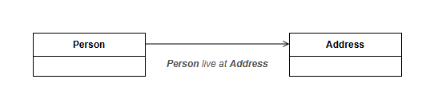
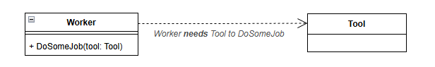
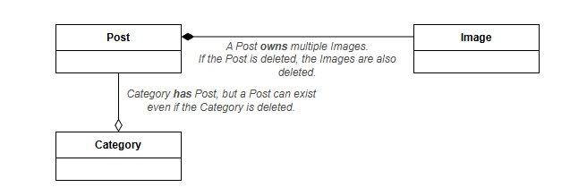
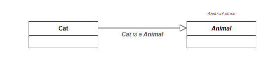
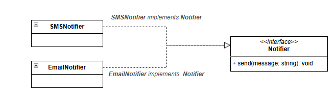
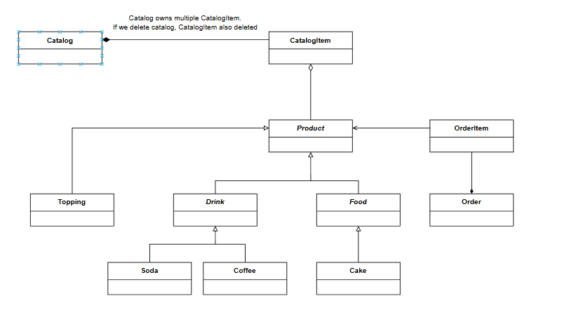
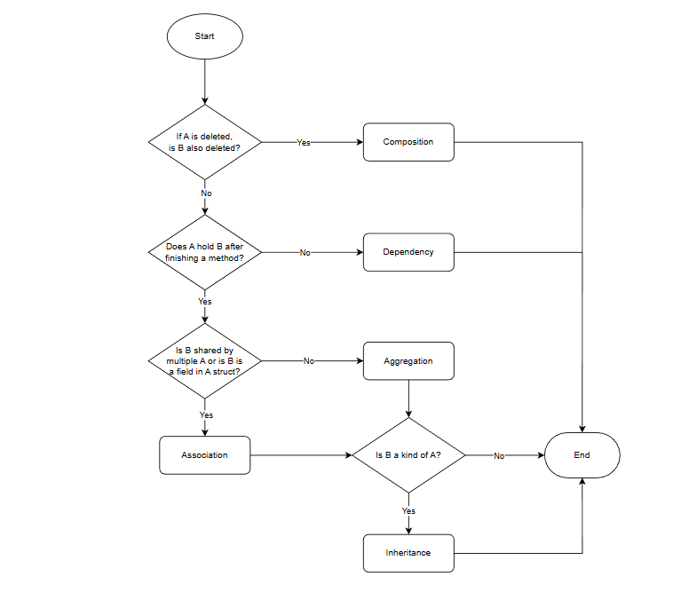

# UML

## Overview

*   The Unified Modeling Language (UML) is a general-purpose, object-oriented, visual modeling language that provides a way to visualize the architecture and design of a system, like a blueprint.


## Table of Contents

- [Overview](#overview)
- [UML Use Case Diagram](#uml-use-case-diagram)
  - [Relationship Types](#relationship-types)
    - [Association](#association)
    - [Include](#include)
    - [Extend](#extend)
    - [Generalization](#generalization)
    - [Example UML Use Case Diagram](#example-uml-use-case-diagram)
- [UML Class Diagram](#uml-class-diagram)
  - [Position of Class Diagram in Solution Architecture](#position-of-class-diagram-in-solution-architecture)
  - [Key Modeling Principles (SA Perspective)](#key-modeling-principles-sa-perspective)
  - [Core Components of a Class Diagram](#core-components-of-a-class-diagram)
    - [Class](#class)
    - [Association](#association-1)
    - [Dependency](#dependency)
    - [Aggregation & Composition](#aggregation--composition)
    - [Generalization (Inheritance)](#generalization-inheritance)
    - [Realization (Implementation)](#realization-implementation)
  - [Key](#key)

## UML Use Case Diagram

* Actors: Represent roles that users or other systems play when interacting with the system. They are depicted as stick figures.
* Use Cases: Represent specific functionalities or services provided by the system. They are depicted as ovals. They are named using verbs or verb phrases.
* System Boundary: A rectangle that defines the scope of the system being modeled. It contains the use cases.
* Relationships: Lines that connect actors to use cases, indicating interactions.

### Relationship Types

#### `Association`

A solid line connecting an actor to a use case, indicating that the actor participates in that use case.

#### `Include`

> "Use case A always requires use case B to be completed."

A dashed arrow pointing from one use case to another, indicating that the first use case includes the behavior of the second use case.


#### `Extend`

> "Use case B happens only in certain conditions of use case A."

A dashed arrow pointing from one use case to another, indicating that the first use case extends the behavior of the second use case under certain conditions.


#### `Generalization`

> "A child use case is a specific variant of a parent use case."

A solid line with a hollow arrowhead pointing from a specialized use case or actor to a more general one, indicating inheritance.

 
#### Example UML Use Case Diagram


## UML Class Diagram
 
A **UML Class Diagram** is a **static structural model** that describes the **concepts of a domain**, their **responsibilities**, and the **relationships between them**. It does **not** describe runtime behavior or business flows; instead, it defines **what exists in the system so that those flows can occur**.

A class diagram is **not**:

* A database schema (ERD)
* A reflection of tables or foreign keys
* A sequence or activity diagram
* A step-by-step business flow

### Position of Class Diagram in Solution Architecture

Class diagrams belong to the **Domain Modeling layer**, positioned between business understanding and implementation:

```
Business Problem
   ↓
Bounded Context / Domain
   ↓
Domain Model  ←── UML Class Diagram
   ↓
Use Cases / Application Flow
   ↓
Infrastructure (DB, API, Messaging)
```

Each class diagram should represent **one domain (or bounded context)**, such as *Catalog*, *Order*, or *Payment*.
**Mixing multiple domains in a single class diagram leads to unclear lifecycle and ownership semantics.**

### Key Modeling Principles (SA Perspective)

* A class represents a **concept with identity, responsibility, and lifecycle**
* Relationships are chosen based on **lifecycle and ownership**.
* **Inheritance** is for classification (*what something is*)
* **Composition** is for lifecycle control (*how long something lives*)
A useful validation question is:

> *If object A is deleted, does object B still exist?*

This question alone determines most relationship types.

### Core Components of a Class Diagram

#### Class

A class represents a domain concept and contains:

* Attributes (state)
* Operations (behavior)
* A clear responsibility within the domain

Classes model **business meaning**, not database tables or APIs.

#### Association



A **structural relationship** indicating that one class **knows or references** another.

* No ownership
* Independent lifecycle
* Long-lived reference

Used when objects are related but do not control each other's existence.

#### Dependency



A **behavioral relationship** where one class **temporarily uses** another.

* Short-lived
* Typically appears as method parameters or local variables
* No retained reference

Dependency expresses **usage**, not structure.

#### Aggregation & Composition



##### Aggregation

A **weak whole-part relationship**.

* The part can exist independently of the whole
* The whole does not control the part's lifecycle

Aggregation is used when objects are grouped conceptually but not owned.

##### Composition

A **strong whole-part relationship with lifecycle ownership**.

* The whole controls the creation and destruction of the part
* Deleting the whole deletes the parts

Composition is essential for modeling **aggregate roots and transactional boundaries**.

#### Generalization (Inheritance)



An **"is-a" relationship** where a subclass is a specialized form of a superclass.

* Used for classification and shared behavior
* Introduces strong coupling
* Should be used carefully in domain models

#### Realization (Implementation)



A relationship where a class **implements an interface (contract)**.

* Enables loose coupling
* Supports substitution and extensibility
* Common in Clean Architecture and Hexagonal Architecture

### Key

* Do not mix **Catalog**, **Order**, and **Payment** concepts in a single diagram
* Do not use class diagrams to describe business flows
* Prefer **composition over inheritance** when modeling lifecycle rules

### Example UML Class Diagram



### Determining Relationship Types Cheat Sheet

