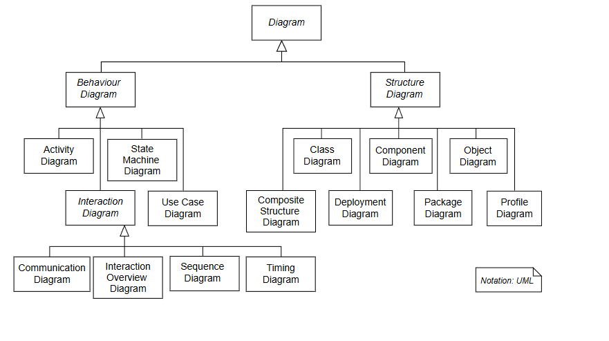
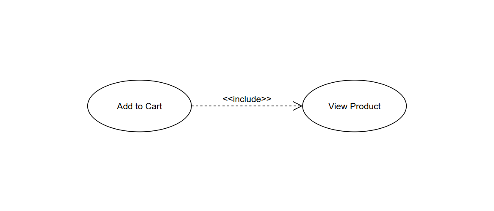
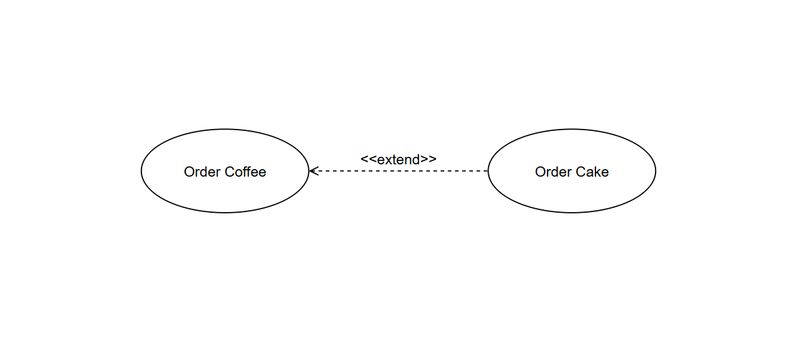
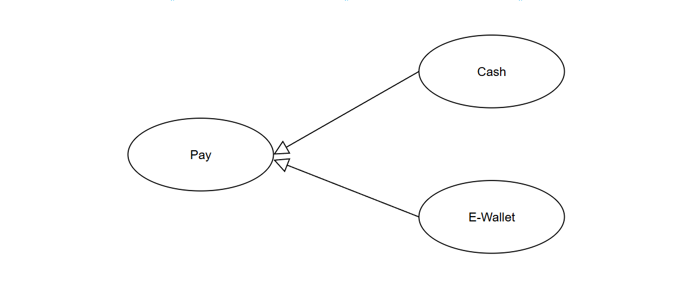
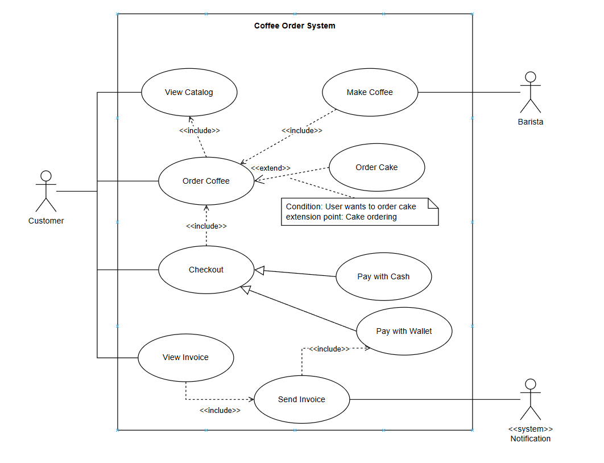

# UML & Use Cases

## UML 

### Overview

*   The Unified Modeling Language (UML) is a general-purpose, object-oriented, visual modeling language that provides a way to visualize the architecture and design of a system, like a blueprint.

### UML Use Case Diagram

* Actors: Represent roles that users or other systems play when interacting with the system. They are depicted as stick figures.
* Use Cases: Represent specific functionalities or services provided by the system. They are depicted as ovals. They are named using verbs or verb phrases.
* System Boundary: A rectangle that defines the scope of the system being modeled. It contains the use cases.
* Relationships: Lines that connect actors to use cases, indicating interactions.

### Relationship Types

#### `Association`

A solid line connecting an actor to a use case, indicating that the actor participates in that use case.

#### `Include`

> "Use case A always requires use case B to be completed."

A dashed arrow pointing from one use case to another, indicating that the first use case includes the behavior of the second use case.

#### `Extend`

> "Use case B happens only in certain conditions of use case A."

A dashed arrow pointing from one use case to another, indicating that the first use case extends the behavior of the second use case under certain conditions.

#### `Generalization`

> "A child use case is a specific variant of a parent use case."

A solid line with a hollow arrowhead pointing from a specialized use case or actor to a more general one, indicating inheritance.

 
### Example UML Use Case Diagram

