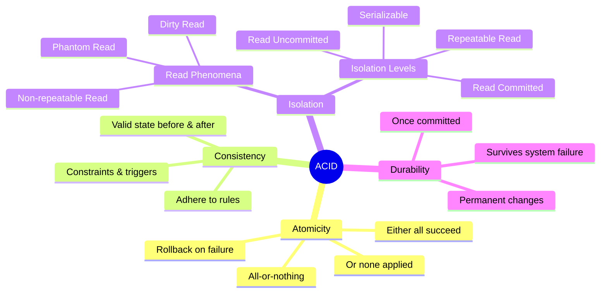
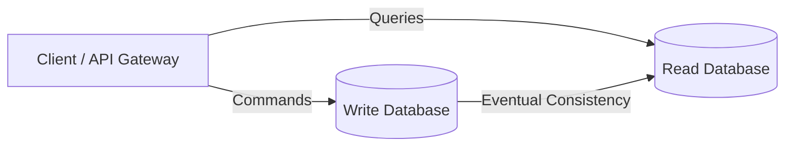

# ACID - CRQS - CAP - CAPELC

## ACID

* ACID stands for `Atomicity`, `Consistency`, `Isolation`, `Durability`.

### Atomicity

* `Atomicity` means a transaction is **all-or-nothing** either all its operations succeed, or none are applied. If any part fails, the entire transaction is rolled back to keep the database consistent.

### Consistency

* `Consistency` in transactions means that the database **must remain in a valid state before and after a transaction**. Any data written must adhere to all defined rules, constraints, and triggers.

### Isolation

* `Isolation` ensures that **concurrent transactions do not interfere with each other**. Each transaction should operate as if it is the only one running, preventing issues like dirty reads or lost updates.
* Two main things to consider: Read phenomena and Isolation levels.
* Read phenomena:
  * **Dirty Read**: Reading uncommitted data from another transaction.
  * **Non-repeatable Read**: Reading the same data multiple times within a transaction and getting different results because another transaction modified it.
  * **Phantom Read**: Reading a set of rows that satisfy a condition, but another transaction inserts or deletes rows that affect the result set.
* Isolation levels:
  * **Read Uncommitted**: Lowest level but highest concurrency. Allows dirty reads: Reads data that has been modified but not yet committed by other transactions.
  * **Read Committed**: Prevents dirty reads. A transaction **can only read data that has been committed** by other transactions.
  * **Repeatable Read**: This isolation level guarantees that a transaction will see the same data throughout its duration, even if other transactions commit changes to the data. As it only sees committed data before the transaction started, it prevents dirty reads and non-repeatable reads. However, new rows may still be inserted that satisfy the query condition, which can lead to phantom reads.
  * **Serializable**: Highest isolation level. Transactions are completely isolated from each other, **as if they were executed serially**. Prevents dirty reads, non-repeatable reads, and phantom reads.

| Isolation Level  | Dirty Read | Non-repeatable Read | Phantom Read | Desc             |
| ---------------- | ---------- | ------------------- | ------------ | -------------------------- |
| READ UNCOMMITTED | YES       | YES                | YES         | Read uncommitted data      |
| READ COMMITTED   | NO    | YES                | YES         | Read committed data        |
| REPEATABLE READ  | NO    | NO             | YES         | Repeatable read data       |
| SERIALIZABLE     | NO    | NO             | NO      | Results as if executed serially |

### Durability

* `Durability` ensures that once a transaction is committed, **its changes are permanently saved, even if the system fails**.

## CRQS

* CRQS stands for `Command`, `Read`, `Query`, `Separation`.