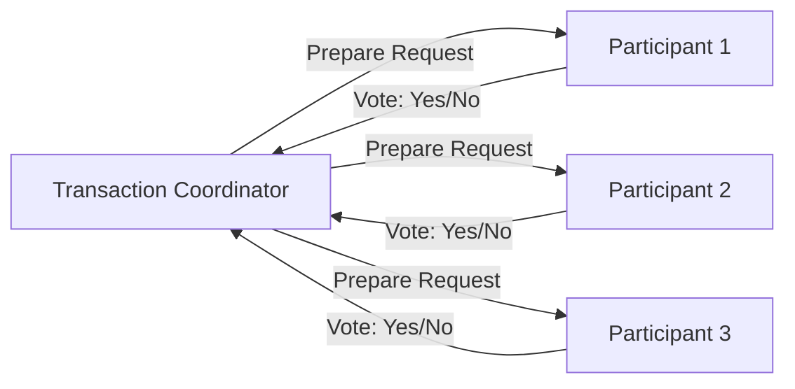
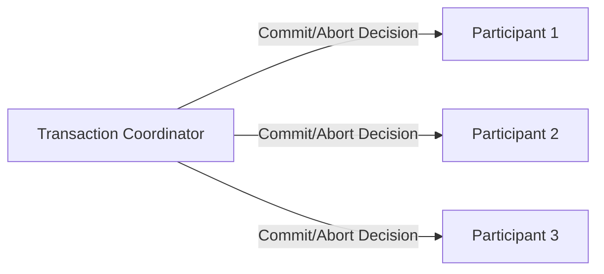

# 2PC - SAGA - Event Storming

## Two-Phase Commit (2PC)

| It works like a long-lived database transaction that spans multiple services.

* Phase 1: Prepare

* Phase 2: Commit/Abort

* Two-Phase Commit (2PC) applies to distributed transactions across multiple services or databases. Example: transaction that involves both database A and database B.
* Two-Phase Commit (2PC) is a distributed algorithm that ensures all participants in a distributed transaction either commit or abort the transaction together, maintaining data consistency across multiple systems. **Two phases commit try to achieve atomicity like "local transactions" in distributed systems.**
* Drawbacks of 2PC:
  * ***Blocking***: If the coordinator fails, participants may be left in a prepared state, unable to commit or abort.
  * **Performance** Overhead: Involves multiple network round-trips, which can slow down transaction processing.
  * **Complexity**: Implementing 2PC can be complex, especially in systems with many participants.
* **We may consider using SAGA pattern as an alternative to 2PC for long-running transactions**, we **reach eventual consistency instead of strong consistency**.

## SAGA Pattern

### What the heck is SAGA Pattern?

The **SAGA Pattern** is a design pattern used to manage **distributed transactions** across multiple services in a microservices architecture **without using 2PC (Two-Phase Commit)**. SAGA pattern focus to achieve `eventual consistency`, `asynchronous communication`, and `failure handling`.

Instead of a single global transaction, a Saga is a **sequence of local transactions**. Each local transaction:

* Updates its own database
* Publishes an event or reply message

If one step fails, the Saga executes **compensating transactions** to undo the effects of previously completed steps.

### SAGA types

#### Choreography-based SAGA

In Choreography, there is no central coordinator. Each service listens for events and decides when to act and what to do next. Wihhout a central coordinator, services communicate directly through events.

**Pros**:
* Simple to implement for small Sagas
* Decoupled services, no single point of failure, easier to scale.
**Cons**:
* Hard to manage complex Sagas with many steps.
* Difficult to monitor and trace the flow of the Saga.

#### Orchestration-based SAGA

In Orchestration, a central coordinator (or orchestrator) manages the Saga's workflow. The orchestrator tells each service when to perform its local transaction and what to do next. Orchestration provides a clear view of the Saga's progress, command-driven and centralized control.

**Pros**:
* Easier to manage complex Sagas with many steps.
* Better monitoring and tracing of the Saga's flow.
**Cons**:
* Centralized orchestrator can become a bottleneck or single point of failure.
* Needs a high availability design for the orchestrator.

### Examples

