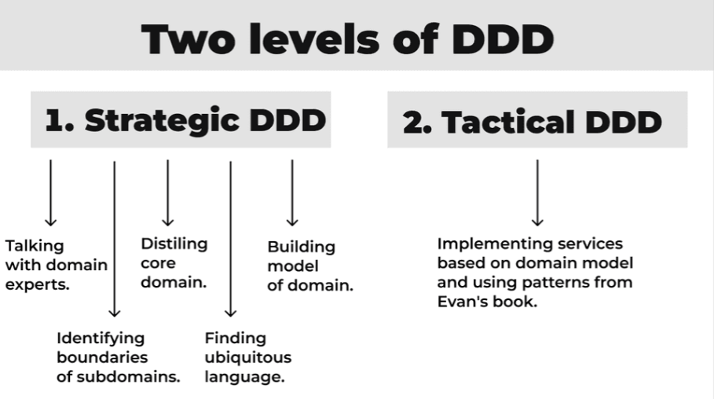
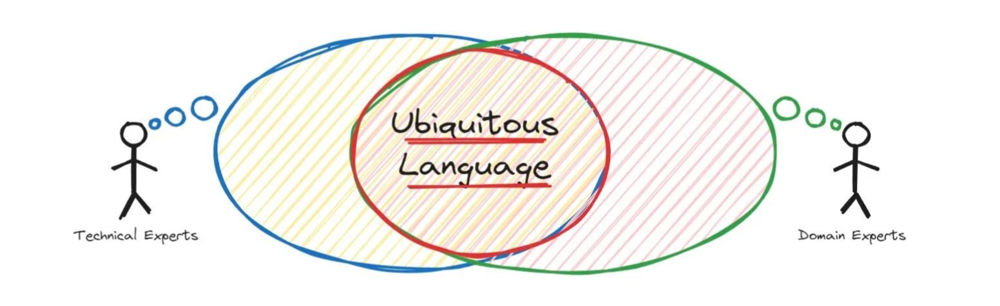
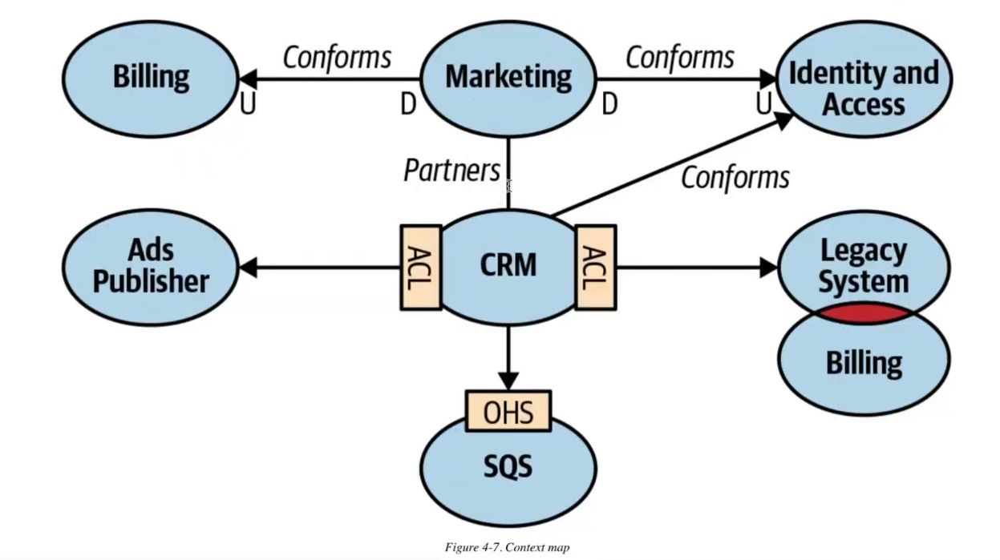
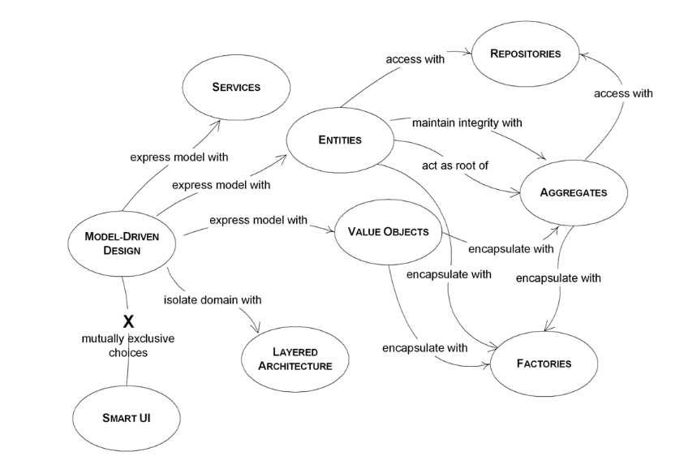
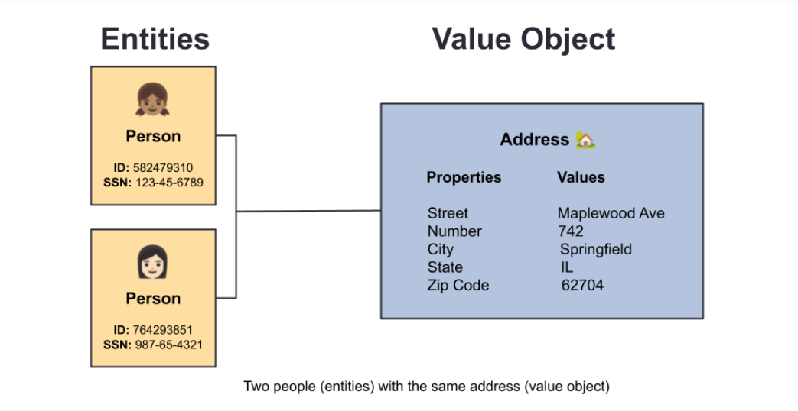
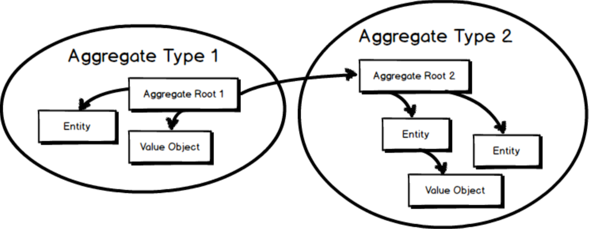

# Domain-Driven Design (DDD)

## Some facts before we start

### About "Code-First" vs "API-First" vs "Domain-First"

- **Code-First**: In this approach, developers start by writing the code for the application, including the domain models and business logic. The API is then generated based on the code.
- **API-First**: In this approach, the API is designed and defined first, often using tools like OpenAPI or Swagger. The domain models and business logic are then implemented to fit the API design.
- **Domain-First**: In this approach, the focus is on understanding and modeling the domain first. The domain models and business logic are designed based on the domain's needs, and the API is created to expose the functionality of the domain.

### About the "Use Case Bloat"

- **Use Case Bloat**: This refers to the situation where use cases become overly complex and bloated with too much logic, making them difficult to maintain and understand. It can occur when use cases are not properly scoped or when they try to handle too many responsibilities.

### About "Domain-Driven Design (DDD)"

| Useful links:
- [Modular Monolith with DDD](https://github.com/kgrzybek/modular-monolith-with-ddd)
- [Context Mapping](https://github.com/ddd-crew/context-mapping)

- **Domain-Driven Design (DDD)**: DDD is an approach to software development that emphasizes understanding the business domain and modeling it in code. It focuses on creating a shared language between `developers`, `domain experts` or `business stakeholders` and structuring the code around the core business concepts.

#### Strategic DDD

##### Ubiquitous Language

- **Ubiquitous Language**: A common language used by both developers and domain experts to describe the domain and its concepts. It helps to ensure that everyone has a shared understanding of the domain. Ubiquitous language is a key principle of DDD and is used to create a common vocabulary for the domain.

##### Bounded Context

- **Bounded Context**: A boundary within which a particular model is defined and applicable. It helps to manage complexity by dividing the domain into smaller, more manageable parts. Each bounded context has its own model and language, and they may interact with each other through well-defined interfaces.
- **Example**: In an e-commerce application, you might have separate bounded contexts for `Order`, `Inventory`, and `Customer`. Each context would have its own model and language specific to its domain.

##### Context Mapping

- **Context Map**: Context Maps describe the contact between bounded contexts and teams with a collection of patterns.
    - **Shared Kernel**: A shared kernel is a pattern where two or more bounded contexts share a common subset of the domain model. This allows for better integration and communication between the contexts while maintaining their independence. Example: If you have two bounded contexts, `Order` and `Inventory`, they might share a common model for `Product`, which includes attributes like `productId`, `name`, and `price`. This shared kernel allows both contexts to use the same representation of a product while still maintaining their own specific models for orders and inventory management.
    - **Partnership**: No drama, no conflict, just a partnership. Two teams work together closely, sharing knowledge and collaborating on the design and implementation of their respective bounded contexts. Example: If you have two teams working on the `Order` and `Inventory` bounded contexts, they might have regular meetings to discuss their progress, share insights, and coordinate their efforts to ensure that their models and implementations are aligned.
    - **Customer(Upstream) - Supplier(Downstream)**: In this pattern, one team (the supplier) provides services or functionality to another team (the customer). The supplier is responsible for delivering a well-defined interface that the customer can use to access the functionality. Example: If you have a team responsible for the `Payment` bounded context (supplier) and another team responsible for the `Order` bounded context (customer), the payment team would provide an API for processing payments that the order team can call when an order is placed.
    - **Anti-Corruption Layer**: An anti-corruption layer is a pattern used to protect a bounded context from being influenced or corrupted by another context. It acts as a barrier that translates between the two contexts, allowing them to interact without directly coupling their models or languages. Example: If you have a legacy system that you need to integrate with, you might use an anti-corruption layer to translate between the legacy system's model (may use XML) and your new system's model (may use JSON), ensuring that the legacy system does not influence the design of your new system.
    - **Open Host Service**: An open host service is a pattern where a bounded context exposes a well-defined interface that other contexts can use to access its functionality. This allows for better integration and communication between contexts while maintaining their independence. Example: If you have a `Customer` bounded context that provides customer information, it might expose an open host service (API) that other contexts, such as `Order` or `Inventory`, can call to retrieve customer data when needed.
    - **Conformist**: In this pattern, one team (the conformist) adopts the model and language of another team (the dominant) in order to facilitate communication and integration. The conformist team is willing to adapt their model to fit the dominant team's model, even if it means sacrificing some of their own design principles. Example: If you have a team working on the `Order` bounded context that needs to integrate with a third-party payment service, they might adopt the payment service's model for transactions in order to simplify integration, even if it means that their own model for orders becomes less ideal.

#### Tactical DDD

##### Entity

| When you think of an Entity, imagine something that needs to be tracked over time and whose attributes are likely to change over time. To be able to keep track of something you need a way of identifying the object and answering the question: "Is this the same object?" after time has passed.

- **Entity (a.k.a Reference Object)**: Many objects are not fundamentally defined by their attributes, but rather by a thread of continuity and identity. An object primarily defined by its identity is called an Entity.
- An Entity has a unique identifier that distinguishes it from other objects, and its identity is independent of its attributes. For example, a `Customer` entity might have attributes like `name`, `email`, and `address`, but it is primarily defined by its unique identifier (e.g., `customerId`), which allows us to track the same customer over time even if their attributes change.
- A `Student` entity might have attributes like `name`, `age`, and `grade`, but it is primarily defined by its unique identifier (e.g., `studentId`), which allows us to track the same student over time even if their attributes change. Two `Student` entities with the same name, age, and grade would still be considered different entities because they have different unique identifiers.

##### Value Object

- **Value Object (a.k.a. Descriptive Object)**: An object that represents a descriptive aspect of the domain with no conceptual identity is called a Value Object. Value Objects are instantiated to represent elements of the design that we care about only for what they are, not who or which they are.
- A Value Object is immutable and it's also has "identity" defined by its attributes. For example, a `Money` value object might have attributes like `amount` and `currency`, and two `Money` objects with the same amount and currency would be considered equal.
- An `Address` value object might have attributes like `street`, `city`, and `postalCode`, and two `Address` objects with the same street, city, and postal code would be considered equal. If you change any of the attributes of an `Address` value object, it would be considered a different address, as value objects are immutable.

##### Aggregate

- **Aggregate**: Aggregate is a pattern in Domain-Driven Design. A DDD aggregate is a cluster of domain objects that can be treated as a single unit. An example may be an order and its line-items, these will be separate objects, but it's useful to treat the order (together with its line items) as a single aggregate.
- An aggregate will have one of its component objects be the aggregate root. **Any references from outside the aggregate should only go to the aggregate root.**