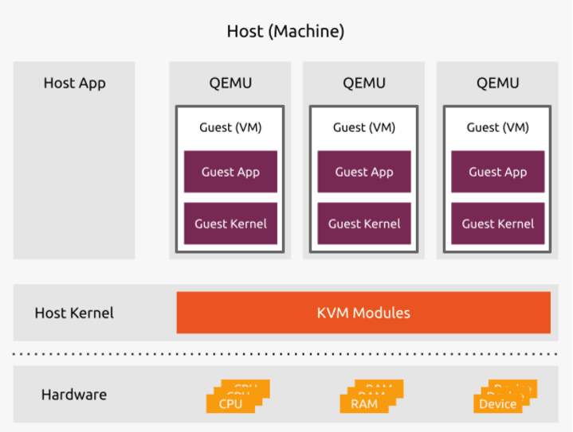
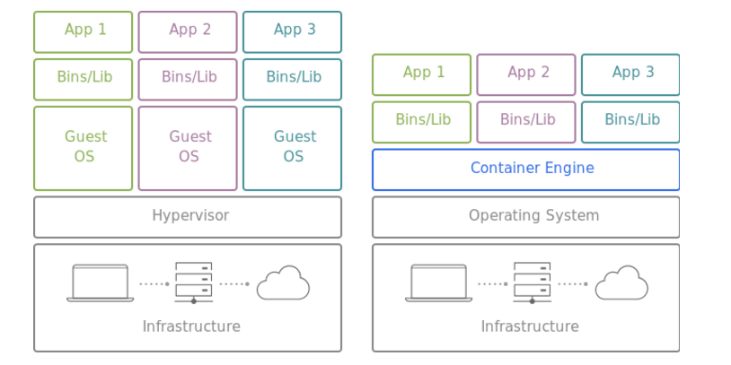
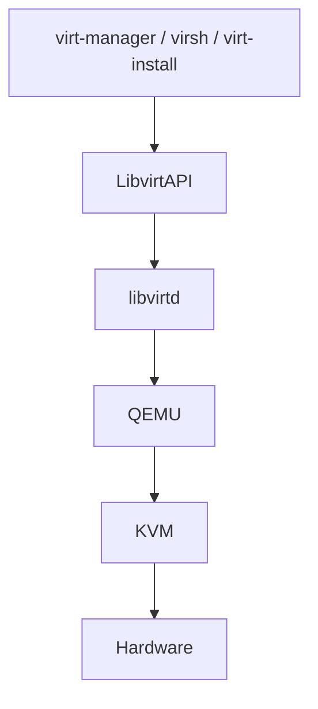

# Linux Virtualization Stack

## Definition

At its core, virtualization is the abstraction of computing resources from the hardware layer, allowing multiple virtual environments to run simultaneously on a single physical machine (the host) while ensuring full resource separation.

* The benefits of virtualization:
    * Cost Efficiency: Virtualization allows multiple virtual machines to run on a single physical machine, which can lead to significant cost savings in terms of hardware and energy consumption.
    * Resource isolation: Each virtual machine operates independently, ensuring that issues in one VM do not affect others.
    * Hardware abstraction: Virtualization abstracts the underlying hardware, allowing for greater flexibility and compatibility across different platforms.
    * Flexibility and scalability: Virtual machines can be easily created, modified, and deleted, allowing for rapid deployment and scaling of applications and services.

## Virtualization vs containerization

* **Virtualization focuses on running multiple VMs on a host machine, each with its dedicated OS, kernel and virtual hardware**. This approach ensures complete isolation between VMs, making it suitable for applications with different requirements and strict security obligations.
* On the other hand, **containerization abstracts the OS-level, allowing multiple containers to share the same host OS kernel while maintaining their independent runtime environments**. Containers are lightweight, start quickly, and consume fewer resources than VMs, making them ideal for microservices and modern cloud-native applications.
* Virtualization remains useful for some use cases:
    * *Legacy applications*
    * *Mixed workloads*: When a mix of legacy and modern applications coexist, VMs efficiently manage these diverse workloads.
    * *Resource-intensive workloads*: Resource-intensive applications, such as data analytics and high-performance computing, may benefit from the resource isolation provided by VMs.

## KVM

* KVM (Kernel-based Virtual Machine) is a virtualization module in the Linux kernel that allows the kernel to function as a hypervisor. It provides hardware-assisted virtualization using Intel VT-x or AMD-V extensions, enabling efficient and secure virtual machine execution.
* KVM is the first layer of the Linux virtualization stack, providing the core virtualization capabilities. KVM alone cannot run VMs; it requires additional components like QEMU to manage and run virtual machines.

## QEMU

* QEMU (Quick Emulator) is a userspace virtual machine runtime. It provides hardware emulation and virtualization capabilities, allowing users to create and manage virtual machines. QEMU is a free, open-source hosted hypervisor and machine emulator that allows you to run operating systems and applications designed for one architecture (e.g., ARM) on another (e.g., x86).
* Besides QEMU, we have other tools such as:
    * **VMware**: A commercial virtualization platform that provides a range of products for desktop and server virtualization.
    * **VirtualBox**: A free and open-source virtualization software that allows users to run multiple operating systems on a single physical machine.
    * **Hyper-V**: A virtualization platform developed by Microsoft, available on Windows Server and Windows

## libvirt

* Managing QEMU manually is painful, so Linux introduced **libvirt**. libvirt is an open-source API, daemon, and management tool for managing platform virtualization. It provides a consistent and unified interface for managing various virtualization technologies, including KVM, QEMU, Xen, and more. libvirt abstracts the underlying virtualization technologies and provides a high-level API for creating, configuring, and managing virtual machines.
* libvirt includes these components:
    * **libvirtd**: daemon.
    * **virsh**: CLI.
    * **virt-install**: CLI provisioning.
    * **virt-manager**: GUI management tool.

## cloud-init

* `cloud-init` is VM boot automation. During boot, `cloud-init` identifies the cloud it is running on and initializes the system accordingly. Cloud instances will automatically be provisioned during first boot with networking, storage, SSH keys, packages and various other system aspects already configured.
* `cloud-init` provides the necessary glue between launching a cloud instance and connecting to it so that it works as expected. Some common tasks:
    * Setting up the hostname and network configuration.
    * Adding SSH keys for secure access.
    * Installing packages and running custom scripts.
    * Configuring users and permissions.